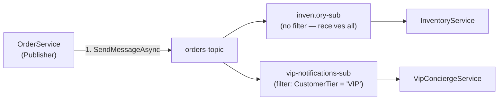
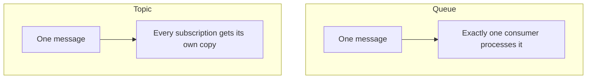

# Azure Service Bus: Topics and Subscriptions

## Introduction

Before reading this lesson, you should already be comfortable with **[Azure Service Bus: Queues](../16-azure-for-dotnet-developers/16-38-azure-service-bus-queues.md)**, including the point-to-point guarantee that one message is processed exactly once by one logical consumer group. This lesson covers what happens when that guarantee is the wrong one — when several *independent* parts of a system all need to react to the same event, each in its own way, without any of them competing with each other for the same message. That is exactly the shape of Module 12's Observer pattern and its Event-Driven Architecture lesson, and **Service Bus topics** are that same fan-out, made durable and cloud-scale.

By the end of this lesson, you will be able to:

- Explain how a topic differs from a queue: one message published, many independent subscribers, each receiving its own copy
- Provision a topic and multiple subscriptions with the Azure CLI
- Publish to a topic and receive from a specific subscription using `Azure.Messaging.ServiceBus`
- Write a SQL filter rule so a subscription receives only the messages relevant to it
- Connect topics/subscriptions to Module 12's Observer pattern and Event-Driven Architecture lesson as the same fan-out, decoupled across services

## Service Bus Topics — A Layman's Perspective

Think about how a company-wide fire alarm actually works, revisiting the exact comparison Module 12's Event-Driven Architecture lesson used for in-process events, but now imagine the building spans multiple sites owned by different departments. When the alarm triggers, it doesn't hand a single slip of paper to one designated responder who then has to decide who else to tell. It rings, independently and simultaneously, in the security office, the facilities team's pager, and the fire department's dispatch system — three completely separate organizations, each of which subscribed to that alarm ahead of time, each hearing the exact same event, each free to react in its own way without coordinating with, waiting for, or even knowing about the other two.

Now add a detail a single-building fire alarm doesn't need: not every subscriber cares about every alarm. The facilities team wants to know about every alarm in every one of their buildings. The security office might only care about alarms flagged as "confirmed," not routine test triggers. A regional fire marshal's system might only want alarms from buildings inside their district. Rather than making every subscriber listen to everything and manually discard what doesn't apply, a well-designed alarm network lets each subscriber register a *standing filter* with the alarm switchboard itself — "only ring my line if the alarm is confirmed AND in my district" — so irrelevant alarms never even reach a subscriber that doesn't need them.

This is precisely what a Service Bus **topic** is for. A publisher sends one message to the topic, once, with no idea who — or how many parties — are listening. Each **subscription** attached to that topic is its own independent, durable copy of the switchboard's output: if three subscriptions exist, three full copies of every matching message are created, one per subscription, and each subscription's consumer works through its own copy entirely independently of the others. If the security office's system is offline for maintenance, the facilities team's copy is completely unaffected — it was never waiting on the security office in the first place. And each subscription can carry its own filter rule, so a subscription tuned to "orders over $10,000" never even sees, let alone has to discard, an order for $12.

The bridge back to code: this is the exact fan-out shape Module 12 already introduced with `EventDispatcher` and multiple `IEventHandler<T>` implementations reacting to one in-process event — `InventoryService` and `NotificationService` never referencing each other, each free to be added, removed, or fail independently. A Service Bus topic gives that same shape to handlers that live in entirely separate deployed services, with the added ability to filter what each one even receives.

## Service Bus Topics — A Programming Language Perspective

An Azure Service Bus **topic** implements the **publish-subscribe** pattern: a publisher sends a message to the topic exactly once, and the broker duplicates it into every attached **subscription**, each of which behaves like its own independent queue with its own `ServiceBusReceiver`/`ServiceBusProcessor`, its own PeekLock semantics, and its own dead-letter sub-queue, exactly as covered for plain queues in the prerequisite lesson. A subscription without any rule receives every message published to the topic by default (an implicit `TrueFilter` rule named `$Default`). A subscription can instead declare one or more explicit **rules** — a `SqlRuleFilter` (a boolean SQL-like expression evaluated against message properties, e.g. `"CustomerTier = 'VIP'"`) or a `CorrelationRuleFilter` (a cheaper equality match on a small set of well-known properties) — configured via the CLI or `ServiceBusAdministrationClient`, so only messages matching the rule are delivered into that subscription.

## How to Publish to a Topic and Filter a Subscription

Provisioning adds one extra layer over a plain queue: a topic, then one or more subscriptions underneath it, each optionally carrying its own filter rule.


*Figure 1: One publish, two independent subscriptions — each a full copy, one of them filtered.*

```bash
# Azure CLI — create a topic and two subscriptions, one with a SQL filter
az servicebus topic create --namespace-name sbns-ecommerce-prod \
  --resource-group rg-ecommerce-prod --name orders-topic

az servicebus topic subscription create --namespace-name sbns-ecommerce-prod \
  --resource-group rg-ecommerce-prod --topic-name orders-topic --name inventory-sub

az servicebus topic subscription create --namespace-name sbns-ecommerce-prod \
  --resource-group rg-ecommerce-prod --topic-name orders-topic --name vip-notifications-sub

az servicebus topic subscription rule create --namespace-name sbns-ecommerce-prod \
  --resource-group rg-ecommerce-prod --topic-name orders-topic \
  --subscription-name vip-notifications-sub --name VipOnly \
  --filter-sql-expression "CustomerTier = 'VIP'"
```

**Azure CLI Output:**

```text
{ "name": "orders-topic" }
{ "name": "inventory-sub" }
{ "name": "vip-notifications-sub" }
{ "name": "VipOnly", "filter": { "sqlExpression": "CustomerTier = 'VIP'" } }
```

```csharp
// Program.cs — .NET 10 / C# 14
using Azure.Identity;
using Azure.Messaging.ServiceBus;

const string fqns = "sbns-ecommerce-prod.servicebus.windows.net";
await using var client = new ServiceBusClient(fqns, new DefaultAzureCredential());

ServiceBusSender sender = client.CreateSender("orders-topic");

var standard = new ServiceBusMessage("""{"orderId":"ORD-7001","total":58.00}""");
standard.ApplicationProperties["CustomerTier"] = "Standard";

var vip = new ServiceBusMessage("""{"orderId":"ORD-7002","total":1899.00}""");
vip.ApplicationProperties["CustomerTier"] = "VIP";

await sender.SendMessagesAsync([standard, vip]);
Console.WriteLine("Published ORD-7001 (Standard) and ORD-7002 (VIP) to orders-topic.");

ServiceBusReceiver vipReceiver = client.CreateReceiver("orders-topic", "vip-notifications-sub");
ServiceBusReceivedMessage onlyVip = await vipReceiver.ReceiveMessageAsync();
Console.WriteLine($"vip-notifications-sub received: {onlyVip.Body}");
await vipReceiver.CompleteMessageAsync(onlyVip);
```

**Console Output:**

```text
Published ORD-7001 (Standard) and ORD-7002 (VIP) to orders-topic.
vip-notifications-sub received: {"orderId":"ORD-7002","total":1899.00}
```

Both messages were published in a single call, but `vip-notifications-sub` only ever saw `ORD-7002` — the `VipOnly` rule discarded `ORD-7001` at the broker before it ever reached that subscription's queue. `inventory-sub`, with no filter attached, would have received both, completely independently of whatever `vip-notifications-sub` did with its own copy.

## Real-Time Example: Fanning Out `OrderPlaced` Across Three Independent Services

We continue from Module 12's Event-Driven Architecture lesson, where `Order` raised an in-process `OrderPlaced` event consumed by an in-process `InventoryService` and `NotificationService`. Those two services — plus a new `VipConciergeService` — now run as separate deployments, each with its own subscription on `orders-topic`.

```csharp
// VipConciergeWorker.cs — .NET 10 / C# 14 — Real-Time Example (E-Commerce Order Processing)
using Azure.Identity;
using Azure.Messaging.ServiceBus;

await using var client = new ServiceBusClient("sbns-ecommerce-prod.servicebus.windows.net", new DefaultAzureCredential());
ServiceBusProcessor processor = client.CreateProcessor("orders-topic", "vip-notifications-sub");

processor.ProcessMessageAsync += async args =>
{
    // This handler never runs for a Standard-tier order — the VipOnly rule filtered it out upstream
    Console.WriteLine($"VipConciergeService: assigning a personal concierge for {args.Message.Body}");
    await args.CompleteMessageAsync(args.Message);
};
processor.ProcessErrorAsync += args => { Console.WriteLine($"Processor error: {args.Exception.Message}"); return Task.CompletedTask; };

await processor.StartProcessingAsync();
```

**Console Output:**

```text
VipConciergeService: assigning a personal concierge for {"orderId":"ORD-7002","total":1899.00}
```

`InventoryService` and `NotificationService` each run their own processor against their own subscription, reserving stock and sending a confirmation email for *every* order regardless of tier, while `VipConciergeService` only ever wakes up for the subset that matches its filter. None of the three services references the other two, and none of the three's downtime affects the others' copies — the exact decoupling property the Observer pattern promised, now holding across service boundaries and deployments instead of just across objects in one process.

## Topics/Subscriptions vs a Single Queue

A queue and a topic solve visibly different problems, and reaching for the wrong one either silently drops work meant for multiple recipients, or forces every recipient to compete over messages meant for all of them.


*Figure 2: A queue splits work among competing consumers; a topic duplicates work to independent subscribers.*

| Aspect | Queue | Topic + Subscriptions |
|---|---|---|
| Delivery model | Point-to-point — one consumer group | Publish-subscribe — every subscription |
| Message copies | One, consumed once | One per subscription |
| Filtering | None built in | SQL/correlation filter rules per subscription |
| Adding a new consumer | Competes with existing consumers for the same messages | Add a subscription — existing ones are unaffected |
| Typical use case | Order fulfillment, task processing | Broadcasting an event to independent, unrelated services |

## Types and Related Concepts

Topics generalize the queue from the previous lesson into a full fan-out mechanism, and connect directly to the module's next stop:

1. **[Azure Service Bus: Queues](../16-azure-for-dotnet-developers/16-38-azure-service-bus-queues.md)** — the point-to-point building block a subscription behaves like internally.
2. **[Observer Pattern](../12-advanced-concepts/12-19-observer-pattern.md)** — the in-process design pattern this lesson's fan-out generalizes across service boundaries.
3. **[Event-Driven Architecture](../12-advanced-concepts/12-43-event-driven-architecture.md)** — the integration-event concept a topic publish typically carries.
4. **[Azure Event Grid](../16-azure-for-dotnet-developers/16-40-azure-event-grid.md)** — a lighter-weight, purpose-built alternative for discrete event notifications, covered next.
5. **[Azure Event Hubs](../16-azure-for-dotnet-developers/16-41-azure-event-hubs.md)** — for high-volume event *streaming* rather than discrete pub-sub messages.
6. **Correlation Filters** — the cheaper, equality-only alternative to a `SqlRuleFilter`, worth a look in the `Azure.Messaging.ServiceBus.Administration` reference once SQL filters feel familiar.

## What You've Learned & What's Next

A Service Bus topic turns a single publish into as many independent copies as there are subscriptions, each with its own optional filter rule, giving Module 12's Observer pattern and Event-Driven Architecture the same decoupled fan-out across services that it already had across objects in one process.

Continue your learning journey with **[Azure Event Grid](../16-azure-for-dotnet-developers/16-40-azure-event-grid.md)**, where a lighter, purpose-built notification service — not meant to carry large or business-critical payloads — takes over for reacting to discrete infrastructure events like a blob being created.

---
*Applies to: .NET 10 / C# 14. Last reviewed 2026-08-16.*
