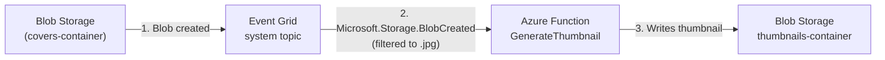
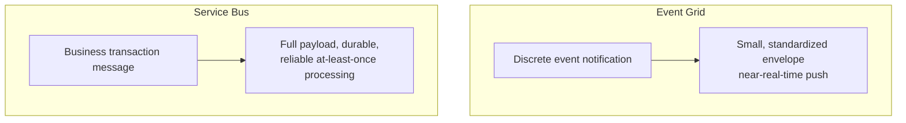

# Azure Event Grid

## Introduction

Before reading this lesson, you should already be comfortable with **[Azure Service Bus: Topics and Subscriptions](../16-azure-for-dotnet-developers/16-39-azure-service-bus-topics.md)**, including the publish-subscribe pattern of one message reaching many independent subscribers. This lesson introduces a service that looks superficially similar — it also fans a message out to subscribers — but exists to solve an entirely different problem: **Azure Event Grid**, built for near-real-time notification of discrete things that *already happened* inside Azure itself, such as "a blob was created" or "a virtual machine was deleted," rather than for carrying the kind of business payload a Service Bus topic carries.

By the end of this lesson, you will be able to:

- Explain what Event Grid is for: lightweight, push-based delivery of discrete event notifications, not reliable transport for large or business-critical payloads
- Distinguish Event Grid from Service Bus along the axis that actually matters: notification vs. message
- Wire a Blob Storage "blob created" event to trigger an Azure Function using an Event Grid subscription
- Read an Event Grid event's schema in C# with `Azure.Messaging.EventGrid`
- Recognize when Event Grid is the right tool versus when a Service Bus topic or queue is

## Azure Event Grid — A Layman's Perspective

Think about the difference between a courier delivering a signed, tracked parcel and a doorbell simply ringing to say someone is at the door. The tracked parcel — the Service Bus topic from the previous lesson — carries the actual contents inside it: the recipient opens it and has everything they need. The doorbell carries no contents at all. It doesn't tell you who's there, what they want, or what's in their hands — it just tells you, instantly and reliably, that *something happened at the door*, and leaves it entirely up to you to walk over and look if you care.

That doorbell is exactly what Azure Event Grid is built to be. When something happens inside an Azure resource — a file lands in storage, a resource is created, a subscription's health changes — Event Grid doesn't try to carry the full business transaction along with the notification. It sends a small, standardized "this happened" envelope: what kind of thing happened, where, and when, plus a short reference to go look at the actual thing if you need more. Compare that to the parcel model from the previous lesson, where the topic message itself *was* the order data a subscriber needed to act on — Event Grid deliberately doesn't try to be that. It is a notification system, not a data-transport system.

The doorbell analogy also explains Event Grid's delivery philosophy. A doorbell rings the instant the button is pressed — there's no queue of unrung doorbells waiting patiently to be answered one at a time. Event Grid is built the same way: it pushes events to subscribers the moment they occur, optimized for near-real-time reactive triggering, not for a subscriber to pull messages off a durable backlog at its own pace the way a Service Bus consumer does. It does retry a failed delivery for a while and can eventually dead-letter a persistently failing one, but its whole design center is "notify fast," not "guarantee this exact payload is processed exactly once, no matter how long that takes."

One more everyday comparison sharpens this: a security camera's motion-detection alert versus a certified letter. The alert tells you "motion was detected at the front door at 3:47pm" — useful, immediate, and disposable; nobody expects the alert itself to contain a video file. The certified letter, by contrast, *is* the actual document that matters, tracked and signed for. Reaching for Event Grid to carry an order's full line-item data would be like stuffing a certified letter's contents into a motion alert — technically possible in a pinch, but fighting the tool's entire design.

The bridge back to code: an Event Grid subscriber typically does very little with the event itself beyond reading "what kind of thing, and where" — then it goes and fetches or acts on the actual resource, exactly like walking to the door after the doorbell rings rather than expecting the doorbell to hand you a guest.

## Azure Event Grid — A Programming Language Perspective

**Azure Event Grid** is a managed, push-based **event routing** service for reactive, event-driven architectures. It is not a message queue or a topic in the Service Bus sense; it routes small, standardized **event notifications** — describing a discrete occurrence (`Microsoft.Storage.BlobCreated`, `Microsoft.Resources.ResourceWriteSuccess`) — from an **event source** (a **system topic**, automatically available for many Azure resources, or a **custom topic** an application defines) to one or more **event handlers** (an Azure Function, a Logic App, a webhook, a Service Bus queue/topic, or others) via an **event subscription**, which can carry filters much like a Service Bus subscription's rules. Events conform to either the Event Grid schema or the CNCF **CloudEvents** v1.0 schema; the `Azure.Messaging.EventGrid` SDK's `EventGridPublisherClient` and `EventGridEvent`/`CloudEvent` types work with either. Delivery is at-least-once with configurable retry and dead-lettering, but — unlike Service Bus — there is no consumer-side receive/lock/complete cycle; a subscriber is simply invoked with the event.

## How to Trigger a Function When a Blob Is Created

Wiring Event Grid to Blob Storage requires no code on the storage side at all — the subscription is configured once, declaratively, against the storage account's built-in system topic.


*Figure 1: Event Grid doesn't move the blob's bytes — it only notifies the Function that a blob now exists, and where.*

```bash
# Azure CLI — subscribe an Azure Function to a storage account's blob-created events
az eventgrid event-subscription create \
  --name blob-created-thumbnail-sub \
  --source-resource-id "/subscriptions/{sub-id}/resourceGroups/rg-library-prod/providers/Microsoft.Storage/storageAccounts/stlibraryprod" \
  --endpoint "/subscriptions/{sub-id}/resourceGroups/rg-library-prod/providers/Microsoft.Web/sites/func-thumbnail-gen/functions/GenerateThumbnail" \
  --endpoint-type azurefunction \
  --included-event-types Microsoft.Storage.BlobCreated \
  --subject-ends-with .jpg
```

**Azure CLI Output:**

```text
{
  "name": "blob-created-thumbnail-sub",
  "provisioningState": "Succeeded",
  "filter": { "includedEventTypes": ["Microsoft.Storage.BlobCreated"], "subjectEndsWith": ".jpg" }
}
```

```csharp
// GenerateThumbnail.cs — .NET 10 / C# 14
using Azure.Messaging.EventGrid;
using Microsoft.Azure.Functions.Worker;
using Microsoft.Extensions.Logging;

public class GenerateThumbnail(ILogger<GenerateThumbnail> logger)
{
    [Function("GenerateThumbnail")]
    public void Run([EventGridTrigger] EventGridEvent gridEvent)
    {
        // The event tells us WHAT happened and WHERE — not the file's actual bytes
        logger.LogInformation("Event: {EventType}, Subject: {Subject}, Time: {Time}",
            gridEvent.EventType, gridEvent.Subject, gridEvent.EventTime);

        // A real handler would now fetch the blob at gridEvent.Subject and generate a thumbnail
        logger.LogInformation("Queuing thumbnail generation for {Subject}", gridEvent.Subject);
    }
}
```

**Console Output (Function log for an uploaded cover image):**

```text
info: GenerateThumbnail[0]
      Event: Microsoft.Storage.BlobCreated, Subject: /blobServices/default/containers/covers-container/blobs/9780134685991.jpg, Time: 2026-08-16T09:14:02Z
info: GenerateThumbnail[0]
      Queuing thumbnail generation for /blobServices/default/containers/covers-container/blobs/9780134685991.jpg
```

Nothing in `stlibraryprod`'s Blob Storage configuration knows `GenerateThumbnail` exists — the event subscription created purely at the infrastructure layer is what connects the two. Uploading a `.jpg` triggers the Function within seconds of the upload completing; uploading a `.pdf` triggers nothing at all, because the subscription's `subjectEndsWith` filter excludes it.

## Real-Time Example: Automatic Cover-Image Processing in the Library Catalog

We extend the `Catalog` and `PhysicalBook`/`EBook` types from Module 02's OOP capstone. When a librarian uploads a new book's cover photo to Blob Storage, the catalog should automatically generate a thumbnail and update the book's `Book` record — without the upload code itself knowing anything about thumbnail generation.

```csharp
// CatalogEventHandler.cs — .NET 10 / C# 14 — Real-Time Example (Library/Inventory Management)
using Azure.Messaging.EventGrid;
using Microsoft.Azure.Functions.Worker;
using Microsoft.Extensions.Logging;

public sealed record CoverImageEvent(string Isbn, string BlobUrl, DateTimeOffset UploadedAt);

public class CatalogCoverImageHandler(ILogger<CatalogCoverImageHandler> logger)
{
    [Function("CatalogCoverImageHandler")]
    public void Run([EventGridTrigger] EventGridEvent gridEvent)
    {
        if (gridEvent.EventType != "Microsoft.Storage.BlobCreated")
        {
            logger.LogInformation("Ignoring unrelated event type {EventType}", gridEvent.EventType);
            return;
        }

        string isbn = System.IO.Path.GetFileNameWithoutExtension(gridEvent.Subject);
        var coverEvent = new CoverImageEvent(isbn, gridEvent.Subject, gridEvent.EventTime);

        logger.LogInformation("Cover uploaded for ISBN {Isbn} at {UploadedAt} — generating thumbnail and updating catalog entry",
            coverEvent.Isbn, coverEvent.UploadedAt);
        // Real handler: generate a thumbnail, then call Catalog.UpdateCoverThumbnail(isbn, thumbnailUrl)
    }
}
```

**Console Output:**

```text
info: CatalogCoverImageHandler[0]
      Cover uploaded for ISBN 9780134685991 at 08/16/2026 09:14:02 +00:00 — generating thumbnail and updating catalog entry
```

The librarian's upload workflow never has to call a thumbnail service, never has to know one exists, and never blocks waiting for it to finish — exactly the reactive, decoupled behavior a doorbell provides over a hand-delivered parcel. If the thumbnail generator is redeployed or briefly down, Event Grid retries the notification on its own schedule; the upload itself already succeeded and was never waiting on it.

## Event Grid vs Service Bus

The previous two lessons and this one are easy to blur together because all three "deliver something to a subscriber." The distinction that matters in practice is payload size and criticality, not subscriber count.


*Figure 2: Event Grid notifies that something happened; Service Bus reliably transports what to do about it.*

| Aspect | Event Grid | Service Bus (Queue/Topic) |
|---|---|---|
| Purpose | Lightweight event notification | Reliable business message transport |
| Payload | Small, standardized event envelope | Arbitrary, often substantial business data |
| Delivery model | Push, near-real-time | Push (Processor) or pull (Receiver), durable backlog |
| Consumer contract | Simple invoke — no receive/lock/complete cycle | PeekLock — explicit complete/abandon/dead-letter |
| Typical use case | "A blob was created," "a resource changed" | Order processing, fan-out of business events |

## Types and Related Concepts

Event Grid's routing model connects several Azure services already covered in this module:

1. **[Azure Blob Storage](../16-azure-for-dotnet-developers/16-23-azure-blob-storage.md)** — one of the most common Event Grid system topic sources, used in this lesson's example.
2. **[Introduction to Azure Functions](../16-azure-for-dotnet-developers/16-12-introduction-to-azure-functions.md)** — the most common Event Grid handler, triggered via `[EventGridTrigger]`.
3. **[Azure Service Bus: Topics and Subscriptions](../16-azure-for-dotnet-developers/16-39-azure-service-bus-topics.md)** — the reliable-transport alternative when the payload itself matters, not just the notification.
4. **[Azure Event Hubs](../16-azure-for-dotnet-developers/16-41-azure-event-hubs.md)** — for continuous, high-volume streams of events rather than discrete, occasional ones, covered next.
5. **CloudEvents Schema** — the CNCF-standard alternative event envelope Event Grid supports alongside its own native schema, worth a look once the native schema feels familiar.

## What You've Learned & What's Next

Azure Event Grid is a lightweight, push-based notification system for discrete events — built to say "this happened, and here's where," not to reliably carry the full business payload a Service Bus queue or topic transports. Reaching for it correctly means treating it as a doorbell, not a courier.

Continue your learning journey with **[Azure Event Hubs](../16-azure-for-dotnet-developers/16-41-azure-event-hubs.md)**, where the concern shifts again — from discrete, occasional events to continuous, high-volume streams arriving by the millions per second.

---
*Applies to: .NET 10 / C# 14. Last reviewed 2026-08-16.*
