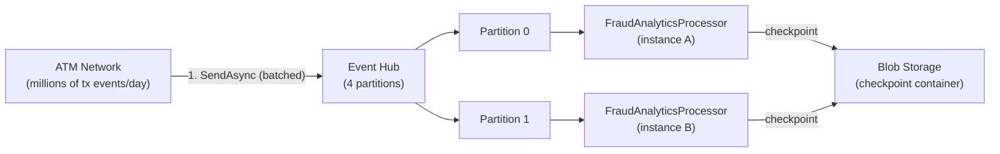
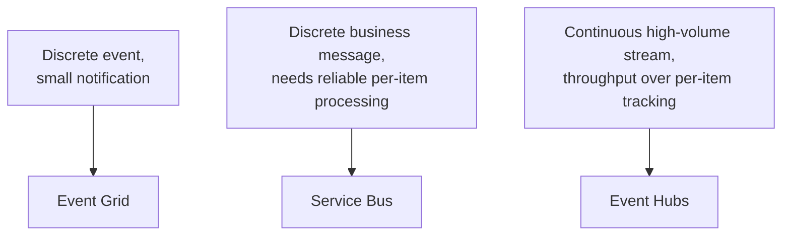

# Azure Event Hubs

## Introduction

Before reading this lesson, you should already be comfortable with **[Azure Event Grid](../16-azure-for-dotnet-developers/16-40-azure-event-grid.md)**, including the idea that it notifies about discrete, occasional events rather than transporting bulk data. This lesson covers the service built for the opposite end of the spectrum: **Azure Event Hubs**, designed to ingest a continuous, high-volume *stream* of events — potentially millions per second — from telemetry, logging, or IoT-scale sources, and let multiple independent readers work through that stream at their own pace.

By the end of this lesson, you will be able to:

- Explain what Event Hubs optimizes for: throughput and volume of a continuous event stream, not discrete notifications or individually guaranteed messages
- Describe the partitioned consumer model and why partitions are how Event Hubs scales
- Send events to a hub and consume them with `Azure.Messaging.EventHubs`
- Explain checkpointing and why an `EventProcessorClient` needs a Blob Storage container to track its progress
- Contrast Event Hubs with Service Bus and Event Grid along the dimension that separates all three: notification vs. message vs. stream

## Azure Event Hubs — A Layman's Perspective

Picture the difference between a bank teller handling individual customers one at a time, each with a specific request that needs a specific, tracked outcome, versus a firehose of transaction records pouring in from every ATM in the country, all day, every day — millions of withdrawals, deposits, and balance checks, none of which needs an individual human to personally track its outcome, but all of which some analytics system downstream genuinely needs to see, in order, in something close to real time.

A bank teller's line is the Service Bus model from two lessons ago: each customer (message) matters individually, gets handled once, and the bank cares deeply whether any single one was mishandled. That model breaks down completely at ATM-network scale — nobody could staff enough tellers to process a nationwide stream of ATM events one at a time with individual tracking overhead per transaction, and nobody needs to. What the fraud-analytics team actually wants is closer to a river of water flowing past a series of turbines: the water (events) keeps flowing continuously and rapidly, and each turbine (a consumer) draws off however much of the flow it can process, at its own pace, remembering exactly how far along the river it has already drawn from so it can resume from that exact point rather than the beginning, if it ever has to stop and restart.

Azure Event Hubs is that river, engineered for volume rather than per-item ceremony. It doesn't lock an individual "message," track its delivery count, or move a poison one to a dead-letter shelf the way Service Bus does — at millions of events per second, per-event tracking of that kind would be far too expensive and, honestly, beside the point. Instead, the river is split into several parallel channels — **partitions** — so that many turbines can draw from different channels of the same river simultaneously without getting in each other's way, and each turbine simply remembers its own **checkpoint**: the furthest point in its channel it has successfully processed so far.

This is why Event Hubs suits telemetry, application logs, and IoT sensor readings so well: a single dropped or slightly-out-of-order reading among millions rarely matters on its own, but the ability to sustain an enormous continuous flow, and to add more turbines (consumers) without redesigning the river, matters enormously. The bridge back to code: sending to Event Hubs looks like firehose-style batch publishing rather than a single tracked send, and consuming from it means picking a partition (or letting a processor balance across all of them) and reading forward from a checkpoint, not receiving-and-completing one message at a time.

## Azure Event Hubs — A Programming Language Perspective

**Azure Event Hubs** is a managed, high-throughput **event streaming** platform, built on the same partitioned-log model as Apache Kafka (and directly Kafka-protocol-compatible). Each event hub is divided into a fixed number of **partitions**, ordered, append-only sequences that events are distributed across (typically by a partition key) to allow parallel throughput. Producers use `EventHubProducerClient` to send `EventData` in batches (`EventDataBatch`). Consumers belong to a **consumer group** — an independent view over the entire stream, so multiple analytics pipelines can each read the full stream at their own pace without affecting each other — and typically use the higher-level `EventProcessorClient`, which balances partitions across running instances and persists **checkpoints** (the last successfully processed position per partition) to an Azure Blob Storage container via `BlobCheckpointStore`, so a restarted processor resumes rather than replaying or losing its place.

## How to Send and Process a Stream of Events

Provisioning declares the partition count up front, since it is the main lever for parallel throughput; the SDK's producer/processor pair mirrors the sender/receiver split from Service Bus, but built around continuous streams rather than discrete messages.


*Figure 1: Partitions let multiple processor instances read the same stream in parallel, each tracking its own checkpoint.*

```bash
# Azure CLI — create a namespace and a 4-partition event hub
az eventhubs namespace create --name ehns-banking-prod \
  --resource-group rg-banking-prod --sku Standard

az eventhubs eventhub create --namespace-name ehns-banking-prod \
  --resource-group rg-banking-prod --name atm-transactions \
  --partition-count 4 --retention-time 24
```

**Azure CLI Output:**

```text
{ "name": "ehns-banking-prod" }
{ "name": "atm-transactions", "partitionCount": 4, "retentionTimeInHours": 24 }
```

```csharp
// Program.cs — .NET 10 / C# 14
using Azure.Identity;
using Azure.Messaging.EventHubs;
using Azure.Messaging.EventHubs.Producer;

const string fqns = "ehns-banking-prod.servicebus.windows.net";
await using var producer = new EventHubProducerClient(fqns, "atm-transactions", new DefaultAzureCredential());

using EventDataBatch batch = await producer.CreateBatchAsync();
batch.TryAdd(new EventData("""{"atmId":"ATM-4471","type":"Withdrawal","amount":200.00}"""));
batch.TryAdd(new EventData("""{"atmId":"ATM-2290","type":"BalanceCheck","amount":0.00}"""));

await producer.SendAsync(batch);
Console.WriteLine($"Sent {batch.Count} event(s) to atm-transactions.");
```

**Console Output:**

```text
Sent 2 event(s) to atm-transactions.
```

Unlike the queue and topic examples in the previous two lessons, nothing here names a specific message, tracks a delivery count, or completes anything — a batch of events is simply appended to whichever partition the producer (or an explicit partition key) routes it to. Throughput, not per-item tracking, is the entire design point.

## Real-Time Example: Streaming ATM Transactions to a Fraud-Analytics Pipeline

We extend the `Account` and `FraudMonitor` types from Module 12's Observer pattern lesson. There, `FraudMonitor` reacted to individual `TransactionEventArgs` raised in-process by one `Account`. At nationwide ATM scale, that same fraud-detection intent now consumes a continuous Event Hubs stream fed by every ATM in the network.

```csharp
// FraudAnalyticsProcessor.cs — .NET 10 / C# 14 — Real-Time Example (Banking/ATM)
using Azure.Identity;
using Azure.Messaging.EventHubs;
using Azure.Messaging.EventHubs.Consumer;
using Azure.Messaging.EventHubs.Primitives;
using Azure.Storage.Blobs;

const string fqns = "ehns-banking-prod.servicebus.windows.net";
var credential = new DefaultAzureCredential();

var checkpointStore = new BlobContainerClient(
    new Uri("https://stbankingprod.blob.core.windows.net/eventhub-checkpoints"), credential);

var processor = new EventProcessorClient(
    checkpointStore, EventHubConsumerClient.DefaultConsumerGroupName, fqns, "atm-transactions", credential);

int highValueAlerts = 0;

processor.ProcessEventAsync += async args =>
{
    string body = args.Data.EventBody.ToString();
    if (body.Contains("\"amount\":2") || body.Contains("\"amount\":9")) // simplified threshold check
    {
        highValueAlerts++;
        Console.WriteLine($"Partition {args.Partition.PartitionId}: flagged high-value transaction — {body}");
    }
    await args.UpdateCheckpointAsync(); // remembers this position so a restart resumes here, not from the start
};
processor.ProcessErrorAsync += args => { Console.WriteLine($"Error on partition {args.PartitionId}: {args.Exception.Message}"); return Task.CompletedTask; };

await processor.StartProcessingAsync();
await Task.Delay(TimeSpan.FromSeconds(5));
await processor.StopProcessingAsync();
Console.WriteLine($"High-value alerts this run: {highValueAlerts}");
```

**Console Output:**

```text
Partition 2: flagged high-value transaction — {"atmId":"ATM-4471","type":"Withdrawal","amount":200.00}
High-value alerts this run: 1
```

At nationwide volume, `FraudAnalyticsProcessor` runs as multiple instances, each automatically assigned a subset of the hub's four partitions by `EventProcessorClient`'s built-in load balancing. If one instance crashes, its partitions are reassigned to the survivors, and each resumes from the last checkpoint written to Blob Storage — not from the beginning of the stream, and not from wherever the crashed instance happened to leave off in memory.

## Event Hubs vs Service Bus vs Event Grid

Three services, three genuinely different jobs, distinguished by what's actually moving through them and at what rate.


*Figure 2: The right service depends on whether you're notifying, transacting, or streaming.*

| Aspect | Service Bus | Event Grid | Event Hubs |
|---|---|---|---|
| Optimized for | Reliable per-message delivery | Lightweight event notification | High-volume continuous streaming |
| Typical scale | Thousands/sec | Near-real-time, discrete events | Millions of events/sec |
| Per-item tracking | PeekLock, complete/dead-letter | Simple invoke, retry/dead-letter | Checkpoint per partition, not per event |
| Consumer model | Competing consumers (queue) or fan-out (topic) | Push to registered handlers | Partitioned, consumer groups read independently |
| Typical use case | Order processing, task queues | "A blob was created" | Telemetry, logs, IoT, clickstream analytics |

## Types and Related Concepts

Event Hubs completes the module's three-way messaging comparison and connects to the storage and streaming concepts already covered:

1. **[Azure Event Grid](../16-azure-for-dotnet-developers/16-40-azure-event-grid.md)** — the discrete-notification counterpart, covered previously.
2. **[Azure Service Bus: Queues](../16-azure-for-dotnet-developers/16-38-azure-service-bus-queues.md)** — the reliable, per-message counterpart for business transactions.
3. **[Azure Blob Storage](../16-azure-for-dotnet-developers/16-23-azure-blob-storage.md)** — where `EventProcessorClient` persists partition checkpoints.
4. **[Async Streams — IAsyncEnumerable](../07-concurrency-parallel-async/07-17-async-streams-iasyncenumerable.md)** — the in-process streaming abstraction Event Hubs' consumer model echoes at cloud scale.
5. **Event Hubs for Apache Kafka** — the Kafka-protocol-compatible endpoint many existing Kafka producers/consumers can point at without code changes, worth a look for teams migrating from self-hosted Kafka.

## What You've Learned & What's Next

Azure Event Hubs trades per-message tracking for raw throughput, splitting a continuous stream across partitions so many consumer instances can read it in parallel, each remembering its own checkpoint. It is the right tool when the volume itself — not any single event — is the point, completing this module's three-way split between reliable messages (Service Bus), lightweight notifications (Event Grid), and high-volume streams (Event Hubs).

Continue your learning journey with **[Azure Logic Apps](../16-azure-for-dotnet-developers/16-42-azure-logic-apps.md)**, where a low-code, visual workflow designer takes over for connecting services together without writing custom integration code by hand.

---
*Applies to: .NET 10 / C# 14. Last reviewed 2026-08-16.*
