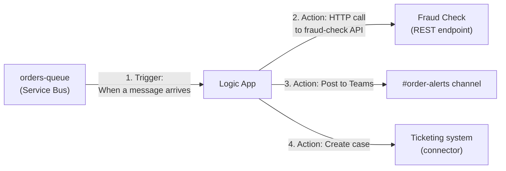
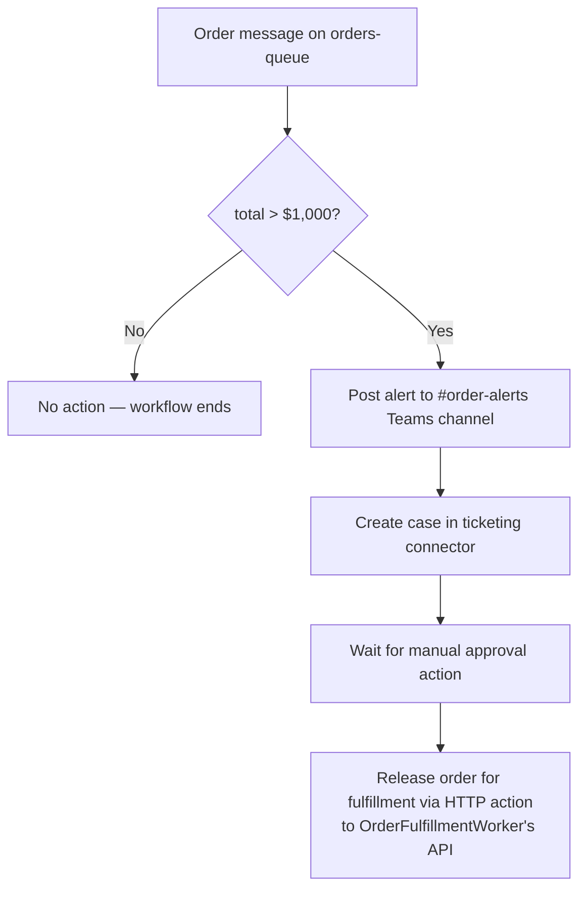
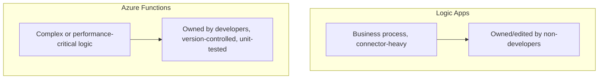

# Azure Logic Apps

## Introduction

Before reading this lesson, you should already be comfortable with **[Azure Event Hubs](../16-azure-for-dotnet-developers/16-41-azure-event-hubs.md)** and the two lessons before it — by now you've seen three different ways a .NET developer writes code to move events and messages between services. This lesson closes the "Messaging & Integration" arc with a service that often needs no application code at all: **Azure Logic Apps**, a low-code, visual workflow designer for wiring services together using hundreds of built-in connectors, and the judgment call for when that's genuinely the better choice than writing the integration by hand.

By the end of this lesson, you will be able to:

- Explain what a Logic App is: a declarative, visually-designed workflow of triggers and actions, not a place to write arbitrary C#
- Describe the built-in connector model and why it removes most hand-written integration code for common SaaS and Azure services
- Build a simple Logic App workflow triggered by a Service Bus message
- Decide when a Logic App is the better fit for a task versus an Azure Function or other custom code
- Recognize Logic Apps as this module's messaging capstone — the layer that often *orchestrates* the queues, topics, and event sources covered in the previous three lessons

## Azure Logic Apps — A Layman's Perspective

Imagine two very different ways a business gets a repetitive, multi-step office process done. One way: hire a skilled developer to write a custom program that checks a mailbox, extracts an attachment, saves it to the right folder, and emails a manager — a real, working solution, but one that needs a programmer's time to build, test, and maintain every time a step in that process changes. The other way: use a flowchart-style form a non-programmer can assemble themselves by dragging boxes onto a canvas — "when a new email with an attachment arrives," "save the attachment here," "then send this notification" — using pre-built connectors for the mailbox, the file system, and the notification service, so no line of code is written for any of it.

Azure Logic Apps is that second approach, offered as an actual production-grade Azure service rather than a desktop toy. Its visual designer represents a workflow as a **trigger** — the event that starts the whole thing, like "a new message arrives on a queue" or "a file appears in a folder" — followed by a chain of **actions**, each one a pre-built step against some system: send an email through Office 365, create a record in Salesforce, post a message to Teams, run a database query, call a REST API. Each of these is a **connector**, and Microsoft maintains hundreds of them, covering enormous swaths of common enterprise software, so a workflow author rarely has to write a single HTTP call by hand for well-known services — they configure a box in the designer instead.

The genuinely important shift here isn't just "no code" — it's *who* can build and maintain the workflow. A business analyst who understands the process — "when a high-value order comes in, notify the fraud team in Teams, then create a case in the ticketing system, then wait for approval before releasing the shipment" — can build and adjust that exact workflow themselves, without filing a ticket with the engineering team and waiting for a sprint to free up. That's the entire value proposition: business-process automation that a non-developer can own, understand at a glance from the visual canvas, and modify when the process itself changes, which happens far more often than the underlying code logic would otherwise need to.

None of this means Logic Apps replaces developers or custom code — it means it replaces a specific, common category of work: gluing together well-known systems in a sequence that's more about *business process* than *computation*. The bridge back to code: a Logic App workflow is still backed by a real JSON workflow definition underneath the designer, and a .NET application often sits at either end of one — publishing the message that triggers it, or exposing the API one of its actions calls — even though the orchestration itself was never written as C#.

## Azure Logic Apps — A Programming Language Perspective

An **Azure Logic App** is a managed, serverless **workflow orchestration** service defined declaratively as a JSON **workflow definition** (following the Workflow Definition Language schema), typically authored through a visual designer rather than hand-written. A workflow consists of exactly one **trigger** (polling-based, like a recurring schedule or a mailbox check, or push-based, like an HTTP request or a Service Bus message) followed by one or more **actions**, connected through **connectors** — pre-built integrations exposing a system's operations as designer-configurable steps, spanning Microsoft 365, Salesforce, databases, FTP, and hundreds of others, alongside generic HTTP and Azure Function actions for anything not covered by a named connector. Logic Apps run on either the multi-tenant **Consumption** plan (pay-per-execution) or the **Standard** plan (dedicated, supports stateful/stateless workflows and local development in Visual Studio Code), and can call out to, or be called by, ordinary .NET code at any HTTP or messaging boundary.

## How to Build a Workflow Triggered by a Service Bus Message

A Logic App consuming from the queue built two lessons ago needs no consumer code in C# at all — the trigger and every action are configured declaratively.


*Figure 1: Every box after the trigger is a configured connector action — no custom integration code behind any of them.*

```bash
# Azure CLI — create a Consumption-plan Logic App from a workflow definition file
az logic workflow create --resource-group rg-ecommerce-prod \
  --name la-high-value-order-alert \
  --definition @high-value-order-workflow.json \
  --location eastus
```

**Azure CLI Output:**

```text
{
  "name": "la-high-value-order-alert",
  "state": "Enabled",
  "location": "eastus"
}
```

```json
// high-value-order-workflow.json — trigger + first action, abbreviated for illustration
{
  "definition": {
    "triggers": {
      "When_a_message_arrives_on_orders-queue": {
        "type": "ApiConnection",
        "inputs": { "host": { "connection": { "name": "@parameters('$connections')['servicebus']['connectionId']" } },
                     "path": "/@{encodeURIComponent('orders-queue')}/messages/head" }
      }
    },
    "actions": {
      "Post_to_Teams_if_order_over_1000": {
        "type": "If",
        "expression": "@greater(json(triggerBody()?['ContentData']).total, 1000)",
        "actions": {
          "Post_message": { "type": "ApiConnection", "inputs": { "host": { "connection": { "name": "@parameters('$connections')['teams']['connectionId']" } } } }
        }
      }
    }
  }
}
```

**Console Output (Logic Apps run history, abbreviated):**

```text
Run 08/16/2026 09:22:10Z — Succeeded
  When_a_message_arrives_on_orders-queue: Succeeded (312ms)
  Post_to_Teams_if_order_over_1000: Succeeded (204ms)
```

Every step in that run history corresponds directly to a box a workflow author placed on the designer canvas — the trigger reading from `orders-queue`, a conditional, and a Teams post — with no deployed .NET assembly executing any of that logic. The workflow definition JSON exists, but it's generated by the designer, not typically hand-written.

## Real-Time Example: Automating High-Value Order Escalation

We continue directly from this module's `orders-queue` and `orders-topic`, extending the `Order` record used throughout. Rather than writing a dedicated `HighValueOrderEscalationWorker` in C#, the business decides this specific escalation process — notify, log a case, wait for approval — changes often enough, and is owned closely enough by the fraud and operations teams, that it belongs in a Logic App they can adjust themselves.


*Figure: The full escalation path, entirely configured — no C# behind any single box.*

The operations team can add a new condition — say, escalating orders shipping to a newly flagged region — by editing one box in the designer, with no deployment pipeline, no code review of C#, and no wait for a development sprint. Compare that to `OrderFulfillmentWorker` from the first lesson in this arc: its retry logic, dead-letter handling, and message deserialization are exactly the kind of *complex, performance-sensitive, developer-owned* logic that belongs in code, not in a visual designer. The two coexist deliberately — the Logic App owns the business-process shape of escalation, and it calls into `OrderFulfillmentWorker`'s own API only for the one step that's genuinely computational: releasing the order.

## Logic Apps vs Azure Functions (Custom Code)

Both can react to a trigger and call out to other services, which is exactly why picking between them deserves a deliberate reason rather than a default.


*Figure 2: The deciding question is who owns the logic and how complex it genuinely is — not merely "can both technically do this."*

| Aspect | Logic Apps | Azure Functions |
|---|---|---|
| Authoring | Visual designer, declarative JSON | C# (or other language), imperative code |
| Best owned by | Business analysts, integration teams | Developers |
| Complex logic / loops / algorithms | Awkward, limited | Natural fit |
| Performance-sensitive, high-throughput work | Not designed for it | Well suited |
| Connector breadth | Hundreds of built-in SaaS/Azure connectors | Requires hand-written SDK/HTTP calls |
| Typical use case | Approval workflows, notifications, SaaS glue | Business logic, data processing, APIs |

## Types and Related Concepts

Logic Apps sits at the orchestration layer above the messaging primitives this module already covered:

1. **[Azure Service Bus: Queues](../16-azure-for-dotnet-developers/16-38-azure-service-bus-queues.md)** — a common Logic Apps trigger source, as in this lesson's example.
2. **[Introduction to Azure Functions](../16-azure-for-dotnet-developers/16-12-introduction-to-azure-functions.md)** — the code-first alternative for logic too complex or performance-sensitive for a visual designer.
3. **[Durable Functions](../16-azure-for-dotnet-developers/16-14-durable-functions.md)** — the developer-owned, code-first counterpart to a multi-step Logic App workflow, useful when a workflow's logic outgrows connectors.
4. **[Azure Event Grid](../16-azure-for-dotnet-developers/16-40-azure-event-grid.md)** — another common Logic Apps trigger, for reacting to infrastructure events rather than business messages.
5. **[Azure API Management in Depth](../16-azure-for-dotnet-developers/16-43-azure-api-management-in-depth.md)** — covered next, for governing and exposing the APIs a Logic App's HTTP actions ultimately call.

## What You've Learned & What's Next

Azure Logic Apps trades custom code for a visual, connector-driven workflow designer, and earns its place specifically for business-process automation that non-developers need to own and adjust — while genuinely complex, performance-critical, or algorithm-heavy logic still belongs in Azure Functions or other developer-owned code, as it has throughout this module.

Continue your learning journey with **[Azure API Management in Depth](../16-azure-for-dotnet-developers/16-43-azure-api-management-in-depth.md)**, where the APIs that Logic Apps, Functions, and every other service in this module call out to get their own dedicated gateway, policy, and governance layer.

---
*Applies to: .NET 10 / C# 14. Last reviewed 2026-08-16.*
