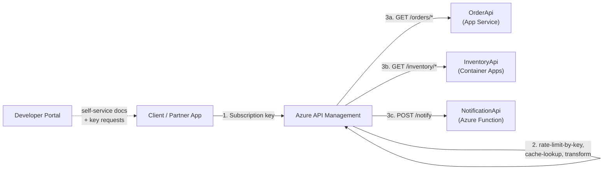
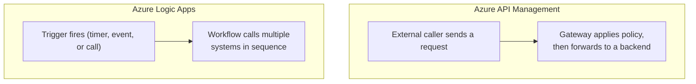

# Azure API Management in Depth

## Introduction

Before reading this lesson, you should already be comfortable with **[Azure Logic Apps](../16-azure-for-dotnet-developers/16-42-azure-logic-apps.md)**, and with Module 12's **[API Gateway Pattern](../12-advanced-concepts/12-40-api-gateway-pattern.md)**, which described — in plain code terms — why a microservices system needs a single front door instead of exposing every backend service directly to callers. That lesson deliberately stopped short of naming a specific product; it described the *shape* of the problem so you would recognize the *shape* of the solution. This lesson names the product: **Azure API Management (APIM)**, the managed Azure service that implements the API Gateway pattern so you don't hand-roll one.

By the end of this lesson, you will be able to:

- Explain why APIM is Azure's concrete implementation of the API Gateway pattern from Module 12
- Provision an APIM instance and import a backend API's OpenAPI definition
- Apply gateway-level policies — rate limiting, request/response transformation, and response caching — without touching backend code
- Use the developer portal for API documentation and self-service subscription key management
- Front multiple backend services (App Service, Azure Functions, Container Apps) behind a single managed API surface
- Distinguish APIM's role from Logic Apps' orchestration role, covered in the previous lesson

## Azure API Management — A Layman's Perspective

Picture a large hospital campus built up over decades: cardiology in one building, radiology in another, billing in a third, each added at a different time with its own separate street entrance. In the early years, every visitor had to already know which building housed which department, walk to that building's specific door, and show ID separately at each one. There was no consistent rule about how many visitors any one department could handle per hour, no shared directory explaining what services existed at all, and no common front-of-house staff enforcing hospital-wide policy — each building improvised its own.

Eventually the hospital does what every growing campus eventually does: it builds one covered main entrance with a single reception desk that every visitor passes through, no matter which department they're ultimately headed to. The reception desk checks ID once, consults a shared directory to route each visitor to the correct building, and enforces hospital-wide rules consistently — no more than a set number of visitors per department per hour during flu season, automatic translation of insurance forms into whatever format each department's back office actually expects, and a rack of commonly-requested brochures kept right at the front desk so the archive room isn't walked to for every single request. Critically, none of the individual departments had to change how they operate internally to make this work — cardiology still runs its own equipment and staff exactly as before. Only the *entrance* changed.

Azure API Management is that main entrance, retrofitted onto a collection of backend services that, like the hospital's buildings, were often built at different times, in different technologies, with different owners. An e-commerce platform's `OrderApi` might run on App Service, its `InventoryApi` on Container Apps, and a lightweight `NotificationApi` as an Azure Function — three genuinely different pieces of infrastructure. Without APIM, every external partner or client app would need to know all three separate addresses and separately implement whatever rate limiting or request-shaping each backend team decided to bolt on individually, inconsistently, or not at all. APIM sits in front of all three, becomes the *one* address anyone outside ever needs to know, and applies rules — how many calls per minute a given partner may make, what an incoming request should be translated into before a backend ever sees it, which responses are safe to cache instead of hitting a backend on every call — consistently, in one place, regardless of which backend eventually answers.

The developer portal is the hospital's shared directory, made self-service: a partner integrating with the platform browses the available APIs, reads their documentation, and requests their own subscription key without ever emailing a human to ask "which building is this in and how do I get in the door." And just as the hospital's individual departments never had to be rebuilt to gain a shared entrance, none of `OrderApi`, `InventoryApi`, or `NotificationApi` need any code changes to be fronted by APIM — the gateway is added *in front of* them, not woven *into* them.

## Azure API Management — A Programming Language Perspective

**Azure API Management** is a fully managed API gateway service that imports one or more backend APIs — typically via an OpenAPI/Swagger definition, the same artifact Module 10's OpenAPI lesson showed ASP.NET Core generating automatically — and exposes them through a single, managed front end with its own hostname, TLS certificate, and authentication surface. Each imported backend becomes an **API** within APIM; APIs are grouped into **products**, which bundle one or more APIs behind a shared subscription key and usage terms (free tier vs. partner tier, for instance). Request handling is governed by **policies**: XML-based configuration fragments applied at defined points in the pipeline — `inbound` (before the backend is called), `backend` (the call itself), `outbound` (before the response returns to the caller), and `on-error`. Built-in policies cover rate limiting (`rate-limit-by-key`), caching (`cache-lookup`/`cache-store`), and payload transformation (`set-body`, `xml-to-json`), all configured declaratively, with zero backend code changes. This is precisely the API Gateway pattern from Module 12, Lesson 40, expressed as a managed Azure resource instead of hand-written middleware.

## How to Provision and Configure Azure API Management

Standing up APIM and fronting a backend API is a three-step CLI sequence: create the APIM instance, import the backend's API definition, and attach a policy. The backend application itself needs no awareness that APIM exists in front of it.


*Figure 1: One managed APIM surface fronts three independently-hosted backends; policies apply before any backend is reached.*

```bash
# Azure CLI — provision APIM and import the Order API's OpenAPI definition
az apim create --name apim-ecommerce-prod --resource-group rg-ecommerce-prod \
  --publisher-name "Contoso Retail" --publisher-email "api-team@contoso.com" \
  --sku-name Developer --location eastus

az apim api import --resource-group rg-ecommerce-prod --service-name apim-ecommerce-prod \
  --api-id order-api --path "orders" \
  --specification-format OpenApi --specification-url "https://orderapi.azurewebsites.net/openapi/v1.json"
```

**Azure CLI Output:**

```text
{
  "name": "apim-ecommerce-prod",
  "properties": {
    "gatewayUrl": "https://apim-ecommerce-prod.azure-api.net",
    "provisioningState": "Succeeded"
  }
}
{
  "id": "/subscriptions/.../apis/order-api",
  "name": "order-api",
  "path": "orders"
}
```

```csharp
// Program.cs — .NET 10 / C# 14 — the OrderApi backend, unaware it sits behind APIM
var builder = WebApplication.CreateBuilder(args);
var app = builder.Build();

app.MapGet("/orders/{orderId}", (string orderId) =>
    Results.Ok(new { orderId, status = "Processing", servedBy = "OrderApi (App Service)" }));

app.Run();
```

**Console Output (calling through the gateway, not the backend directly):**

```text
$ curl -H "Ocp-Apim-Subscription-Key: <partner-key>" \
    https://apim-ecommerce-prod.azure-api.net/orders/ORD-1042

{"orderId":"ORD-1042","status":"Processing","servedBy":"OrderApi (App Service)"}
```

`Program.cs` never references APIM, a subscription key, or a rate limit — that logic lives entirely in the gateway's policy configuration, applied to the `orders` API after import. A `rate-limit-by-key` policy added to the `inbound` section throttles a given partner's key to, say, 100 calls per minute; a `cache-lookup`/`cache-store` pair added around a read-only `GET` avoids re-invoking `OrderApi` for identical requests within a configured duration. Both changes are made in APIM, deployed independently of `OrderApi`, and take effect immediately — exactly the separation of concerns the API Gateway pattern promised.

## Real-Time Example: One Gateway for the E-Commerce Platform's Three Backends

We continue the e-commerce platform introduced across Modules 12 and 16: `OrderApi` on App Service, an `InventoryApi` on Azure Container Apps (Lesson 15), and a lightweight `NotificationApi` implemented as an Azure Function (Lesson 12). Each was built by a different team, on a different compute service, at a different time — exactly the fragmented-entrances problem the layman's section described. APIM unifies all three behind `https://apim-ecommerce-prod.azure-api.net`, with per-partner products enforcing different rate-limit tiers.

```csharp
// ApiProductCatalog.cs — .NET 10 / C# 14 — Real-Time Example (E-Commerce)
public sealed record BackendApi(string Name, string HostedOn, string GatewayPath);
public sealed record ApiProduct(string Name, int CallsPerMinute, bool CachingEnabled);

BackendApi[] backends =
[
    new("OrderApi", "App Service", "/orders"),
    new("InventoryApi", "Azure Container Apps", "/inventory"),
    new("NotificationApi", "Azure Functions", "/notify")
];

ApiProduct[] products =
[
    new("Public-Free", CallsPerMinute: 60, CachingEnabled: true),
    new("Partner-Premium", CallsPerMinute: 1000, CachingEnabled: true)
];

Console.WriteLine("apim-ecommerce-prod — fronted backends:");
foreach (BackendApi b in backends)
    Console.WriteLine($"  {b.GatewayPath,-12} -> {b.Name} ({b.HostedOn})");

Console.WriteLine();
Console.WriteLine("Subscription products and their rate-limit policy:");
foreach (ApiProduct p in products)
    Console.WriteLine($"  {p.Name,-16} {p.CallsPerMinute,5} calls/min | cache: {(p.CachingEnabled ? "on" : "off")}");
```

**Console Output:**

```text
apim-ecommerce-prod — fronted backends:
  /orders      -> OrderApi (App Service)
  /inventory   -> InventoryApi (Azure Container Apps)
  /notify      -> NotificationApi (Azure Functions)

Subscription products and their rate-limit policy:
  Public-Free       60 calls/min | cache: on
  Partner-Premium 1000 calls/min | cache: on
```

A partner integrating with the platform never learns that `InventoryApi` happens to run on Container Apps while `OrderApi` runs on App Service — and if the platform team migrates `OrderApi` to Container Apps next quarter, the partner's integration doesn't change at all, because it was only ever pointed at APIM. The `Partner-Premium` product's higher rate limit is enforced entirely at the gateway, with no changes required in any of the three backends.

## Azure API Management vs Azure Logic Apps

Both services from this sub-area sit *between* systems, which makes them easy to conflate, but they solve different problems. APIM governs **inbound** access to APIs you already have — it doesn't call anything on a schedule or react to events on its own; it fronts synchronous request/response traffic that was already going to happen, adding security, rate limiting, and documentation around it. Logic Apps, the previous lesson's subject, **orchestrates** — it drives multi-step workflows, often triggered by a timer or an event, calling out to multiple systems in sequence with built-in retry and branching logic, whether or not any external caller is involved at all.


*Figure 2: APIM fronts existing request/response traffic; Logic Apps drives multi-step workflows independently of any external caller.*

| Aspect | Azure API Management | Azure Logic Apps |
|---|---|---|
| Primary role | API Gateway — governs inbound access | Workflow orchestrator |
| Triggered by | An external caller's HTTP request | Timers, events, or an HTTP call |
| Typical unit of work | A single request/response pass-through | A multi-step, often long-running workflow |
| Where policy/logic lives | Declarative XML policies per API/product | A visual/JSON-defined workflow definition |
| Backend awareness required | None — backends are unaware they're fronted | Connectors call backends explicitly, by design |

## Types and Related Concepts of API Management

APIM builds directly on concepts covered elsewhere in the curriculum:

1. **[API Gateway Pattern](../12-advanced-concepts/12-40-api-gateway-pattern.md)** — the general pattern APIM is the managed Azure implementation of.
2. **[Azure Logic Apps](../16-azure-for-dotnet-developers/16-42-azure-logic-apps.md)** — the workflow-orchestration counterpart contrasted above.
3. **[OpenAPI and Swagger](../10-aspnetcore/10-17-openapi-and-swagger.md)** — the definition format APIM imports to generate an API surface automatically.
4. **[Rate Limiting](../10-aspnetcore/10-14-rate-limiting.md)** — the same concern implemented in ASP.NET Core middleware, now moved up to the gateway.
5. **[Azure Container Apps](../16-azure-for-dotnet-developers/16-15-azure-container-apps.md)** — one of the backend compute options APIM can front, alongside App Service and Functions.
6. **[Azure Functions with Messaging Triggers](../16-azure-for-dotnet-developers/16-44-azure-functions-messaging-triggers.md)** — the next lesson, where a Function becomes a *consumer* of messages rather than an API fronted by APIM.

## What You've Learned & What's Next

Azure API Management is the managed, policy-driven front door for Azure-hosted APIs — the concrete answer to the abstract API Gateway pattern from Module 12, letting rate limiting, transformation, and caching live in one governed place instead of being reimplemented, inconsistently, inside every backend service.

Continue your learning journey with **[Azure Functions with Messaging Triggers](../16-azure-for-dotnet-developers/16-44-azure-functions-messaging-triggers.md)**, where we shift from request/response traffic fronted by a gateway to Functions that react directly to messages landing on a queue, topic, or event stream.

---
*Applies to: .NET 10 / C# 14. Last reviewed 2026-08-16.*
