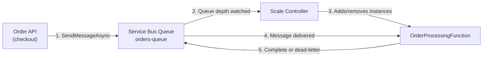
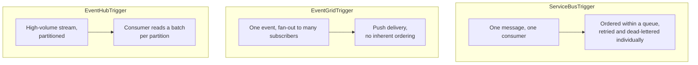

# Azure Functions with Messaging Triggers

## Introduction

Before reading this lesson, you should already be comfortable with **[Azure API Management in Depth](../16-azure-for-dotnet-developers/16-43-azure-api-management-in-depth.md)**, and with the Azure Functions foundations from earlier in this module — **[Introduction to Azure Functions](../16-azure-for-dotnet-developers/16-12-introduction-to-azure-functions.md)** and **[Azure Functions Bindings and Triggers](../16-azure-for-dotnet-developers/16-13-azure-functions-bindings-triggers.md)** — which introduced HTTP triggers and Timer triggers as the two easiest entry points. This lesson covers the trigger family those lessons deferred: Functions that wake up not because a client called an HTTP endpoint or a clock ticked, but because a *message* arrived on **Azure Service Bus**, **Event Grid**, or **Event Hubs** — the three messaging services this sub-area has been building toward.

By the end of this lesson, you will be able to:

- Explain how a messaging trigger eliminates the polling loop a hand-written consumer would otherwise need
- Wire a Function to a Service Bus queue using `[ServiceBusTrigger]`, in the .NET Isolated Worker model
- Build a Service-Bus-Queue-triggered Function that processes incoming e-commerce orders
- Explain how the Functions scale controller grows or shrinks consumer instances based on queue depth
- Distinguish the delivery guarantees a queue trigger provides from those of Event Grid and Event Hub triggers
- Configure retry behavior and recognize when a message is abandoned to the dead-letter queue

## Azure Functions Messaging Triggers — A Layman's Perspective

Picture a busy restaurant kitchen with an order rail — the metal bar where waitstaff clip paper tickets as orders come in. In a poorly run kitchen, a cook would have to walk over and check the rail every thirty seconds just to see whether a new ticket had appeared, wasting motion on every check that finds nothing. A well-run kitchen instead wires the rail to a bell: the instant a ticket is clipped, the bell rings, and whichever station is free steps up immediately. Nobody checks the rail on a schedule — the rail *announces itself*.

That bell is exactly what a messaging trigger gives an Azure Function. Without it, a consumer would need to be written as a loop: connect to the queue, ask "anything new?", get nothing, wait, ask again — burning compute the entire time regardless of whether any work exists. A Service Bus, Event Grid, or Event Hub trigger removes that loop entirely. The Functions runtime itself holds the connection to the messaging service, and your code — the "station" in the kitchen analogy — is invoked only at the exact moment a message actually arrives, with the message's contents handed to it directly as a parameter. No polling code is ever written by hand.

Now extend the kitchen on a Friday night rush. One cook at the grill station is fine on a slow Tuesday, but Friday's order rail fills up faster than one cook can keep pace — tickets start backing up, and customers wait longer and longer. A well-equipped kitchen calls in more grill cooks the moment the rail starts backing up, and sends some home again once the rush passes and the rail stays empty. That's precisely how Azure Functions scales a queue-triggered app: it doesn't run on a fixed number of instances around the clock. It watches how many messages are waiting — the queue depth, equivalent to how many tickets are stacked on the rail — and automatically adds or removes function instances to match, without anyone manually provisioning more compute during a big sale.

The dead-letter queue, covered more fully in the capstone lesson ahead, is the kitchen's rejected-ticket bin: an order that a cook tried and failed to prepare correctly several times running gets pulled off the active rail entirely, so it stops blocking the cooks behind it, and gets set aside for a manager to look at by hand — rather than letting one bad ticket jam the whole rail indefinitely.

## Azure Functions Messaging Triggers — A Programming Language Perspective

A **messaging trigger** is a Functions trigger binding that subscribes a function directly to a message source rather than to an HTTP endpoint or a timer. In the .NET **Isolated Worker** model — the current default for .NET 10 Functions — a queue-triggered function is declared with the `[Function]` attribute plus a binding attribute on its parameter: `[ServiceBusTrigger("orders-queue", Connection = "ServiceBusConnection")]` for Service Bus, `[EventGridTrigger]` for Event Grid, or `[EventHubTrigger("telemetry-hub", Connection = "EventHubConnection")]` for Event Hubs. The Functions **scale controller** (Consumption/Elastic Premium plans) or **KEDA** (Container Apps-hosted Functions, Lesson 15) monitors the message source's backlog — queue length for Service Bus, partition lag for Event Hubs — and adjusts the number of running instances accordingly, entirely outside application code. A thrown exception inside the function body signals a processing failure back to the runtime, which retries according to `host.json` settings before ultimately dead-lettering the message.

## How to Wire a Function to a Service Bus Queue Trigger

Connecting a Function to Service Bus takes a queue, a connection string bound to app settings, and a trigger attribute — no consumer loop, no manual `ServiceBusReceiver` polling.


*Figure 1: The Function never polls the queue — the runtime delivers messages and the scale controller sizes the consumer pool to match queue depth.*

```bash
# Azure CLI — create the queue this Function will trigger on
az servicebus queue create --resource-group rg-ecommerce-prod \
  --namespace-name sb-ecommerce-prod --name orders-queue \
  --max-delivery-count 5
```

**Azure CLI Output:**

```text
{
  "name": "orders-queue",
  "maxDeliveryCount": 5,
  "status": "Active"
}
```

```csharp
// OrderProcessingFunction.cs — .NET 10 / C# 14 — Isolated Worker model
using Microsoft.Azure.Functions.Worker;
using Microsoft.Extensions.Logging;

public sealed record OrderMessage(string OrderId, string CustomerId, decimal Total);

public sealed class OrderProcessingFunction(ILogger<OrderProcessingFunction> logger)
{
    [Function("OrderProcessingFunction")]
    public void Run(
        [ServiceBusTrigger("orders-queue", Connection = "ServiceBusConnection")] OrderMessage order)
    {
        logger.LogInformation(
            "Received order {OrderId} for customer {CustomerId}, total {Total:C}",
            order.OrderId, order.CustomerId, order.Total);
    }
}
```

**Console Output (`func start` — local Azure Functions Core Tools run):**

```text
[2026-08-16T09:12:03Z] Worker process started and initialized.
[2026-08-16T09:12:05Z] Executing 'Functions.OrderProcessingFunction'
[2026-08-16T09:12:05Z] Received order ORD-1042 for customer CUST-778, total $249.99
[2026-08-16T09:12:05Z] Executed 'Functions.OrderProcessingFunction' (Succeeded)
```

`Run` takes an `OrderMessage`, not a raw `ServiceBusReceivedMessage` — the Functions runtime deserializes the message body automatically based on the parameter type, the same convention used by HTTP trigger model binding two lessons ago. Because the method returns normally, the runtime completes the message on the queue on the function's behalf; had it thrown, the message would have been made visible again for a retry, up to the `max-delivery-count` configured when the queue was created.

## Real-Time Example: Auto-Scaling E-Commerce Order Processing

We extend the e-commerce checkout flow: `OrderApi`, fronted by APIM in the previous lesson, now publishes a message to `orders-queue` on every completed checkout instead of processing the order synchronously in the request thread. `OrderProcessingFunction` consumes that queue, and the platform needs enough running instances to keep pace during a flash sale without paying for idle capacity the rest of the day.

```csharp
// ScaleSimulation.cs — .NET 10 / C# 14 — Real-Time Example (E-Commerce)
public sealed record ScaleSample(TimeOnly Time, int QueueDepth, int RunningInstances);

ScaleSample[] samples =
[
    new(new TimeOnly(9, 0), QueueDepth: 3, RunningInstances: 1),
    new(new TimeOnly(9, 5), QueueDepth: 480, RunningInstances: 1),   // flash sale begins
    new(new TimeOnly(9, 6), QueueDepth: 510, RunningInstances: 8),   // scale controller reacts
    new(new TimeOnly(9, 20), QueueDepth: 40, RunningInstances: 8),
    new(new TimeOnly(9, 25), QueueDepth: 2, RunningInstances: 1)     // sale ends, scale back down
];

Console.WriteLine("orders-queue — depth vs. running OrderProcessingFunction instances:");
foreach (ScaleSample s in samples)
    Console.WriteLine($"  {s.Time,8:t}  queue depth: {s.QueueDepth,4}  instances: {s.RunningInstances,2}");
```

**Console Output:**

```text
orders-queue — depth vs. running OrderProcessingFunction instances:
   9:00 AM  queue depth:    3  instances:  1
   9:05 AM  queue depth:  480  instances:  1
   9:06 AM  queue depth:  510  instances:  8
   9:20 AM  queue depth:   40  instances:  8
   9:25 AM  queue depth:    2  instances:  1
```

The jump from one instance to eight happens without an operator adjusting a slider, an alert firing, or a deployment being triggered — the scale controller reacts to the queue depth spike directly. This is the concrete payoff of decoupling checkout from order processing with a queue in the first place: `OrderApi` keeps accepting checkouts at normal speed throughout the sale, while `OrderProcessingFunction` absorbs the backlog by scaling out, then scales back down once the queue drains, so the platform isn't paying for eight always-on instances outside of sale events.

## Queue Trigger vs Event Grid Trigger vs Event Hub Trigger

All three messaging triggers invoke a Function without a manual polling loop, but they differ sharply in delivery semantics, ordering, and intended traffic shape — differences this sub-area's next lesson expands into a full decision guide.


*Figure 2: A queue trigger delivers one message to one consumer; an Event Grid trigger fans a single event out to many subscribers; an Event Hub trigger reads high-volume partitioned batches.*

| Aspect | ServiceBusTrigger | EventGridTrigger | EventHubTrigger |
|---|---|---|---|
| Delivery model | One message, one logical consumer | Push, fan-out to every matching subscriber | Pull, batched per partition |
| Ordering | Preserved within a queue or session | Not guaranteed | Preserved within a partition |
| Retry on failure | Automatic redelivery up to max delivery count, then dead-letter | Configurable retry policy per event subscription | Checkpoint-based; failed batch is re-read |
| Best suited for | Discrete business messages needing reliable processing | Lightweight, reactive notifications | High-volume telemetry/event streams |

## Types and Related Concepts of Messaging Triggers

Messaging triggers connect Functions directly into the services this sub-area has covered, plus a few adjacent ones:

1. **[Azure Service Bus: Queues](../16-azure-for-dotnet-developers/16-38-azure-service-bus-queues.md)** — the message source used in this lesson's queue trigger.
2. **[Azure Event Grid](../16-azure-for-dotnet-developers/16-40-azure-event-grid.md)** — the fan-out, event-notification counterpart to a queue trigger.
3. **[Azure Event Hubs](../16-azure-for-dotnet-developers/16-41-azure-event-hubs.md)** — the high-volume streaming counterpart, contrasted above.
4. **[Durable Functions](../16-azure-for-dotnet-developers/16-14-durable-functions.md)** — for chaining multiple steps after a message triggers the first one.
5. **[Azure Functions Bindings and Triggers](../16-azure-for-dotnet-developers/16-13-azure-functions-bindings-triggers.md)** — the general binding model this lesson's messaging triggers are specific instances of.
6. **[Azure Container Apps](../16-azure-for-dotnet-developers/16-15-azure-container-apps.md)** — where KEDA, rather than the Consumption plan's scale controller, drives the same queue-depth-based scaling for container-hosted Functions.

## What You've Learned & What's Next

Messaging triggers let an Azure Function react directly to a Service Bus message, an Event Grid event, or an Event Hubs stream, with no polling loop in your code and with instance count automatically tracking backlog depth — turning what would otherwise be a manually-scaled background worker into infrastructure that grows and shrinks with actual load.

Continue your learning journey with **[Service Bus vs Event Grid vs Event Hubs — Comparison](../16-azure-for-dotnet-developers/16-45-servicebus-vs-eventgrid-vs-eventhubs.md)**, where this lesson's trigger-level comparison table expands into a full decision framework across everything this sub-area has covered.

---
*Applies to: .NET 10 / C# 14. Last reviewed 2026-08-16.*
