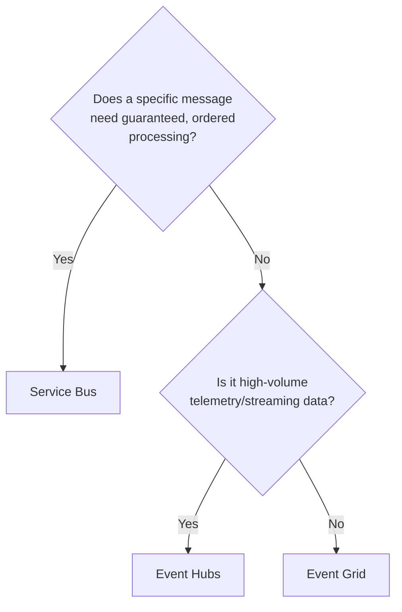
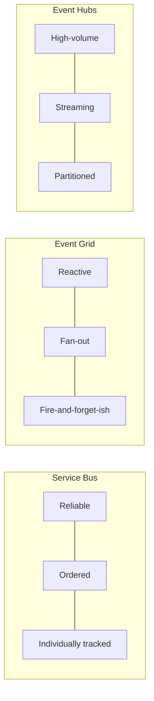

# Service Bus vs Event Grid vs Event Hubs — Comparison

## Introduction

Before reading this lesson, you should already be comfortable with **[Azure Functions with Messaging Triggers](../16-azure-for-dotnet-developers/16-44-azure-functions-messaging-triggers.md)**, and ideally with each of the three messaging services covered individually earlier in this sub-area: Service Bus (Lessons 38–39), Event Grid (Lesson 40), and Event Hubs (Lesson 41). Each of those lessons necessarily focused on one service in isolation. This lesson does the opposite: it puts all three side by side and answers the question every one of those earlier lessons deferred — *given a real scenario, which one do you actually reach for?*

By the end of this lesson, you will be able to:

- State, in one sentence each, what Service Bus, Event Grid, and Event Hubs are individually optimized for
- Apply a three-way decision framework to a new, unseen scenario in under a minute
- Explain why "message" is used loosely across all three services despite very different delivery guarantees underneath
- Map each of the three recurring case-study domains — E-Commerce, Banking/ATM, Library/Inventory — onto the service that fits it best
- Recognize when a scenario genuinely needs more than one of these services working together, rather than picking exactly one

## Choosing an Azure Messaging Service — A Layman's Perspective

Three very different systems exist for moving information from one place to another in the physical world, and conflating them causes real problems. The first is **registered mail**: a courier hands a specific numbered envelope to a specific recipient, gets a signature, and if delivery fails, tries again — and again — before finally setting the envelope aside for a supervisor to open by hand. Nobody sends registered mail to a thousand people at once; it exists for the rare item where losing it, duplicating it, or delivering it out of order would be a real problem — a signed contract, a wire transfer confirmation.

The second is a **community bulletin board with a phone tree**: a school posts "picture day moved to Thursday" once, and it doesn't matter how many parents see it, in what order, or whether a few miss it entirely because they'll hear about it another way. Nobody tracks which specific parent read the notice or resends it individually to stragglers; the announcement is broadcast once, cheaply, and whoever is listening reacts.

The third is a **utility company's live meter-reading network**: hundreds of thousands of smart meters each report a tiny reading every few seconds, continuously, forever. No single reading matters much on its own — losing one from one meter for one interval barely registers — but the *aggregate stream*, read continuously by systems built specifically for high-volume ingestion, is exactly what powers billing and grid-load analysis. Nobody signs for each individual meter reading, and nobody tries to redeliver a specific missed one; the stream just keeps flowing.

Azure gives you exactly these three systems, under the names **Service Bus** (registered mail — reliable, ordered, individually-tracked business messages), **Event Grid** (the bulletin board — lightweight, reactive, one-to-many event notifications), and **Event Hubs** (the meter network — high-volume, continuous telemetry streaming). The single biggest design mistake this comparison exists to prevent is picking the wrong one for the shape of the traffic you actually have — using registered mail for a bulletin-board announcement wastes enormous overhead per item, and trying to treat a meter-reading stream like registered mail would collapse under the sheer volume the instant you tried to individually track and retry every reading.

## Choosing an Azure Messaging Service — A Programming Language Perspective

In code, the distinction shows up in which SDK client you reach for and what guarantees it makes. `Azure.Messaging.ServiceBus`'s `ServiceBusSender`/`ServiceBusReceiver` (or `ServiceBusProcessor`) model a **queue or topic subscription**: a message is received, processed, then explicitly completed, abandoned, or dead-lettered — guaranteeing at-least-once delivery with per-message tracking. `Azure.Messaging.EventGrid`'s `EventGridPublisherClient` publishes a **discrete event** to a topic, which Event Grid fans out to every matching **event subscription** — the publisher has no notion of individual subscriber acknowledgment. `Azure.Messaging.EventHubs`'s `EventHubProducerClient`/`EventHubConsumerClient` write to and read from **partitions** in a continuously-flowing, checkpointed stream, optimized for throughput measured in thousands of events per second rather than per-message tracking. Each maps to a distinct Azure Functions trigger attribute — `[ServiceBusTrigger]`, `[EventGridTrigger]`, `[EventHubTrigger]` — introduced in the previous lesson.

## How to Choose: A Decision Function in Code

Rather than memorizing the comparison table below from scratch, it helps to encode the decision as an actual function — the same three questions, asked in order, that the table encodes visually.


*Figure 1: The three-question decision tree behind the comparison table — reliability first, then volume/shape.*

```csharp
// MessagingServiceAdvisor.cs — .NET 10 / C# 14
public enum AzureMessagingService { ServiceBus, EventGrid, EventHubs }

static AzureMessagingService Recommend(bool needsGuaranteedOrderedDelivery, bool isHighVolumeTelemetry) =>
    needsGuaranteedOrderedDelivery ? AzureMessagingService.ServiceBus
    : isHighVolumeTelemetry ? AzureMessagingService.EventHubs
    : AzureMessagingService.EventGrid;

(string Scenario, bool NeedsOrdering, bool IsHighVolume)[] scenarios =
[
    ("Bank wire transfer instruction", NeedsOrdering: true, IsHighVolume: false),
    ("Library book returned notification", NeedsOrdering: false, IsHighVolume: false),
    ("IoT checkout-lane scanner telemetry", NeedsOrdering: false, IsHighVolume: true)
];

foreach (var s in scenarios)
{
    var recommendation = Recommend(s.NeedsOrdering, s.IsHighVolume);
    Console.WriteLine($"{s.Scenario,-38} -> {recommendation}");
}
```

**Console Output:**

```text
Bank wire transfer instruction         -> ServiceBus
Library book returned notification     -> EventGrid
IoT checkout-lane scanner telemetry     -> EventHubs
```

This is deliberately the same logic the comparison table encodes as prose — writing it as a function makes explicit that the decision is a short, ordered set of questions, not an arbitrary lookup: ask about reliability first, then about volume, and the answer falls out.

## Real-Time Example: One Recommendation per Case-Study Domain

Running the same `Recommend` function against a scenario from each of the curriculum's three recurring domains shows the pattern holding regardless of industry: it's the *shape* of the traffic, not the business vertical, that determines the right service.

```csharp
// CaseStudyRouting.cs — .NET 10 / C# 14 — Real-Time Example
(string Domain, string Scenario, bool NeedsOrdering, bool IsHighVolume)[] caseStudies =
[
    ("Banking/ATM", "ATM cash-withdrawal debit posting", NeedsOrdering: true, IsHighVolume: false),
    ("Library/Inventory", "New-book-arrival notification to subscribers", NeedsOrdering: false, IsHighVolume: false),
    ("E-Commerce", "Checkout-page click and scroll telemetry", NeedsOrdering: false, IsHighVolume: true),
    ("E-Commerce", "Order placed at checkout", NeedsOrdering: true, IsHighVolume: false)
];

foreach (var cs in caseStudies)
{
    var recommendation = Recommend(cs.NeedsOrdering, cs.IsHighVolume);
    Console.WriteLine($"[{cs.Domain,-18}] {cs.Scenario,-42} -> {recommendation}");
}
```

**Console Output:**

```text
[Banking/ATM       ] ATM cash-withdrawal debit posting             -> ServiceBus
[Library/Inventory ] New-book-arrival notification to subscribers  -> EventGrid
[E-Commerce        ] Checkout-page click and scroll telemetry      -> EventHubs
[E-Commerce        ] Order placed at checkout                      -> ServiceBus
```

Notice the same domain, E-Commerce, produces two different recommendations depending on the specific scenario — clickstream telemetry is Event Hubs territory, while the order itself, which absolutely must be processed exactly once and in a sane order, is Service Bus territory. That last row is exactly the scenario the next lesson builds into a full pipeline.

## The Three-Way Comparison

This is the section the rest of the lesson has been building toward, and it consolidates everything from Lessons 38 through 44.

**Service Bus — reliable, ordered business messages.** Choose Service Bus whenever losing a message, processing it twice, or processing it out of order would cause a real business problem: financial transactions, order placement, inventory reservation, anything where "exactly one consumer eventually processes this exactly right" matters more than raw throughput. It is comparatively expensive per message and comparatively low-throughput next to the other two, and that is by design — the guarantees cost something, and you pay it deliberately, only where it's needed.

**Event Grid — lightweight, reactive event notifications.** Choose Event Grid when something happened and any number of interested parties should react, but no single reaction is so critical that its failure needs individual, guaranteed retry-and-dead-letter handling on your part — a blob was uploaded, a resource was provisioned, a book was returned. Event Grid's strength is fan-out: one event can trigger a Function, a Logic App, and a webhook simultaneously, each configured independently, with none of them blocking or even aware of the others.

**Event Hubs — high-volume telemetry and streaming.** Choose Event Hubs when the traffic is less "a message" and more "a continuous stream" — sensor readings, clickstream events, application logs — where individual items are cheap and somewhat disposable, but the aggregate flow, often in the thousands of events per second, needs to be captured and processed, typically by multiple independent consumer groups reading the same stream for different purposes (real-time dashboards and long-term storage, simultaneously).


*Figure 2: Three genuinely different shapes of traffic — none is a drop-in substitute for another.*

| Aspect | Service Bus | Event Grid | Event Hubs |
|---|---|---|---|
| Traffic shape | Discrete business messages | Discrete event notifications | Continuous high-volume stream |
| Delivery model | Pull (queue/subscription), at-least-once | Push, fan-out to subscribers | Pull, partitioned, checkpointed |
| Ordering guarantee | Yes, within a queue or session | No | Yes, within a partition |
| Typical throughput | Low-to-moderate, per message | Low-to-moderate, per event | Very high, thousands/sec |
| Failure handling | Automatic retry, then dead-letter queue | Configurable retry policy per subscription | Consumer re-reads from last checkpoint |
| .NET client | `Azure.Messaging.ServiceBus` | `Azure.Messaging.EventGrid` | `Azure.Messaging.EventHubs` |
| Functions trigger | `[ServiceBusTrigger]` | `[EventGridTrigger]` | `[EventHubTrigger]` |
| Best-fit scenario | Order processing, financial transactions | Resource-change notifications, webhooks | Telemetry, logs, clickstream analytics |
| This module's lesson | 38–39 | 40 | 41 |

## Types and Related Concepts from This Sub-Area

This lesson is deliberately a consolidation point; the full detail behind each row above lives in the lessons already covered:

1. **[Azure Service Bus: Queues](../16-azure-for-dotnet-developers/16-38-azure-service-bus-queues.md)** — point-to-point reliable messaging.
2. **[Azure Service Bus: Topics and Subscriptions](../16-azure-for-dotnet-developers/16-39-azure-service-bus-topics.md)** — Service Bus's own one-to-many pattern, for when fan-out still needs Service Bus-grade reliability.
3. **[Azure Event Grid](../16-azure-for-dotnet-developers/16-40-azure-event-grid.md)** — the reactive-notification service compared above.
4. **[Azure Event Hubs](../16-azure-for-dotnet-developers/16-41-azure-event-hubs.md)** — the high-volume streaming service compared above.
5. **[Azure Logic Apps](../16-azure-for-dotnet-developers/16-42-azure-logic-apps.md)** — a common consumer of both Event Grid events and Service Bus messages, for workflow orchestration.
6. **[Azure Functions with Messaging Triggers](../16-azure-for-dotnet-developers/16-44-azure-functions-messaging-triggers.md)** — how C# code actually attaches to any of the three services covered here.

## What You've Learned & What's Next

Service Bus, Event Grid, and Event Hubs are not three interchangeable ways to "send a message" — they are three different tools for three different shapes of traffic, and the decision between them comes down to two questions asked in order: does a specific item need guaranteed, ordered handling, and is the traffic high-volume and continuous. Reliable business messages point to Service Bus, reactive notifications point to Event Grid, and telemetry streams point to Event Hubs.

Continue your learning journey with **[Processing E-Commerce Orders via Service Bus — Real-Time Example](../16-azure-for-dotnet-developers/16-46-ecommerce-orders-via-service-bus.md)**, the capstone of this sub-area, where the "Order placed at checkout" row from this lesson's table becomes a complete, working pipeline.

---
*Applies to: .NET 10 / C# 14. Last reviewed 2026-08-16.*
