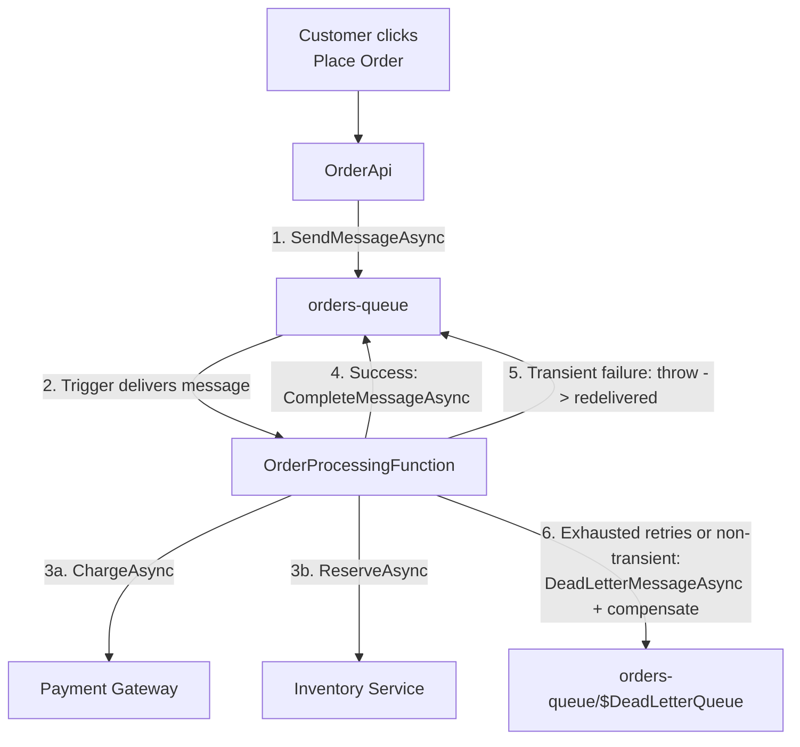
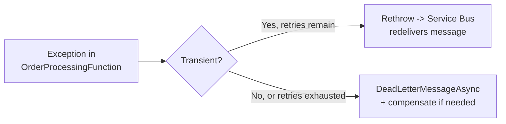

# Processing E-Commerce Orders via Service Bus — Real-Time Example

## Introduction

Before reading this lesson, you should already be comfortable with **[Service Bus vs Event Grid vs Event Hubs — Comparison](../16-azure-for-dotnet-developers/16-45-servicebus-vs-eventgrid-vs-eventhubs.md)**, which concluded that a checkout order — needing guaranteed, ordered, exactly-processed-once handling — belongs on Service Bus. This lesson is the capstone of the Messaging & Integration sub-area: it stops comparing services and instead builds the complete pipeline that decision implies, from the moment a customer clicks "place order" through payment, inventory reservation, and — when something goes wrong — dead-lettering and compensation.

By the end of this lesson, you will be able to:

- Build a checkout flow where `OrderApi` publishes to a Service Bus queue instead of processing the order inline
- Write a Service-Bus-triggered Function that charges payment and reserves inventory for an incoming order
- Configure a retry policy so transient failures are retried automatically before a message is given up on
- Recognize when a message should be dead-lettered rather than retried indefinitely
- Apply Module 12's Saga pattern to compensate for a partially-completed order (payment succeeded, inventory failed, or vice versa)
- Recap how Lessons 38 through 46 fit together as one coherent messaging strategy

## E-Commerce Order Processing via Service Bus — A Layman's Perspective

Picture a parcel-sorting facility with a single conveyor belt feeding a sorting station. Each package on the belt is one customer's order. The sorting robot at the station picks up a package, checks it against the manifest, weighs it, and routes it onward — all fully automatic, no human touching each package individually. Most packages sail through without incident.

Occasionally a package's label is smudged and the robot's scanner can't read it cleanly on the first pass. A well-designed facility doesn't fail the whole belt over one smudged label — the robot gives that specific package a couple more scan attempts, maybe under better lighting, before giving up on it. If it still can't be read after a handful of tries, the robot doesn't keep the belt jammed retrying forever, and it doesn't just guess and risk sending a package to the wrong destination — it diverts that one package onto a side track, a physical "problem bin," and lets the rest of the belt keep moving. A supervisor checks the problem bin by hand at the end of the shift, deciding case by case whether to relabel and resend, or refund the sender. That side track is the dead-letter queue; the couple of extra scan attempts before diverting it are the retry policy.

Now add one more wrinkle a good facility handles carefully: what if a package was already weighed and billed to the customer's account, but then the routing scanner failed and it had to be pulled to the problem bin anyway? The facility can't just leave that customer charged for a package that never shipped. A well-run operation has a standing rule for exactly this: if the first step of a multi-step process succeeded but a later step failed, *undo* the first step — refund the billing — rather than leaving the customer in a half-completed, inconsistent state. That undo-the-earlier-step rule is precisely what Module 12's Saga pattern formalizes for software, and it's exactly what this lesson's order-processing pipeline needs the moment payment succeeds but inventory reservation doesn't.

## E-Commerce Order Processing via Service Bus — A Programming Language Perspective

The pipeline in this lesson uses `ServiceBusClient`/`ServiceBusSender` in `OrderApi` to publish a `CheckoutOrderMessage` to `orders-queue`, and a `[ServiceBusTrigger]`-bound Isolated Worker Function to consume it, exactly as introduced in Lesson 44. Retry behavior comes from two layers working together: Service Bus's own `MaxDeliveryCount` on the queue (configured in Lesson 44's example) governs how many times an unacknowledged or faulted message is redelivered before Service Bus itself moves it to the **dead-letter queue** (a system sub-queue, not a separate resource); inside the function, a caught, transient failure can be deliberately rethrown to trigger that redelivery, while a non-transient failure calls `DeadLetterMessageAsync` immediately, skipping retries it has no chance of succeeding on. When a partial failure needs to *undo* an already-completed step, that compensating logic is exactly the pattern documented in Module 12's **[Saga Pattern](../12-advanced-concepts/12-44-the-saga-pattern.md)**, applied here at the scale of a single message rather than a distributed multi-service transaction.

## How to Build the Checkout-to-Processing Pipeline

The pipeline has two independently deployable pieces: `OrderApi`, which publishes on checkout, and `OrderProcessingFunction`, which consumes, processes, and — on repeated failure — dead-letters with compensation.


*Figure 1: Checkout is decoupled from processing by the queue; failures either retry automatically or fall through to dead-lettering with compensation.*

```bash
# Azure CLI — configure the retry policy on the queue used throughout this pipeline
az servicebus queue update --resource-group rg-ecommerce-prod \
  --namespace-name sb-ecommerce-prod --name orders-queue \
  --max-delivery-count 5 --lock-duration PT1M
```

**Azure CLI Output:**

```text
{
  "name": "orders-queue",
  "maxDeliveryCount": 5,
  "lockDuration": "PT1M"
}
```

```csharp
// OrderApi.cs — .NET 10 / C# 14 — publishing at checkout
using Azure.Messaging.ServiceBus;

var builder = WebApplication.CreateBuilder(args);
builder.Services.AddSingleton(_ =>
    new ServiceBusClient(builder.Configuration["ServiceBus:ConnectionString"]));
var app = builder.Build();

app.MapPost("/checkout", async (CheckoutRequest request, ServiceBusClient client) =>
{
    ServiceBusSender sender = client.CreateSender("orders-queue");
    var order = new CheckoutOrderMessage(request.OrderId, request.CustomerId, request.Total);
    await sender.SendMessageAsync(new ServiceBusMessage(System.Text.Json.JsonSerializer.SerializeToUtf8Bytes(order)));
    return Results.Accepted(value: new { order.OrderId, status = "Queued" });
});

app.Run();

public sealed record CheckoutRequest(string OrderId, string CustomerId, decimal Total);
public sealed record CheckoutOrderMessage(string OrderId, string CustomerId, decimal Total);
```

**Console Output (`POST /checkout`):**

```text
$ curl -X POST https://apim-ecommerce-prod.azure-api.net/checkout \
    -d '{"orderId":"ORD-2091","customerId":"CUST-441","total":89.50}'

{"orderId":"ORD-2091","status":"Queued"}
```

`OrderApi` returns to the customer the instant the message lands on `orders-queue` — it never waits for payment or inventory to finish, which is exactly the decoupling this sub-area has been building toward since Lesson 38. Everything downstream of that `Accepted` response is now `OrderProcessingFunction`'s responsibility.

## Real-Time Example: Processing, Dead-Lettering, and Compensation

`OrderProcessingFunction` picks up `CheckoutOrderMessage` and performs the two steps a real checkout requires: charge payment, then reserve inventory. If inventory reservation fails *after* payment already succeeded, the function must compensate by refunding — precisely the Saga-pattern concern the layman's section described.

```csharp
// OrderProcessingFunction.cs — .NET 10 / C# 14 — Real-Time Example (E-Commerce)
using Azure.Messaging.ServiceBus;
using Microsoft.Azure.Functions.Worker;
using Microsoft.Extensions.Logging;

public sealed record CheckoutOrderMessage(string OrderId, string CustomerId, decimal Total);

public sealed class OrderProcessingFunction(
    PaymentGateway payments, InventoryService inventory, ILogger<OrderProcessingFunction> logger)
{
    [Function("OrderProcessingFunction")]
    public async Task RunAsync(
        [ServiceBusTrigger("orders-queue", Connection = "ServiceBusConnection")] CheckoutOrderMessage order,
        ServiceBusMessageActions messageActions,
        ServiceBusReceivedMessage rawMessage)
    {
        bool paymentCharged = false;
        try
        {
            await payments.ChargeAsync(order.CustomerId, order.Total);
            paymentCharged = true;

            await inventory.ReserveAsync(order.OrderId);

            logger.LogInformation("Order {OrderId} processed: payment charged, inventory reserved.", order.OrderId);
            await messageActions.CompleteMessageAsync(rawMessage);
        }
        catch (InventoryUnavailableException) when (paymentCharged)
        {
            // Saga-style compensation: undo the step that already succeeded
            await payments.RefundAsync(order.CustomerId, order.Total);
            logger.LogWarning("Order {OrderId}: inventory unavailable, payment refunded (compensated).", order.OrderId);
            await messageActions.DeadLetterMessageAsync(rawMessage, deadLetterReason: "InventoryUnavailable");
        }
        catch (Exception ex) when (rawMessage.DeliveryCount < 5)
        {
            logger.LogWarning(ex, "Order {OrderId}: transient failure, delivery {Count}/5.", order.OrderId, rawMessage.DeliveryCount);
            throw; // let Service Bus redeliver — this is the retry policy in action
        }
    }
}

public sealed class InventoryUnavailableException : Exception;
public sealed class PaymentGateway
{
    public Task ChargeAsync(string customerId, decimal amount) => Task.CompletedTask;
    public Task RefundAsync(string customerId, decimal amount) => Task.CompletedTask;
}
public sealed class InventoryService
{
    public Task ReserveAsync(string orderId) => Task.CompletedTask;
}
```

**Console Output (one successful order, one compensated order):**

```text
info: OrderProcessingFunction[0]
      Order ORD-2091 processed: payment charged, inventory reserved.
warn: OrderProcessingFunction[0]
      Order ORD-2092: inventory unavailable, payment refunded (compensated).
```

`ORD-2091` completes cleanly and is removed from the queue. `ORD-2092`'s payment succeeds, but its inventory reservation throws `InventoryUnavailableException` — rather than leaving the customer charged with no order fulfilled, the `when (paymentCharged)` filter catches exactly that case, issues a refund first, and only then dead-letters the message with a reason string a support engineer can read directly from the dead-letter sub-queue. Contrast this with a genuinely transient failure — a momentary network blip calling the payment gateway — which instead rethrows and lets Service Bus redeliver the message up to five times, per the queue's `MaxDeliveryCount`, before ever reaching the dead-letter path. Both failure modes are handled, but only one of them ever needed compensation, and the function's two `catch` clauses, ordered deliberately, tell them apart.

## Retry Policy vs Dead-Lettering — When to Use Each

Retry and dead-lettering are not alternatives to choose between once — they are two stages of the same failure-handling pipeline, and confusing which stage a given failure belongs in causes real problems. A transient failure — a timeout, a momentary 503 from a downstream dependency — should be *retried*, because trying again shortly afterward has a real chance of succeeding, and Service Bus's built-in redelivery-up-to-`MaxDeliveryCount` handles this without any special code beyond rethrowing. A non-transient failure — the inventory genuinely doesn't exist, the order references a customer ID that was never valid — should skip straight to dead-lettering, because retrying it five more times wastes delivery attempts on a message that will never succeed, and worse, delays discovery of a real data problem behind a wall of pointless retries.


*Figure 2: The same exception path splits in two, based on whether trying again could plausibly help.*

| Aspect | Retry Policy | Dead-Lettering |
|---|---|---|
| Triggered by | Transient failures, retries remaining | Non-transient failures, or retries exhausted |
| Mechanism | Rethrow; Service Bus redelivers automatically | Explicit `DeadLetterMessageAsync` call |
| Message stays on | The active queue, re-locked for another attempt | The `$DeadLetterQueue` system sub-queue |
| Compensation needed? | Rarely — the operation hasn't been given up on | Often — an earlier step may have already succeeded |
| Who resolves it | The system, automatically | A human or an automated remediation process, later |

## Types and Related Concepts Recap

This lesson closes the nine-lesson Messaging & Integration sub-area; each concept below was introduced earlier and put to work here:

1. **[The Saga Pattern](../12-advanced-concepts/12-44-the-saga-pattern.md)** — the compensation logic behind the `RefundAsync` call above.
2. **[Event-Driven Architecture](../12-advanced-concepts/12-43-event-driven-architecture.md)** — the broader architectural style this whole sub-area has been an implementation of.
3. **[Retry Patterns with Polly](../05-exception-handling/05-09-retry-patterns-with-polly.md)** — a general-purpose retry mechanism, contrasted here with Service Bus's own built-in redelivery.
4. **[Azure Service Bus: Queues](../16-azure-for-dotnet-developers/16-38-azure-service-bus-queues.md)** — the foundation this entire pipeline is built on.
5. **[Azure Functions with Messaging Triggers](../16-azure-for-dotnet-developers/16-44-azure-functions-messaging-triggers.md)** — how `OrderProcessingFunction` is invoked at all.
6. **[Service Discovery and Resilience with Polly](../12-advanced-concepts/12-45-service-discovery-and-resilience.md)** — resilience patterns applicable to the `PaymentGateway` and `InventoryService` calls inside the function.

## What You've Learned & What's Next

This lesson closes the Messaging & Integration sub-area. Across nine lessons, the platform went from raw messaging primitives to a governed, production-shaped pipeline: **Service Bus queues and topics** (38–39) and **Event Grid** (40) and **Event Hubs** (41) established the three fundamental traffic shapes; **Logic Apps** (42) added no-code orchestration; **API Management** (43) put a governed front door on the synchronous side of the platform; **Functions with messaging triggers** (44) connected compute directly to all three messaging services; the **comparison lesson** (45) consolidated all of it into a single decision framework; and this capstone tied checkout, processing, retry, dead-lettering, and Saga-style compensation into one coherent, resilient order pipeline.

Continue your learning journey with **[Application Insights in Depth](../16-azure-for-dotnet-developers/16-47-application-insights-in-depth.md)**, where the Observability sub-area begins — because a pipeline this asynchronous, spanning `OrderApi`, a queue, and a Function, is exactly the kind of system that becomes very hard to reason about without proper telemetry.

---
*Applies to: .NET 10 / C# 14. Last reviewed 2026-08-16.*
