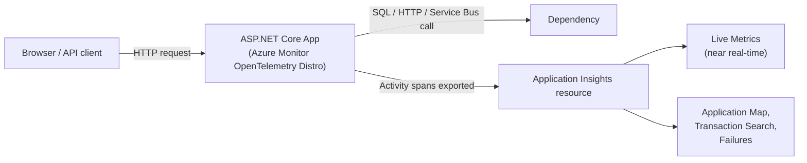
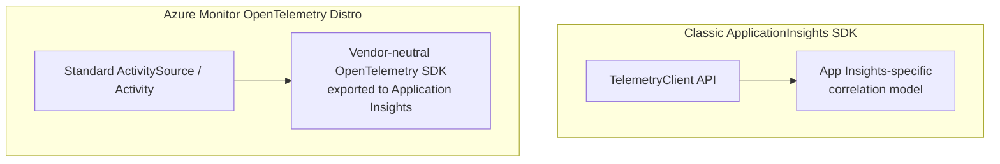

# Application Insights in Depth

## Introduction

Before reading this lesson, you should already be comfortable with **[Processing E-Commerce Orders via Service Bus](../16-azure-for-dotnet-developers/16-46-ecommerce-orders-via-service-bus.md)**, where an `OrderApi` publishes messages onto a Service Bus queue and an Azure Function drains them asynchronously. That pipeline now has three moving parts running on three different compute resources — and the moment something goes wrong at 2 a.m., "check the logs" stops being a single command and becomes a scavenger hunt across an App Service, a Function App, and a queue with no visible state. This lesson introduces the service that ends that scavenger hunt: **Application Insights**, Azure's Application Performance Monitoring (APM) service, and the concrete, production answer to a question Module 12's capstone lesson on distributed tracing left deliberately open — what actually receives and displays the `Activity` spans that `ActivitySource` produces?

By the end of this lesson, you will be able to:

- Explain what Application Insights is, and where it sits inside the broader Azure Monitor platform
- Enable auto-instrumentation for an ASP.NET Core app with a handful of lines, capturing requests, dependencies, and exceptions with no manual tracing code
- Distinguish the classic `Microsoft.ApplicationInsights.AspNetCore` SDK from the current Azure Monitor OpenTelemetry Distro
- Explain how Application Insights telemetry is the concrete Azure destination for the `ActivitySource`/`Activity` spans introduced in Module 12, Lesson 46
- Use Live Metrics to watch requests, failures, and dependency calls as they happen, with sub-second latency
- Read a captured exception and its correlated request in the Application Insights portal

## Application Insights — A Layman's Perspective

Picture a large retail store that has quietly wired itself with instrumentation everywhere, without asking any single employee to file a report. A sensor over each entrance counts every person walking in and how long the door stayed open. A discreet counter at each checkout lane logs how long each transaction took and whether the card reader had to retry. A small light near the stockroom door blinks red for a few seconds every time an item scanned at checkout wasn't actually in inventory. None of this depends on a cashier remembering to write anything down — it happens automatically, in the background, the instant the event occurs. And crucially, there's a live monitor in the manager's office showing all of it *right now* — not yesterday's summary, but the store's pulse at this exact second.

That is the entire value proposition of Application Insights, applied to software instead of a store. A running application has a "front door" (incoming requests), "checkout lanes" (calls out to a database, a queue, another API), and occasional "stockroom" failures (exceptions). Left uninstrumented, a developer only finds out about any of this by adding logging statements one at a time, redeploying, and hoping the next failure happens to hit a line that was actually being logged — the software equivalent of a store with no cameras, hoping an employee happens to notice something and remembers to mention it. Application Insights instead wires all three of those categories automatically, the moment the SDK is added to the project, with no attention required from the developer writing business logic.

The "live monitor in the manager's office" detail matters more than it first appears. A weekly sales report is useful for trends, but it is useless during an actual incident — nobody wants to wait until tomorrow's report to learn that checkout has been failing for the last eleven minutes. Application Insights' **Live Metrics** view is exactly that manager's-office monitor: request rate, failure rate, and dependency call duration updating on a stream, with roughly one second of lag, so a team pushing a risky deploy can watch it land in real time rather than finding out from a customer complaint an hour later.

And the "blinking red light" detail is the exception-tracking piece: when the checkout scanner encounters an item that isn't in stock, it doesn't just fail silently — a specific, visible signal fires, tied to exactly which lane and which item, at exactly which moment. That is precisely what Application Insights does with an unhandled exception: it captures the exception type, message, and full stack trace, and — this is the detail that turns "an error happened somewhere" into "this specific request, from this specific customer, at this specific millisecond, failed for this specific reason" — it automatically correlates that exception back to the exact incoming request that triggered it, without a developer having to manually thread an identifier through the call stack to make that connection happen.

The bridge to code: none of this instrumentation is bolted onto individual business methods by hand. It rides on the same automatic request/response and outbound-call interception that ASP.NET Core's middleware pipeline and `HttpClient`/database drivers already go through — the SDK simply taps into pipes that are already there.

## Application Insights — A Programming Language Perspective

**Application Insights** is Azure Monitor's Application Performance Monitoring (APM) component: an SDK-instrumented telemetry pipeline that captures **requests** (inbound HTTP calls), **dependencies** (outbound calls to a database, HTTP endpoint, or message broker), **exceptions**, and **traces**, sending them to an Application Insights resource for querying and visualization. Two SDK generations exist for ASP.NET Core. The classic `Microsoft.ApplicationInsights.AspNetCore` package registers telemetry via `builder.Services.AddApplicationInsightsTelemetry(...)` and predates OpenTelemetry entirely. The current generation, the **Azure Monitor OpenTelemetry Distro** (`Azure.Monitor.OpenTelemetry.AspNetCore`), instead configures the *standard* .NET `System.Diagnostics.Activity`/`ActivitySource` pipeline from Module 12, Lesson 46 and exports every span it produces to Application Insights via `UseAzureMonitor()` — meaning Application Insights telemetry today, under the hood, *is* OpenTelemetry data, correlated automatically by the same trace ID and span ID model that lesson already introduced.

## How to Enable Application Insights Auto-Instrumentation in ASP.NET Core

Provisioning the Azure resource is a single CLI call; wiring the app to it is a handful of lines, after which every controller and minimal API endpoint in the application is instrumented with no further code.


*Figure 1: Requests and outbound dependency calls are captured automatically and exported as correlated spans, without any manual tracing code in the controller.*

```bash
# Azure CLI — create an Application Insights resource
az monitor app-insights component create \
  --app ai-order-api-prod \
  --location eastus \
  --resource-group rg-ecommerce-prod \
  --application-type web
```

**Azure CLI Output:**

```text
{
  "appId": "3f1a9c2e-...",
  "connectionString": "InstrumentationKey=3f1a9c2e-...;IngestionEndpoint=https://eastus-8.in.applicationinsights.azure.com/;LiveEndpoint=https://eastus.livediagnostics.monitor.azure.com/",
  "name": "ai-order-api-prod",
  "provisioningState": "Succeeded"
}
```

```csharp
// Program.cs — .NET 10 / C# 14 — OrderApi
using Azure.Monitor.OpenTelemetry.AspNetCore;

var builder = WebApplication.CreateBuilder(args);

// One call instruments ASP.NET Core requests, outbound HttpClient calls, and
// SQL/Service Bus dependencies — all mapped onto ActivitySource spans under the hood
builder.Services.AddOpenTelemetry().UseAzureMonitor(options =>
{
    options.ConnectionString = builder.Configuration["ApplicationInsights:ConnectionString"];
});

var app = builder.Build();

app.MapPost("/orders", (OrderRequest request, ILogger<Program> logger) =>
{
    if (request.Quantity <= 0)
    {
        // Captured automatically as an exception telemetry item, correlated to this request
        throw new InvalidOperationException($"Invalid quantity {request.Quantity} for SKU {request.Sku}.");
    }

    logger.LogInformation("Order accepted for SKU {Sku}, quantity {Quantity}", request.Sku, request.Quantity);
    return Results.Accepted();
});

app.Run();

public sealed record OrderRequest(string Sku, int Quantity);
```

**Console Output (App Service log, then Live Metrics stream in the Azure Portal):**

```text
info: Program[0]
      Order accepted for SKU SKU-4471, quantity 2

Live Metrics — ai-order-api-prod (portal.azure.com)
  Incoming Requests: 4/sec    Failed Requests: 0/sec    Avg. Duration: 38ms
  Dependency Calls:  1/sec    Failed Dependency Calls: 0/sec
```

No `Activity.StartActivity` call appears anywhere in `OrderApi`'s code — `UseAzureMonitor()` registered listeners against ASP.NET Core's own instrumentation sources once, at startup, and every request since has produced a span automatically. That single registration is doing exactly what Module 12, Lesson 46 described `ActivitySource` and `Activity` doing in the abstract; Application Insights is simply where those spans land, get stored, and become queryable.

## Real-Time Example: Instrumenting the Order API and Order Processor Function

We continue directly from the previous lesson's `OrderApi` and its downstream Azure Function, `OrderProcessorFunction`, which drains the Service Bus queue that `OrderApi` publishes to. Both get `UseAzureMonitor()` pointed at the same Application Insights resource, so a single order's journey — API, queue, function — becomes one correlated transaction instead of two unrelated logs.

```csharp
// OrderProcessorFunction.cs — .NET 10 / C# 14 — Real-Time Example (E-Commerce)
public sealed class OrderProcessorFunction(ILogger<OrderProcessorFunction> logger, InventoryService inventory)
{
    [Function("OrderProcessorFunction")]
    public async Task Run(
        [ServiceBusTrigger("orders-queue", Connection = "ServiceBusConnection")] OrderMessage message)
    {
        // Because the ASP.NET Core caller and this Function both export to the same
        // Application Insights resource, this span is correlated back to the /orders POST
        // that originally enqueued the message — same trace ID, different span.
        bool inStock = await inventory.TryReserveAsync(message.Sku, message.Quantity);

        if (!inStock)
        {
            logger.LogWarning("Out-of-stock for SKU {Sku}, order {OrderId}", message.Sku, message.OrderId);
            throw new InvalidOperationException($"SKU {message.Sku} could not be reserved for order {message.OrderId}.");
        }

        logger.LogInformation("Reserved {Quantity} units of {Sku} for order {OrderId}", message.Quantity, message.Sku, message.OrderId);
    }
}

public sealed record OrderMessage(string OrderId, string Sku, int Quantity);
```

**Console Output (Application Insights — Transaction Search for the order's trace ID):**

```text
Trace ID: 8f2c91a4b7de4310...
  [Request]     POST /orders                         38ms   Succeeded
  [Dependency]  Service Bus Send: orders-queue         6ms   Succeeded
  ...
  [Request]     OrderProcessorFunction (Service Bus)  112ms  Failed
  [Exception]   InvalidOperationException: SKU SKU-4471 could not be reserved for order ORD-88213
```

Before Application Insights, diagnosing a failed order meant separately opening the App Service's logs and the Function App's logs and manually matching timestamps to guess which entries belonged together. With both processes exporting to the same resource, that same failure now surfaces as one transaction: the original HTTP request, the Service Bus send, and the Function's exception, all under a single trace ID, in the order they actually happened.

## Classic Application Insights SDK vs the Azure Monitor OpenTelemetry Distro

Two generations of instrumentation coexist in production Azure apps today, and new projects should not default to the older one. The classic `Microsoft.ApplicationInsights.AspNetCore` SDK predates OpenTelemetry and uses its own `TelemetryClient` API and its own correlation model, built specifically for Application Insights and nothing else. The **Azure Monitor OpenTelemetry Distro**, `Azure.Monitor.OpenTelemetry.AspNetCore`, instead configures the vendor-neutral OpenTelemetry SDK — the same `ActivitySource` model from Module 12 — and simply exports its output to Application Insights, meaning the identical instrumentation code would just as easily export to a different backend if one were ever needed. As of .NET 10, in mid-2026, Microsoft's guidance is unambiguous: the OpenTelemetry Distro is the recommended path for all new applications, and the classic SDK is in long-term maintenance rather than active feature development.


*Figure 2: The classic SDK is a bespoke pipeline built only for Application Insights; the OpenTelemetry Distro reuses the same standard tracing model introduced in Module 12.*

| Aspect | Classic ApplicationInsights SDK | Azure Monitor OpenTelemetry Distro |
|---|---|---|
| Underlying tracing model | Proprietary `TelemetryClient` | Standard `ActivitySource`/`Activity` (OpenTelemetry) |
| Custom telemetry API | `TelemetryClient.TrackEvent`, `TrackMetric` | `ActivitySource.StartActivity`, `Meter` (OpenTelemetry API) |
| Portability to another backend | None — App Insights only | Yes — same code can export elsewhere via a different exporter |
| Setup call | `AddApplicationInsightsTelemetry()` | `AddOpenTelemetry().UseAzureMonitor()` |
| Recommended for new apps (2026) | No — maintenance mode | Yes — Microsoft's current default |

## Types of Application Insights Telemetry

Application Insights groups everything it captures into a small number of telemetry types, most of which appear automatically once auto-instrumentation is enabled:

1. **Requests** — every inbound HTTP call, its duration, status code, and success/failure, captured with zero code changes.
2. **Dependencies** — outbound calls to a database, HTTP API, or Service Bus, captured the same way, forming the basis of the Application Map covered in [Distributed Tracing with OpenTelemetry on Azure](../16-azure-for-dotnet-developers/16-49-opentelemetry-on-azure.md).
3. **Exceptions** — unhandled exceptions, correlated automatically to the request that triggered them, as shown above.
4. **Traces** — `ILogger` log entries, forwarded automatically once the Application Insights logging provider is registered.
5. **Custom Events and Metrics** — business-specific signals (`OrderPlaced`, `CartAbandoned`) emitted manually via `TelemetryClient` or an OpenTelemetry `Meter`, for data auto-instrumentation cannot infer on its own.
6. **[Distributed Tracing (Module 12, Lesson 46)](../12-advanced-concepts/12-46-distributed-tracing.md)** — the `ActivitySource`/`Activity` foundation this lesson's telemetry is built directly on top of.

## What You've Learned & What's Next

Application Insights turns the manual, scattered logging problem this lesson opened with into automatic, correlated telemetry — requests, dependencies, and exceptions captured the instant the Azure Monitor OpenTelemetry Distro is registered, with Live Metrics giving a real-time view and Transaction Search reconstructing an entire multi-service failure as a single trace. That telemetry doesn't live only inside an Application Insights blade, though — it's actually stored in a broader workspace shared with the rest of Azure Monitor.

Continue your learning journey with **[Azure Monitor and Log Analytics](../16-azure-for-dotnet-developers/16-48-azure-monitor-and-log-analytics.md)**, where we zoom out from a single application's telemetry to the platform-wide monitoring service Application Insights is actually built on top of, and start querying that data directly with Kusto Query Language.

---
*Applies to: .NET 10 / C# 14. Last reviewed 2026-08-16.*
