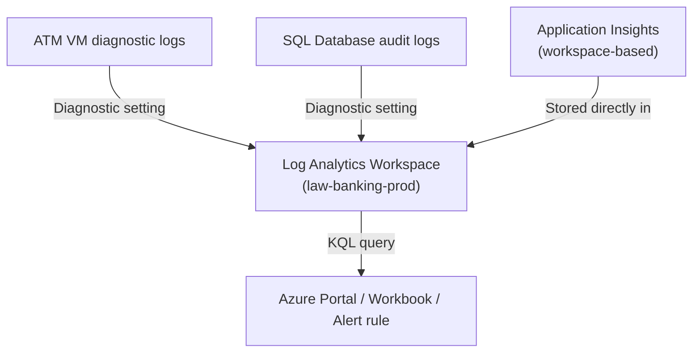
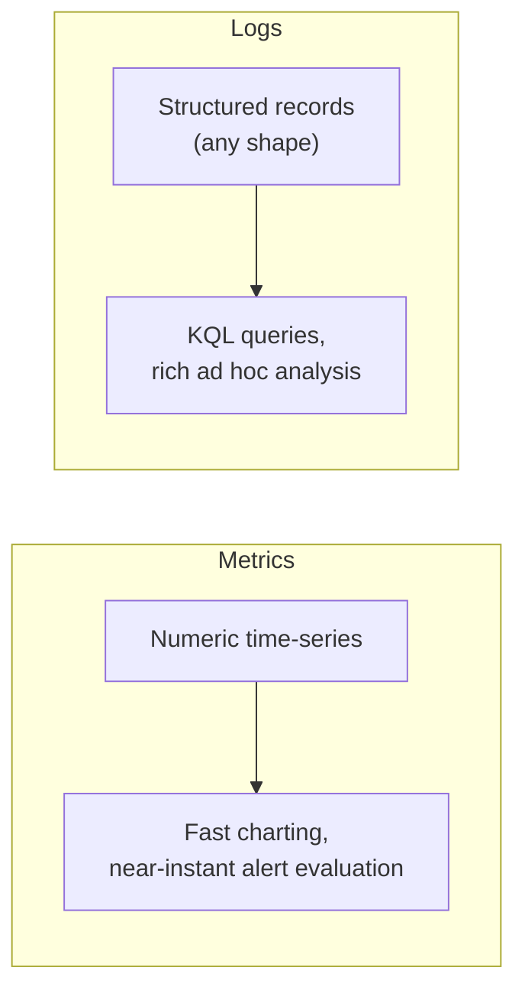

# Azure Monitor and Log Analytics

## Introduction

Before reading this lesson, you should already be comfortable with **[Application Insights in Depth](../16-azure-for-dotnet-developers/16-47-application-insights-in-depth.md)**, including the fact that Application Insights automatically captures requests, dependencies, and exceptions for a *single* application. That's a deliberately narrow view — a large system is never just one app. A bank's ATM network alone might involve a fleet of virtual machines, a SQL database, a Key Vault, and a handful of App Services, each producing its own logs and metrics. This lesson zooms out to the platform that watches all of them at once: **Azure Monitor**, the umbrella service Application Insights is actually a specialized part of, and **Log Analytics**, the workspace and query engine where most of that telemetry — Application Insights data included — actually ends up living.

By the end of this lesson, you will be able to:

- Explain how Azure Monitor differs from Application Insights: platform-wide coverage of every Azure resource versus one application's request/dependency view
- Explain what a Log Analytics workspace is and why Application Insights data lives inside one
- Distinguish Azure Monitor's two core data types: metrics (numeric, time-series) and logs (structured, queryable records)
- Write and run a basic Kusto Query Language (KQL) query against a Log Analytics workspace
- Configure diagnostic settings to send an Azure resource's logs into a Log Analytics workspace

## Azure Monitor and Log Analytics — A Layman's Perspective

Application Insights, from the previous lesson, was described as a security desk watching one building — cameras on the front door, sensors at checkout, a light that blinks when something's missing from the stockroom. Useful, but it only sees that one building. Now picture the view from a city's emergency operations center: traffic signal uptime across every intersection, water pressure at every pumping station, power draw across the entire grid, all flowing into one command room, regardless of which department or contractor originally installed the sensor. Nobody in that command room cares whether a given feed came from the water utility's equipment or the transit authority's — it's all just "signals from the city," collected centrally so patterns across departments become visible that no single department could ever see on its own.

Azure Monitor is that city-wide command center, and it doesn't just watch web applications the way Application Insights does — it watches virtual machines, databases, storage accounts, Key Vaults, Service Bus queues, literally any resource that exists in the subscription. Application Insights isn't a separate, competing product; it's one specialized instrument panel *inside* that larger command center, tuned specifically for "here's what one running application's requests and dependencies look like." Everything else the command center watches — CPU load on a VM, connection counts on a database, queue depth on a message broker — is Azure Monitor operating in its broader, resource-wide capacity.

Here's the detail that resolves something that might otherwise seem confusing: where does all of this actually get *filed*? A city command center doesn't just watch blinking lights forever and discard the history — every reading gets written into a central records office, indexed and searchable, so an investigator can later ask "show me every water-pressure anomaly across the whole city in the last 30 days, sorted by severity." That records office is a **Log Analytics workspace**. And the security desk from the previous lesson's Application Insights analogy? Its records don't sit in some separate, isolated filing cabinet in the building's basement — under the hood, they're filed in that very same city records office, alongside water-pressure logs, traffic-signal logs, and everything else. That's precisely what a *workspace-based* Application Insights resource is: the requests and exceptions from one application, physically stored in a shared Log Analytics workspace, queryable with the exact same tools used for every other Azure resource's logs.

And a records office is only useful if an investigator can actually search it, not just flip through pages by hand. That's what Kusto Query Language (KQL) is: the search language built specifically for this records office, purpose-built for filtering, aggregating, and joining huge volumes of time-stamped records — closer to a purpose-built search syntax than to general-purpose SQL, but readable enough that "find every failed transaction on ATM-4471 in the last hour" translates into KQL almost line for line.

The bridge to code: a bank doesn't wait for a customer to call and complain that an ATM ate their card — a diagnostic setting streams that ATM's own transaction logs straight into the workspace continuously, so the pattern is visible to whoever's watching, in near real time, before the complaint call ever comes in.

## Azure Monitor and Log Analytics — A Programming Language Perspective

**Azure Monitor** is Azure's platform-wide observability service, collecting two fundamentally different data types from every monitored resource: **metrics**, lightweight numeric time-series values (CPU percentage, queue length) optimized for near-real-time charting and alerting, and **logs**, structured, timestamped records (a request, an exception, a diagnostic event) optimized for rich, ad hoc querying rather than simple charting. A **Log Analytics workspace** is the storage and query backend for Azure Monitor's log data, built on the Kusto engine also used by Azure Data Explorer. **Application Insights**, from the previous lesson, is a purpose-built Azure Monitor experience layered specifically for application telemetry; a *workspace-based* Application Insights resource — the default and only option for new resources today — stores its `requests`, `dependencies`, and `exceptions` tables physically inside a Log Analytics workspace, queryable with **Kusto Query Language (KQL)**, a pipe-based (`|`) query language purpose-built for filtering and aggregating large volumes of time-series log data.

## How to Query a Log Analytics Workspace with KQL

Diagnostic settings route an Azure resource's own logs into a workspace; once there, KQL queries them directly, whether the data originated from an ATM's VM, a SQL database, or an Application Insights resource.


*Figure 1: Diagnostic settings from unrelated resource types, plus Application Insights itself, all converge on the same Log Analytics workspace and the same query language.*

```bash
# Azure CLI — create a workspace and route ATM VM diagnostics into it
az monitor log-analytics workspace create \
  --resource-group rg-banking-prod \
  --workspace-name law-banking-prod

az monitor diagnostic-settings create \
  --name atm-vm-diagnostics \
  --resource "/subscriptions/.../virtualMachines/vm-atm-fleet-01" \
  --workspace law-banking-prod \
  --logs '[{"category": "Administrative", "enabled": true}]'
```

**Azure CLI Output:**

```text
{
  "name": "law-banking-prod",
  "provisioningState": "Succeeded",
  "customerId": "8b3e1c7a-..."
}
{
  "id": ".../diagnosticSettings/atm-vm-diagnostics",
  "name": "atm-vm-diagnostics"
}
```

```kusto
// KQL — run in the Log Analytics workspace's "Logs" blade
AppExceptions
| where TimeGenerated > ago(1h)
| where OperationName == "WithdrawalFunction"
| summarize FailureCount = count() by Type = ProblemId, bin(TimeGenerated, 10m)
| order by FailureCount desc
```

**KQL Query Output (Log Analytics — Logs blade):**

```text
Type                              bin(TimeGenerated, 10m)   FailureCount
InsufficientFundsException        2026-08-16T09:40:00Z      3
CardReaderTimeoutException        2026-08-16T09:30:00Z      1
```

`AppExceptions` is one of the tables Application Insights writes directly into the workspace — the exact same exception telemetry from the previous lesson, now reachable with a general-purpose query instead of only through the Application Insights blade's built-in views. The `summarize ... by` clause aggregates raw exception rows into 10-minute buckets grouped by exception type, turning a raw event stream into the kind of "here's what's actually failing, and how often" answer an on-call engineer needs during an incident.

## Real-Time Example: Investigating ATM Withdrawal Failures

We continue in the Banking/ATM domain, extending the `WithdrawalService` introduced in earlier modules. Its Azure Function now writes structured log entries for every withdrawal attempt, and a diagnostic setting routes them, along with the VM logs from the underlying ATM controllers, into `law-banking-prod`.

```csharp
// WithdrawalFunction.cs — .NET 10 / C# 14 — Real-Time Example (Banking/ATM)
public sealed class WithdrawalFunction(ILogger<WithdrawalFunction> logger, AccountService accounts)
{
    [Function("WithdrawalFunction")]
    public async Task<HttpResponseData> Run(
        [HttpTrigger(AuthorizationLevel.Function, "post", Route = "atm/{atmId}/withdraw")] HttpRequestData req,
        string atmId)
    {
        WithdrawalRequest request = await req.ReadFromJsonAsync<WithdrawalRequest>()
            ?? throw new InvalidOperationException("Malformed withdrawal request.");

        // This structured log entry becomes a queryable row in the workspace's "traces" table
        logger.LogInformation(
            "Withdrawal attempt: ATM={AtmId} Account={AccountId} Amount={Amount}",
            atmId, request.AccountId, request.Amount);

        WithdrawalResult result = await accounts.TryWithdrawAsync(request.AccountId, request.Amount);

        if (!result.Success)
        {
            logger.LogWarning(
                "Withdrawal declined: ATM={AtmId} Account={AccountId} Reason={Reason}",
                atmId, request.AccountId, result.DeclineReason);
        }

        HttpResponseData response = req.CreateResponse(result.Success ? HttpStatusCode.OK : HttpStatusCode.BadRequest);
        await response.WriteAsJsonAsync(result);
        return response;
    }
}

public sealed record WithdrawalRequest(string AccountId, decimal Amount);
public sealed record WithdrawalResult(bool Success, string? DeclineReason);
```

**KQL Query used to investigate a spike in declines (Log Analytics — Logs blade):**

```kusto
traces
| where Message has "Withdrawal declined"
| where TimeGenerated > ago(24h)
| extend AtmId = extract(@"ATM=([\w-]+)", 1, Message)
| summarize DeclineCount = count() by AtmId
| order by DeclineCount desc
```

**KQL Query Output:**

```text
AtmId          DeclineCount
ATM-4471       17
ATM-2209        2
ATM-1187        1
```

That result immediately narrows an investigation that would otherwise require pulling logs off individual ATM controllers one machine at a time: `ATM-4471` alone accounts for the overwhelming majority of declines in the last day, pointing operations staff at a single physical machine — likely a stuck card reader or a stale cash-dispenser firmware version — rather than a systemic account or network issue. This is the payoff of routing everything into one workspace: a single query answers a question that spans a Function App's logs and, indirectly, the physical device fleet behind it.

## Metrics vs Logs in Azure Monitor

Azure Monitor's two data types solve different problems and are not interchangeable. **Metrics** are lightweight numeric values sampled at regular intervals — CPU percentage, queue message count, HTTP request rate — stored in a time-series database optimized for fast charting and near-instant threshold evaluation, which is why metric alerts (covered two lessons ahead) fire within roughly a minute. **Logs** are structured, timestamped records with arbitrary shape — an exception with a stack trace, an audit entry with a dozen fields — stored in a Log Analytics workspace and queried with KQL, trading a small amount of ingestion latency for vastly richer, ad hoc query power.


*Figure 2: Metrics trade query flexibility for speed; logs trade a little latency for much richer analysis.*

| Aspect | Metrics | Logs |
|---|---|---|
| Data shape | Numeric values over time | Structured records, arbitrary fields |
| Storage | Time-series metrics database | Log Analytics workspace (Kusto engine) |
| Query language | Metrics Explorer (chart-based) | Kusto Query Language (KQL) |
| Typical latency | Seconds | Roughly 1-5 minutes to ingestion |
| Best suited for | Dashboards, threshold alerts | Root-cause investigation, ad hoc analysis |

## Types of Azure Monitor Data Sources and Concepts

Azure Monitor's Log Analytics workspace is fed by several distinct sources, and connects forward into the rest of this Observability sub-area:

1. **Platform metrics** — automatically collected numeric metrics emitted by every Azure resource with no configuration required.
2. **Diagnostic settings** — the mechanism used above to route a resource's own logs (VM, SQL, Service Bus) into a workspace.
3. **[Application Insights](../16-azure-for-dotnet-developers/16-47-application-insights-in-depth.md)** — application-level telemetry, stored inside the same workspace when workspace-based.
4. **Kusto Query Language (KQL)** — the query language this lesson introduced, used identically for alerts, dashboards, and ad hoc investigation.
5. **[Distributed Tracing with OpenTelemetry on Azure](../16-azure-for-dotnet-developers/16-49-opentelemetry-on-azure.md)** — how trace data specifically flows into this same workspace, covered next.
6. **[Alerting in Azure Monitor](../16-azure-for-dotnet-developers/16-50-alerting-in-azure-monitor.md)** — turning both metrics and KQL log queries into automatic notifications.

## What You've Learned & What's Next

Azure Monitor is the platform-wide observability layer underneath every Azure resource, and Log Analytics is where its log data — including, under the hood, Application Insights' own requests and exceptions — actually lives, queryable with KQL instead of being locked inside a single product's UI. That shared storage is exactly what makes it possible to correlate a request across multiple services, which is the next lesson's subject.

Continue your learning journey with **[Distributed Tracing with OpenTelemetry on Azure](../16-azure-for-dotnet-developers/16-49-opentelemetry-on-azure.md)**, where we trace a single E-Commerce checkout request across API Management, an Order API, Service Bus, and a Function, correlated end to end by one trace ID.

---
*Applies to: .NET 10 / C# 14. Last reviewed 2026-08-16.*
