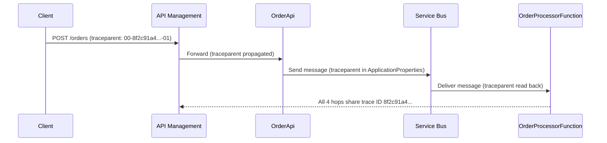
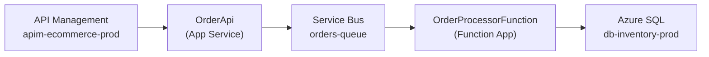
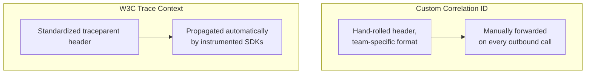

# Distributed Tracing with OpenTelemetry on Azure

## Introduction

Before reading this lesson, you should already be comfortable with **[Azure Monitor and Log Analytics](../16-azure-for-dotnet-developers/16-48-azure-monitor-and-log-analytics.md)**, including the fact that Application Insights telemetry — requests, dependencies, exceptions — physically lives in a shared Log Analytics workspace. This lesson also reaches all the way back to Module 12, Lesson 46, **Distributed Tracing**, which introduced `ActivitySource` and `Activity` in the abstract and asked how a single checkout request's journey across a Gateway, an `OrderService`, and a `PaymentService` could ever be reconstructed. We now have every piece needed to answer that concretely: **OpenTelemetry**, the vendor-neutral tracing standard that lesson was built on, exports its spans to Azure Monitor through the **Azure Monitor OpenTelemetry Distro**, and Application Insights stitches those spans back together into a single, correlated trace — visible end to end, across process and machine boundaries, in a view called the **Application Map**.

By the end of this lesson, you will be able to:

- Explain what makes OpenTelemetry vendor-neutral, and why that matters for a system that spans multiple Azure services
- Explain how a trace ID propagates across an HTTP call, a Service Bus message, and an Azure Function trigger using the W3C Trace Context standard
- Configure the Azure Monitor OpenTelemetry Distro to export traces, metrics, and logs from an ASP.NET Core app and an Azure Function to the same Application Insights resource
- Trace a single E-Commerce checkout request across API Management, an Order API, Service Bus, and a Function, correlated by one trace ID
- Read a multi-service request's shape in the Application Insights Application Map

## OpenTelemetry on Azure — A Layman's Perspective

Consider an international package shipment: a parcel leaves a warehouse in one country, passes through a customs facility, gets loaded onto a cargo flight, clears customs again on arrival, and finally rides a local courier van to the recipient's door. Four completely different organizations touch that parcel — the warehouse, customs, the airline, the local courier — none of which share a computer system, a company, or even a country. And yet the customer tracking a single order online sees one continuous, ordered timeline: picked up, in transit, customs cleared, out for delivery, delivered. That's only possible because of one detail present on the parcel from the very first scan: a single tracking number, printed on a barcode, that every single handler — regardless of which unrelated company they work for — scans and logs against, without needing to invent their own number or coordinate with anyone else in advance.

That tracking number is the entire idea behind distributed tracing, and it's exactly what an incoming checkout request needs as it moves through an E-Commerce system: it hits API Management at the "front door," gets forwarded to an Order API, which drops a message onto a Service Bus queue, which an Azure Function later picks up to actually reserve inventory. Four different hops, potentially four different pieces of infrastructure, and — just like the shipment — one customer-facing question: "did my order go through, and if not, at which step did it fail?" Answering that requires the software equivalent of the tracking barcode: an identifier attached to the request the instant it arrives, carried forward through every single hop, scanned and logged at each one.

Here's the part that makes OpenTelemetry specifically valuable rather than just "yet another correlation ID scheme": a real international shipment works because the tracking number format is a standard every carrier, in every country, already knows how to read and re-scan, rather than each carrier inventing its own private numbering system that the next carrier in the chain has no idea how to interpret. Before OpenTelemetry existed as a standard, that's genuinely what many companies did in software — each team invented its own `X-Correlation-Id` header, in its own format, understood only by that team's own services, breaking the moment a request crossed into a system built by a different team or vendor. OpenTelemetry replaces every one of those private schemes with a single, universally recognized format called the **W3C Trace Context** standard, so a request's identifier means the same thing and is carried the same way whether it's crossing an HTTP call, a message queue, or a completely different cloud provider's service.

The bridge to code: neither API Management's policy engine, the Order API's `HttpClient` call, nor the Service Bus message the Order API sends has to manually stamp on that tracking number by hand. Just like a shipping label printer automatically reprints the same barcode on every leg of the journey, the OpenTelemetry-instrumented SDK automatically attaches the trace context to every outbound call it makes, and automatically reads it back off every inbound call and message it receives — the "barcode" travels with the request without a single line of business logic having to know it exists.

## OpenTelemetry on Azure — A Programming Language Perspective

**OpenTelemetry** is a vendor-neutral observability standard defining how traces, metrics, and logs are represented, generated, and propagated, independent of any specific backend. In .NET, it's realized through `System.Diagnostics.Activity` and `ActivitySource`, introduced in Module 12, Lesson 46. Trace context — a **trace ID** shared across an entire request and a **span ID** unique to each hop — propagates across process boundaries using the **W3C Trace Context** specification's `traceparent` header for HTTP calls, and via equivalent message properties for non-HTTP transports such as Service Bus. On Azure, the **Azure Monitor OpenTelemetry Distro** (`Azure.Monitor.OpenTelemetry.AspNetCore` and its Functions equivalent) configures this propagation automatically for ASP.NET Core `HttpClient` calls, Service Bus SDK calls, and Azure Functions triggers, then exports the resulting span tree to an Application Insights resource, where it renders as a correlated, multi-hop trace.

## How to Trace a Request Across Azure Services

Enabling cross-service correlation on Azure requires no manual header-passing code in the common case — API Management, the Azure Functions Service Bus trigger, and the OpenTelemetry Distro all participate in W3C Trace Context automatically once each hop is instrumented.


*Figure 1: One trace ID, generated at the client's first request, is carried through API Management, the Order API, and the Service Bus message to the Function that finally processes it.*

```bash
# Azure CLI — enable Application Insights logging on the APIM gateway
az apim logger create \
  --resource-group rg-ecommerce-prod \
  --service-name apim-ecommerce-prod \
  --logger-id ai-logger \
  --logger-type applicationInsights \
  --credentials instrumentationKey="3f1a9c2e-..."
```

**Azure CLI Output:**

```text
{
  "id": ".../loggers/ai-logger",
  "loggerType": "applicationInsights",
  "resourceId": "/subscriptions/.../components/ai-order-api-prod"
}
```

```csharp
// OrderApi Program.cs — .NET 10 / C# 14
using Azure.Monitor.OpenTelemetry.AspNetCore;
using Azure.Messaging.ServiceBus;

var builder = WebApplication.CreateBuilder(args);
builder.Services.AddOpenTelemetry().UseAzureMonitor(o =>
    o.ConnectionString = builder.Configuration["ApplicationInsights:ConnectionString"]);
builder.Services.AddSingleton(new ServiceBusClient(builder.Configuration["ServiceBus:ConnectionString"]));

var app = builder.Build();

app.MapPost("/orders", async (OrderRequest request, ServiceBusClient sbClient) =>
{
    ServiceBusSender sender = sbClient.CreateSender("orders-queue");

    // No manual trace-context code here: the Azure.Messaging.ServiceBus SDK,
    // instrumented by the OpenTelemetry Distro, stamps the current Activity's
    // trace context into the message's Diagnostic-Id property automatically.
    ServiceBusMessage message = new(JsonSerializer.SerializeToUtf8Bytes(request));
    await sender.SendMessageAsync(message);

    return Results.Accepted();
});

app.Run();

public sealed record OrderRequest(string Sku, int Quantity);
```

**Console Output (Application Insights — End-to-End Transaction Details for trace 8f2c91a4...):**

```text
Trace ID: 8f2c91a4b7de4310...
  [Request]     APIM: POST /orders                     41ms
  [Request]     OrderApi: POST /orders                  35ms
  [Dependency]  Service Bus Send: orders-queue            6ms
  [Request]     OrderProcessorFunction (Service Bus)    118ms
```

Every row above shares the same trace ID despite running in four different processes, on at least three different Azure resources. `UseAzureMonitor()` and API Management's Application Insights logger did the propagation work independently of each other, purely because both sides speak the same W3C Trace Context format — no team had to coordinate a shared correlation scheme by hand.

## Real-Time Example: The Application Map for E-Commerce Checkout

We continue extending the `OrderApi` → Service Bus → `OrderProcessorFunction` pipeline from the previous two lessons, now with API Management from earlier in this module sitting in front of `OrderApi`. Once all three components export to the same Application Insights resource, the **Application Map** renders the entire pipeline as a single diagram, generated automatically from real trace data rather than hand-drawn.


*Application Map (Azure Portal) — each node's call count and average duration are computed from real traced requests, not configured manually.*

```csharp
// InventoryService.cs — .NET 10 / C# 14 — Real-Time Example (E-Commerce)
public sealed class InventoryService(SqlConnection connection, ILogger<InventoryService> logger)
{
    public async Task<bool> TryReserveAsync(string sku, int quantity)
    {
        // This SQL call becomes a "Dependency" node feeding the Application Map above,
        // automatically correlated to the same trace ID as the Function invocation that called it.
        SqlCommand command = new(
            "UPDATE Inventory SET Reserved = Reserved + @qty WHERE Sku = @sku AND (OnHand - Reserved) >= @qty",
            connection);
        command.Parameters.AddWithValue("@qty", quantity);
        command.Parameters.AddWithValue("@sku", sku);

        int rowsAffected = await command.ExecuteNonQueryAsync();
        logger.LogInformation("Reservation for SKU {Sku}: {Result}", sku, rowsAffected > 0 ? "succeeded" : "insufficient stock");
        return rowsAffected > 0;
    }
}
```

**Console Output (Application Map node detail for db-inventory-prod, last hour):**

```text
db-inventory-prod
  Call count:       412
  Failed calls:       3
  Avg. duration:    9.4ms
  Slowest 5% (P95): 41ms
```

Before this pipeline was fully instrumented end to end, a slow checkout could have been caused by API Management throttling, `OrderApi` itself, a Service Bus backlog, or a slow SQL query — and answering "which one?" meant checking four separate dashboards by hand. The Application Map answers it visually and immediately: the node with the disproportionate latency or failure rate is the bottleneck, and it's identified from real production traffic, not guesswork.

## Custom Correlation IDs vs W3C Trace Context

Before OpenTelemetry became the industry standard, teams that needed to correlate requests across services typically invented their own scheme — a custom `X-Correlation-Id` header generated at the edge and manually forwarded by every downstream call. It worked, but only within that one team's own services, and only as long as every developer remembered to forward the header on every single outbound call, including message properties nobody thought to check. **W3C Trace Context**, the format OpenTelemetry uses, replaces that ad hoc convention with a standardized `traceparent` header and, critically, automatic propagation baked into the instrumented HTTP client, Service Bus SDK, and Functions trigger themselves — no developer has to remember anything.


*Figure 2: A custom correlation ID depends on every developer remembering to forward it; W3C Trace Context is propagated automatically by the instrumented libraries themselves.*

| Aspect | Custom Correlation ID | W3C Trace Context (OpenTelemetry) |
|---|---|---|
| Format | Team-specific, ad hoc | Standardized `traceparent` header |
| Propagation | Manual, per outbound call | Automatic, via instrumented SDKs |
| Parent/child relationships | Usually flat — one flat ID | Full span tree (trace ID + span ID per hop) |
| Cross-vendor interoperability | None | Yes — recognized by any OpenTelemetry-compatible system |
| Azure Functions / Service Bus support | Requires custom wiring | Built into the SDK and Functions trigger |

## Types of OpenTelemetry Signals and Related Views

OpenTelemetry standardizes three signal types, all exported to the same Application Insights resource in this lesson's setup:

1. **Traces** — the request/dependency spans this lesson focused on, viewable in the Application Map and Transaction Details.
2. **Metrics** — numeric measurements (request rate, duration histograms) emitted alongside traces via the OpenTelemetry `Meter` API.
3. **Logs** — `ILogger` entries, correlated to the active trace automatically when emitted inside a traced request.
4. **[Distributed Tracing (Module 12, Lesson 46)](../12-advanced-concepts/12-46-distributed-tracing.md)** — the `ActivitySource`/`Activity` foundation this lesson's Azure export is built on.
5. **Application Map** — the auto-generated topology view this lesson relied on to visualize the four-hop pipeline.
6. **[Alerting in Azure Monitor](../16-azure-for-dotnet-developers/16-50-alerting-in-azure-monitor.md)** — turning the latency and failure data this trace reveals into automatic notifications.

## What You've Learned & What's Next

OpenTelemetry's vendor-neutral trace propagation, standardized as W3C Trace Context, is what lets a single request's journey across API Management, an Order API, Service Bus, and a Function be reconstructed as one correlated trace rather than four disconnected logs — and the Azure Monitor OpenTelemetry Distro is what wires that propagation up automatically on Azure. With that visibility in place, the natural next question is what happens automatically when the numbers this pipeline produces cross a line that matters.

Continue your learning journey with **[Alerting in Azure Monitor](../16-azure-for-dotnet-developers/16-50-alerting-in-azure-monitor.md)**, where the metrics and log queries introduced across this sub-area become the triggers for automatic notifications and remediation.

---
*Applies to: .NET 10 / C# 14. Last reviewed 2026-08-16.*
