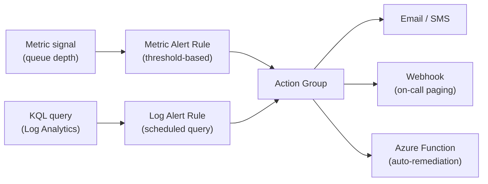
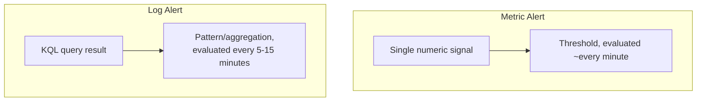

# Alerting in Azure Monitor

## Introduction

Before reading this lesson, you should already be comfortable with **[Distributed Tracing with OpenTelemetry on Azure](../16-azure-for-dotnet-developers/16-49-opentelemetry-on-azure.md)**, and with the metrics-versus-logs distinction from **[Azure Monitor and Log Analytics](../16-azure-for-dotnet-developers/16-48-azure-monitor-and-log-analytics.md)**. Every lesson in this sub-area so far has been about *seeing* telemetry — dashboards, traces, query results someone has to actually go look at. That's a problem: nobody stares at a KQL query result 24 hours a day waiting for it to look wrong. This lesson closes that gap with **alerting** — Azure Monitor watching metrics and log queries continuously and *telling someone* the moment a condition is met, through **action groups** that route the notification to email, SMS, a webhook, or straight into an automated remediation function.

By the end of this lesson, you will be able to:

- Distinguish metric alerts (threshold-based, fast) from log alerts (KQL query-based, richer)
- Configure a metric alert that fires when a resource's CPU or queue depth crosses a threshold
- Configure a log alert that fires based on the result of a scheduled KQL query
- Configure an action group to route a firing alert to email, SMS, a webhook, or an Azure Function for auto-remediation
- Recognize alert fatigue and apply practical guidelines — sensible thresholds, appropriate severities — to avoid it

## Alerting in Azure Monitor — A Layman's Perspective

A smoke detector and a building inspector's periodic walkthrough solve the same underlying problem — "tell me if something is wrong" — in very different ways, and a well-run building needs both. The smoke detector watches one specific, simple signal continuously: is there smoke in the air, right now, above a certain concentration? It reacts in seconds, with no judgment involved, because the question it's answering is deliberately narrow. The inspector, by contrast, walks the building on a schedule and looks for a *pattern* no single sensor could catch alone — three fire doors propped open with the same brand of doorstop, say, which individually mean nothing but together suggest a policy problem. The inspector's check takes longer to run and requires an actual query against accumulated evidence, not just a single live reading.

Azure Monitor's two alert types map onto exactly these two roles. A **metric alert** is the smoke detector: it watches a single numeric signal — CPU percentage, queue message count — against a threshold, and evaluates that threshold every minute or so, firing within roughly a minute of the condition becoming true. A **log alert** is the inspector's walkthrough: it runs a KQL query on a schedule — every five or fifteen minutes, typically — looking for a pattern across accumulated log records that a single metric could never express, such as "the same customer account had three failed checkouts in ten minutes." It takes a little longer to notice, because running a rich query costs more time than reading one gauge, but it can catch things a gauge fundamentally cannot see.

Neither a smoke detector nor an inspector's checklist is worth anything if firing them doesn't reliably reach the right person doing the right thing — that's what an **action group** is. A smoke detector wired only to a light that blinks in an empty room helps nobody; a properly wired one calls the fire department, sounds an audible alarm, and — for a serious enough building — automatically triggers the sprinkler system without waiting for a human at all. An action group is that same wiring diagram for a software alert: send an email, send a text message, hit a webhook that pages the on-call engineer, or — the sprinkler-system equivalent — invoke an Azure Function or Logic App that takes corrective action completely on its own, with no human in the loop, such as automatically scaling out a struggling service.

The genuinely important, easy-to-get-wrong detail is what happens when *every* detector in the building is tuned to go off at the faintest whiff of anything: toast smoke, a candle, a bit of steam from the shower. Within a month, everyone in the building has learned to ignore the alarm, including the one time it's a real fire. That is **alert fatigue**, and it is the single most common way a well-intentioned monitoring setup quietly stops working — not because the alerts were wrong, but because there were too many low-value ones, and the humans on the receiving end rationally learned to tune them all out. A well-run alerting strategy is not "alert on everything that could possibly matter" — it is a small number of alerts, each tuned to a threshold and severity that genuinely means "a person should look at this now," with everything else left to dashboards and queries a human checks on their own schedule.

The bridge to code: a threshold of "CPU over 80% for five minutes" and a KQL query counting failed checkouts are both just configuration, sitting entirely outside the application's own code — the application doesn't know or care that an alert rule is watching its metrics.

## Alerting in Azure Monitor — A Programming Language Perspective

A **metric alert** in Azure Monitor evaluates a numeric signal against a static or dynamic threshold on a fixed, short evaluation frequency (as low as one minute), and is best suited to fast-moving infrastructure signals such as CPU, memory, or queue depth. A **log alert**, configured as a **scheduled query rule**, instead runs a KQL query against a Log Analytics workspace on a configurable interval (commonly 5-15 minutes) and fires when the query's result meets a specified condition — typically a row count threshold. Both alert types target one or more **action groups**, a reusable, named collection of notification and automation channels — email, SMS, voice call, webhook, or an Azure Function/Logic App invocation — decoupling *what* triggers an alert from *what happens* when it fires, so the same action group can be attached to many unrelated alert rules across a subscription.

## How to Configure Metric and Log Alerts with an Action Group

An action group is created once and reused across alert rules; the alert rule itself simply names a signal, a threshold or query, and which action group to notify.


*Figure 1: Both alert types converge on the same action group, which fans out to human notification channels and automated remediation alike.*

```bash
# Azure CLI — create an action group, then a metric alert on Service Bus queue depth
az monitor action-group create \
  --resource-group rg-library-prod \
  --name ag-inventory-oncall \
  --short-name invoncall \
  --email-receivers name=OpsTeam email=ops@library-system.example \
  --azure-function-receiver name=AutoRequeue \
    function-app-resource-id "/subscriptions/.../functionapps/func-requeue-handler" \
    function-name "RequeueHandler" \
    http-trigger-url "https://func-requeue-handler.azurewebsites.net/api/RequeueHandler"

az monitor metrics alert create \
  --name alert-checkin-queue-depth \
  --resource-group rg-library-prod \
  --scopes "/subscriptions/.../namespaces/sb-library-prod/queues/book-checkins" \
  --condition "avg ActiveMessages > 500" \
  --window-size 5m \
  --evaluation-frequency 1m \
  --severity 2 \
  --action ag-inventory-oncall
```

**Azure CLI Output:**

```text
{
  "name": "ag-inventory-oncall",
  "enabled": true
}
{
  "name": "alert-checkin-queue-depth",
  "severity": 2,
  "criteria": { "allOf": [{ "metricName": "ActiveMessages", "threshold": 500, "operator": "GreaterThan" }] }
}
```

```bash
# Azure CLI — a log alert firing on a KQL pattern, not a single numeric signal
az monitor scheduled-query create \
  --name alert-repeated-checkout-failures \
  --resource-group rg-library-prod \
  --scopes "/subscriptions/.../workspaces/law-library-prod" \
  --condition "count 'FailedCheckouts' > 3" \
  --condition-query FailedCheckouts='traces | where Message has "Checkout failed" | summarize count() by MemberId, bin(TimeGenerated, 10m)' \
  --window-size 10m \
  --evaluation-frequency 5m \
  --severity 3 \
  --action-groups ag-inventory-oncall
```

**Azure CLI Output:**

```text
{
  "name": "alert-repeated-checkout-failures",
  "severity": 3,
  "evaluationFrequency": "PT5M"
}
```

The metric alert reacts to a single gauge crossing 500 active messages, evaluated every minute — the smoke detector. The log alert instead runs a query grouping failures by member ID over a 10-minute window, catching a pattern — the same member failing checkout repeatedly — that no single metric could express, evaluated every five minutes rather than every one, reflecting the heavier cost of running a real query.

## Real-Time Example: Alerting on the Library Check-In Pipeline

We continue in the Library/Inventory Management domain, extending the check-in processing pipeline: a `CheckInFunction` drains a `book-checkins` Service Bus queue and updates each title's availability. A backlog here means patrons see a book as "checked out" long after it was physically returned — worth paging someone about, but only past a threshold that reflects genuine trouble, not routine variation.

```csharp
// CheckInFunction.cs — .NET 10 / C# 14 — Real-Time Example (Library/Inventory Management)
public sealed class CheckInFunction(ILogger<CheckInFunction> logger, CatalogService catalog)
{
    [Function("CheckInFunction")]
    public async Task Run(
        [ServiceBusTrigger("book-checkins", Connection = "ServiceBusConnection")] CheckInMessage message)
    {
        bool updated = await catalog.MarkAvailableAsync(message.Isbn, message.BranchId);

        if (!updated)
        {
            // Feeds the "FailedCheckins" log alert query — a pattern, not a single threshold
            logger.LogWarning("Check-in failed: ISBN={Isbn} Branch={BranchId} — title not found in catalog", message.Isbn, message.BranchId);
            return;
        }

        logger.LogInformation("Checked in: ISBN={Isbn} Branch={BranchId}", message.Isbn, message.BranchId);
    }
}

public sealed record CheckInMessage(string Isbn, string BranchId);
```

**Console Output (alert fires and notifies via the action group):**

```text
[Metric Alert] alert-checkin-queue-depth — FIRED (Severity 2)
  Resource: sb-library-prod/queues/book-checkins
  ActiveMessages: 618 (threshold: 500)
  Action Group: ag-inventory-oncall
    -> Email sent to ops@library-system.example
    -> RequeueHandler function invoked automatically
```

**Console Output (RequeueHandler auto-remediation, triggered by the action group):**

```text
info: RequeueHandler[0]
      Alert-triggered scale-out: increasing CheckInFunction max instances from 4 to 8
info: RequeueHandler[0]
      book-checkins backlog: 618 messages, draining
```

No human had to notice the backlog, open the portal, and manually scale the Function App — the action group's webhook receiver did that the moment the metric alert fired. A human is still notified by email in parallel, in case the automated remediation isn't sufficient, but the fastest possible response happened without waiting on anyone.

## Metric Alerts vs Log Alerts

The two alert types genuinely serve different jobs, and a mature monitoring setup uses both rather than treating one as a strict upgrade over the other. Metric alerts are cheap to evaluate and react within roughly a minute, but can only express a threshold on a single numeric signal — they cannot ask "did the *same* member fail three times," only "is a number currently above X." Log alerts can express arbitrarily rich conditions via KQL — grouping, joining, filtering across fields — at the cost of a slower evaluation cycle and, because they run an actual query, a small compute cost per evaluation.


*Figure 2: Metric alerts trade expressiveness for speed; log alerts trade a slower cycle for the ability to express real patterns.*

| Aspect | Metric Alert | Log Alert (Scheduled Query) |
|---|---|---|
| Signal | Single numeric metric | KQL query result over a Log Analytics workspace |
| Evaluation frequency | As low as 1 minute | Typically 5-15 minutes |
| Expressiveness | Threshold on one value | Arbitrary aggregation, grouping, joins |
| Typical use case | CPU, queue depth, response time | Repeated failure patterns, business-rule violations |
| Cost model | Included, minimal | Billed per query evaluation (workspace pricing) |

## Types of Azure Monitor Alerts

Alert rules in Azure Monitor cover more ground than the two types above, and connect directly to the dashboards covered next:

1. **Metric alerts** — threshold-based, fast, covered above.
2. **Log alerts (scheduled query rules)** — KQL-based, pattern-aware, also covered above.
3. **Activity log alerts** — fire on control-plane events, such as a resource being deleted or a role assignment changing.
4. **Smart detection alerts** — Application Insights' built-in anomaly detection for failure rate and performance regressions, requiring no manually configured threshold at all.
5. **Action groups** — the reusable notification/remediation targets every alert type above routes through.
6. **[Building Azure Dashboards](../16-azure-for-dotnet-developers/16-51-building-azure-dashboards.md)** — where the same metrics and queries behind these alerts are surfaced visually for ongoing monitoring, not just exception-based paging.

## What You've Learned & What's Next

Azure Monitor's metric and log alerts turn passive telemetry into active notification, and action groups decide what happens next — a human notified, or a fully automated remediation triggered with no human in the loop at all — while a disciplined, sparing approach to thresholds and severities is what keeps that notification meaningful instead of becoming background noise everyone learns to ignore. Alerts answer "tell me when something is wrong"; the next lesson answers the complementary, ongoing question of "let me see how things are doing right now, without waiting for anything to break."

Continue your learning journey with **[Building Azure Dashboards](../16-azure-for-dotnet-developers/16-51-building-azure-dashboards.md)**, the capstone of this Observability sub-area, where the metrics, logs, and traces from all five lessons come together into a single shared operational view.

---
*Applies to: .NET 10 / C# 14. Last reviewed 2026-08-16.*
