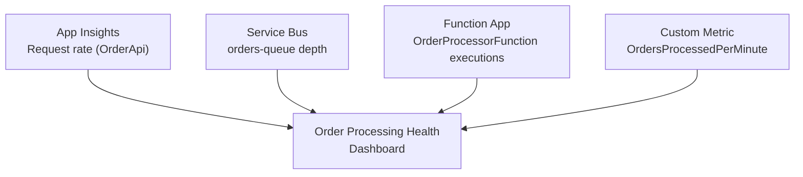
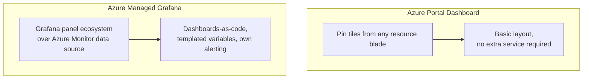

# Building Azure Dashboards

## Introduction

Before reading this lesson, you should already be comfortable with **[Alerting in Azure Monitor](../16-azure-for-dotnet-developers/16-50-alerting-in-azure-monitor.md)**. Alerts answer "tell me the moment something is wrong" — but a team also needs the complementary, everyday view: *how are things doing right now*, checked voluntarily rather than in response to a page. This lesson is the capstone of this module's five-lesson **Observability** sub-area, and it exists specifically to pull together everything the previous four lessons produced — Application Insights request telemetry, Log Analytics queries, OpenTelemetry traces, and alert-worthy metrics — into a single shared view: an Azure **Dashboard**, and its more capable successor, **Azure Managed Grafana**.

By the end of this lesson, you will be able to:

- Explain what an Azure Portal Dashboard is and pin a metric chart or log query tile onto one
- Explain what Azure Managed Grafana adds over a Portal Dashboard, and why it's increasingly the recommended choice for serious observability
- Build an "Order Processing Health" dashboard combining Application Insights request rates, Service Bus queue depth, and Function execution counts
- Emit a custom metric from application code that a dashboard tile can visualize
- Recap the full five-lesson Observability sub-area and see how it connects into DevOps and Infrastructure as Code next

## Building Azure Dashboards — A Layman's Perspective

A car's dashboard is a genuinely useful thing: speed, fuel level, engine temperature, all visible at a glance, built directly into the vehicle by the manufacturer, requiring no setup from the driver at all. It's also, by design, fixed — it shows exactly the gauges the manufacturer decided to include, laid out the way the manufacturer laid them out, and it only ever shows *this one car*. That's perfectly sufficient for a single driver on a single trip. It is not remotely sufficient for a professional racing team's pit crew, who need to watch a dozen live metrics per car, correlate tire temperature against lap time, overlay this lap against last week's qualifying run, and do all of that across an entire fleet of cars simultaneously — none of which a stock dashboard was ever built to do. Racing teams solve this with a completely different category of tool: a purpose-built telemetry system, installed independently of any single car, with fully customizable panels, historical comparison, and the flexibility to add a brand-new kind of chart the moment a new sensor produces a new kind of data.

**Azure Portal Dashboards** are the built-in car dashboard. They're already there, require no separate product or licensing decision, and let anyone pin a metric chart, a log query result, or an Application Insights blade directly onto a shared canvas that a whole team can open with one click — genuinely valuable, and often entirely sufficient for a small team or a single application's day-to-day view. But they inherit the built-in dashboard's real limitation: the visualization options are whatever the Portal happens to offer, the layout tools are basic, and correlating signals from genuinely different sources into one rich, custom chart is awkward at best.

**Azure Managed Grafana** is the racing team's telemetry system, offered as a fully managed Azure service so nobody has to run Grafana's own servers by hand. It plugs into Azure Monitor as one data source among many Grafana already supports, brings Grafana's much larger panel and visualization ecosystem, supports templated variables so one dashboard definition can serve many environments, and — critically for a team that wants dashboards to be reviewed and versioned like code — its dashboards are portable JSON definitions that fit naturally into a Git-based, Infrastructure-as-Code workflow, rather than living only as manual clicks inside one portal's UI. It is why, by 2026, Managed Grafana has become Microsoft's own recommended direction for any observability setup serious enough to outgrow "quick shared view of a few charts."

Neither tool cares where the underlying data came from. Whether a chart is showing Application Insights' request rate, a Service Bus queue's message count, or a Function App's execution count, all three of those numbers are already sitting in Azure Monitor from the previous four lessons in this sub-area — a dashboard, of either kind, is simply a different lens pointed at data that already exists, not a new pipeline of its own.

## Building Azure Dashboards — A Programming Language Perspective

An **Azure Portal Dashboard** is an ARM resource of type `Microsoft.Portal/dashboards`, defined as JSON describing a grid of **tiles** (also called "parts"), each tile bound to a specific Azure Monitor metric, a saved KQL query, or an existing resource blade such as Application Insights' Failures view; dashboards can be created interactively in the portal or deployed as code via Bicep/ARM, matching this curriculum's earlier IaC lessons. **Azure Managed Grafana** is a fully managed instance of Grafana, querying Azure Monitor through Grafana's Azure Monitor data source plugin, with dashboards defined as Grafana's own portable JSON model — provisionable via Terraform or the Grafana HTTP API — and supporting Grafana's alerting engine and templated, reusable dashboard variables that a Portal Dashboard has no equivalent for. Both tools visualize the same underlying metrics and Log Analytics query results already produced by the Application Insights and OpenTelemetry instrumentation from earlier in this sub-area; a **custom metric**, emitted via the OpenTelemetry `Meter` API, is one additional data source either dashboard type can plot directly.

## How to Build an Order Processing Health Dashboard

A dashboard tile needs data to plot; some of that data — request rate, queue depth — already exists automatically from earlier lessons, while a business-specific number like "orders processed per minute" needs one small addition: a custom metric emitted from the application itself.


*Figure 1: Three signals already produced by earlier lessons, plus one custom application metric, converge onto a single dashboard.*

```csharp
// OrderProcessorFunction.cs — .NET 10 / C# 14 — emitting a custom metric for the dashboard
using System.Diagnostics.Metrics;

public sealed class OrderProcessorFunction(ILogger<OrderProcessorFunction> logger, InventoryService inventory)
{
    private static readonly Meter Meter = new("EcommerceApp.Orders", "1.0.0");
    private static readonly Counter<long> OrdersProcessed =
        Meter.CreateCounter<long>("orders.processed", description: "Orders successfully reserved against inventory");

    [Function("OrderProcessorFunction")]
    public async Task Run(
        [ServiceBusTrigger("orders-queue", Connection = "ServiceBusConnection")] OrderMessage message)
    {
        bool reserved = await inventory.TryReserveAsync(message.Sku, message.Quantity);

        if (reserved)
        {
            // The OpenTelemetry Distro exports this counter to Azure Monitor automatically,
            // where it becomes a plottable metric exactly like Service Bus's built-in ones.
            OrdersProcessed.Add(1);
            logger.LogInformation("Order {OrderId} processed", message.OrderId);
        }
    }
}

public sealed record OrderMessage(string OrderId, string Sku, int Quantity);
```

```bash
# Azure CLI — deploy a Portal Dashboard combining all four signals from a JSON definition
az portal dashboard create \
  --resource-group rg-ecommerce-prod \
  --name order-processing-health \
  --location eastus \
  --input-path ./order-processing-health-dashboard.json
```

**Azure CLI Output:**

```text
{
  "name": "order-processing-health",
  "type": "Microsoft.Portal/dashboards",
  "properties": {
    "lenses": [ { "order": 0, "parts": "4 tiles" } ]
  }
}
```

Nothing in `OrderProcessorFunction` had to know a dashboard exists — the `Counter<long>` simply records a business event, the OpenTelemetry Distro exports it to Azure Monitor the same way it exports every trace and log, and the dashboard's fourth tile treats it exactly like any other metric.

## Real-Time Example: The Order Processing Health Dashboard

This dashboard pulls together every component built across the last two lessons of this module: `OrderApi` behind API Management, the `orders-queue` Service Bus queue, and `OrderProcessorFunction`. Rather than four separate blades, one on-call engineer opens a single URL and sees the whole pipeline's health.

```csharp
// DashboardTileSummary.cs — .NET 10 / C# 14 — Real-Time Example (E-Commerce)
public sealed record DashboardTile(string Title, string DataSource, string CurrentValue, bool Healthy);

DashboardTile[] tiles =
[
    new("OrderApi Request Rate", "Application Insights", "42 req/sec", Healthy: true),
    new("orders-queue Depth", "Service Bus Metrics", "18 messages", Healthy: true),
    new("OrderProcessorFunction Executions", "Function App Metrics", "41/sec", Healthy: true),
    new("Orders Processed (custom metric)", "OpenTelemetry Meter export", "40/sec", Healthy: true)
];

Console.WriteLine("Order Processing Health — order-processing-health dashboard");
Console.WriteLine(new string('-', 58));
foreach (DashboardTile tile in tiles)
{
    string status = tile.Healthy ? "OK" : "ATTENTION";
    Console.WriteLine($"  [{status,-9}] {tile.Title,-38} {tile.CurrentValue,10}  ({tile.DataSource})");
}
```

**Console Output:**

```text
Order Processing Health — order-processing-health dashboard
----------------------------------------------------------
  [OK       ] OrderApi Request Rate                    42 req/sec  (Application Insights)
  [OK       ] orders-queue Depth                       18 messages  (Service Bus Metrics)
  [OK       ] OrderProcessorFunction Executions         41/sec  (Function App Metrics)
  [OK       ] Orders Processed (custom metric)           40/sec  (OpenTelemetry Meter export)
```

The value of this dashboard isn't any single tile — it's that a request rate of 42/sec from Application Insights, a queue depth of 18 from Service Bus, and 41 Function executions per second are all roughly consistent with each other, at a glance, without opening three separate blades and doing that arithmetic by hand. If `orders-queue` depth started climbing while `OrderProcessorFunction` executions stayed flat, that mismatch — visible instantly on one shared screen — is exactly the kind of signal the alert rules from the previous lesson would also be watching for, just made visible continuously rather than only when a threshold is crossed.

## Azure Portal Dashboards vs Azure Managed Grafana

A Portal Dashboard is the right choice when the need is "a shared, no-setup view of a handful of existing metrics and queries" — it costs nothing extra, requires no new service, and is created directly from tiles already pinned while browsing the portal. Azure Managed Grafana is the right choice once a team needs richer visualizations, dashboards defined as version-controlled code, templated variables that let one dashboard serve many environments, or Grafana's own alerting engine layered on top of Azure Monitor data — capabilities a Portal Dashboard was never designed to offer. Microsoft's own current guidance, as of .NET 10 in 2026, increasingly steers serious production observability toward Managed Grafana as the default, with Portal Dashboards reserved for quick, low-ceremony views.


*Figure 2: A Portal Dashboard is built-in and immediate; Managed Grafana is a separate, richer service increasingly recommended for production observability.*

| Aspect | Azure Portal Dashboard | Azure Managed Grafana |
|---|---|---|
| Setup | Built into the Portal, no extra resource | Separate managed Azure resource |
| Visualization options | Portal's built-in tile types | Grafana's full panel/plugin ecosystem |
| Dashboard-as-code | ARM/Bicep JSON, less common in practice | Native JSON model, Git-friendly, Terraform-provisionable |
| Templated/reusable dashboards | Limited | Yes — variables shared across environments |
| Alerting | None built in (uses Azure Monitor alerts separately) | Grafana's own alerting engine, in addition to Azure Monitor |
| Recommended direction (2026) | Quick, low-ceremony views | Microsoft's recommended default for serious observability |

## Types of Azure Visualization Tools

Beyond the two tools this lesson focused on, a few related views are worth knowing where they fit:

1. **[Azure Portal Dashboards](#building-azure-dashboards---a-programming-language-perspective)** — the built-in, no-setup shared view this lesson started with.
2. **[Azure Managed Grafana](#azure-portal-dashboards-vs-azure-managed-grafana)** — the richer, increasingly recommended alternative for production observability.
3. **Azure Workbooks** — interactive, parameterized reports combining multiple queries and visualizations, positioned between a static dashboard and a full BI tool.
4. **Application Insights Overview blade** — a fixed, pre-built dashboard scoped to a single Application Insights resource, useful before a custom dashboard exists.
5. **[Alerting in Azure Monitor](../16-azure-for-dotnet-developers/16-50-alerting-in-azure-monitor.md)** — the exception-based counterpart to the continuous view a dashboard provides.
6. **[Azure DevOps Pipelines: Build](../16-azure-for-dotnet-developers/16-52-azure-devops-pipelines-build.md)** — where this module turns from observing a running system to automating how it gets built and deployed in the first place.

## What You've Learned & What's Next

This lesson closes the Observability sub-area by pulling together everything the last four lessons produced into one shared view: an **Order Processing Health** dashboard combining Application Insights request rates, Service Bus queue depth, Function execution counts, and a custom OpenTelemetry metric, built either as a quick Portal Dashboard or, for serious production use, Azure Managed Grafana. Across these five lessons, a fully observable E-Commerce pipeline took shape: **[Application Insights](../16-azure-for-dotnet-developers/16-47-application-insights-in-depth.md)** captured requests and exceptions automatically; **[Azure Monitor and Log Analytics](../16-azure-for-dotnet-developers/16-48-azure-monitor-and-log-analytics.md)** revealed where that telemetry actually lives and how to query it with KQL; **[OpenTelemetry on Azure](../16-azure-for-dotnet-developers/16-49-opentelemetry-on-azure.md)** correlated a single request across every hop of a multi-service pipeline; **[Alerting](../16-azure-for-dotnet-developers/16-50-alerting-in-azure-monitor.md)** turned that telemetry into automatic notification and remediation; and this lesson turned it into a shared, continuous view.

With a system that can now be watched, traced, alerted on, and visualized, the next question this module turns to is how that same system actually gets built and deployed in the first place — moving from Observability into **DevOps & Infrastructure as Code**.

Continue your learning journey with **[Azure DevOps Pipelines: Build](../16-azure-for-dotnet-developers/16-52-azure-devops-pipelines-build.md)**, where we start automating the build side of getting this E-Commerce system from source code into a deployable artifact.

---
*Applies to: .NET 10 / C# 14. Last reviewed 2026-08-16.*
