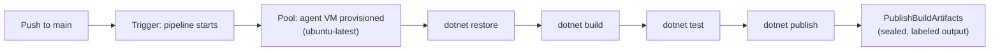
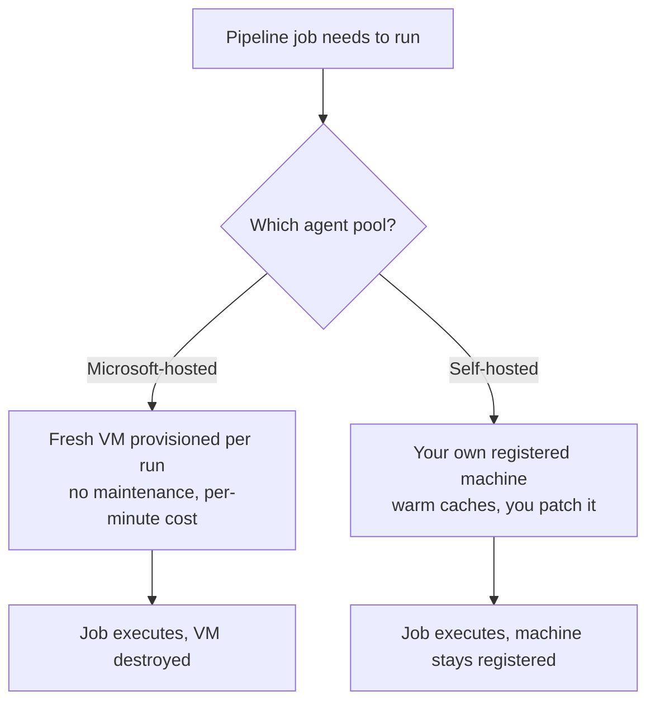

# Azure DevOps Pipelines: Build

## Introduction

Before reading this lesson, you should already be comfortable with **[Building Azure Dashboards](../16-azure-for-dotnet-developers/16-51-building-azure-dashboards.md)**, which surfaced metrics about resources that were already running in Azure. Every lesson since this module opened has quietly assumed that working code somehow already made it into an Azure resource — an App Service, a Container App, an AKS cluster — usually by way of a manual `az webapp deploy` or `dotnet publish` run from someone's laptop. This lesson opens the module's **DevOps & Infrastructure as Code** sub-area by removing that assumption, starting with **Azure DevOps**, Microsoft's own CI/CD and work-tracking platform, and specifically the **build pipeline**: the automated process that turns a commit into a tested, deployable artifact without a laptop, or a human's memory of the right commands, involved at all.

By the end of this lesson, you will be able to:

- Explain what Azure DevOps is and where Pipelines fits alongside its other services (Boards, Repos, Artifacts)
- Describe the anatomy of a YAML pipeline: triggers, pools, stages, jobs, steps, and tasks
- Write an `azure-pipelines.yml` file that restores, builds, tests, and publishes a .NET solution as a build artifact
- Distinguish Microsoft-hosted build agents from self-hosted agent pools, and when each is the right choice
- Explain why a build pipeline stops at "artifact produced," leaving deployment for the release pipeline covered next

## Azure DevOps Pipelines — A Layman's Perspective

Picture a factory that manufactures a product assembled from many parts — say, a bicycle. Nobody at a serious bicycle factory hand-assembles each unit from scratch on a workbench, trusting memory to get every torque setting and bolt sequence right. Instead, a part arriving from a supplier travels down a conveyor through a fixed sequence of stations: an inspection station checks the part is the right one and undamaged, an assembly station bolts it into the frame, a testing station puts the assembled bike through a stress test on rollers, and a final packaging station boxes up only the units that passed every earlier station, with a label recording exactly which parts went in and which tests it survived. If any station finds a problem, the line stops right there — a cracked frame doesn't get quietly boxed up and shipped anyway.

A software build pipeline is that conveyor, and the "parts" are the source files a developer just pushed. Every time new code arrives, the same fixed sequence of stations runs automatically, with no human deciding, that particular Tuesday afternoon, to remember to run the tests: first a station gathers the raw ingredients the code depends on — third-party libraries, in a bicycle's case the wheels and gears bought from other factories — a second station assembles everything into a finished, runnable form, a third station runs the finished assembly through its own stress tests, and a final station boxes up only the version that passed everything, sealing it with a label recording exactly which commit it came from. That sealed box is a **build artifact**, and just like the bicycle factory, if any station along the way finds a problem — a library that won't resolve, code that won't compile, a test that fails — the whole line stops right there. Nothing defective quietly reaches the loading dock.

Azure DevOps Pipelines is the conveyor-belt system itself: a service that watches a code repository the way the factory floor watches its supply chain, and runs that exact fixed sequence — described once, in a file, rather than configured by hand on the factory floor each time — every single time new code shows up. Crucially, this factory doesn't yet know where the finished, boxed product is actually going to be sold; it just guarantees that whatever comes off the end of this particular line is a verified, working, labeled unit, ready to be handed to a separate distribution process. That handoff — getting the boxed artifact to an actual store shelf, or in this lesson's world, an actual running Azure App Service — is deliberately a different job, covered by the very next lesson's release pipeline. This lesson is entirely about the factory floor that produces the sealed box.

## Azure DevOps Pipelines — A Programming Language Perspective

**Azure DevOps** is Microsoft's integrated suite for software delivery, comprising **Boards** (work-item tracking), **Repos** (Git hosting), **Artifacts** (package feeds), and **Pipelines** — the CI/CD engine this lesson covers. A **pipeline** is defined declaratively in an `azure-pipelines.yml` file checked into the same repository as the source it builds, using a hierarchy of **stages** (major phases, such as Build or Deploy), each containing one or more **jobs** (units of work assigned to an **agent**), each containing an ordered list of **steps**, most commonly **tasks** — pre-built, parameterized units like `DotNetCoreCLI@2` for running `dotnet` commands. A **trigger** (typically a branch push) starts a run; a **pool** specifies which **build agent** — a Microsoft-hosted VM image such as `ubuntu-latest`, or a self-hosted machine — actually executes the job's steps. The final `publish` step uploads a **build artifact**, the pipeline's tangible output, ready for a release pipeline to consume.

## How to Write a YAML Build Pipeline for a .NET Solution

A minimal but production-shaped build pipeline for a .NET solution needs exactly four steps in sequence: restore its NuGet dependencies, build it, run its test project, and publish the compiled output as an artifact.


*Figure 1: A single-stage YAML build pipeline — each step must succeed before the next one runs.*

```yaml
# azure-pipelines.yml — CI build for a .NET 10 solution
trigger:
  branches:
    include:
      - main

pool:
  vmImage: "ubuntu-latest"

variables:
  buildConfiguration: "Release"

steps:
  - task: UseDotNet@2
    inputs:
      version: "10.0.x"

  - task: DotNetCoreCLI@2
    displayName: "Restore"
    inputs:
      command: "restore"
      projects: "**/*.sln"

  - task: DotNetCoreCLI@2
    displayName: "Build"
    inputs:
      command: "build"
      projects: "**/*.sln"
      arguments: "--configuration $(buildConfiguration) --no-restore"

  - task: DotNetCoreCLI@2
    displayName: "Test"
    inputs:
      command: "test"
      projects: "**/*Tests.csproj"
      arguments: "--configuration $(buildConfiguration) --no-build"

  - task: DotNetCoreCLI@2
    displayName: "Publish"
    inputs:
      command: "publish"
      projects: "**/*.csproj"
      arguments: "--configuration $(buildConfiguration) --no-build --output $(Build.ArtifactStagingDirectory)"
      zipAfterPublish: true

  - task: PublishBuildArtifacts@1
    inputs:
      pathToPublish: "$(Build.ArtifactStagingDirectory)"
      artifactName: "drop"
```

**Azure DevOps Pipeline Run Log (summary):**

```text
✔ UseDotNet         .NET SDK 10.0.100 installed
✔ Restore           124 packages restored
✔ Build             Build succeeded. 0 Warning(s). 0 Error(s)
✔ Test              Passed!  - Failed: 0, Passed: 47, Skipped: 0
✔ Publish           1 project(s) published
✔ PublishBuildArtifacts   Artifact "drop" published (1 file, 4.2 MB)

Pipeline run #2026.0816.3 succeeded
```

Each `task` wraps a familiar `dotnet` CLI command the same way earlier modules ran it locally, so nothing here is new syntax to learn beyond the YAML wrapper itself. The pipeline fails fast: if `Test` reports any failed case, `Publish` and `PublishBuildArtifacts` never run, and the whole pipeline reports failure — exactly the bicycle factory's stopped conveyor. The `drop` artifact produced here is what the next lesson's release pipeline picks up and actually deploys.

## Real-Time Example: A Build Pipeline for the Order API Solution

We continue the E-Commerce Order Processing domain, specifically the `OrderApi` ASP.NET Core solution built across earlier modules, which by now includes an `OrderApi.csproj` web project and an `OrderApi.Tests.csproj` xUnit test project covering the order-validation logic. The build pipeline below is what actually runs on every push to `main`, replacing whatever manual build-and-test ritual existed before.

```yaml
# azure-pipelines.yml — OrderApi solution build
trigger:
  branches:
    include:
      - main
  paths:
    include:
      - "src/OrderApi/*"

pool:
  vmImage: "ubuntu-latest"

variables:
  buildConfiguration: "Release"
  solution: "src/OrderApi/OrderApi.sln"

steps:
  - task: UseDotNet@2
    inputs:
      version: "10.0.x"

  - task: DotNetCoreCLI@2
    displayName: "Restore OrderApi"
    inputs:
      command: "restore"
      projects: "$(solution)"

  - task: DotNetCoreCLI@2
    displayName: "Build OrderApi"
    inputs:
      command: "build"
      projects: "$(solution)"
      arguments: "--configuration $(buildConfiguration) --no-restore"

  - task: DotNetCoreCLI@2
    displayName: "Run OrderApi.Tests"
    inputs:
      command: "test"
      projects: "src/OrderApi/OrderApi.Tests/OrderApi.Tests.csproj"
      arguments: "--configuration $(buildConfiguration) --logger trx"

  - task: PublishTestResults@2
    inputs:
      testResultsFormat: "VSTest"
      testResultsFiles: "**/*.trx"

  - task: DotNetCoreCLI@2
    displayName: "Publish OrderApi"
    inputs:
      command: "publish"
      projects: "src/OrderApi/OrderApi.csproj"
      arguments: "--configuration $(buildConfiguration) --output $(Build.ArtifactStagingDirectory)/orderapi"
      zipAfterPublish: true

  - task: PublishBuildArtifacts@1
    inputs:
      pathToPublish: "$(Build.ArtifactStagingDirectory)/orderapi"
      artifactName: "orderapi-drop"
```

**Azure DevOps Pipeline Run Log (summary):**

```text
✔ Restore OrderApi       89 packages restored
✔ Build OrderApi         Build succeeded. 0 Warning(s). 0 Error(s)
✔ Run OrderApi.Tests     Passed!  - Failed: 0, Passed: 63, Skipped: 0
✔ PublishTestResults     Published 63 test results
✔ Publish OrderApi       OrderApi.dll and dependencies published
✔ PublishBuildArtifacts  Artifact "orderapi-drop" published (2.8 MB)

Pipeline run #2026.0816.7 succeeded — triggered by commit a3f9c1e
```

The `paths: include` filter means this pipeline only runs when files under `src/OrderApi/` actually change — a large curriculum-wide repository can host many such path-scoped pipelines side by side without every push triggering every one of them. The resulting `orderapi-drop` artifact, sealed and versioned against commit `a3f9c1e`, is the exact unit the next lesson's release pipeline deploys to Dev, then Staging, then Production, without ever rebuilding the code — the same binary that passed 63 tests here is the one that eventually reaches customers.

## Microsoft-Hosted Agents vs Self-Hosted Agents

Every job in a pipeline runs on an **agent** — a machine that actually executes the steps — drawn from an **agent pool**. Azure DevOps offers Microsoft-hosted pools like `ubuntu-latest` or `windows-latest`: fresh, disposable VMs, provisioned automatically for each run and destroyed afterward, pre-loaded with common SDKs including recent .NET versions, at the cost of a per-minute usage limit on free tiers and a short provisioning delay every run. A **self-hosted agent pool** instead uses machines you register and manage yourself — a VM, an on-premises server, even a container — that stay running between jobs, keeping a warm cache of restored packages and Docker layers, at the cost of you now owning that machine's patching, capacity, and security.


*Figure 2: Microsoft-hosted agents trade a small per-run cost and cold start for zero maintenance; self-hosted agents trade maintenance burden for speed and control.*

| Aspect | Microsoft-Hosted Agent | Self-Hosted Agent |
|---|---|---|
| Provisioning | Fresh VM per job, automatic | Registered once, reused across jobs |
| Maintenance | None — Microsoft manages images | You patch the OS, SDKs, tools |
| Startup time | Cold start every run (~1-2 min) | Instant — already running |
| Cost model | Free tier minutes, then per-minute billing | Your own VM/hardware cost |
| Network access | Public internet only | Can reach private VNets, on-prem resources |
| Typical use case | Most standard .NET/web builds | Private network access, large caches, GPUs |

## Types of Pipeline Building Blocks in Azure DevOps

1. **[Azure DevOps Pipelines: Release](../16-azure-for-dotnet-developers/16-53-azure-devops-pipelines-release.md)** — the multi-stage deployment pipeline that consumes this lesson's build artifact, covered next.
2. **Pipeline templates** — reusable YAML fragments (`extends`, `template`) shared across multiple pipelines to avoid duplicating steps like restore/build/test.
3. **Variable groups** — named sets of pipeline variables, optionally linked to Key Vault, shared across pipelines without repeating values.
4. **Service connections** — stored, permissioned credentials a pipeline uses to reach external systems such as an Azure subscription.
5. **Classic pipelines** — Azure DevOps's older, UI-configured (non-YAML) pipeline editor, still supported but no longer the recommended starting point for new pipelines.
6. **Multi-stage YAML pipelines** — a single file spanning both build and release stages, an alternative to the separate build/release pipeline split used in this and the next lesson.

## What You've Learned & What's Next

A YAML build pipeline gives every push to a .NET solution the same fixed, automatic sequence — restore, build, test, publish — that a manual process would eventually forget to run correctly, producing a sealed, versioned build artifact and running on either a disposable Microsoft-hosted agent or a self-managed self-hosted one. Producing that artifact is only half the story: nothing has been deployed anywhere yet.

Continue your learning journey with **[Azure DevOps Pipelines: Release](../16-azure-for-dotnet-developers/16-53-azure-devops-pipelines-release.md)**, where this lesson's `orderapi-drop` artifact gets deployed through Dev, Staging, and Production environments, gated by approvals before it ever reaches customers.

---
*Applies to: .NET 10 / C# 14. Last reviewed 2026-08-16.*
