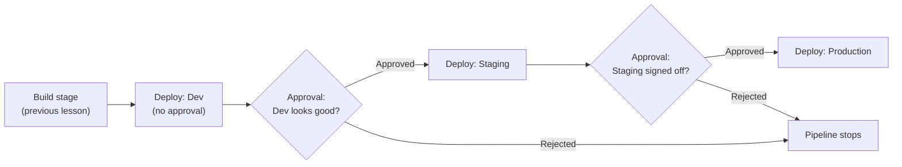
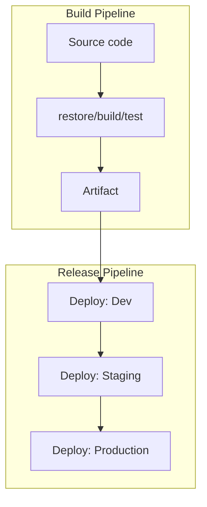

# Azure DevOps Pipelines: Release

## Introduction

Before reading this lesson, you should already be comfortable with **[Azure DevOps Pipelines: Build](../16-azure-for-dotnet-developers/16-52-azure-devops-pipelines-build.md)**, where every push produced a sealed, tested build artifact — but that artifact went nowhere. A build pipeline's entire job is to stop at "verified and packaged"; it deliberately knows nothing about Dev, Staging, or Production, or about the fact that a banking system's production deployment should never happen without a human explicitly signing off first. This lesson picks up exactly there, with the **release pipeline**: the multi-stage process that takes the previous lesson's artifact and actually deploys it, through a sequence of environments, with real approval gates standing between the artifact and production.

By the end of this lesson, you will be able to:

- Explain what a release pipeline adds on top of a build pipeline
- Write a multi-stage YAML pipeline that deploys a build artifact to Azure App Service or Container Apps
- Define Dev, Staging, and Production as Azure DevOps **environments**, each with its own approval requirements
- Configure an approval check that blocks a deployment until a named approver signs off
- Trace a single artifact's journey through Dev → Staging → Production as a sequence of gated stage deployments

## Release Pipelines — A Layman's Perspective

Recall the previous lesson's factory conveyor, sealing a finished, tested product into a labeled box. That box doesn't get flown straight to every retail shelf in the country the moment it's sealed — first it goes to a regional test market, a handful of stores where the company can watch how real customers react and catch anything the factory's own testing missed. If that test market goes well, a manager reviews the results and signs a form authorizing a wider regional rollout. Only after that second, larger rollout also proves solid does someone with real authority — someone whose name will be on the decision — sign off on shipping the product nationwide.

That sequence of sequentially wider release rings, each one requiring a specific person's explicit sign-off before the product moves to the next, is exactly what a release pipeline automates for software, and it matters most precisely in the domains where "we shipped a bug to everyone at once" is not an acceptable sentence. A bank's core transaction system is the clearest possible example: it makes complete sense to deploy a change to a small internal Dev environment where a handful of engineers can poke at it freely, then to a Staging environment that mirrors production closely enough to catch anything Dev couldn't, and only after both of those look right, to Production — the actual system moving real customers' real money — and even then, not automatically. A specific, accountable person needs to look at the Staging results and click "approve" before Production is touched at all, exactly like the manager signing the regional-rollout form.

Crucially, it's the exact same sealed box moving through every ring, never a new one repackaged for each stage — a bank does not want its production system running code subtly different from what passed testing in Staging, any more than a customer wants a "similar but not identical" product to the one that tested well in the regional market. A release pipeline enforces that discipline mechanically: the identical build artifact from the previous lesson gets deployed to Dev, then that same artifact gets deployed to Staging, then that same artifact gets deployed to Production, with the pipeline itself refusing to move to the next ring until the current one has been explicitly approved, or in some setups, has simply run cleanly for a required soak period.

The bridge back to code: an Azure DevOps **environment** is simply a named target — Dev, Staging, Production — that the release pipeline deploys the artifact into, and an **approval check** attached to an environment is the digital equivalent of that manager's signature, pausing the pipeline in place until a specific person clicks approve.

## Release Pipelines — A Programming Language Perspective

A **release pipeline** extends the previous lesson's build pipeline with one or more deployment **stages**, each targeting an Azure DevOps **environment** — a first-class resource (`environment: Staging`) representing a deployment target, distinct from a simple variable. A `deployment` job, rather than an ordinary job, references that environment and runs a `strategy` (commonly `runOnce`) containing `deploy` steps, such as the `AzureWebApp@1` task, which deploys a previously published artifact — never rebuilding it — to an Azure App Service or Container App using a stored **service connection**. Each environment can carry one or more **checks**, most notably an **approval check**, which pauses the pipeline before that stage's deployment job starts until a designated approver (or group) explicitly approves or rejects the run from the Azure DevOps portal or its mobile app. A single YAML file can therefore express the entire Dev → Staging → Production sequence, with `dependsOn` chaining stages so each only starts after the previous one succeeds.

## How to Write a Multi-Stage Release Pipeline

A release stage typically consumes the artifact a build stage already published, then deploys it to one environment; chaining several such stages with `dependsOn` produces the full promotion sequence.


*Figure 1: Each environment can require its own approval before the identical artifact is allowed to move to the next stage.*

```yaml
# azure-pipelines.yml — multi-stage release, deploying to three environments in sequence
stages:
  - stage: Build
    jobs:
      - job: BuildAndTest
        pool: { vmImage: "ubuntu-latest" }
        steps:
          - script: dotnet publish -c Release -o $(Build.ArtifactStagingDirectory)
          - publish: $(Build.ArtifactStagingDirectory)
            artifact: drop

  - stage: DeployDev
    dependsOn: Build
    jobs:
      - deployment: DeployToDev
        environment: "Dev"
        pool: { vmImage: "ubuntu-latest" }
        strategy:
          runOnce:
            deploy:
              steps:
                - task: AzureWebApp@1
                  inputs:
                    azureSubscription: "svc-conn-azure-prod"
                    appName: "app-service-dev"
                    package: "$(Pipeline.Workspace)/drop/**/*.zip"

  - stage: DeployStaging
    dependsOn: DeployDev
    jobs:
      - deployment: DeployToStaging
        environment: "Staging"
        pool: { vmImage: "ubuntu-latest" }
        strategy:
          runOnce:
            deploy:
              steps:
                - task: AzureWebApp@1
                  inputs:
                    azureSubscription: "svc-conn-azure-prod"
                    appName: "app-service-staging"
                    package: "$(Pipeline.Workspace)/drop/**/*.zip"

  - stage: DeployProduction
    dependsOn: DeployStaging
    jobs:
      - deployment: DeployToProduction
        environment: "Production"
        pool: { vmImage: "ubuntu-latest" }
        strategy:
          runOnce:
            deploy:
              steps:
                - task: AzureWebApp@1
                  inputs:
                    azureSubscription: "svc-conn-azure-prod"
                    appName: "app-service-prod"
                    package: "$(Pipeline.Workspace)/drop/**/*.zip"
```

**Azure DevOps Pipeline Run Log (summary):**

```text
✔ Build              Artifact "drop" published
✔ DeployDev           Deployed to app-service-dev — no approval configured
⏸ DeployStaging       Waiting for approval (Staging environment)
   → Approved by j.morgan@bank.example — 2026-08-16 14:22 UTC
✔ DeployStaging       Deployed to app-service-staging
⏸ DeployProduction     Waiting for approval (Production environment)
   → Approved by r.chen@bank.example — 2026-08-16 15:05 UTC
✔ DeployProduction    Deployed to app-service-prod

Pipeline run #2026.0816.9 succeeded
```

Notice that `DeployDev` ran immediately with no pause — the Dev environment has no approval check configured — while `DeployStaging` and `DeployProduction` both stopped and waited for a named human to act, each recorded with a timestamp and identity in the run log. The `package` input in every stage points at the same `drop` artifact from the `Build` stage; nothing gets rebuilt between environments.

## Real-Time Example: Promoting the Core Banking Statement Service

We continue the Banking/ATM domain's `TransactionStatementService`, whose secrets already live in `kv-banking-prod` from the Key Vault lesson. Its release pipeline enforces exactly the discipline a banking audit expects: Production requires two named approvers, not one, and Staging requires at least one.

```yaml
# azure-pipelines.yml (excerpt) — StatementService release stages
  - stage: DeployStaging
    dependsOn: Build
    jobs:
      - deployment: DeployStatementServiceStaging
        environment: "Staging-Banking"      # 1 required approver configured in the portal
        pool: { vmImage: "ubuntu-latest" }
        strategy:
          runOnce:
            deploy:
              steps:
                - task: AzureWebApp@1
                  inputs:
                    azureSubscription: "svc-conn-banking-prod"
                    appName: "app-statementservice-staging"
                    package: "$(Pipeline.Workspace)/drop/**/*.zip"

  - stage: DeployProduction
    dependsOn: DeployStaging
    jobs:
      - deployment: DeployStatementServiceProduction
        environment: "Production-Banking"   # 2 required approvers configured in the portal
        pool: { vmImage: "ubuntu-latest" }
        strategy:
          runOnce:
            deploy:
              steps:
                - task: AzureWebApp@1
                  inputs:
                    azureSubscription: "svc-conn-banking-prod"
                    appName: "app-statementservice-prod"
                    package: "$(Pipeline.Workspace)/drop/**/*.zip"
```

**Azure DevOps Pipeline Run Log (summary):**

```text
⏸ DeployStaging        Waiting for approval (Staging-Banking, 1 of 1 required)
   → Approved by ops.lead@corebank.example
✔ DeployStaging        Deployed to app-statementservice-staging
⏸ DeployProduction     Waiting for approval (Production-Banking, 0 of 2 required)
   → Approved by ops.lead@corebank.example (1 of 2)
   → Approved by compliance.officer@corebank.example (2 of 2)
✔ DeployProduction     Deployed to app-statementservice-prod

Pipeline run #2026.0816.14 succeeded — release of commit 9d2ff31
```

Requiring two independent approvers on `Production-Banking` — one from operations, one from compliance — is the kind of segregation-of-duties control a banking audit routinely checks for by name: no single engineer, however trusted, can push a change straight to the system that moves customers' money without a second, differently-accountable person also signing off. Because both approvals are recorded against the same commit and the same artifact that already passed Staging, the audit trail is complete without anyone maintaining it by hand.

## Release Pipelines vs Build Pipelines

A build pipeline answers "does this code compile, and does it pass its tests?" and produces an artifact; a release pipeline answers "should this artifact actually run in this environment right now?" and consumes that artifact without ever touching source code again. Conflating them is a common early mistake — rebuilding inside a deployment stage means Staging and Production could theoretically run subtly different binaries if the source changed between deployments, exactly the discipline break the layman's section warned against.


*Figure 2: The build pipeline's output is the release pipeline's only input — code is never touched again once the artifact exists.*

| Aspect | Build Pipeline | Release Pipeline |
|---|---|---|
| Core question | Does the code compile and pass tests? | Should this artifact run here, now? |
| Input | Source code | A previously published build artifact |
| Output | A build artifact | A running deployment in an environment |
| Gates | Test failures stop it | Approval checks on environments |
| Reruns code build? | Yes | Never — reuses the same artifact |
| Typical trigger | Every push | Completion of a build, or manually |

## Types of Release Pipeline Concepts

1. **[GitHub Actions for Azure Deployments](../16-azure-for-dotnet-developers/16-54-github-actions-for-azure.md)** — an alternative platform covering much of the same build-then-deploy ground, covered next.
2. **Deployment strategies** — `runOnce` used here, alongside `rolling` and `canary` strategies for gradually shifting traffic to a new version.
3. **Branch policies and environment approvals combined** — requiring both a reviewed pull request and a manual approval before Production.
4. **Environment resources** — attaching a Kubernetes namespace or a virtual machine resource directly to an environment, beyond a plain App Service deployment.
5. **Release gates** — automated checks (a query against Azure Monitor, an external API call) that can approve or block a stage without a human involved at all.

## What You've Learned & What's Next

A release pipeline takes the exact artifact a build pipeline already tested and moves it through a sequence of named environments, with approval checks acting as the mechanical equivalent of a required human sign-off before a sensitive environment like Production is touched — a control that matters in every domain, but is frequently a literal audit requirement in banking.

Continue your learning journey with **[GitHub Actions for Azure Deployments](../16-azure-for-dotnet-developers/16-54-github-actions-for-azure.md)**, where we cover the increasingly common alternative to Azure DevOps Pipelines for teams already hosting their code on GitHub.

---
*Applies to: .NET 10 / C# 14. Last reviewed 2026-08-16.*
