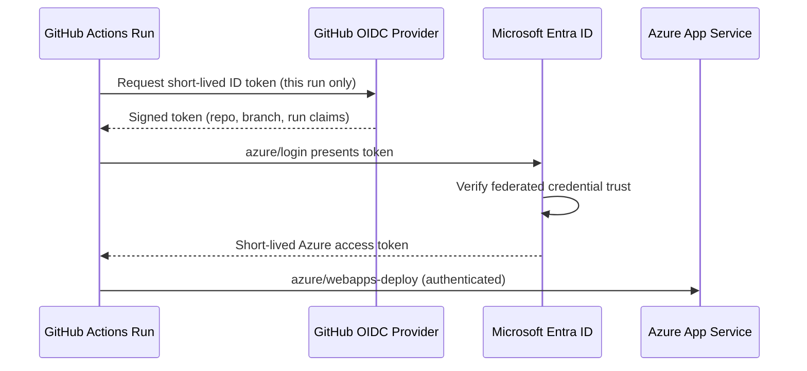
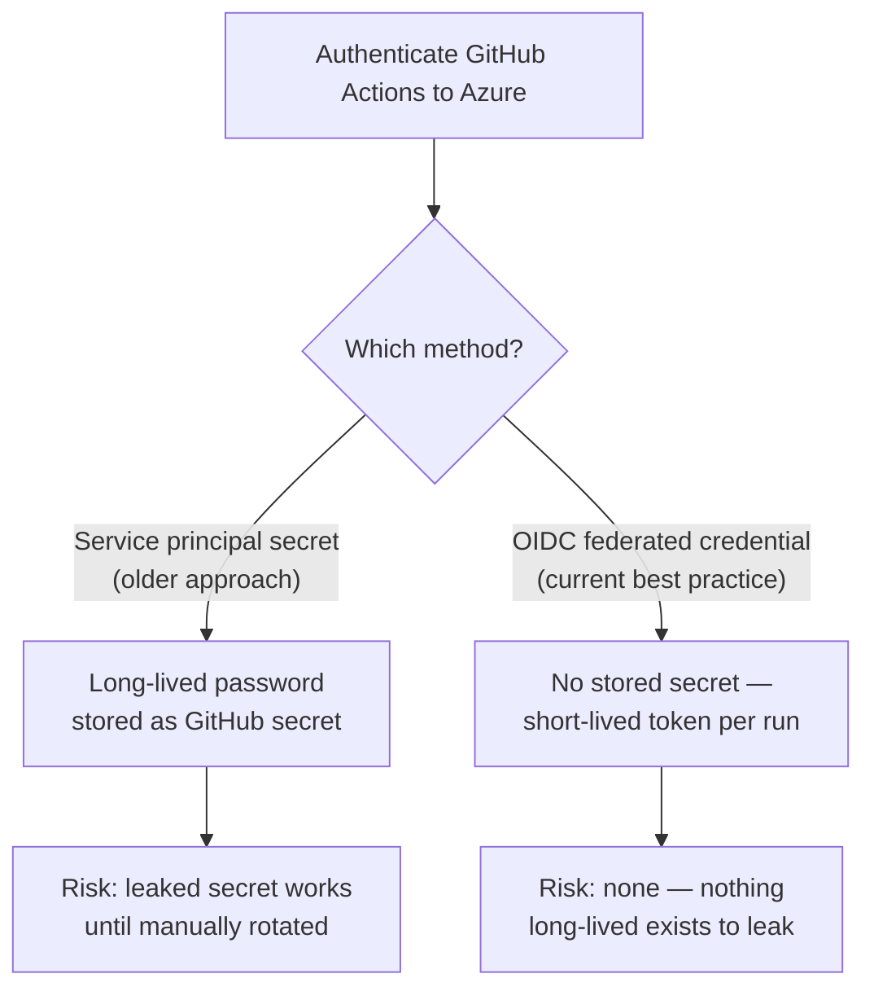

# GitHub Actions for Azure Deployments

## Introduction

Before reading this lesson, you should already be comfortable with **[Azure DevOps Pipelines: Release](../16-azure-for-dotnet-developers/16-53-azure-devops-pipelines-release.md)**, including the general shape of a CI/CD pipeline: a trigger, a build stage, and gated deployment stages. Azure DevOps isn't the only place that shape lives. A great many .NET teams — especially open-source projects and any team that already hosts its code on GitHub — reach for **GitHub Actions** instead, deploying straight to Azure without a second platform in the mix at all. This lesson covers that alternative, and along the way introduces a genuinely current security practice: authenticating to Azure from a pipeline **without storing a single long-lived secret** anywhere in GitHub.

By the end of this lesson, you will be able to:

- Explain what GitHub Actions is and how a workflow file compares to an Azure DevOps YAML pipeline
- Deploy a .NET app to Azure App Service using the `azure/webapps-deploy` action
- Explain the older service-principal-secret authentication approach, and precisely what problem it has
- Set up OIDC federated credentials so a GitHub Actions workflow authenticates to Azure with zero stored secrets
- Decide when GitHub Actions is the more natural choice for a .NET team over Azure DevOps Pipelines

## GitHub Actions for Azure — A Layman's Perspective

Think back to the release pipeline's regional-rollout analogy — a manager signing a form before a product ships wider. That whole apparatus assumed a company had its own dedicated shipping department, a separate operation from wherever the product was actually designed and built. Now imagine a smaller, more tightly integrated company where the design studio and the shipping dock are the same building, run by the same team, using the same badge system for both — nobody hands a finished product across an organizational boundary to a separate shipping company at all. GitHub Actions is that integrated setup for software: the same platform that hosts a project's source code, tracks its issues, and reviews its pull requests also runs its build-and-deploy automation, with no second platform's login, billing account, or permission model to manage alongside it.

That convenience raises an obvious old-fashioned worry, though: if the shipping dock and the design studio share one building, how does the dock actually get let into the warehouse it's delivering to, if that warehouse belongs to a different, larger partner company — in this analogy, Azure? The old-fashioned answer was a spare key: the partner company cuts a physical key, hands it to the shipping dock, and trusts the dock to keep it safe indefinitely. That key is exactly the earlier "service principal secret" approach — a password-like credential, generated once, then pasted into the shipping dock's own key cabinet and used forever until someone remembers to change it. It works, but it has the exact weakness every spare key has: if it's ever copied, lost, or simply forgotten about in a drawer for three years, whoever holds it can walk into the warehouse indefinitely, and there's no way for the warehouse to tell the real dock crew from an intruder holding a stolen copy.

The modern answer is far better, and it's what this lesson centers on: instead of a physical spare key, the warehouse's own front desk is taught to recognize the dock crew's *existing*, already-issued company badges — no separate key ever gets cut, copied, or forgotten in a drawer at all. Every time the dock crew shows up, they present their own badge, the front desk calls the dock company's own security office to confirm "yes, this badge is legitimate and it's clocked in for exactly this one delivery run, right now," and access is granted for that visit only. No physical object capable of being stolen ever changes hands. That's **OIDC federated credentials**: GitHub itself vouches for a specific, narrowly-scoped workflow run, Azure calls back to confirm GitHub's vouching is genuine, and a short-lived pass is issued — never a long-lived password sitting in a GitHub secret waiting to leak.

## GitHub Actions for Azure — A Programming Language Perspective

A **GitHub Actions workflow** is a YAML file under `.github/workflows/` triggered by repository events (`push`, `pull_request`), composed of **jobs** running on **runners** (GitHub-hosted or self-hosted), each executing an ordered list of **steps** that either run shell commands or invoke a reusable **action** — a packaged unit referenced as `owner/repo@version`, such as `azure/webapps-deploy@v3`, which deploys a package to an Azure Web App. Authentication to Azure traditionally used the `azure/login` action with a **service principal**'s client secret stored as a GitHub encrypted secret — a long-lived credential valid until manually rotated. The current, Microsoft-recommended alternative uses **OpenID Connect (OIDC)**: an Entra ID **federated identity credential** configured to trust GitHub's own OIDC token issuer for a specific repository and branch, so `azure/login` exchanges a short-lived, workflow-run-scoped GitHub-issued token for an Azure access token at run time — no client secret exists in GitHub at all, ever.

## How to Deploy to Azure with GitHub Actions and OIDC

Setting this up has two halves: an Entra ID federated credential trusting this specific GitHub repository and branch, and a workflow file that uses it.


*Figure 1: No secret is stored anywhere — GitHub's own token is exchanged for an Azure token at run time, scoped to this one workflow run.*

```bash
# Azure CLI — one-time setup: register the federated credential (no secret generated)
az ad app federated-credential create \
  --id <app-registration-object-id> \
  --parameters '{
    "name": "github-main-branch",
    "issuer": "https://token.actions.githubusercontent.com",
    "subject": "repo:my-org/library-inventory-api:ref:refs/heads/main",
    "audiences": ["api://AzureADTokenExchange"]
  }'
```

```yaml
# .github/workflows/deploy.yml
name: Deploy to Azure App Service

on:
  push:
    branches: [main]

permissions:
  id-token: write   # required so the job can request the OIDC token
  contents: read

jobs:
  build-and-deploy:
    runs-on: ubuntu-latest
    steps:
      - uses: actions/checkout@v4

      - uses: actions/setup-dotnet@v4
        with:
          dotnet-version: "10.0.x"

      - run: dotnet publish -c Release -o ./publish

      - name: Azure login (OIDC, no secret)
        uses: azure/login@v2
        with:
          client-id: ${{ vars.AZURE_CLIENT_ID }}
          tenant-id: ${{ vars.AZURE_TENANT_ID }}
          subscription-id: ${{ vars.AZURE_SUBSCRIPTION_ID }}

      - name: Deploy to App Service
        uses: azure/webapps-deploy@v3
        with:
          app-name: "app-library-api"
          package: "./publish"
```

**GitHub Actions Run Log (summary):**

```text
✔ checkout                    Repository checked out
✔ setup-dotnet                .NET SDK 10.0.100 installed
✔ dotnet publish              Published to ./publish
✔ Azure login (OIDC, no secret)   Federated token exchanged — logged in as app-library-deploy
✔ Deploy to App Service       Deployment successful: https://app-library-api.azurewebsites.net

Run #47 succeeded — main @ 4c1a8de
```

Notice that `client-id`, `tenant-id`, and `subscription-id` are plain, non-secret identifiers — safe to store as ordinary repository **variables** rather than encrypted secrets, because none of them, alone, grants any access. The `permissions: id-token: write` line is what actually allows this specific job to request an OIDC token in the first place; omitting it is the most common reason this setup fails on a first attempt.

## Real-Time Example: Deploying the Library Inventory API via GitHub Actions

We continue the Library/Inventory Management domain's `LibraryInventoryApi`, hosted on GitHub rather than in Azure Repos. Its workflow deploys straight to an Azure App Service on every push to `main`, using the exact OIDC setup above, with no secret stored in the repository at any point in its history.

```yaml
# .github/workflows/deploy.yml — LibraryInventoryApi
name: Deploy LibraryInventoryApi

on:
  push:
    branches: [main]
    paths: ["src/LibraryInventoryApi/**"]

permissions:
  id-token: write
  contents: read

jobs:
  build-test-deploy:
    runs-on: ubuntu-latest
    steps:
      - uses: actions/checkout@v4

      - uses: actions/setup-dotnet@v4
        with:
          dotnet-version: "10.0.x"

      - name: Restore, build, test
        run: |
          dotnet restore src/LibraryInventoryApi/LibraryInventoryApi.sln
          dotnet build src/LibraryInventoryApi/LibraryInventoryApi.sln -c Release --no-restore
          dotnet test src/LibraryInventoryApi/LibraryInventoryApi.Tests --no-build -c Release

      - name: Publish
        run: dotnet publish src/LibraryInventoryApi/LibraryInventoryApi.csproj -c Release -o ./publish

      - name: Azure login (OIDC)
        uses: azure/login@v2
        with:
          client-id: ${{ vars.AZURE_CLIENT_ID }}
          tenant-id: ${{ vars.AZURE_TENANT_ID }}
          subscription-id: ${{ vars.AZURE_SUBSCRIPTION_ID }}

      - uses: azure/webapps-deploy@v3
        with:
          app-name: "app-library-inventory-api"
          package: "./publish"
```

**GitHub Actions Run Log (summary):**

```text
✔ Restore, build, test        Passed! - Failed: 0, Passed: 31, Skipped: 0
✔ Publish                     Published to ./publish
✔ Azure login (OIDC)          Logged in as app-library-deploy (token expires in 60 min)
✔ webapps-deploy              Deployment successful: https://app-library-inventory-api.azurewebsites.net

Run #12 succeeded — main @ 91bd44f
```

For a library system shared across a public catalog site and a small internal cataloging team, GitHub Actions removes an entire second platform from the picture — the same pull request that adds a new catalog feature also carries the workflow run that deploys it, reviewed by the same people, in the same interface. And because the deploy credential is a 60-minute federated token rather than a stored secret, even a fully public repository's workflow logs contain nothing an attacker could extract and reuse a week later.

## OIDC Federated Credentials vs Service Principal Secrets

The older approach creates an Entra ID service principal with a **client secret** — a password-equivalent string — pasted into a GitHub encrypted secret and presented by `azure/login` on every run. It works, and remains supported, but that secret is valid until someone manually rotates or revokes it, meaning a leaked copy from months ago can still authenticate today. **OIDC federated credentials** eliminate the stored secret entirely: Entra ID is configured to trust tokens issued by GitHub's own OIDC provider for a specific repository and branch, so `azure/login` exchanges a token minted fresh for that one workflow run — typically valid under an hour — for Azure access. There is no secret to leak, because there is no secret.


*Figure 2: Removing the stored secret entirely removes the specific risk that secret represented.*

| Aspect | Service Principal Secret | OIDC Federated Credential |
|---|---|---|
| What's stored in GitHub | A client secret (password) | Nothing secret — plain client/tenant IDs |
| Credential lifetime | Until manually rotated (often months/years) | Minutes, minted fresh per workflow run |
| Leak impact | Full access until secret is revoked | None — nothing reusable to steal |
| Setup effort | One CLI command | One federated-credential registration, scoped to a repo/branch |
| Microsoft's current guidance | Still supported, but legacy | **Recommended for new GitHub-to-Azure workflows** |

## Types of GitHub Actions Concepts for Azure Deployments

1. **[Bicep in Depth](../16-azure-for-dotnet-developers/16-55-bicep-in-depth.md)** — provisioning the infrastructure a workflow like this deploys into, covered next.
2. **Reusable workflows** — `workflow_call`-triggered YAML files shared across multiple repositories, GitHub's answer to Azure DevOps pipeline templates.
3. **Environments and required reviewers** — GitHub's own approval-gate mechanism, directly comparable to the previous lesson's Azure DevOps environments.
4. **Composite actions** — bundling several steps into one reusable, named action, similar in spirit to an Azure DevOps task.
5. **Self-hosted GitHub runners** — registering your own machine as a runner, mirroring the previous lesson's self-hosted agent pools.

## What You've Learned & What's Next

GitHub Actions offers the same build-and-deploy shape as Azure DevOps Pipelines, integrated directly into the platform many .NET teams already use for source control, and `azure/webapps-deploy` deploys straight to an App Service from a workflow run. The genuinely current security upgrade is OIDC federated credentials: eliminating the stored service-principal secret entirely, so a GitHub repository's automation authenticates to Azure with nothing long-lived left for an attacker to ever find.

Continue your learning journey with **[Bicep in Depth](../16-azure-for-dotnet-developers/16-55-bicep-in-depth.md)**, where we return to the Bicep language introduced back in Lesson 5 and cover modules, parameters, outputs, and what-if deployments in full.

---
*Applies to: .NET 10 / C# 14. Last reviewed 2026-08-16.*
