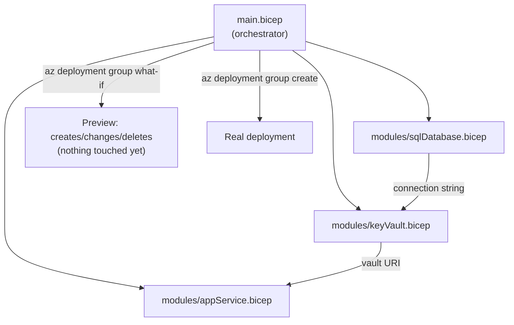
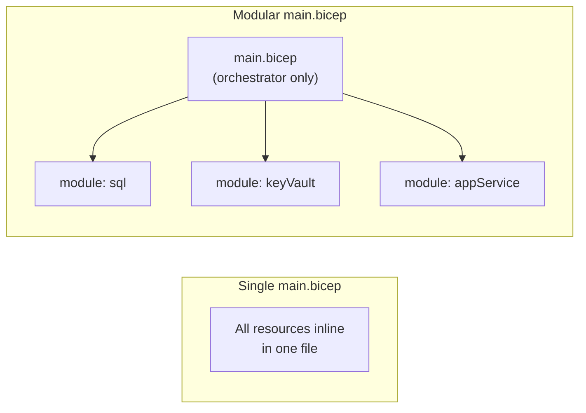

# Bicep in Depth

## Introduction

Before reading this lesson, you should already be comfortable with **[GitHub Actions for Azure Deployments](../16-azure-for-dotnet-developers/16-54-github-actions-for-azure.md)** and, further back, **[ARM Templates vs Bicep — Introduction](../16-azure-for-dotnet-developers/16-05-arm-templates-vs-bicep-intro.md)**, which promised a full return to Bicep once this module's DevOps sub-area arrived. That lesson covered a single storage account and left modules, parameter files, and what-if deployments as named-but-unexplored topics. This lesson delivers on that promise, moving from Bicep's basic syntax to the tools that make it viable for a real, multi-resource deployment: **modules** for splitting large infrastructure into reusable pieces, **parameters and outputs** for making a template environment-agnostic, and **what-if deployments** for previewing exactly what a deployment will change before committing to it.

By the end of this lesson, you will be able to:

- Split a Bicep deployment into reusable **modules**, each responsible for one resource or resource group
- Declare **parameters** with defaults and constraints, and expose **outputs** other modules or pipelines can consume
- Run a **what-if deployment** to preview additions, changes, and deletions before they happen
- Provision an entire application stack — App Service, SQL Database, and Key Vault — from a single Bicep file and one deployment command
- Explain why Bicep modules are the natural next step once a single-file template outgrows readability

## Bicep Modules and What-If — A Layman's Perspective

Return to Lesson 5's architect analogy: a single, clean blueprint that a translation step turns into a machine-precise specification. That worked well for a single room's design. Now imagine the architect is designing an entire office building — dozens of rooms, an electrical system, plumbing, an elevator shaft — and insists on drawing every single one of those systems onto one enormous sheet of paper. Even a readable blueprint language stops being readable once a single sheet has to hold the entire building's design at once; a plumber trying to check the pipe routing has to visually wade through elevator specs and electrical runs that have nothing to do with their job.

The professional answer, in real architecture, is a **set** of blueprints: one sheet for the electrical plan, one for plumbing, one for the elevator shaft, one for the overall floor layout that simply references the others by name — "see electrical plan E-1 for wiring in this room" — without redrawing their contents inline. Each sheet can be handed to the specific trade that needs it, reviewed independently, and even reused wholesale on the next building that needs an identical elevator shaft. A **Bicep module** is exactly that referenced sub-sheet: a separate `.bicep` file responsible for one coherent piece of infrastructure — a database, a vault, a web app — that a top-level file pulls in by reference, passing it just the specific measurements (parameters) that particular building needs, rather than repeating the whole sub-design inline every time.

The second half of this lesson answers a different, equally practical worry: before a construction crew tears into an existing, occupied building to apply a revised blueprint, nobody sane skips straight to swinging the sledgehammer. A competent contractor first walks the site with the *revised* blueprint in hand and produces a written change list — "this wall gets removed, this doorway gets added, everything else stays exactly as it is" — for the building's owner to review and sign off on before a single wall actually comes down. That walkthrough, entirely on paper, changing nothing yet, is what a **what-if deployment** does for a Bicep template: Azure compares the template against what's actually deployed right now and reports exactly what would be created, changed, or deleted, without touching a single real resource, so nobody discovers a website's database was about to be dropped only after `provisioningState` already says "Succeeded."

## Bicep Modules and What-If — A Programming Language Perspective

A **Bicep module** is declared with the `module` keyword, referencing another `.bicep` file by relative path, and is instantiated with its own `name` and a `params` block supplying that file's declared parameters — conceptually a function call whose "function body" is an entire nested deployment, itself compiling down to a linked ARM template. A module's `output` values are accessed from the calling file as `moduleSymbol.outputs.propertyName`, letting one module's result — say, a Key Vault's URI — feed directly into another module's parameters, such as an App Service's app settings. **Parameters** (`param name type = defaultValue`) support type constraints (`@allowed`, `@minLength`) that fail validation before any resource is touched; **outputs** (`output name type = expression`) surface values, like a generated hostname, back to whatever invoked the deployment — a CI/CD pipeline, a script, or another module. A **what-if deployment**, run via `az deployment group what-if --template-file main.bicep`, performs the same resolution and validation as a real deployment but stops before the write phase, printing a structured diff of every resource Azure would create, modify, or delete.

## How to Structure a Bicep Deployment with Modules and What-If

A well-structured Bicep deployment separates each resource type into its own module file, then composes them from one top-level orchestrating file that passes parameters between them.


*Figure 1: Each module owns one resource; outputs from one feed the parameters of another, and what-if previews the whole graph before anything real happens.*

```bicep
// modules/keyVault.bicep
param vaultName string
param location string

resource vault 'Microsoft.KeyVault/vaults@2023-07-01' = {
  name: vaultName
  location: location
  properties: {
    sku: { family: 'A', name: 'standard' }
    tenantId: subscription().tenantId
    enableRbacAuthorization: true
  }
}

output vaultUri string = vault.properties.vaultUri
```

```bicep
// main.bicep — orchestrator
param location string = resourceGroup().location
param environmentName string = 'prod'

module keyVault 'modules/keyVault.bicep' = {
  name: 'deploy-keyvault'
  params: {
    vaultName: 'kv-app-${environmentName}'
    location: location
  }
}

output vaultUri string = keyVault.outputs.vaultUri
```

```bash
# Preview changes before applying anything
az deployment group what-if \
  --resource-group rg-app-prod \
  --template-file main.bicep
```

**Azure CLI What-If Output:**

```text
Resource and property changes are indicated with these symbols:
  + Create

The deployment will update the following scope:

Scope: /subscriptions/.../resourceGroups/rg-app-prod

  + Microsoft.KeyVault/vaults/kv-app-prod [2023-07-01]

Resource changes: 1 to create, 0 to modify, 0 to delete.
```

Nothing was created by that `what-if` call — it is purely a preview, safe to run at any time, including against a resource group that already has resources in it, where it would instead report `~` for modifications or `-` for anything the template would delete. Only running `az deployment group create` with the identical template actually provisions the vault.

## Real-Time Example: Provisioning the E-Commerce Stack in One Command

We continue the E-Commerce Order Processing domain, provisioning the `OrderApi`'s full production stack — App Service, Azure SQL Database, and Key Vault — as three modules composed from one orchestrating file, exactly mirroring the manual, one-resource-at-a-time CLI commands from Lesson 5 and earlier App Service lessons, now expressed declaratively and reproducibly.

```bicep
// main.bicep — provisions the OrderApi's App Service + SQL Database + Key Vault
param location string = resourceGroup().location
param environmentName string = 'prod'
param sqlAdminPassword string

module sql 'modules/sqlDatabase.bicep' = {
  name: 'deploy-sql'
  params: {
    serverName: 'sql-orderapi-${environmentName}'
    databaseName: 'OrderApiDb'
    location: location
    adminPassword: sqlAdminPassword
  }
}

module vault 'modules/keyVault.bicep' = {
  name: 'deploy-keyvault'
  params: {
    vaultName: 'kv-orderapi-${environmentName}'
    location: location
  }
}

module appService 'modules/appService.bicep' = {
  name: 'deploy-appservice'
  params: {
    appName: 'app-orderapi-${environmentName}'
    location: location
    keyVaultUri: vault.outputs.vaultUri
    sqlConnectionString: sql.outputs.connectionString
  }
}

output orderApiUrl string = appService.outputs.defaultHostName
```

```bash
# Preview, then apply, the full three-resource stack
az deployment group what-if --resource-group rg-orderapi-prod --template-file main.bicep --parameters sqlAdminPassword='...'
az deployment group create --resource-group rg-orderapi-prod --template-file main.bicep --parameters sqlAdminPassword='...'
```

**Azure CLI What-If Output (first run, empty resource group):**

```text
  + Microsoft.Sql/servers/sql-orderapi-prod [2023-08-01]
  + Microsoft.Sql/servers/sql-orderapi-prod/databases/OrderApiDb [2023-08-01]
  + Microsoft.KeyVault/vaults/kv-orderapi-prod [2023-07-01]
  + Microsoft.Web/serverfarms/plan-orderapi-prod [2023-12-01]
  + Microsoft.Web/sites/app-orderapi-prod [2023-12-01]

Resource changes: 5 to create, 0 to modify, 0 to delete.
```

**Azure CLI Deployment Output (after `create`):**

```text
{
  "properties": {
    "provisioningState": "Succeeded",
    "outputs": {
      "orderApiUrl": { "type": "String", "value": "app-orderapi-prod.azurewebsites.net" }
    }
  }
}
```

Every dependency in this stack is explicit and ordering is handled automatically: the App Service module needs the vault's URI and the database's connection string, so Bicep deploys `sql` and `vault` first, then `appService`, without anyone writing that ordering down by hand. Standing up an entirely separate, identical `staging` environment is now `environmentName: 'staging'` and one more `az deployment group create` — the same guarantee Lesson 5 promised, now delivered for a genuinely realistic, three-resource stack instead of a single storage account.

## Modules vs a Single Monolithic Bicep File

A single `.bicep` file with every resource declared inline works fine for a handful of resources, exactly as Lesson 5's one-storage-account example showed, but stops scaling the moment a real application's infrastructure spans a database, a cache, a vault, networking, and multiple compute resources — at that point, one file becomes exactly the unreadable, all-trades-on-one-sheet blueprint the layman's section warned about. Splitting into modules restores per-resource readability, enables reuse (the same `keyVault.bicep` module deploys Dev, Staging, and Production alike), and lets different resources be reviewed and versioned independently, at the modest cost of an extra layer of indirection when tracing a single property's value across files.


*Figure 2: A monolithic file mixes every resource's concerns together; a modular layout isolates each resource behind its own reusable file.*

| Aspect | Monolithic Bicep File | Modular Bicep (with `module`) |
|---|---|---|
| Readability at scale | Degrades quickly past a few resources | Each file stays focused on one concern |
| Reuse across environments | Copy-paste the whole file | Same module, different `params` per environment |
| Independent review | Entire file reviewed together | Each module reviewable/versionable on its own |
| Dependency management | Manual ordering awareness | Automatic, inferred from `outputs`/`params` wiring |
| Best for | A handful of resources, quick prototypes | Any real multi-resource application stack |

## Types of Bicep Concepts Worth Knowing

1. **[Terraform Basics for Azure](../16-azure-for-dotnet-developers/16-56-terraform-basics-for-azure.md)** — the multi-cloud, third-party alternative to Bicep, covered next.
2. **Bicep parameter files** (`.bicepparam`) — supplying an entire environment's parameter values from a checked-in file instead of `--parameters` flags on the command line.
3. **Bicep registry / module registry** — publishing a module to a shared registry so multiple teams or repositories can reuse it without copying files.
4. **Existing resources** (`resource ... existing`) — referencing a resource a Bicep file didn't create itself, useful when only part of an environment is managed as code.
5. **Deployment stacks** — a newer Azure feature that tracks a set of resources as one deployable unit and can clean up resources removed from the template, beyond what a plain deployment does.

## What You've Learned & What's Next

Bicep modules turn a single unreadable template into a set of focused, reusable files wired together through parameters and outputs, and what-if deployments let you see exactly what a deployment will create, change, or delete before it touches a single real resource — together making Bicep viable for provisioning a genuinely realistic, multi-resource stack like the E-Commerce Order Processing domain's App Service, SQL Database, and Key Vault, all from one file and one command.

Continue your learning journey with **[Terraform Basics for Azure](../16-azure-for-dotnet-developers/16-56-terraform-basics-for-azure.md)**, where we cover the popular multi-cloud alternative to Bicep and how its approach to the same Infrastructure as Code problem differs.

---
*Applies to: .NET 10 / C# 14. Last reviewed 2026-08-16.*
