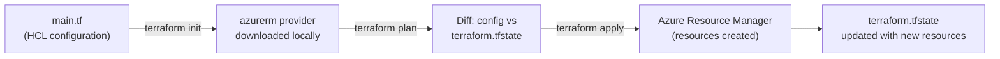
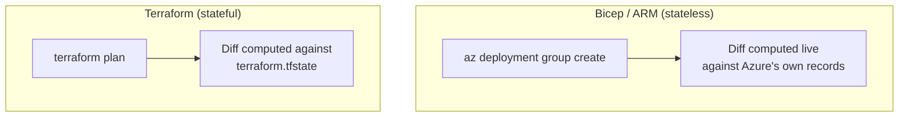

# Terraform Basics for Azure

## Introduction

Before reading this lesson, you should already be comfortable with **[Bicep in Depth](../16-azure-for-dotnet-developers/16-55-bicep-in-depth.md)**, including the fact that Bicep is a concise authoring layer that compiles down to ARM JSON and deploys exclusively through Azure Resource Manager. That exclusivity is fine for an Azure-only shop, but plenty of real organizations run workloads across Azure, AWS, and Google Cloud at the same time, and none of those other clouds have ever heard of a `.bicep` file. This lesson introduces **Terraform**, HashiCorp's cloud-agnostic Infrastructure as Code tool, which describes resources in a single language regardless of which cloud they ultimately live in.

By the end of this lesson, you will be able to:

- Explain why Terraform exists as a multi-cloud alternative to Bicep and ARM templates
- Read and write basic HashiCorp Configuration Language (HCL) using the AzureRM provider
- Explain Terraform's state file and why Terraform tracks deployed resources itself, unlike Bicep
- Run the `terraform init` / `plan` / `apply` workflow against an Azure resource group
- Decide, for a given team, whether Terraform or Bicep is the better default choice

## Terraform — A Layman's Perspective

Imagine a shipping company that only ever sends cargo to one country. It hires a single customs broker who knows that one country's import forms inside and out, fills them out precisely the way that country's port authority expects, and never has to think about any other nation's paperwork. That broker is fast and deeply specialized, but utterly useless the day the company decides to open a warehouse in a second country with entirely different customs forms, different terminology, and a different port authority reading them. The company would need to hire a second broker, trained from scratch on the second country's rules, and the two brokers would have no shared process between them at all.

Now imagine instead a different kind of broker — an international logistics coordinator who fills out one standardized internal shipping request, in the company's own consistent format, for every shipment regardless of destination. Behind the scenes, that coordinator has a translator on staff for each country's port authority: a translator for the first country's customs office, a different translator for the second country's, a third for the third. The company's own staff never learn any of those countries' native paperwork; they fill out the same internal form every time, and the appropriate translator silently converts it into whatever each destination country's port actually requires.

Bicep is the first broker: excellent within its one country (Azure), unable to speak to any other. Terraform is the second: one consistent authoring language — HashiCorp Configuration Language, or HCL — with a swappable **provider** acting as the translator for each destination. The `azurerm` provider translates Terraform's resource declarations into calls against Azure's own APIs; a separate `aws` provider does the equivalent for Amazon; a `google` provider does it for Google Cloud. A company running workloads across two or three clouds can describe all of them in the same HCL syntax, in the same repository, using the same `terraform` command-line tool, rather than maintaining a completely separate toolchain per cloud.

There is one more thing this coordinator does that the single-country broker never needed to: keep a personal ledger of every shipment they have ever personally sent, because the coordinator's own recordkeeping — not the destination country's official registry — is what the coordinator trusts when planning the next shipment. That ledger is Terraform's **state file**. Bicep never keeps such a ledger; every time it runs, it simply asks Azure directly "what already exists here?" and computes a diff against that live answer. Terraform instead keeps its own private record of what it believes it deployed, and consults that record — not a fresh, guaranteed-accurate query of the real cloud — before deciding what to change next. That difference sounds like a technicality, but it is the single most important thing to understand about how Terraform actually behaves, and it drives the comparison later in this lesson.

## Terraform — A Programming Language Perspective

**Terraform** is an open-source Infrastructure as Code tool from HashiCorp, configured in **HashiCorp Configuration Language (HCL)**, a declarative syntax organized around `provider`, `resource`, `variable`, and `output` blocks. A **provider** — most relevantly here, `azurerm` — is a plugin that translates Terraform's generic resource blocks into calls against a specific cloud's control-plane API; the same Terraform CLI and largely the same HCL structure work against `aws`, `google`, or dozens of other providers, which is what makes Terraform cloud-agnostic in a way Bicep and ARM, both wired permanently to Azure Resource Manager, are not. Terraform's defining mechanism is its **state**: a JSON file, `terraform.tfstate`, recording every resource Terraform believes it has created, which `terraform plan` diffs against both the HCL configuration and (optionally) a fresh read of real infrastructure to compute exactly what would change on the next `terraform apply`. State is commonly stored remotely — an `azurerm` backend pointing at a Blob Storage container is the standard choice for Azure work — so a team collaborates against one shared, lockable source of truth instead of a state file sitting on a single developer's laptop.

## How to Provision Azure Resources with Terraform

A minimal Terraform project for Azure needs three things: a `provider` block declaring `azurerm`, one or more `resource` blocks, and the three-command workflow that turns HCL into real infrastructure.


*Figure 1: Terraform reads its own state file, not a fresh query of Azure, to decide what `plan` and `apply` need to change.*

```hcl
# main.tf -- resource group and storage account for the Library Catalog system
terraform {
  required_providers {
    azurerm = {
      source  = "hashicorp/azurerm"
      version = "~> 4.0"
    }
  }
}

provider "azurerm" {
  features {}
}

resource "azurerm_resource_group" "library_catalog" {
  name     = "rg-library-catalog-prod"
  location = "eastus"
}

resource "azurerm_storage_account" "catalog_covers" {
  name                     = "stlibrarycatalogimg"
  resource_group_name      = azurerm_resource_group.library_catalog.name
  location                 = azurerm_resource_group.library_catalog.location
  account_tier             = "Standard"
  account_replication_type = "LRS"
}
```

```bash
# Terraform CLI -- the standard init / plan / apply workflow
terraform init
terraform plan -out=tfplan
terraform apply tfplan
```

**Terraform CLI Output:**

```text
Initializing the backend...
Initializing provider plugins...
- Installing hashicorp/azurerm v4.10.0...

Terraform will perform the following actions:
  # azurerm_resource_group.library_catalog will be created
  # azurerm_storage_account.catalog_covers will be created

Plan: 2 to add, 0 to change, 0 to destroy.

azurerm_resource_group.library_catalog: Creating...
azurerm_storage_account.catalog_covers: Creating...
azurerm_storage_account.catalog_covers: Creation complete after 22s

Apply complete! Resources: 2 added, 0 changed, 0 destroyed.
```

Notice that `terraform plan` names both resources explicitly *before* anything is created, and that the CLI Output's summary line — `2 to add, 0 to change, 0 to destroy` — is Terraform comparing this configuration against its state file, not against a blind guess. Running `terraform apply tfplan` executes exactly the plan that was already reviewed, which is why teams routinely require a saved plan file to be reviewed in a pull request before anyone runs `apply` against it.

## Real-Time Example: Multi-Cloud Disaster Recovery for the Library Catalog

We continue the Library/Inventory Management domain's catalog system, whose book cover images already live in Blob Storage from **[Azure Blob Storage](../16-azure-for-dotnet-developers/16-23-azure-blob-storage.md)**, backed by the `Book(Isbn, Title, Author)` record used throughout that domain. The library consortium operating this system has a disaster-recovery requirement its Azure-only Bicep templates cannot satisfy on their own: a nightly replica of the catalog's metadata must also exist in an AWS S3 bucket, maintained by the same infrastructure team that already manages Azure. Rather than running two entirely separate toolchains, that team describes both the Azure storage account and the AWS replica bucket in one Terraform configuration.

```hcl
# main.tf -- Azure primary storage plus an AWS disaster-recovery replica, one configuration
terraform {
  required_providers {
    azurerm = { source = "hashicorp/azurerm", version = "~> 4.0" }
    aws     = { source = "hashicorp/aws",     version = "~> 5.0" }
  }
}

provider "azurerm" {
  features {}
}

provider "aws" {
  region = "us-east-1"
}

resource "azurerm_storage_account" "catalog_covers" {
  name                     = "stlibrarycatalogimg"
  resource_group_name      = "rg-library-catalog-prod"
  location                 = "eastus"
  account_tier             = "Standard"
  account_replication_type = "LRS"
}

resource "aws_s3_bucket" "catalog_dr_replica" {
  bucket = "library-catalog-dr-replica"
}
```

**Terraform CLI Output:**

```text
Plan: 2 to add, 0 to change, 0 to destroy.

azurerm_storage_account.catalog_covers: Creation complete after 21s
aws_s3_bucket.catalog_dr_replica: Creation complete after 4s

Apply complete! Resources: 2 added, 0 changed, 0 destroyed.
```

This is the exact scenario Bicep structurally cannot address: one `terraform apply`, one state file, one team's tooling spanning both the Azure resource the catalog actually runs on and the AWS resource that exists purely as an off-cloud disaster-recovery target. If the library consortium's infrastructure were Azure-only, none of this multi-provider capability would matter, and the earlier Bicep lesson's simpler, more tightly-integrated authoring experience would remain the better default — which is exactly the tradeoff the comparison below makes explicit.

## Terraform vs Bicep

The deepest difference between the two is not syntax but state. Bicep and ARM are **stateless** against Azure: every deployment re-reads the live resource graph from Azure Resource Manager itself and computes a diff on the spot, so Azure's own records are always the single source of truth, and running the same template twice is inherently safe. Terraform is **stateful**: it maintains its own separate record, `terraform.tfstate`, of what it believes it created, and if a resource is changed outside Terraform — through the Portal, the CLI, or another tool entirely — that state file can drift out of sync with reality until someone runs `terraform plan` (or `terraform refresh`) to reconcile the difference. That extra bookkeeping is also Terraform's superpower: the same state-tracking mechanism that requires care to keep synchronized is what lets Terraform manage resources across completely unrelated clouds through a uniform interface.


*Figure 2: Bicep trusts Azure's own resource state as the source of truth; Terraform trusts a state file it maintains itself.*

| Aspect | Terraform | Bicep |
|---|---|---|
| Cloud scope | Multi-cloud (Azure, AWS, GCP, and more via providers) | Azure-only |
| Language | HashiCorp Configuration Language (HCL) | Bicep DSL |
| Source of truth for "what exists" | Its own state file (local or remote backend) | Azure Resource Manager's live resource graph |
| Drift risk | Yes — state can fall out of sync with manual changes | No — always re-reads Azure directly |
| First-party Azure integration | Third-party, via the `azurerm` provider | Native, maintained by Microsoft |
| Best fit | Multi-cloud orgs, or teams with existing Terraform investment | Azure-only shops wanting the simplest, most tightly integrated authoring experience |

## Types of Terraform Concepts Worth Knowing

1. **Remote state backends** — storing `terraform.tfstate` in an Azure Storage container (or Terraform Cloud) with locking, so teams collaborate against one shared state safely.
2. **Terraform modules** — reusable, parameterized HCL packages, conceptually equivalent to Bicep's `module` keyword from the previous lesson.
3. **`terraform import`** — bringing an already-existing Azure resource, created outside Terraform, under Terraform's state management without recreating it.
4. **OpenTofu** — an open-source fork of Terraform maintained by the Linux Foundation, created after a HashiCorp licensing change, and largely command-compatible with the `terraform` CLI shown here.
5. **[Azure Container Registry](../16-azure-for-dotnet-developers/16-57-azure-container-registry.md)** — the next lesson's topic, provisionable with either Bicep or the Terraform patterns just covered.

## What You've Learned & What's Next

Terraform's HCL and `azurerm` provider let a single authoring language and toolchain describe infrastructure across Azure and other clouds at once, at the cost of maintaining its own state file as the record of what it has deployed — the opposite of Bicep's stateless, always-ask-Azure-directly model. For an Azure-only team, Bicep's tighter integration usually wins; for a multi-cloud org or a team with existing Terraform expertise, that cost is well worth paying.

Continue your learning journey with **[Azure Container Registry](../16-azure-for-dotnet-developers/16-57-azure-container-registry.md)**, where we shift from provisioning infrastructure to managing the container images that infrastructure actually runs.

---
*Applies to: .NET 10 / C# 14. Last reviewed 2026-08-16.*
