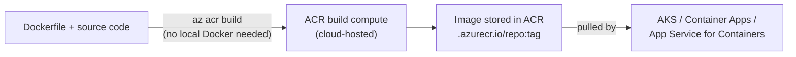
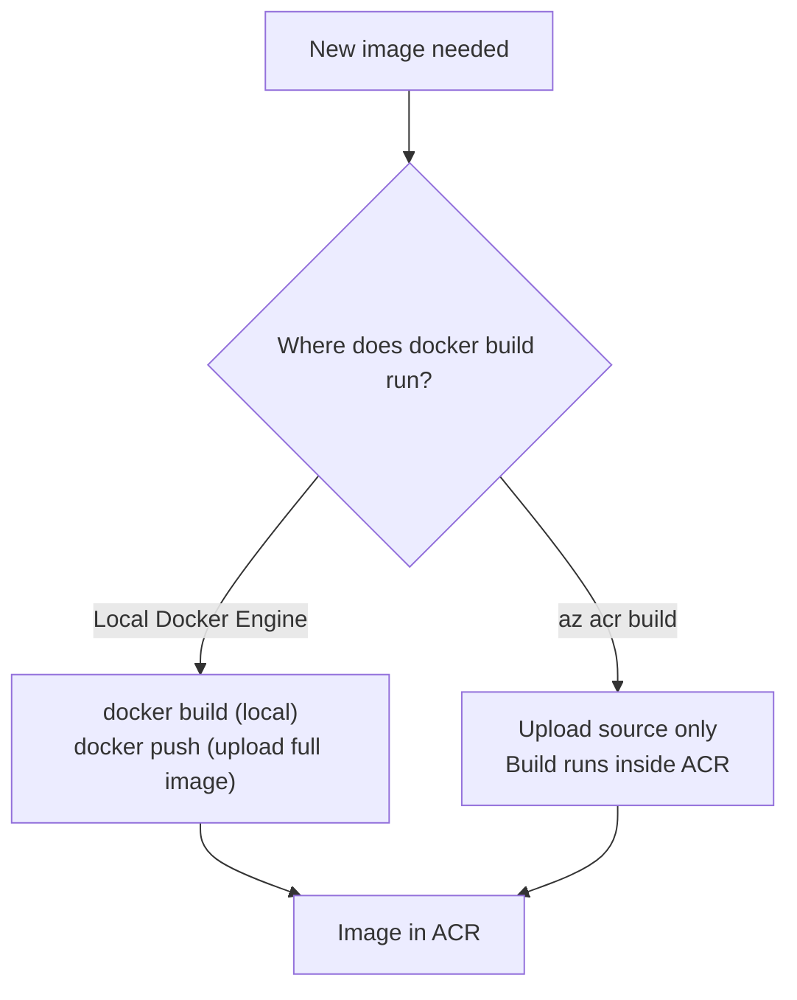

# Azure Container Registry

## Introduction

Before reading this lesson, you should already be comfortable with **[Terraform Basics for Azure](../16-azure-for-dotnet-developers/16-56-terraform-basics-for-azure.md)** and, further back, Module 15's Docker lessons — specifically **[Dockerizing an ASP.NET Core App](../15-containers-blazor-maui/15-02-dockerizing-aspnetcore-app.md)** and **[Multi-Stage Docker Builds](../15-containers-blazor-maui/15-14-multi-stage-docker-builds.md)**, both of which ended with a built image sitting only on a local machine. A local image is useless to Azure Kubernetes Service, Azure Container Apps, or App Service for Containers, all of which need to *pull* an image from somewhere reachable over the network. This lesson covers that somewhere: **Azure Container Registry (ACR)**.

By the end of this lesson, you will be able to:

- Explain what Azure Container Registry is and why a private registry matters for production images
- Create an ACR instance and push an existing Docker image to it
- Build an image directly in the cloud with `az acr build`, without a local Docker Engine at all
- Pull images from ACR into AKS, Azure Container Apps, and App Service for Containers
- Explain how ACR fits between Module 15's local Docker workflow and Module 16's Azure hosting options

## Azure Container Registry — A Layman's Perspective

Picture a small photography studio that, until now, has only ever developed film in its own darkroom and handed finished prints directly to the one client waiting in the lobby. That works fine for a single client picking up a single order in person, but it falls apart the moment the studio needs to supply prints to five different retail shops across town, each of which needs to fetch the latest prints on its own schedule, from its own location, without anyone physically carrying a folder of photos across the city every time.

What that studio actually needs is a proper photo lab and distribution warehouse — a facility that develops film professionally, stores every finished print in labeled, versioned folders, and lets any authorized shop across town request exactly the print it needs, whenever it needs it, through a locked front counter that checks credentials before handing anything over. Critically, this lab is private: it's not a public photo kiosk anyone off the street can browse through, the way a public stock-photo website would be. Only the studio's own shops, and anyone the studio explicitly grants a key to, can request prints from it at all.

Azure Container Registry is exactly that private lab, sized for container images instead of photographs. Every image a team builds — the compiled, packaged result of a `Dockerfile`, from Module 15 — gets pushed into ACR once, tagged with a version, and stored there indefinitely until something requests it. AKS, Container Apps, and App Service for Containers are the "shops across town": each one independently pulls whichever image and tag it needs, whenever it starts up or scales out, straight from ACR's locked front counter, authenticating first rather than being handed images by an anonymous public source the way Docker Hub's public repositories work.

The detail that makes ACR more than "just a private version of Docker Hub" is the studio's own darkroom becoming unnecessary entirely. Instead of a developer's laptop building the film locally and then mailing the finished print to the lab — the ordinary `docker build` followed by `docker push` — the studio can send the *undeveloped film itself* (the source code and Dockerfile) straight to the lab and have the lab's own equipment do the developing. That's `az acr build`: Azure's own build compute compiles the Docker image inside the registry's infrastructure, so a developer's machine never needs Docker installed at all, and the image that comes out the other end is already sitting exactly where it needs to be, with no separate push step required.

## Azure Container Registry — A Programming Language Perspective

**Azure Container Registry** is a managed, private container registry implementing the standard Docker Registry HTTP API V2, meaning any Docker-compatible tool — `docker push`, `docker pull`, Kubernetes' own image-pulling machinery — works against it identically to how it works against Docker Hub, differing only in the registry's hostname (`<registry-name>.azurecr.io`) and its access-control model. Images are pushed and pulled via standard Docker tagging conventions: `<registry-name>.azurecr.io/<repository>:<tag>`. **ACR Tasks**, invoked through `az acr build`, run the `docker build` step itself on managed build compute inside Azure rather than on the caller's machine, uploading only the build context (source plus `Dockerfile`) and producing a finished image already stored in the registry — no local Docker Engine is required to run it. Authentication for pulls from AKS, Container Apps, or App Service for Containers is handled either through the registry's admin credentials (simplest, least recommended for production) or, preferably, a managed identity granted the `AcrPull` role — the same managed-identity pattern from **[Managed Identities](../16-azure-for-dotnet-developers/16-32-managed-identities.md)**.

## How to Build and Push Images with Azure Container Registry

Provisioning a registry is one command; getting an image into it can go two ways — a traditional local build followed by a push, or a single cloud-native build that skips the local step entirely.


*Figure 1: `az acr build` uploads only source and a Dockerfile; the image is built and stored inside ACR without ever touching a local Docker Engine.*

```bash
# Azure CLI -- create a registry, then build directly in the cloud
az acr create --resource-group rg-orderapi-prod --name acrorderapiprod --sku Standard

az acr build --registry acrorderapiprod \
  --image order-api:v1 \
  --file ./Dockerfile .

az acr repository show-tags --name acrorderapiprod --repository order-api
```

**Azure CLI Output:**

```text
{
  "name": "acrorderapiprod",
  "loginServer": "acrorderapiprod.azurecr.io",
  "sku": { "name": "Standard" }
}

Sending build context (2.1 MiB) to ACR...
Queued a build with ID: ca3
Step 1/6 : FROM mcr.microsoft.com/dotnet/aspnet:10.0 AS base
Step 6/6 : ENTRYPOINT ["dotnet", "OrderApi.dll"]
Run ID: ca3 was successful after 47s

[
  "v1"
]
```

Notice that no `docker build`, `docker login`, or `docker push` command appears anywhere in that sequence — `az acr build` performed the entire round trip, from source to a stored, tagged image, using Azure's own build compute rather than the machine running the CLI. That matters as much for CI pipelines running on lightweight, Docker-less build agents as it does for a developer's own laptop.

## Real-Time Example: Building the Order API Image for Container Apps

We continue the E-Commerce Order Processing domain's containerized Order API, first built locally in **[Containerizing the Order API — Real-Time Example](../15-containers-blazor-maui/15-13-containerizing-order-api-real-time.md)** and refined with a multi-stage `Dockerfile` in the very next lesson. That image now needs to reach **[Azure Container Apps](../16-azure-for-dotnet-developers/16-15-azure-container-apps.md)**, which cannot pull anything from a developer's local machine — only from a registry it has been granted access to.

```csharp
// OrderApiImage.cs -- .NET 10 / C# 14 -- Real-Time Example (E-Commerce Order Processing)
public sealed record ContainerImageRef(string Registry, string Repository, string Tag)
{
    public string FullyQualifiedName => $"{Registry}/{Repository}:{Tag}";
}

ContainerImageRef image = new("acrorderapiprod.azurecr.io", "order-api", "v1");

Console.WriteLine($"Image to deploy: {image.FullyQualifiedName}");
Console.WriteLine("Container Apps will pull this image using its managed identity's AcrPull role.");
```

**Console Output:**

```text
Image to deploy: acrorderapiprod.azurecr.io/order-api:v1
Container Apps will pull this image using its managed identity's AcrPull role.
```

```bash
# Azure CLI -- build the image in ACR, grant Container Apps pull access, then deploy from it
az acr build --registry acrorderapiprod --image order-api:v1 .

az containerapp identity assign --name ca-order-api --resource-group rg-orderapi-prod --system-assigned

az role assignment create \
  --assignee "$(az containerapp identity show --name ca-order-api --resource-group rg-orderapi-prod --query principalId -o tsv)" \
  --role AcrPull \
  --scope "$(az acr show --name acrorderapiprod --query id -o tsv)"

az containerapp update --name ca-order-api --resource-group rg-orderapi-prod \
  --image acrorderapiprod.azurecr.io/order-api:v1
```

**Azure CLI Output:**

```text
Run ID: ca4 was successful after 41s

Identity assigned.
Role assignment 'AcrPull' created.

Container app 'ca-order-api' updated. Active revision now pulling
acrorderapiprod.azurecr.io/order-api:v1.
```

This is the same `AcrPull`-via-managed-identity pattern the Key Vault and Managed Identities lessons built toward: `ca-order-api` never stores a registry credential of its own, and every pull is attributable to a specific identity in Azure's role assignment history rather than a shared admin password anyone on the team could leak.

## az acr build vs Local Docker Build and Push

A local `docker build` followed by `docker push` requires Docker Engine installed and running wherever the build happens — a developer's laptop or a CI runner — and produces the image on that machine before uploading the entire finished image over the network. `az acr build` instead uploads only the (usually much smaller) build context and lets Azure's own compute run the build, which matters most for CI agents that intentionally avoid installing Docker, and for keeping build behavior consistent regardless of which machine triggered it.


*Figure 2: Both paths end with the same image in ACR; only where the `docker build` step physically executes differs.*

| Aspect | Local Docker Build + Push | `az acr build` |
|---|---|---|
| Requires local Docker Engine | Yes | No |
| What's uploaded over the network | The entire finished image | Just the source code and Dockerfile |
| Build consistency across machines | Depends on local Docker version/config | Consistent — always the same ACR build compute |
| Best fit | Local development and quick iteration | CI pipelines and Docker-less build agents |
| Extra cost | None beyond registry storage | Build compute minutes (Standard/Premium SKU) |

## Types of Azure Container Registry Capabilities

1. **ACR Tasks** — the broader automation feature `az acr build` is one command inside, including scheduled and source-triggered builds.
2. **Geo-replication** — a Premium-SKU feature replicating a registry across regions for lower pull latency in multi-region deployments.
3. **Content trust and image signing** — cryptographically verifying an image hasn't been tampered with between push and pull.
4. **AKS integration (`az aks update --attach-acr`)** — a one-command grant letting an AKS cluster pull from ACR without manual role assignments.
5. **[Azure Container Apps](../16-azure-for-dotnet-developers/16-15-azure-container-apps.md)** — one of the three consumers of ACR images covered in this lesson.
6. **[AKS Fundamentals](../16-azure-for-dotnet-developers/16-16-aks-fundamentals.md)** — the other major ACR consumer, for workloads outsized for Container Apps.

## What You've Learned & What's Next

Azure Container Registry is the private, managed home for the Docker images Module 15 taught you to build, reachable by AKS, Container Apps, and App Service for Containers alike; `az acr build` goes a step further, building the image in the cloud so no machine in the pipeline needs Docker installed at all. With images now built and reachable, the next question is how a new version of one actually reaches production traffic.

Continue your learning journey with **[Release Strategies: Blue-Green and Canary on Azure](../16-azure-for-dotnet-developers/16-58-blue-green-canary-on-azure.md)**, where we cover exactly that.

---
*Applies to: .NET 10 / C# 14. Last reviewed 2026-08-16.*
