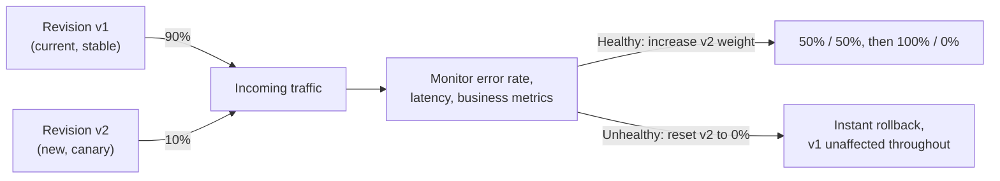
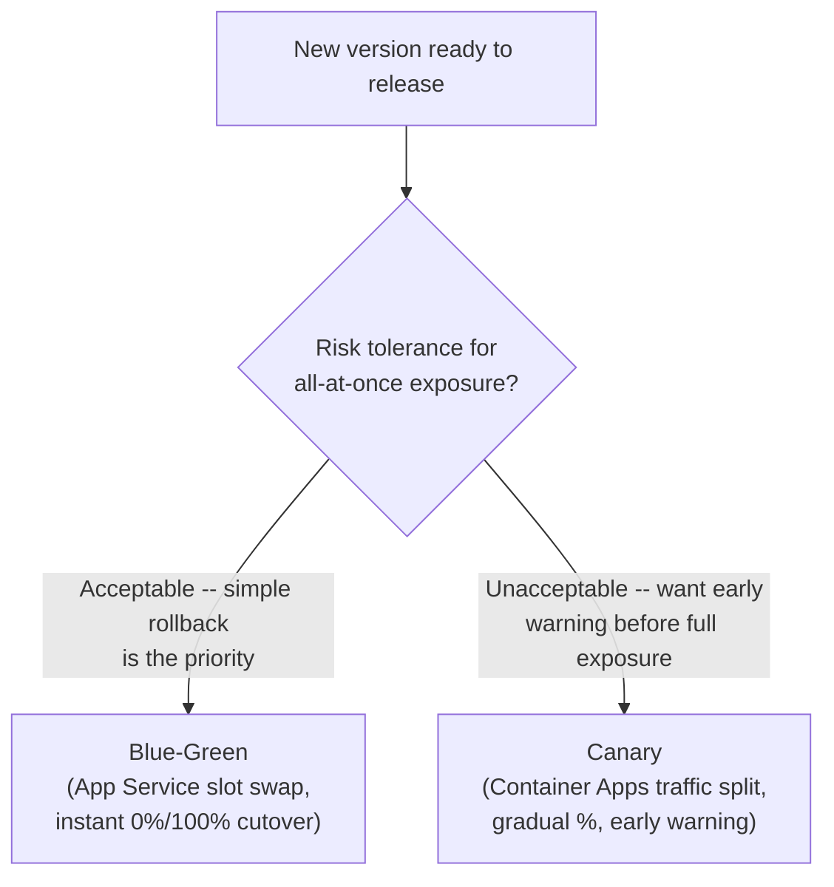

# Release Strategies: Blue-Green and Canary on Azure

## Introduction

Before reading this lesson, you should already be comfortable with **[Azure Container Registry](../16-azure-for-dotnet-developers/16-57-azure-container-registry.md)** and, further back, **[App Service Deployment Slots](../16-azure-for-dotnet-developers/16-10-app-service-deployment-slots.md)**, which already introduced one entire release strategy — a slot swap — without naming it as such. This lesson gives that pattern its formal name, **blue-green deployment**, and introduces its sibling, **canary deployment**, which shifts traffic to a new version gradually instead of all at once. Both exist to answer the same question — how does a new version reach real users without risking all of them at once — with genuinely different tradeoffs.

By the end of this lesson, you will be able to:

- Define blue-green deployment and recognize that App Service slot swapping already implements it
- Define canary deployment and explain how gradual, weighted traffic shifting differs from an all-at-once cutover
- Configure a canary rollout using Azure Container Apps' revision traffic splitting
- Compare rollback speed and blast-radius risk between the two strategies
- Choose the appropriate strategy for a given service's risk tolerance

## Blue-Green and Canary Deployment — A Layman's Perspective

Recall the restaurant from the App Service Deployment Slots lesson: a rehearsal dining room, fully staffed and fully tested, that becomes the real dining room the instant the signage on both doors is swapped. Every customer who was already seated moves, in effect, all at once — one moment they're being served from the old room, the next moment, entirely from the new one. That's **blue-green deployment**: two complete, independent environments, one live and one standing by, with an instantaneous, all-or-nothing cutover between them.

Now picture a different, older kind of caution: coal miners, long before instruments could detect dangerous gas underground, carried a caged canary bird down into the mine ahead of themselves. Canaries are unusually sensitive to toxic gas, and a canary that stopped singing — or worse — was an unmistakable, early warning that something was wrong, discovered by sacrificing the risk to one small bird rather than to the entire mining crew. Nobody sent the whole crew down first and hoped for the best; they sent the smallest possible advance party and watched it closely before anyone else followed.

**Canary deployment** borrows that exact instinct. Instead of switching every single user over to a new version at once, a small slice of real traffic — 5%, maybe 10% — gets routed to the new version while the overwhelming majority keeps using the old one, completely undisturbed. If that small slice shows trouble — error rates climbing, latency spiking, a business metric moving the wrong direction — the rollout stops immediately, and only that small canary group was ever exposed. If it looks healthy, the slice grows: 10% becomes 25%, then 50%, then eventually 100%, with a real opportunity to catch a problem at every step along the way, rather than after the fact.

The core difference, stripped of both metaphors, comes down to exposure and reversibility. Blue-green's rehearsal room is either 0% or 100% live — there's no partial state, which makes the rollback trivially simple (swap back) but means a bad deployment, however briefly, is briefly *everyone's* problem the instant it goes live. Canary's advance party is deliberately never more than a fraction of the whole, which makes a bad deployment *someone's* problem, but only a small, contained group of someones, and a rollback is often just as fast — reset the traffic weight back to zero for the new version, and it stops receiving anyone at all. Choosing between them is really choosing how much you trust a deployment before it ever sees a real, paying customer, and how much of the customer base you're willing to expose to find out.

## Blue-Green and Canary Deployment — A Programming Language Perspective

**Blue-green deployment** maintains two complete, production-capable environments — conventionally labeled "blue" and "green" — with exactly one live at any moment; promoting a new version is an instantaneous cutover of the routing layer, such as an App Service **slot swap**, an AKS Service selector change, or a Container Apps revision made the sole target of 100% of traffic, rather than a gradual shift. **Canary deployment** runs the new version alongside the old at reduced capacity and routes a configurable percentage of real traffic to it via a layer capable of weighted routing — Azure Front Door's weighted routing, Application Gateway's weighted backend pools, or, most directly for containerized .NET workloads, **Azure Container Apps' revision traffic splitting**, which assigns an explicit percentage weight to each active revision of the same container app. Both strategies support rollback by reversing the routing decision — swapping slots back, or resetting a canary's weight to 0% — but canary's partial exposure means a rollback, in the worst case, only ever affects the fraction of traffic that was already routed to the bad version.

## How to Configure a Canary Rollout with Container Apps Revision Traffic Splitting

Azure Container Apps treats every deployed image as a **revision**, and traffic weights are assigned across active revisions directly, making a canary rollout a matter of adjusting percentages rather than standing up separate infrastructure.


*Figure 1: Traffic weight, not infrastructure, moves gradually between revisions — v1 keeps serving the majority of traffic until v2 has proven itself.*

```bash
# Azure CLI -- deploy v2 as a new revision at 10% traffic, alongside v1 at 90%
az containerapp update --name ca-order-api --resource-group rg-orderapi-prod \
  --image acrorderapiprod.azurecr.io/order-api:v2 \
  --revision-suffix v2

az containerapp ingress traffic set --name ca-order-api --resource-group rg-orderapi-prod \
  --revision-weight ca-order-api--v1=90 ca-order-api--v2=10
```

**Azure CLI Output:**

```text
Revision 'ca-order-api--v2' created.

Traffic split updated:
  ca-order-api--v1   90%
  ca-order-api--v2   10%
```

```bash
# After monitoring shows v2 is healthy, shift the remaining traffic
az containerapp ingress traffic set --name ca-order-api --resource-group rg-orderapi-prod \
  --revision-weight ca-order-api--v1=0 ca-order-api--v2=100
```

**Azure CLI Output:**

```text
Traffic split updated:
  ca-order-api--v1   0%
  ca-order-api--v2   100%
```

Each `traffic set` call is the entire rollout mechanism — no new infrastructure was created, and no image was rebuilt between the 10% step and the 100% step. Resetting `ca-order-api--v2` back to 0% at any point along the way is the complete rollback, exactly as fast as the step that promoted it.

## Real-Time Example: Canary-Rolling Out Fraud-Scoring Changes for ATM Transactions

We extend the Banking/ATM domain's transaction-processing service with a new revision of its `FraudScoringService`, which flags suspicious ATM withdrawals in real time. A scoring-logic bug here has real financial consequences in both directions — flagging too aggressively locks out legitimate customers mid-withdrawal, and flagging too little lets fraud through — which is exactly the kind of risk a blue-green all-at-once cutover would expose to every ATM transaction simultaneously. The bank's platform team instead canaries the new revision.

```csharp
// FraudScoringCanaryMonitor.cs -- .NET 10 / C# 14 -- Real-Time Example (Banking/ATM)
public sealed record RevisionMetrics(string Revision, int TrafficWeightPercent, int TransactionsScored, int FalseDeclines);

RevisionMetrics[] rollout =
[
    new("fraud-scoring--v1", TrafficWeightPercent: 90, TransactionsScored: 8_412, FalseDeclines: 3),
    new("fraud-scoring--v2", TrafficWeightPercent: 10, TransactionsScored:   935, FalseDeclines: 41)
];

Console.WriteLine("Canary rollout status -- fraud-scoring--v2 at 10% traffic:");
foreach (RevisionMetrics r in rollout)
{
    double declineRate = 100.0 * r.FalseDeclines / r.TransactionsScored;
    Console.WriteLine($"  {r.Revision,-20} weight {r.TrafficWeightPercent,3}%  " +
                       $"scored {r.TransactionsScored,6}  false-decline rate {declineRate:F2}%");
}

bool anomalyDetected = rollout[1].FalseDeclines / (double)rollout[1].TransactionsScored
                     > 3 * (rollout[0].FalseDeclines / (double)rollout[0].TransactionsScored);
Console.WriteLine();
Console.WriteLine(anomalyDetected
    ? "ANOMALY: v2 false-decline rate far exceeds v1 -- halting rollout, resetting v2 traffic to 0%."
    : "v2 healthy -- safe to increase traffic weight.");
```

**Console Output:**

```text
Canary rollout status -- fraud-scoring--v2 at 10% traffic:
  fraud-scoring--v1    weight  90%  scored   8412  false-decline rate 0.04%
  fraud-scoring--v2    weight  10%  scored    935  false-decline rate 4.39%

ANOMALY: v2 false-decline rate far exceeds v1 -- halting rollout, resetting v2 traffic to 0%.
```

Because only 10% of ATM traffic was ever routed to `fraud-scoring--v2`, the 41 false declines it produced, while genuinely bad for those customers, are a small, bounded, and immediately reversible incident rather than the bank's entire ATM network locking out legitimate withdrawals nationwide. Resetting the traffic weight to 0% is the rollback — no redeployment, no slot swap, just a routing change identical in spirit to the one that promoted the canary in the first place.

## Blue-Green vs Canary

Blue-green's all-or-nothing cutover makes it simple to reason about and instant to roll back, but it offers zero real-traffic signal before every single user is affected — a subtle bug that only shows up under real production load is discovered by *everyone* at once. Canary's gradual exposure catches exactly that kind of bug early, at the cost of genuine added complexity: it requires infrastructure capable of weighted routing, careful selection of monitoring metrics to decide when to advance or retreat, and a rollout that takes materially longer than an instantaneous swap. Neither strategy is strictly better; a service's risk tolerance for "everyone finds out at once" versus its willingness to accept operational complexity in exchange for a smaller blast radius should decide between them.


*Figure 2: The deciding question is how much of the user base a bad deployment is allowed to touch before anyone notices.*

| Aspect | Blue-Green | Canary |
|---|---|---|
| Traffic cutover | Instant, all-or-nothing | Gradual, weighted percentage |
| Real-traffic signal before full exposure | None | Yes -- a small slice, monitored before advancing |
| Rollback speed | Instant -- swap back | Instant -- reset weight to 0% |
| Blast radius of a bad deployment | 100% of users, briefly | Bounded to the canary's traffic percentage |
| Infrastructure required | Two full environments (slots) | Weighted routing (Front Door, App Gateway, Container Apps revisions) |
| Operational complexity | Lower | Higher -- requires active monitoring at each step |

## Types of Release Strategies and Related Mechanisms

1. **[App Service Deployment Slots](../16-azure-for-dotnet-developers/16-10-app-service-deployment-slots.md)** — the blue-green mechanism for App Service, covered as a dedicated lesson earlier in this module.
2. **Azure Container Apps revision traffic splitting** — the canary mechanism demonstrated in this lesson, native to Container Apps.
3. **Azure Front Door weighted routing** — canary-style traffic splitting at the global edge, ahead of multiple backend regions or environments.
4. **Application Gateway weighted backend pools** — a regional equivalent for AKS or VM-based backends behind a single gateway.
5. **[AKS Fundamentals](../16-azure-for-dotnet-developers/16-16-aks-fundamentals.md)** — where canary rollouts are typically achieved with multiple Deployments and a weighted Ingress or service mesh.
6. **[CI/CD for the Banking Sample App](../16-azure-for-dotnet-developers/16-59-cicd-for-banking-sample-app.md)** — the next lesson, which wires a blue-green slot swap directly into an automated pipeline.

## What You've Learned & What's Next

Blue-green deployment cuts traffic over instantly between two complete environments, trading simplicity for an all-at-once exposure; canary deployment shifts traffic gradually, trading added complexity for an early-warning signal that limits a bad deployment's blast radius to a deliberately small slice of real users. Both rely on the same underlying idea from the deployment-slots lesson — routing changes, not code changes, are what makes a release safe.

Continue your learning journey with **[CI/CD for the Banking Sample App — Real-Time Example](../16-azure-for-dotnet-developers/16-59-cicd-for-banking-sample-app.md)**, where a blue-green slot swap becomes one gated step in a complete, automated pipeline.

---
*Applies to: .NET 10 / C# 14. Last reviewed 2026-08-16.*
