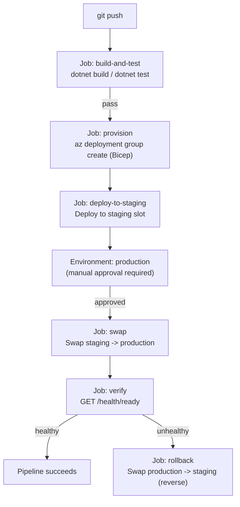
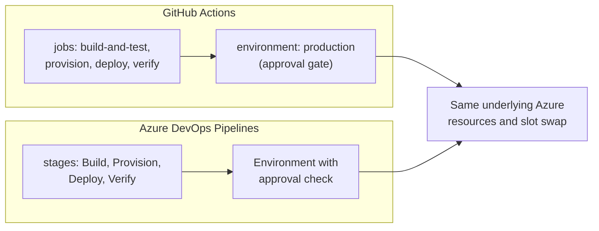

# CI/CD for the Banking Sample App — Real-Time Example

## Introduction

Before reading this lesson, you should already be comfortable with **[Release Strategies: Blue-Green and Canary on Azure](../16-azure-for-dotnet-developers/16-58-blue-green-canary-on-azure.md)**, and with every piece this lesson assembles: Bicep provisioning from earlier in this sub-area, the slot swap mechanics from **[App Service Deployment Slots](../16-azure-for-dotnet-developers/16-10-app-service-deployment-slots.md)**, and the `/health` endpoint pattern from **[Health Checks](../10-aspnetcore/10-13-health-checks.md)** and **[Container Health Checks](../15-containers-blazor-maui/15-15-container-health-checks.md)**. Every earlier lesson in this sub-area introduced one piece of a deployment pipeline in isolation. This lesson is the capstone: it wires all of those pieces together into one real, automated pipeline for the Banking/ATM sample app, with a human approval gate before production and an automatic rollback if a post-deploy health check ever fails.

By the end of this lesson, you will be able to:

- Design a GitHub Actions workflow that builds and tests a .NET solution on every push
- Have that same workflow provision infrastructure with Bicep before deploying anything
- Add a manual approval gate that must pass before a slot swap can reach production
- Wire a post-deploy health check into the pipeline, and trigger an automatic rollback when it fails
- Recap how the full eight-lesson DevOps & Infrastructure as Code sub-area fits together end to end

## CI/CD for a Real Application — A Layman's Perspective

Every earlier lesson in this sub-area handed you one station on an assembly line without showing you the whole line running. The blueprint-writer (Bicep) draws up the factory floor. The rehearsal room (deployment slots) lets a new product be tested before customers ever see it. The canary bird (weighted traffic) offers an early warning when a rehearsal room isn't quite trustworthy enough on its own. What none of those lessons showed is what happens when all of those stations are bolted together into one continuous line that runs automatically, every single time a new part arrives from the design department, without a factory worker having to walk it from station to station by hand.

That continuous, automated line is what a CI/CD pipeline actually is. The moment a developer commits a change, the line starts moving on its own: a quality-control station immediately builds and tests the new part, rejecting it outright if it's obviously broken. If it passes, the line's blueprint-following robot (Bicep) rebuilds or confirms the factory floor itself is correctly laid out before anything gets deployed onto it. The finished part then goes into the rehearsal room — the staging slot — for one more check. And here's the one station banking floors insist on that a smaller storefront might skip: before the rehearsal room's contents are allowed to become the real showroom, a human supervisor has to walk over and personally sign off, because for a bank, "the automated line thought it looked fine" is not, by itself, sufficient authority to let something touch real customer money.

Even after that human sign-off and the swap itself, the line keeps watching. An inspector immediately checks the newly-promoted product for defects — the post-deploy health check — and if that inspector finds something wrong, the line doesn't wait for a human to notice and intervene manually. It reverses itself automatically, on the spot, putting the previous, known-good part right back in the showroom before a single customer is affected by the defect. That automatic reversal is the rollback plan, and its entire value is in not depending on a tired human noticing a problem at 2 a.m. — the line notices for them.

The bridge back to code: every station in that assembly line corresponds to one job in a GitHub Actions workflow file, running automatically on every push, with the human sign-off implemented as an "environment protection rule" GitHub itself enforces before a deployment job is allowed to proceed.

## CI/CD Pipelines — A Programming Language Perspective

A **CI/CD pipeline**, expressed in **GitHub Actions** as a workflow YAML file under `.github/workflows/`, is a directed sequence of **jobs** — build-and-test, infrastructure provisioning, deployment, and verification — each composed of ordered **steps**, triggered automatically on events such as `push` or `pull_request`. A **manual approval gate** is implemented through a GitHub **environment** with a configured required reviewer: any job targeting that environment (`environment: production` in the job definition) pauses and waits for an authorized reviewer's explicit approval in the GitHub UI before its steps execute, regardless of how quickly earlier jobs completed. A **post-deploy health check** is simply an HTTP request — typically against the same `/health` or `/health/ready` endpoint from Module 10 and Module 15 — issued by a pipeline step immediately after deployment; a non-success response is checked with a conditional step (`if: failure()` in GitHub Actions) that triggers a rollback job, most commonly a slot swap executed in reverse.

## How to Build a Gated Pipeline with a Health-Check Rollback

The full pipeline is one workflow file with four logical stages: build-and-test, provision, deploy-with-approval, and verify-or-rollback.


*Figure 1: Four stages, one approval gate, and a rollback path that only triggers when the post-deploy health check itself reports failure.*

```yaml
# .github/workflows/deploy.yml -- GitHub Actions, illustrative and abbreviated
name: Build, Provision, and Deploy

on:
  push:
    branches: [main]

jobs:
  build-and-test:
    runs-on: ubuntu-latest
    steps:
      - uses: actions/checkout@v4
      - uses: actions/setup-dotnet@v4
        with:
          dotnet-version: "10.0.x"
      - run: dotnet build --configuration Release
      - run: dotnet test --configuration Release

  provision:
    needs: build-and-test
    runs-on: ubuntu-latest
    steps:
      - uses: actions/checkout@v4
      - uses: azure/login@v2
        with:
          creds: ${{ secrets.AZURE_CREDENTIALS }}
      - run: az deployment group create --resource-group rg-banking-prod --template-file main.bicep

  deploy-to-staging:
    needs: provision
    runs-on: ubuntu-latest
    steps:
      - run: az webapp deploy --resource-group rg-banking-prod --name app-banking-core \
                --slot staging --src-path ./publish.zip --type zip

  swap-to-production:
    needs: deploy-to-staging
    runs-on: ubuntu-latest
    environment: production   # requires a registered reviewer to approve before this job runs
    steps:
      - run: az webapp deployment slot swap --resource-group rg-banking-prod \
                --name app-banking-core --slot staging --target-slot production

  verify-and-rollback:
    needs: swap-to-production
    runs-on: ubuntu-latest
    steps:
      - id: health
        run: curl -sf https://app-banking-core.azurewebsites.net/health/ready
        continue-on-error: true
      - if: steps.health.outcome == 'failure'
        run: az webapp deployment slot swap --resource-group rg-banking-prod \
                --name app-banking-core --slot production --target-slot staging
```

**GitHub Actions Run Log (illustrative):**

```text
build-and-test        Succeeded  (dotnet test: 142 passed, 0 failed)
provision             Succeeded  (Bicep: provisioningState Succeeded)
deploy-to-staging     Succeeded  (Deployment successful. Site restarted.)
swap-to-production    Waiting for approval -- reviewer: platform-team-lead
swap-to-production    Approved -- Swap completed successfully.
verify-and-rollback   GET /health/ready -> HTTP 200
verify-and-rollback   Pipeline succeeded -- no rollback triggered.
```

Notice the `environment: production` line is the entire mechanism behind the approval gate — GitHub itself pauses the `swap-to-production` job the instant it's reached, and the workflow simply does not proceed until a designated reviewer clicks approve. Nothing about the YAML changes between "waiting for approval" and "approved"; the pause is enforced by GitHub's environment protection rules, not by any script the pipeline author had to write.

## Real-Time Example: A Full Pipeline Run for the Banking Core Service, Including a Rollback

We bring together the Banking/ATM domain's `TransactionStatementService` and its sibling, the core banking API behind `app-banking-core`, whose managed identity, Key Vault secrets, and `/health/ready` endpoint were all established across earlier lessons in this module. The scenario: a developer pushes a change that updates the interest-calculation logic behind account statements, and this time, unlike the healthy run just shown, the change contains a subtle bug that only surfaces once real database load hits it.

The pipeline's first three stages run exactly as before — build and test pass, Bicep confirms `rg-banking-prod`'s infrastructure matches the checked-in template, and the new code deploys cleanly to the staging slot. The platform team lead reviews the change, sees nothing alarming in the staging slot's manual smoke test, and approves the swap. The swap itself completes successfully, exactly as fast as it did in the healthy run — a slot swap's mechanics don't know or care whether the code being promoted is actually correct.

```csharp
// PostDeployHealthCheck.cs -- .NET 10 / C# 14 -- Real-Time Example (Banking/ATM)
public sealed record HealthCheckResult(string Endpoint, int StatusCode, string? DependencyThatFailed);

async Task<HealthCheckResult> CheckPostDeployHealthAsync(HttpClient client, string baseUrl)
{
    HttpResponseMessage response = await client.GetAsync($"{baseUrl}/health/ready");
    string body = await response.Content.ReadAsStringAsync();

    string? failedDependency = body.Contains("\"InterestCalculationEngine\":\"Unhealthy\"")
        ? "InterestCalculationEngine"
        : null;

    return new HealthCheckResult($"{baseUrl}/health/ready", (int)response.StatusCode, failedDependency);
}

HealthCheckResult result = await CheckPostDeployHealthAsync(
    new HttpClient(), "https://app-banking-core.azurewebsites.net");

Console.WriteLine($"Post-deploy health check: {result.Endpoint}");
Console.WriteLine($"  Status code: {result.StatusCode}");
Console.WriteLine($"  Failed dependency: {result.DependencyThatFailed ?? "none"}");

if (result.StatusCode != 200 || result.DependencyThatFailed is not null)
{
    Console.WriteLine();
    Console.WriteLine("ROLLBACK TRIGGERED: swapping production back to the previous slot contents.");
}
```

**Console Output:**

```text
Post-deploy health check: https://app-banking-core.azurewebsites.net/health/ready
  Status code: 503
  Failed dependency: InterestCalculationEngine

ROLLBACK TRIGGERED: swapping production back to the previous slot contents.
```

The pipeline's `verify-and-rollback` job sees the same `503` this console output simulates, treats it as `steps.health.outcome == 'failure'`, and immediately runs the reverse slot swap — `production` back to `staging`, `staging` back to `production` — restoring the previous, known-good interest-calculation logic before more than a handful of statement requests ever touched the broken version. No human had to be paged at the moment of failure; the rollback happened as an automatic, unconditional consequence of one HTTP response code. The developer's fix for the actual bug still has to go through the entire pipeline again from the top — build, test, provision, staging, approval, swap, verify — exactly as any other change would, because a rollback restores service, it doesn't excuse a change from earning its way back to production correctly the second time.

For a banking system specifically, this sequence — automated tests, an infrastructure-as-code provisioning step, a human approval gate immediately before production, and an unconditional automated rollback on health-check failure — is frequently close to a literal audit requirement, not just an engineering nicety: regulators and internal risk-management reviews routinely ask, by name, whether production changes require a documented approval step and a demonstrated rollback capability. This pipeline answers both questions with actual, working automation rather than a policy document describing intentions.

## GitHub Actions vs Azure DevOps Pipelines for This Pipeline

Everything this lesson built in GitHub Actions has a direct equivalent in **Azure DevOps Pipelines**, Microsoft's own CI/CD product, which predates GitHub Actions and remains common in enterprises already standardized on Azure DevOps for work-item tracking and repos. The underlying capabilities line up closely: Azure DevOps `stages` and `jobs` correspond to GitHub Actions' `jobs`; Azure DevOps environments with approval checks correspond to GitHub's `environment` protection rules; both support hosted build agents and both authenticate to Azure via a service connection or federated credential rather than a stored secret. The meaningful difference is less about capability and more about where a team already lives — a codebase already hosted on GitHub, with issues and pull requests there, tends to make GitHub Actions the path of least friction, while a team already using Azure DevOps Boards and Repos tends to keep its pipeline there too, avoiding a second platform's login, permissions model, and YAML dialect entirely.


*Figure 2: Both tools express the identical pipeline shape; the choice usually comes down to where the rest of the team's work already lives.*

| Aspect | GitHub Actions | Azure DevOps Pipelines |
|---|---|---|
| Config format | YAML under `.github/workflows/` | YAML (or classic UI) pipeline definition |
| Approval gates | `environment` protection rules | Environment approval checks |
| Best fit | Codebase and issue tracking already on GitHub | Codebase and work-item tracking already on Azure DevOps |
| Azure authentication | `azure/login` action with a service principal or federated credential | Azure Resource Manager service connection |
| Hosted build agents | GitHub-hosted runners | Microsoft-hosted agents |
| Capability gap versus the other | None functionally relevant to this lesson's pipeline | None functionally relevant to this lesson's pipeline |

## Types of Pipeline Components Worth Knowing

1. **GitHub Environments and required reviewers** — the exact approval-gate mechanism this lesson relied on before the production slot swap.
2. **[App Service Deployment Slots](../16-azure-for-dotnet-developers/16-10-app-service-deployment-slots.md)** — the blue-green mechanism this pipeline automates rather than performs by hand.
3. **[Container Health Checks](../15-containers-blazor-maui/15-15-container-health-checks.md)** — the `/health/ready` endpoint pattern this pipeline's verify step depends on.
4. **[Release Strategies: Blue-Green and Canary on Azure](../16-azure-for-dotnet-developers/16-58-blue-green-canary-on-azure.md)** — canary traffic-splitting as an alternative rollout shape this same pipeline structure could drive instead of a slot swap.
5. **[Bicep in Depth](../16-azure-for-dotnet-developers/16-55-bicep-in-depth.md)** — the provisioning step's underlying tool, run automatically on every push rather than by hand.
6. **Azure DevOps Pipelines** — this lesson's comparison target, a fully viable alternative orchestrator for the identical pipeline shape.

## What You've Learned & What's Next: Recapping the DevOps & Infrastructure as Code Sub-Area

This lesson closes out an eight-lesson arc that started with the basics of continuous integration and Infrastructure as Code and ends here, with every one of those pieces working together on a real application. Earlier lessons in this sub-area built the individual stations: continuous integration fundamentals and automated testing gates, Infrastructure as Code with **[Bicep in Depth](../16-azure-for-dotnet-developers/16-55-bicep-in-depth.md)**, **[Terraform Basics for Azure](../16-azure-for-dotnet-developers/16-56-terraform-basics-for-azure.md)** as the multi-cloud alternative, **[Azure Container Registry](../16-azure-for-dotnet-developers/16-57-azure-container-registry.md)** for building and storing the images a pipeline deploys, and **[Release Strategies: Blue-Green and Canary on Azure](../16-azure-for-dotnet-developers/16-58-blue-green-canary-on-azure.md)** for deciding how a new version actually reaches traffic. This lesson assembled all of it — build, test, provision, deploy, gate, verify, and roll back — into one continuous, automated pipeline for the Banking/ATM sample app, with a human approval step exactly where a bank needs one, and an automatic, unconditional rollback exactly where a human shouldn't have to be the one who notices first.

With deployment automation now fully in place, the next sub-area shifts to the network these applications actually run inside of.

Continue your learning journey with **[Azure Virtual Networks](../16-azure-for-dotnet-developers/16-60-azure-virtual-networks.md)**, where we begin the Networking sub-area by covering how Azure resources are isolated and connected at the network layer.

---
*Applies to: .NET 10 / C# 14. Last reviewed 2026-08-16.*
