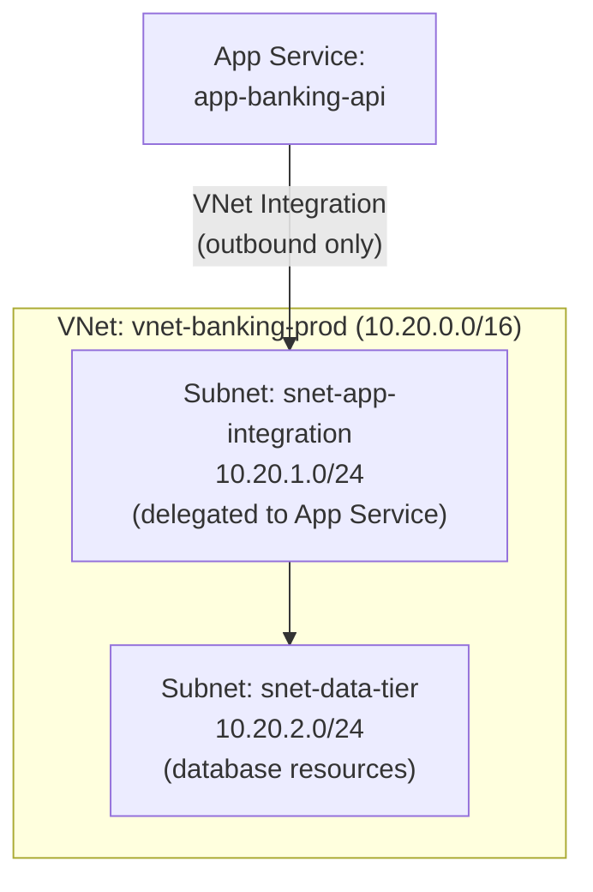
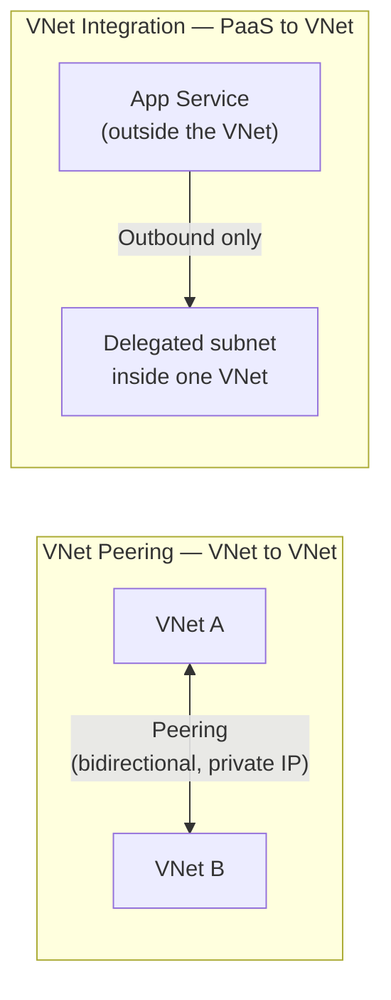

# Azure Virtual Networks

## Introduction

Before reading this lesson, you should already be comfortable with **[CI/CD for the Banking Sample App — Real-Time Example](../16-azure-for-dotnet-developers/16-59-cicd-for-banking-sample-app.md)**, including the fact that a pipeline's job ends the moment a new build lands on App Service. That pipeline says nothing about *how* the running app talks to the things it depends on — its database, its cache, its Key Vault — once it's live. Every lesson so far in this module has treated the network as invisible: an app calls `AddAzureKeyVault` or opens a SQL connection string and it just works, over the public internet, protected only by credentials and firewall rules on the target resource. This lesson opens the "Networking" sub-area of the module by introducing the layer that sits underneath all of that: the **Azure Virtual Network (VNet)**, Azure's software-defined private network, and the reason a banking application in particular usually can't stop at "protected by a password."

By the end of this lesson, you will be able to:

- Explain what an Azure Virtual Network (VNet) is and why it exists as an isolated, software-defined network boundary inside Azure
- Divide a VNet into subnets to segment resources by role or trust level
- Connect two separate VNets together using VNet peering
- Explain why App Service and Azure Functions need explicit "VNet integration" to reach resources that aren't publicly exposed
- Provision a VNet, a subnet, and a VNet-integrated App Service using the Azure CLI
- Place VNets correctly relative to the rest of this sub-area — Front Door, Load Balancer/Application Gateway, Private Endpoints, and Network Security Groups — each covered in the four lessons that follow

## Azure Virtual Networks — A Layman's Perspective

Picture a large office building shared by dozens of unrelated companies. Every company gets its own floor, and every floor is completely sealed off from every other floor by default — no shared hallways, no shared elevators, nothing. A company on floor 12 cannot simply walk down to floor 7 and knock on a door; as far as floor 12 is concerned, floor 7 might as well not exist, unless the building management explicitly runs a corridor between them. That sealed-off floor, leased to exactly one company, is a Virtual Network. Azure's underlying physical network hosts thousands of customers' virtual machines, databases, and app instances side by side, but a VNet guarantees that your company's floor is invisible and unreachable from every other tenant's floor, by default, with no configuration required to get that isolation — it's the starting condition, not something you have to earn.

Now picture that one company doesn't just get an empty floor — it gets to decide how to divide it up. Maybe the reception desk and the visitor lounge sit near the main entrance, where outsiders are allowed to walk in. Behind a second set of internal doors sits the open-plan area where most of the staff work. And behind a third, reinforced door — the one with a badge reader instead of a doorknob — sits the records room, where the company's most sensitive filing cabinets live, and where almost nobody ever needs to go in person. That's a **subnet**: a smaller, named region carved out of the VNet's overall floor plan, used to physically separate the resources that face outsiders from the resources that should never be reachable by anyone outside a very short list. A banking application typically ends up with at least three such subnets: one for anything public-facing, one for the application tier, and one — the most locked-down of all — for the database.

Two more everyday details complete the picture. First: what if two *different* companies, both tenants in the same building, decide they actually want to collaborate — say, a bank and its outsourced fraud-detection vendor, each on their own sealed floor? Building management can run a dedicated, private corridor connecting the two floors directly, visible to no one else in the building. Neither floor becomes any less sealed to everyone else; they've simply agreed to open one specific connection to each other. That direct corridor between two otherwise-isolated floors is **VNet peering**.

Second: a fully sealed floor is only useful if the company's own staff can actually get onto it. A managed, "serverless-feeling" service like App Service normally lives entirely outside this building, in its own shared, publicly reachable space — which is exactly why it's so convenient to deploy to, and exactly why, left alone, it has no way to walk into anyone's private floor. **VNet integration** is the badge that lets that outside App Service instance step through the building's front door and reach specific floors from the inside, without the building itself having to become any less sealed to the rest of the internet.

## Azure Virtual Networks — A Programming Language Perspective

An **Azure Virtual Network (VNet)** is a logically isolated, customer-defined IPv4/IPv6 address space within Azure, declared as an `Microsoft.Network/virtualNetworks` resource with a CIDR block (for example `10.20.0.0/16`). A VNet provides no traffic path to any other VNet or to the public internet by default; connectivity is always explicit. A VNet is subdivided into one or more **subnets** — smaller CIDR ranges carved out of the VNet's block, each an independent boundary for applying route tables, Network Security Groups (Lesson 64), and per-service delegation. **VNet peering** links two VNets' address spaces so resources in each can address resources in the other using private IPs, without traffic ever leaving Azure's backbone or traversing the public internet. **Regional VNet integration**, configured on an App Service or Function App via `az webapp vnet-integration add`, injects that PaaS instance's *outbound* traffic into a delegated subnet of a chosen VNet, so calls the app makes to VNet-only resources succeed — inbound requests to the app itself are unaffected by this setting.

## How to Create a VNet, Subnet, and VNet-Integrated App Service

Provisioning starts with the VNet's address space, then a delegated subnet for App Service integration, then the integration itself — three CLI commands that together give a publicly reachable web app a private path into resources that live inside the VNet.


*Figure 1: App Service sits outside the VNet by default; VNet integration routes its outbound calls into a delegated subnet, from which it can reach the data-tier subnet.*

```bash
# Azure CLI — create a VNet with two subnets
az network vnet create \
  --name vnet-banking-prod \
  --resource-group rg-banking-prod \
  --address-prefix 10.20.0.0/16 \
  --subnet-name snet-data-tier \
  --subnet-prefix 10.20.2.0/24

az network vnet subnet create \
  --name snet-app-integration \
  --vnet-name vnet-banking-prod \
  --resource-group rg-banking-prod \
  --address-prefix 10.20.1.0/24 \
  --delegations Microsoft.Web/serverFarms

# Wire the existing App Service into that delegated subnet
az webapp vnet-integration add \
  --name app-banking-api \
  --resource-group rg-banking-prod \
  --vnet vnet-banking-prod \
  --subnet snet-app-integration
```

**Azure CLI Output:**

```text
{
  "name": "vnet-banking-prod",
  "addressSpace": { "addressPrefixes": [ "10.20.0.0/16" ] },
  "subnets": [ { "name": "snet-data-tier", "addressPrefix": "10.20.2.0/24" } ]
}
{
  "name": "snet-app-integration",
  "addressPrefix": "10.20.1.0/24",
  "delegations": [ { "serviceName": "Microsoft.Web/serverFarms" } ]
}
{
  "vnetResourceId": "/subscriptions/.../virtualNetworks/vnet-banking-prod",
  "subnetResourceId": "/subscriptions/.../subnets/snet-app-integration"
}
```

```csharp
// NetworkTopologyCheck.cs — .NET 10 / C# 14
// A small operations console app that confirms a VNet's subnet layout using the
// Azure Resource Manager SDK for .NET — the kind of check a deployment pipeline
// might run right after provisioning, before promoting traffic to the app.
using Azure.Identity;
using Azure.ResourceManager;
using Azure.ResourceManager.Network;

ArmClient client = new(new DefaultAzureCredential());
SubscriptionResource subscription = await client.GetDefaultSubscriptionAsync();
ResourceGroupResource rg = await subscription.GetResourceGroupAsync("rg-banking-prod");
VirtualNetworkResource vnet = await rg.GetVirtualNetworkAsync("vnet-banking-prod");

Console.WriteLine($"VNet: {vnet.Data.Name} ({vnet.Data.AddressSpace.AddressPrefixes[0]})");
foreach (SubnetData subnet in vnet.Data.Subnets)
{
    bool isDelegated = subnet.Delegations.Count > 0;
    Console.WriteLine($"  Subnet: {subnet.Name,-24} {subnet.AddressPrefix,-14} delegated: {isDelegated}");
}
```

**Console Output:**

```text
VNet: vnet-banking-prod (10.20.0.0/16)
  Subnet: snet-data-tier          10.20.2.0/24   delegated: False
  Subnet: snet-app-integration    10.20.1.0/24   delegated: True
```

Nothing about `app-banking-api`'s own code changed to make any of this work — VNet integration is entirely infrastructure configuration. What changed is the *path* its outbound calls take: a connection string pointing at a database inside `snet-data-tier` now resolves and routes through the delegated subnet instead of failing (or succeeding only because that database was, until now, sitting on a public endpoint). The subnet delegation to `Microsoft.Web/serverFarms` is what tells Azure this subnet is reserved for App Service's use, distinct from the data-tier subnet reserved for storage-style resources.

## Real-Time Example: Segmenting the Banking Sample App's Network

We continue with the Banking/ATM sample app whose pipeline was covered in the previous lesson. Up to this point, `app-banking-api` reached its Azure SQL database (from Lesson 20) purely over its public endpoint, protected by SQL firewall rules and Entra ID authentication. That's adequate for a demo, but a real core-banking deployment segments its network into tiers first, so that even a leaked connection string can't be used to reach the database from an arbitrary internet host.

```csharp
// NetworkTierPlan.cs — .NET 10 / C# 14 — Real-Time Example (Banking/ATM)
public sealed record NetworkTier(string SubnetName, string Purpose, bool PubliclyReachable);

NetworkTier[] tiers =
[
    new("snet-app-integration", "App Service outbound path (app-banking-api)", PubliclyReachable: false),
    new("snet-data-tier",       "Azure SQL private endpoint (CoreBanking DB)", PubliclyReachable: false),
    new("snet-mgmt",            "Jump-box / bastion for operator access",       PubliclyReachable: false)
];

Console.WriteLine("vnet-banking-prod — network tier plan:");
foreach (NetworkTier t in tiers)
{
    Console.WriteLine($"  {t.SubnetName,-22} {t.Purpose,-46} public: {t.PubliclyReachable}");
}

int publiclyReachableTiers = tiers.Count(t => t.PubliclyReachable);
Console.WriteLine();
Console.WriteLine($"Subnets directly reachable from the public internet: {publiclyReachableTiers}");
```

**Console Output:**

```text
vnet-banking-prod — network tier plan:
  snet-app-integration  App Service outbound path (app-banking-api)   public: False
  snet-data-tier        Azure SQL private endpoint (CoreBanking DB)   public: False
  snet-mgmt             Jump-box / bastion for operator access        public: False

Subnets directly reachable from the public internet: 0
```

That zero matters for the same reason the zero in Lesson 33's Key Vault example mattered: it is the answer to a specific audit question, not a vague security goal. `app-banking-api` remains publicly reachable — customers still need to reach the API — but every *subnet inside the VNet* is closed off, including the one the database's private endpoint will live in once Lesson 63 wires that up. VNets and subnets are the container this whole sub-area builds inside; the next four lessons fill in how traffic gets routed to the front door (Lesson 61), balanced across regional backends (Lesson 62), reaches specific PaaS resources privately (Lesson 63), and gets filtered rule-by-rule (Lesson 64).

## VNet Peering vs VNet Integration

These two terms are easy to conflate because both involve "connecting a VNet to something," but they solve different problems. **VNet peering** connects two *VNets* to each other, bidirectionally, so resources on both sides can reach each other by private IP — useful when a bank's core VNet needs to talk to a separate VNet owned by, say, a shared services team, or when a hub-and-spoke topology links multiple application VNets to a central hub. **VNet integration** connects a single *regional PaaS service* — App Service or Functions — to one VNet, one-way, so that service's own outbound calls can reach into that VNet; it does not connect two VNets together, and it does not affect inbound traffic to the app at all.


*Figure 2: Peering links two VNets to each other; VNet integration links one PaaS service's outbound path into one VNet.*

| Aspect | VNet Peering | VNet Integration |
|---|---|---|
| What it connects | Two Virtual Networks | One App Service/Functions app to one VNet |
| Direction | Bidirectional | Outbound only, from the app into the VNet |
| Affects inbound traffic to the app? | N/A | No — inbound is unchanged |
| Typical use case | Hub-and-spoke topologies, cross-team VNets | Letting App Service reach a private database, cache, or Key Vault |
| Where it's configured | On each VNet resource | On the App Service/Functions resource |

## Types of VNet-Related Concepts in Azure

VNets are the foundation the rest of this sub-area sits on top of:

1. **Subnets** — the smaller address ranges within a VNet used to segment resources by role, covered above and referenced throughout Lessons 61-64.
2. **VNet Peering** — direct, private connectivity between two VNets, contrasted with VNet integration above.
3. **[Azure Front Door and CDN](../16-azure-for-dotnet-developers/16-61-azure-front-door-and-cdn.md)** — the global entry point that sits in front of VNet-hosted regional backends, covered next.
4. **[Load Balancer vs Application Gateway](../16-azure-for-dotnet-developers/16-62-load-balancer-vs-app-gateway.md)** — the regional traffic-distribution layer that lives inside a VNet.
5. **[Private Endpoints](../16-azure-for-dotnet-developers/16-63-private-endpoints.md)** — how a PaaS resource itself gets a private IP inside a VNet's subnet.
6. **[Network Security Groups](../16-azure-for-dotnet-developers/16-64-network-security-groups.md)** — the rule-based firewall applied at the subnet or NIC level within a VNet.

## What You've Learned & What's Next

A Virtual Network is Azure's software-defined, isolated private network — sealed off from every other tenant by default — subdivided into subnets to separate resources by trust level, connected to other VNets via peering, and reachable by App Service or Functions only once those services are explicitly VNet-integrated. Every remaining lesson in this Networking sub-area assumes a VNet like `vnet-banking-prod` already exists as the container everything else attaches to.

Continue your learning journey with **[Azure Front Door and CDN](../16-azure-for-dotnet-developers/16-61-azure-front-door-and-cdn.md)**, where we move up a layer to the global entry point that routes users to the nearest healthy regional backend and caches static content at the edge.

---
*Applies to: .NET 10 / C# 14. Last reviewed 2026-08-16.*
