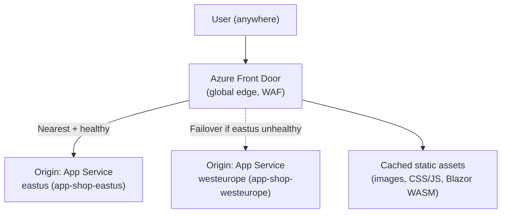
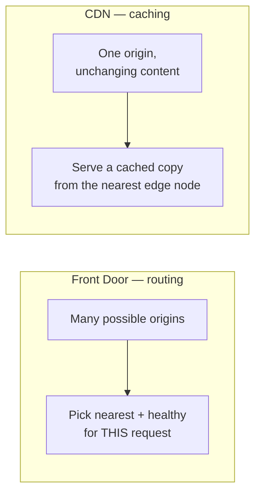

# Azure Front Door and CDN

## Introduction

Before reading this lesson, you should already be comfortable with **[Azure Virtual Networks](../16-azure-for-dotnet-developers/16-60-azure-virtual-networks.md)**, including the fact that a VNet is fundamentally a *regional* construct — `vnet-banking-prod` lives in one Azure region, with its own address space and subnets. That's the right scope for segmenting one deployment's internal traffic, but it says nothing about a much more common real-world requirement: a single application deployed to *several* regions at once, so that a customer in Sydney and a customer in Dublin both get a fast response from a nearby copy of the app, and so that losing one entire region doesn't take the application down. This lesson introduces the layer that sits above every region's VNet: **Azure Front Door**, Azure's global entry point, alongside **Azure CDN**, its companion service for caching static content at the network edge.

By the end of this lesson, you will be able to:

- Explain what Azure Front Door does as a global Layer 7 entry point, distinct from anything running inside a single region's VNet
- Describe how Front Door routes each user to the closest healthy backend region and removes an unhealthy region from rotation automatically
- Explain Front Door's built-in Web Application Firewall (WAF) capability
- Explain what a CDN caches, why it caches at edge locations close to users, and how that applies to static assets and published Blazor WebAssembly apps
- Judge when a global-scale deployment actually needs Front Door/CDN versus when a single-region deployment is the right call
- Provision a Front Door profile with two backend origins using the Azure CLI

## Azure Front Door and CDN — A Layman's Perspective

Imagine a nationwide pizza chain with three regional distribution kitchens — one on the west coast, one in the middle of the country, one on the east coast. A customer calling the chain's single national phone number has no idea which kitchen exists, doesn't need to know, and shouldn't have to guess. Behind that one phone number sits a dispatcher whose entire job is routing: the dispatcher knows which kitchen is geographically closest to the caller, checks whether that kitchen is actually open and taking orders right now, and sends the call there — automatically rerouting to the next-closest kitchen the instant the nearest one reports it's overwhelmed or shut its ovens off entirely. The customer dials one number and always reaches *a* working kitchen; which one changes transparently behind the scenes. That dispatcher is **Azure Front Door** — a single global front-door address for an application that may actually be running as several independent regional deployments, routing each caller to whichever one is both nearest and currently healthy.

That same dispatcher does one more job well beyond call routing: security screening. Before connecting any call, they can hang up immediately on obvious prank calls, known harassment numbers, or callers clearly trying to flood the line to jam it up for everyone else — all without ever bothering a single kitchen with that traffic. That's Front Door's **Web Application Firewall (WAF)** capability: malicious or malformed requests get rejected at the global edge, before they ever reach a regional backend at all.

Now picture something unrelated to phone calls entirely: that same pizza chain's promotional flyer, showing the same photo of a pepperoni pizza, needs to be handed out at thousands of street corners nationwide. It would be absurd to print every single flyer at the west-coast kitchen and ship it individually to every street corner on the east coast — the printing plant should instead produce copies locally, at print shops already near each street corner, so a corner in Boston gets its flyer from a nearby Boston print shop rather than waiting on a truck from California. A **CDN (Content Delivery Network)** does exactly that for a website's static files: images, stylesheets, and JavaScript bundles get copied out to edge locations positioned close to actual users all over the world, so a browser in Tokyo downloads a product photo from a nearby edge copy instead of crossing an ocean to fetch the original file from wherever the app happens to be hosted.

The distinction that matters: Front Door decides *which distribution kitchen answers the call* — it's about routing dynamic requests to a live backend. A CDN decides *where the flyer gets printed* — it's about caching content that doesn't change on every request. Many real deployments use both together, and Front Door itself includes CDN-style caching for exactly this reason, but they solve genuinely different problems, which is why the comparison later in this lesson treats them as a pairing rather than one blended feature.

## Azure Front Door and CDN — A Programming Language Perspective

**Azure Front Door** is a global, Anycast-based Layer 7 (HTTP/HTTPS) service that terminates a user's connection at the nearest Microsoft edge point of presence, then routes the request to one of several configured **origins** — typically regional App Service instances, Application Gateways, or storage accounts — using latency-based routing and continuous health probes, automatically excluding an origin that fails its health checks. Front Door is configured as origin groups and routing rules against a `Microsoft.Cdn/profiles` (Front Door Standard/Premium) resource, and optionally attaches a managed or custom **WAF policy** that evaluates OWASP-style rule sets against every request before it reaches an origin. **Azure CDN** — either as a standalone `Microsoft.Cdn` profile or as Front Door's built-in caching behavior — caches responses at edge nodes according to `Cache-Control` headers and query-string caching rules, so subsequent requests for the same static resource are served from an edge node instead of the origin. Neither service is a C# API surface directly; from application code, the relevant difference is entirely in DNS and routing configuration, and in setting correct caching headers on static content.

## How to Provision Front Door with Two Regional Origins

A minimal Front Door setup names a profile, groups the regional backends as an origin group with health probes, and adds a routing rule pointing the profile's public endpoint at that group.


*Figure 1: Front Door probes both regional origins and routes each request to the nearest healthy one, while serving cacheable static content from the edge.*

```bash
# Azure CLI — create a Front Door profile with two regional origins
az afd profile create \
  --profile-name fd-shop-global \
  --resource-group rg-shop-prod \
  --sku Standard_AzureFrontDoor

az afd endpoint create \
  --endpoint-name shop-global \
  --profile-name fd-shop-global \
  --resource-group rg-shop-prod

az afd origin-group create \
  --origin-group-name og-shop-api \
  --profile-name fd-shop-global \
  --resource-group rg-shop-prod \
  --probe-request-type GET --probe-path "/health" --probe-interval-in-seconds 30

az afd origin create \
  --origin-name origin-eastus \
  --origin-group-name og-shop-api \
  --profile-name fd-shop-global \
  --resource-group rg-shop-prod \
  --host-name app-shop-eastus.azurewebsites.net --priority 1 --weight 1000
```

**Azure CLI Output:**

```text
{
  "name": "fd-shop-global",
  "sku": { "name": "Standard_AzureFrontDoor" },
  "provisioningState": "Succeeded"
}
{
  "name": "shop-global",
  "hostName": "shop-global-abc123.z01.azurefd.net"
}
{
  "name": "og-shop-api",
  "healthProbeSettings": { "probePath": "/health", "probeIntervalInSeconds": 30 }
}
{
  "name": "origin-eastus",
  "hostName": "app-shop-eastus.azurewebsites.net",
  "priority": 1,
  "weight": 1000
}
```

```csharp
// StoreHealthEndpoint.cs — .NET 10 / C# 14
// The /health endpoint Front Door's probe polls every 30 seconds — a simple,
// cheap check any regional origin exposes so Front Door knows whether to
// keep routing traffic to it.
var builder = WebApplication.CreateBuilder(args);
var app = builder.Build();

app.MapGet("/health", (IConfiguration config) =>
{
    string region = config["DeploymentRegion"] ?? "unknown";
    return Results.Ok(new { status = "Healthy", region, checkedAtUtc = DateTimeOffset.UtcNow });
});

app.Run();
```

**Console Output (Front Door probe log, one cycle):**

```text
[Front Door] Probing origin-eastus (app-shop-eastus.azurewebsites.net/health)... 200 OK, 42ms
[Front Door] Probing origin-westeurope (app-shop-westeurope.azurewebsites.net/health)... 200 OK, 118ms
[Front Door] Routing decision for request from Sydney: origin-eastus (lower latency + healthy)
```

Neither region's application code has any idea Front Door exists — each origin just answers an ordinary health-check request, exactly as any load-balanced backend would. The intelligence lives entirely in Front Door's global configuration: which origins exist, how often to probe them, and which one currently wins the routing decision for a given user's location and each origin's live health state.

## Real-Time Example: Global Storefront Assets for the E-Commerce Sample App

We continue building on the E-Commerce Order Processing case study's storefront, whose product catalog images and published storefront UI have, until now, been served from a single region. As the store expands to customers in Europe and Asia, product images loading from a single US-based origin start dominating page-load time for those customers — exactly the problem a CDN exists to solve, independent of anything Front Door's routing does for the API itself.

```csharp
// StorefrontAssetPlan.cs — .NET 10 / C# 14 — Real-Time Example (E-Commerce)
public sealed record StaticAsset(string Path, string ContentType, bool CdnCached, string CacheControl);

StaticAsset[] assets =
[
    new("/images/products/sku-1042-front.jpg", "image/jpeg", CdnCached: true,  CacheControl: "public, max-age=604800"),
    new("/css/storefront.min.css",              "text/css",   CdnCached: true,  CacheControl: "public, max-age=604800"),
    new("/_framework/blazor.boot.json",         "application/json", CdnCached: true, CacheControl: "public, max-age=86400"),
    new("/api/orders/checkout",                 "application/json", CdnCached: false, CacheControl: "no-store")
];

Console.WriteLine("shop-cdn.azureedge.net — asset caching plan:");
foreach (StaticAsset a in assets)
{
    Console.WriteLine($"  {a.Path,-40} cached: {a.CdnCached,-6} {a.CacheControl}");
}

int cachedCount = assets.Count(a => a.CdnCached);
Console.WriteLine();
Console.WriteLine($"Assets served from the edge instead of origin: {cachedCount} of {assets.Length}");
```

**Console Output:**

```text
shop-cdn.azureedge.net — asset caching plan:
  /images/products/sku-1042-front.jpg     cached: True   public, max-age=604800
  /css/storefront.min.css                 cached: True   public, max-age=604800
  /_framework/blazor.boot.json            cached: True   public, max-age=86400
  /api/orders/checkout                    cached: False  no-store

Assets served from the edge instead of origin: 3 of 4
```

The rule the plan makes explicit — cache product photos and the published Blazor WASM bundle, never cache the checkout call — is the entire design decision a CDN requires: content is only safe to serve from an edge cache if it's the same for every user and doesn't need to be fresh on every request. `sku-1042-front.jpg` is identical for every shopper worldwide; a `checkout` POST is never safe to cache regardless of headers. Once the storefront's static assets and the Module 15 published Blazor WASM app are both fronted by a CDN, a shopper in Tokyo loads product images and the WASM bundle from a nearby edge node in milliseconds, while every order still travels all the way to the origin API where it belongs.

## Azure Front Door vs Azure CDN

Front Door and CDN are frequently bundled in people's minds because Front Door Standard/Premium includes CDN-style caching as one of its features, but they answer different questions. **Front Door** is fundamentally about *routing* — which of several live regional backends should handle this dynamic request right now, plus WAF filtering at the edge. **CDN** is fundamentally about *caching* — serving a copy of unchanging content from a location physically close to the requester, with no backend routing decision involved because there's typically only one origin for the content in the first place. A single-region app with no global customer base generally needs neither: Front Door's global routing has nothing to route *to* with only one region, and a CDN's benefit shrinks to nothing if most users are already close to the one origin.


*Figure 2: Front Door chooses among multiple live backends per request; a CDN serves a static copy of one origin's content from a nearby cache.*

| Aspect | Azure Front Door | Azure CDN |
|---|---|---|
| Primary job | Global routing across regional origins + WAF | Edge caching of static content |
| Works with dynamic content? | Yes — that's its main purpose | No — only effective for cacheable, unchanging content |
| Needs multiple backend regions? | Yes, to have anything to route between | No — works even with a single origin |
| Failover on region outage | Yes, via health probes | Not applicable — no backend routing decision |
| When a single-region app needs it | Rarely — little to route between | Often — even one region benefits from edge caching for distant users |

## Types of Global Delivery Concepts in Azure

Front Door and CDN are the two most common tools for global-scale delivery, alongside a few related concepts:

1. **Origin Groups** — the set of backend regions Front Door routes across, with their own health-probe configuration, covered in the How-To section above.
2. **WAF Policies** — managed or custom rule sets Front Door evaluates before forwarding a request to any origin.
3. **[Load Balancer vs Application Gateway](../16-azure-for-dotnet-developers/16-62-load-balancer-vs-app-gateway.md)** — the *regional* traffic-distribution layer Front Door sits above, covered next.
4. **[Publishing a Blazor App](../15-containers-blazor-maui/15-16-publishing-a-blazor-app.md)** — produces the static WebAssembly bundle this lesson's CDN example caches at the edge.
5. **[Private Endpoints](../16-azure-for-dotnet-developers/16-63-private-endpoints.md)** — how a Front Door origin can reach a backend privately instead of over its public endpoint.
6. **Azure Traffic Manager** — an older, DNS-level (rather than HTTP-level) global routing service that predates Front Door's more capable Layer 7 approach.

## What You've Learned & What's Next

Azure Front Door is the global, Layer 7 entry point that routes each request to the nearest healthy regional backend and filters malicious traffic through its WAF, while Azure CDN caches unchanging static content — images, stylesheets, and published Blazor WASM bundles among them — at edge locations close to users. Both operate above the level of a single region's VNet, and a genuinely single-region deployment often needs neither.

Continue your learning journey with **[Load Balancer vs Application Gateway](../16-azure-for-dotnet-developers/16-62-load-balancer-vs-app-gateway.md)**, where we drop down from this global layer into the regional traffic-distribution tools Front Door's origins actually route to.

---
*Applies to: .NET 10 / C# 14. Last reviewed 2026-08-16.*
