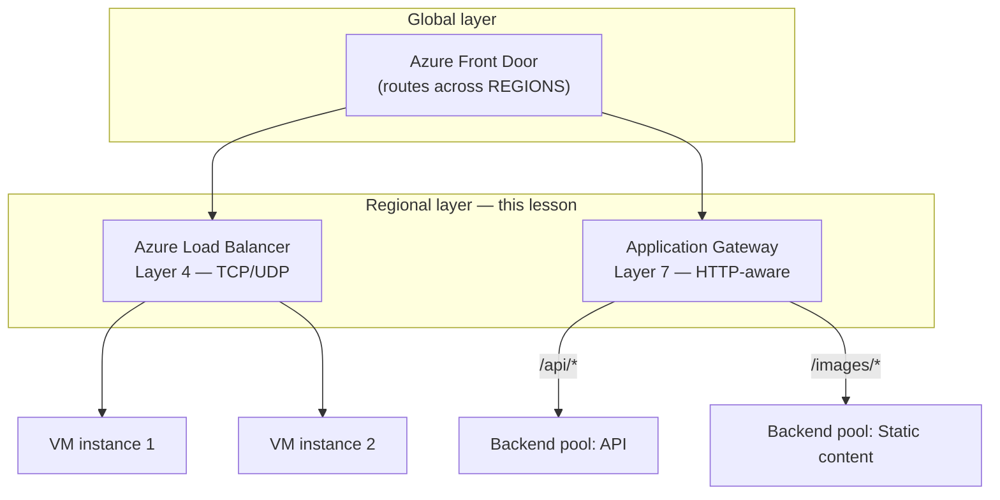
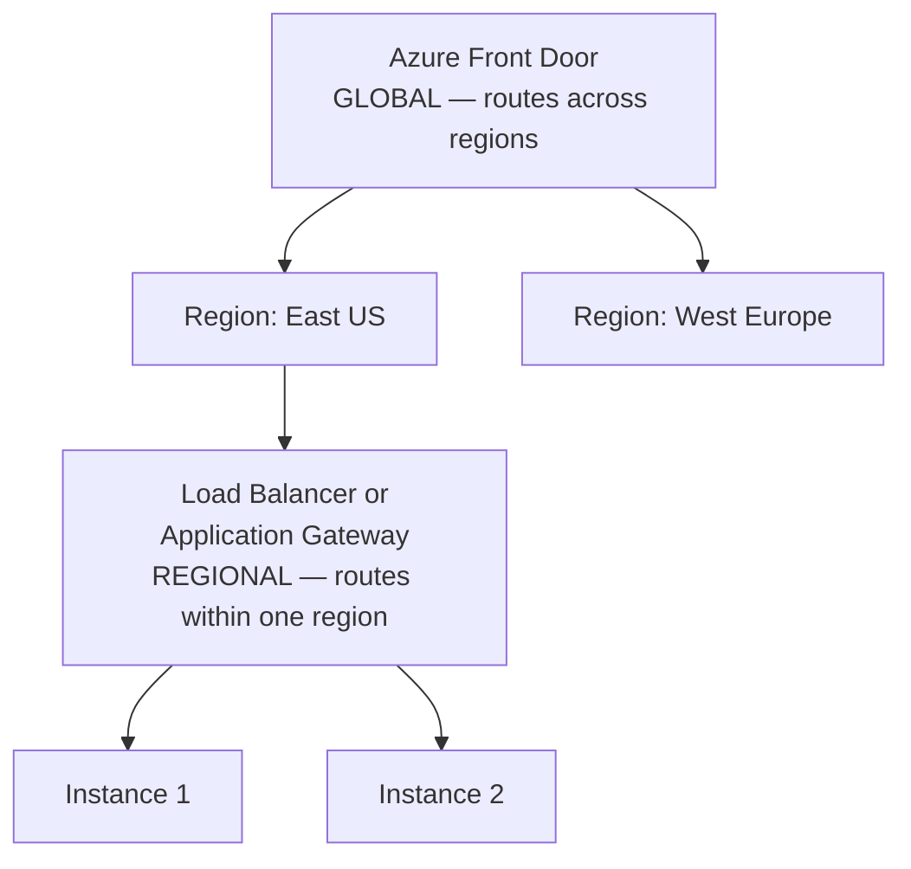

# Load Balancer vs Application Gateway

## Introduction

Before reading this lesson, you should already be comfortable with **[Azure Front Door and CDN](../16-azure-for-dotnet-developers/16-61-azure-front-door-and-cdn.md)**, including the fact that Front Door operates *globally*, deciding which entire region should handle a request. That's the wrong tool for a much more local problem: once a request has already arrived at, say, the East US region, something still has to spread that traffic across the several identical VM or container instances actually running the application *within* that one region. This lesson covers the two Azure services that do exactly that job — **Azure Load Balancer** and **Azure Application Gateway** — and, because choosing correctly between them is the single most common networking decision a .NET team makes, this lesson's comparison section is the main event rather than a closing summary.

By the end of this lesson, you will be able to:

- Explain what Azure Load Balancer does at Layer 4 (transport level) and why that makes it fast and protocol-agnostic
- Explain what Application Gateway does at Layer 7 (application level) and why understanding HTTP unlocks path-based routing, SSL termination, and WAF filtering
- Choose the right tool for a given regional traffic-distribution scenario
- Place Front Door, Load Balancer, and Application Gateway correctly relative to each other — one global layer above two regional layers
- Provision both a Load Balancer and an Application Gateway using the Azure CLI

## Load Balancer vs Application Gateway — A Layman's Perspective

Picture a busy toll plaza on a highway with six identical booths, all leading to the exact same road beyond them. The attendant directing traffic at the entrance doesn't care what kind of vehicle is coming, doesn't read anyone's destination, and doesn't open the trunk to see what's inside — they just glance at which booth currently has the shortest line and wave the next car toward it. That's the entire job, done extremely fast, for every single vehicle regardless of what it's carrying. That indifferent, lightning-fast traffic cop is **Azure Load Balancer**: it distributes incoming connections across a set of backend instances based purely on connection-level information — source, destination, port — with zero interest in what's actually inside the traffic. It works identically well for a TCP database connection, a UDP game server packet, or an HTTP request, precisely because it never looks past the envelope.

Now picture something different: a large hospital's front desk, where the person greeting visitors actually reads each visitor's stated purpose before deciding where to send them. Someone asking for the pharmacy gets pointed to Wing A. Someone here for a scheduled MRI gets pointed to Wing C. Someone who looks like a walk-in emergency gets flagged and rushed to a completely different door entirely, bypassing the normal queue. This front-desk attendant is doing something categorically more involved than the toll-booth cop — they're reading content, not just glancing at a license plate — and that's exactly what **Application Gateway** does with HTTP traffic: it reads the actual request — its URL path, its headers, its cookies — and routes intelligently based on what it finds. `/api/*` goes to one backend pool, `/images/*` goes to another; a request arriving in plain, unencrypted form can be decrypted right at the front desk (SSL termination) so that the backend rooms deeper in the building never have to do that decryption work themselves; and a visitor exhibiting obviously malicious behavior can be turned away right at the desk by a built-in Web Application Firewall, the same protective idea Front Door applies at the *global* front door, now applied at the regional one.

The trade-off follows directly from that difference in job description. The toll-booth cop, doing almost nothing per car, can wave through an enormous volume of traffic with almost no added delay — that's Load Balancer's strength, and it works for literally any TCP/UDP-based protocol, not just HTTP. The hospital front desk, actually reading and understanding each visitor's request, necessarily takes a little more time per visitor and only really makes sense for visitors speaking a language it understands — HTTP and HTTPS specifically. Neither approach is strictly better; they're built for different jobs, and plenty of real deployments run both, layered, wherever some traffic needs simple fast distribution and other traffic needs smart, content-aware routing.

## Load Balancer vs Application Gateway — A Programming Language Perspective

**Azure Load Balancer** operates at OSI Layer 4 (transport), distributing inbound TCP/UDP flows across a backend pool of VM instances or virtual machine scale set members using a hashing algorithm over source/destination IP and port, with no inspection of payload content — it is provisioned as a `Microsoft.Network/loadBalancers` resource with a frontend IP configuration, a backend pool, health probes, and load-balancing rules. **Azure Application Gateway** operates at OSI Layer 7 (application), terminating and parsing HTTP/HTTPS itself, and is provisioned as a `Microsoft.Network/applicationGateways` resource whose configuration includes **listeners** (what to accept), **URL path-based routing rules** (where to send it based on the request path), **backend HTTP settings** (how to talk to the chosen backend, including SSL re-encryption), and an optional attached WAF policy using the same rule-set family Front Door uses at the global tier. Both are strictly *regional* resources — neither has any concept of routing across Azure regions, which remains Front Door's job from the previous lesson.

## How to Provision a Load Balancer and an Application Gateway

Both services need a backend pool of instances to route to; the meaningful difference shows up in how each one is told *how* to route.


*Figure 1: Front Door routes across regions; within a region, Load Balancer and Application Gateway each distribute traffic differently across that region's own backend instances.*

```bash
# Azure CLI — a basic internal Load Balancer across two VM instances
az network lb create \
  --name lb-catalog-internal \
  --resource-group rg-library-prod \
  --backend-pool-name pool-catalog-vms \
  --frontend-ip-name feip-catalog --private-ip-address 10.30.2.10

# Azure CLI — an Application Gateway with a path-based routing rule
az network application-gateway create \
  --name agw-library-web \
  --resource-group rg-library-prod \
  --sku Standard_v2 \
  --public-ip-address pip-agw-library \
  --servers 10.30.1.10 10.30.1.11
```

**Azure CLI Output:**

```text
{
  "name": "lb-catalog-internal",
  "sku": { "name": "Standard" },
  "frontendIPConfigurations": [ { "privateIPAddress": "10.30.2.10" } ]
}
{
  "name": "agw-library-web",
  "sku": { "name": "Standard_v2" },
  "operationalState": "Running",
  "frontendIPConfigurations": [ { "publicIPAddress": "pip-agw-library" } ]
}
```

```csharp
// BackendHealthReporter.cs — .NET 10 / C# 14
// A minimal API each backend instance exposes so either service's health probe
// can decide whether to keep sending it traffic — the same shape regardless of
// which routing layer is calling it.
var builder = WebApplication.CreateBuilder(args);
var app = builder.Build();

app.MapGet("/health", () => Results.Ok(new { status = "Healthy", host = Environment.MachineName }));

app.Run();
```

**Console Output (Application Gateway backend health check):**

```text
$ az network application-gateway show-backend-health --name agw-library-web --resource-group rg-library-prod
BackendAddressPool: pool-catalog-web
  10.30.1.10  -> Healthy  (200 OK, /health)
  10.30.1.11  -> Healthy  (200 OK, /health)
```

Both services probed the exact same `/health` endpoint, but for entirely different reasons: Load Balancer's probe decides which instances stay in the connection-hashing rotation with no idea what protocol rides on top; Application Gateway's probe feeds into a routing decision that also depends on the request's URL path, which Load Balancer never inspects.

## Real-Time Example: Splitting Traffic for the Library Catalog System

We continue building on the Library/Inventory Management case study's catalog system, which exposes both a public web front end for patrons browsing the catalog and an internal book-scanning service used by staff at circulation desks to check items in and out. These two workloads have genuinely different traffic-distribution needs, which makes the choice between the two services concrete rather than theoretical.

```csharp
// TrafficDistributionPlan.cs — .NET 10 / C# 14 — Real-Time Example (Library/Inventory)
public sealed record Workload(string Name, string Protocol, bool NeedsPathRouting, string RecommendedService);

Workload[] workloads =
[
    new("Patron catalog web app",     "HTTPS", NeedsPathRouting: true,  RecommendedService: "Application Gateway"),
    new("Staff barcode scanner feed", "TCP (custom)", NeedsPathRouting: false, RecommendedService: "Load Balancer"),
    new("Internal SQL read replicas", "TCP (SQL)", NeedsPathRouting: false, RecommendedService: "Load Balancer")
];

Console.WriteLine("rg-library-prod — regional traffic distribution plan:");
foreach (Workload w in workloads)
{
    Console.WriteLine($"  {w.Name,-30} {w.Protocol,-14} path-routing needed: {w.NeedsPathRouting,-5} -> {w.RecommendedService}");
}
```

**Console Output:**

```text
rg-library-prod — regional traffic distribution plan:
  Patron catalog web app        HTTPS          path-routing needed: True  -> Application Gateway
  Staff barcode scanner feed    TCP (custom)   path-routing needed: False -> Load Balancer
  Internal SQL read replicas    TCP (SQL)      path-routing needed: False -> Load Balancer

The patron web app splits /catalog/* and /images/* across separate backend pools via agw-library-web.
The barcode scanner feed is a raw TCP protocol Application Gateway cannot parse at all, so lb-catalog-internal handles it.
```

The barcode scanner feed is the deciding detail: it isn't HTTP, so Application Gateway has no content to read and no path to route on — Load Balancer's protocol-agnostic Layer 4 distribution is not just adequate here, it's the *only* option of the two that works at all. The patron-facing web app, by contrast, benefits from exactly the HTTP-aware features Load Balancer can't provide: routing catalog pages and cover-image requests to different backend pools, and terminating SSL once at the gateway instead of on every backend VM.

## Load Balancer vs Application Gateway vs Front Door — The Full Picture

With both regional services now covered, the complete three-tier picture from this lesson and the last resolves cleanly by layer and scope.


*Figure 2: Front Door is the single global layer; Load Balancer and Application Gateway are both regional layers, chosen per workload rather than layered on top of each other by default.*

| Aspect | Azure Load Balancer | Application Gateway | Azure Front Door (previous lesson) |
|---|---|---|---|
| OSI layer | 4 (Transport) | 7 (Application/HTTP) | 7 (Application/HTTP) |
| Scope | Regional | Regional | Global |
| Protocol awareness | None — any TCP/UDP | HTTP/HTTPS only | HTTP/HTTPS only |
| Routing basis | Source/dest IP + port hash | URL path, headers, host | Latency + backend region health |
| SSL termination | No | Yes | Yes |
| WAF capability | No | Yes | Yes |
| Typical use case | Raw TCP/UDP, non-HTTP workloads | Path-based HTTP routing within a region | Cross-region routing and failover |

## Types of Regional Traffic Distribution in Azure

Load Balancer and Application Gateway cover most regional scenarios, with a few related variants worth knowing by name:

1. **Azure Load Balancer (Internal)** — the private-IP variant used above for the barcode scanner feed, never exposed to the public internet.
2. **Azure Load Balancer (Public)** — the public-IP variant, used when raw TCP/UDP traffic must be reachable directly from outside Azure.
3. **Application Gateway with WAF** — the SKU tier that adds the same managed rule sets Front Door uses, applied regionally instead of globally.
4. **[Private Endpoints](../16-azure-for-dotnet-developers/16-63-private-endpoints.md)** — how a backend pool member can itself be reached privately rather than over a public address, covered next.
5. **[Network Security Groups](../16-azure-for-dotnet-developers/16-64-network-security-groups.md)** — the rule-based filter that still applies to traffic after either service has routed it.
6. **[Azure Front Door and CDN](../16-azure-for-dotnet-developers/16-61-azure-front-door-and-cdn.md)** — the global layer these two regional services sit underneath.

## What You've Learned & What's Next

Azure Load Balancer distributes any TCP/UDP traffic across a region's backend instances at Layer 4, fast and protocol-agnostic but blind to content; Application Gateway understands HTTP at Layer 7, enabling path-based routing, SSL termination, and WAF filtering at the cost of only working for HTTP/HTTPS. Both are regional tools that sit directly beneath the global routing layer Front Door provides.

Continue your learning journey with **[Private Endpoints](../16-azure-for-dotnet-developers/16-63-private-endpoints.md)**, where a backend resource itself — not just the traffic in front of it — gets pulled entirely inside the VNet, eliminating its public exposure altogether.

---
*Applies to: .NET 10 / C# 14. Last reviewed 2026-08-16.*
