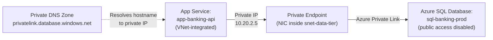
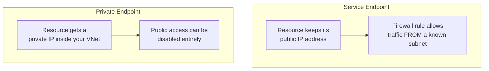

# Private Endpoints

## Introduction

Before reading this lesson, you should already be comfortable with **[Load Balancer vs Application Gateway](../16-azure-for-dotnet-developers/16-62-load-balancer-vs-app-gateway.md)**, including the fact that both of those services route traffic that has already arrived somewhere on a public or semi-public address. Neither one changes a more fundamental fact about most Azure PaaS services: an Azure SQL Database, a Key Vault, or a Storage Account normally lives on its *own* public endpoint by default, reachable in principle from anywhere on the internet and protected only by whatever firewall rules and credentials are layered on top. Lesson 60 sealed off a VNet's subnets from the outside world; this lesson closes the last gap in that story by pulling the PaaS resource itself — not just your own compute — physically inside the VNet, using **Private Endpoints**.

By the end of this lesson, you will be able to:

- Explain what a Private Endpoint is and how it gives an Azure PaaS resource a private IP address inside your own VNet
- Explain why a Private Endpoint eliminates public internet exposure entirely, rather than just restricting it
- Contrast Private Endpoints with the older, lighter-weight Service Endpoints model
- Provision a Private Endpoint for an Azure SQL Database using the Azure CLI
- Apply Private Endpoints to lock down the Banking/ATM sample app's database so it is reachable only from within its VNet

## Private Endpoints — A Layman's Perspective

Return to the sealed-floor office building from Lesson 60. Sealing off your company's floor from every other tenant solves the *inside-the-building* problem, but it does nothing about a service your company depends on that happens to be headquartered somewhere else entirely — say, a specialized records-storage vendor located across town, in its own separate building with its own public street address and its own front desk that, by default, anyone who knows the address can walk up to and ring the bell at. Your company reaches that vendor's public address every time it needs a record, protected only by whatever ID checks the vendor's front desk performs on arrival.

A **Private Endpoint** is what happens when that vendor agrees to install a dedicated, private door directly inside *your* company's own sealed floor — not a copy of their building, the actual working connection to their specific records-storage service, just accessible from a door inside your own space instead of from their public street address. Once that door exists, your street address for the vendor's public building can be shut down entirely — bricked over — because nobody inside your company ever needed to use it again anyway. The vendor's service hasn't moved and hasn't been duplicated; it's still the exact same records-storage vendor. What's changed is that the only way to reach it now is by already being inside your building, on your sealed floor.

This is a meaningfully different guarantee than simply telling the vendor's front desk "only let people in who show ID from these approved companies." That's a real security measure, and a useful one, but the vendor's public street address still physically exists, still accepts foot traffic from anyone, and still depends entirely on the front desk correctly checking every single ID, every single time, forever. A Private Endpoint doesn't add a stricter checkpoint at a still-public door — it removes the public door from existence, replacing it with a private one that literally cannot be reached except by walking through your own sealed building first. For a bank's core database in particular, the difference between "publicly reachable, but well-guarded" and "not publicly reachable at all" is frequently the difference between a compliance checkbox that raises follow-up questions and one that simply doesn't.

The lighter-weight alternative — checking ID at a still-public door — is exactly what this lesson's comparison section covers under the name **Service Endpoints**: a real improvement over no restriction at all, but categorically different from actually removing the public door.

## Private Endpoints — A Programming Language Perspective

A **Private Endpoint** is a `Microsoft.Network/privateEndpoints` resource that provisions a network interface with a private IP address, drawn from a subnet inside your VNet, and binds that NIC to a specific instance of a supported PaaS resource — an Azure SQL Database, Key Vault, Storage Account, or Cosmos DB account among many others — via **Azure Private Link**. DNS resolution for the resource's normal fully-qualified name (for example `sql-banking-prod.database.windows.net`) is redirected, via a **Private DNS Zone** linked to the VNet, to that private IP instead of the resource's public IP, so client code and connection strings require no changes at all — only the network path changes. Once a Private Endpoint exists, the resource's public network access can be disabled entirely via its `publicNetworkAccess` property, at which point the resource is unreachable by any path except through the VNet(s) holding an approved Private Endpoint connection.

## How to Provision a Private Endpoint for Azure SQL Database

Creating a Private Endpoint involves the target resource, the subnet it lands in, and a Private DNS Zone so existing connection strings keep resolving correctly without any code change.


*Figure 1: The Private Endpoint's NIC sits inside the data-tier subnet; a Private DNS Zone silently redirects the database's normal hostname to that private IP.*

```bash
# Azure CLI — create a Private Endpoint for the banking SQL Database
az network private-endpoint create \
  --name pe-sql-banking-prod \
  --resource-group rg-banking-prod \
  --vnet-name vnet-banking-prod \
  --subnet snet-data-tier \
  --private-connection-resource-id "/subscriptions/.../servers/sql-banking-prod" \
  --group-id sqlServer \
  --connection-name sql-banking-connection

# Link a Private DNS Zone so the existing connection string keeps resolving correctly
az network private-dns zone create \
  --name privatelink.database.windows.net \
  --resource-group rg-banking-prod

az network private-dns link vnet create \
  --resource-group rg-banking-prod \
  --zone-name privatelink.database.windows.net \
  --name link-banking-vnet \
  --virtual-network vnet-banking-prod \
  --registration-enabled false

# Disable the database's public endpoint entirely
az sql server update \
  --name sql-banking-prod \
  --resource-group rg-banking-prod \
  --set publicNetworkAccess=Disabled
```

**Azure CLI Output:**

```text
{
  "name": "pe-sql-banking-prod",
  "privateLinkServiceConnections": [ { "privateLinkServiceConnectionState": { "status": "Approved" } } ],
  "customDnsConfigs": [ { "fqdn": "sql-banking-prod.database.windows.net", "ipAddresses": [ "10.20.2.5" ] } ]
}
{
  "name": "sql-banking-prod",
  "publicNetworkAccess": "Disabled"
}
```

```csharp
// PrivateConnectivityCheck.cs — .NET 10 / C# 14
using System.Net;

string hostname = "sql-banking-prod.database.windows.net";
IPAddress[] resolved = await Dns.GetHostAddressesAsync(hostname);

Console.WriteLine($"Resolving {hostname} from inside vnet-banking-prod:");
foreach (IPAddress ip in resolved)
{
    bool isPrivate = ip.ToString().StartsWith("10.");
    Console.WriteLine($"  {ip}  (private range: {isPrivate})");
}
```

**Console Output (run from a VM inside vnet-banking-prod):**

```text
Resolving sql-banking-prod.database.windows.net from inside vnet-banking-prod:
  10.20.2.5  (private range: True)
```

The same DNS name that used to resolve to a public IP now resolves to `10.20.2.5`, a private address inside `snet-data-tier`, purely because the VNet is linked to the Private DNS Zone created above. `app-banking-api`'s connection string in configuration hasn't changed by a single character — it still says `sql-banking-prod.database.windows.net` — but the actual network path it now travels never leaves Azure's private backbone, and with `publicNetworkAccess=Disabled`, there is no longer any public path to fall back to at all.

## Real-Time Example: Locking Down the Banking/ATM Core Database

We continue directly from the Banking/ATM case study's `CoreBanking` database, first introduced in Lesson 20 and referenced again in Lesson 33's Key Vault example. Up to now, it has been reachable over its public endpoint, restricted by SQL firewall rules and Entra ID authentication. A security review for the bank's production rollout raises a specific finding: a database holding account balances and transaction history should not have *any* publicly routable address, regardless of how well the firewall rules are maintained.

```csharp
// DatabaseExposureAudit.cs — .NET 10 / C# 14 — Real-Time Example (Banking/ATM)
public sealed record DatabaseExposure(string ResourceName, bool PublicNetworkAccess, bool HasPrivateEndpoint, string ReachableFrom);

DatabaseExposure before = new("sql-banking-prod", PublicNetworkAccess: true,  HasPrivateEndpoint: false, ReachableFrom: "Public internet + firewall rules");
DatabaseExposure after  = new("sql-banking-prod", PublicNetworkAccess: false, HasPrivateEndpoint: true,  ReachableFrom: "vnet-banking-prod only");

void PrintState(string label, DatabaseExposure d)
{
    Console.WriteLine($"{label}: public access = {d.PublicNetworkAccess}, private endpoint = {d.HasPrivateEndpoint}");
    Console.WriteLine($"  Reachable from: {d.ReachableFrom}");
}

PrintState("Before hardening", before);
PrintState("After hardening ", after);
```

**Console Output:**

```text
Before hardening: public access = True, private endpoint = False
  Reachable from: Public internet + firewall rules
After hardening : public access = False, private endpoint = True
  Reachable from: vnet-banking-prod only
```

That "public internet" line disappearing entirely is the point a bank's security and compliance teams are actually looking for. A misconfigured firewall rule, a leaked connection string, or a future administrator accidentally widening an IP allow-list can no longer expose `sql-banking-prod` to the internet at all, because there is no longer a public network path to expose — the resource is architecturally unreachable except from inside `vnet-banking-prod`, where `app-banking-api`'s VNet integration from Lesson 60 already lands.

## Private Endpoints vs Service Endpoints

Both features restrict which network traffic a PaaS resource accepts, and both predate this lesson's more thorough Private Endpoint model, which is why it's easy to reach for the wrong one out of habit. A **Service Endpoint** extends a subnet's identity onto Azure's backbone network so that traffic from that subnet to a resource like SQL Database is recognized as coming from a known VNet/subnet, and a firewall rule on the resource can then allow that specific subnet — but the resource *itself* keeps its public IP address the entire time; a Service Endpoint only changes which traffic gets waved through the firewall, not whether a public door exists at all. A **Private Endpoint** removes the public door outright, assigning the resource an actual private IP inside your VNet, letting you disable public access completely.


*Figure 2: A Service Endpoint recognizes trusted traffic to a still-public resource; a Private Endpoint removes the public address altogether.*

| Aspect | Service Endpoints | Private Endpoints |
|---|---|---|
| Resource keeps a public IP? | Yes, always | No — can be fully disabled |
| Mechanism | Subnet identity recognized on Azure backbone | Private Link NIC with a real private IP |
| Can be reached from outside the VNet? | Yes, if firewall rules allow it | No, once public access is disabled |
| DNS changes required | None | Private DNS Zone linked to the VNet |
| Granularity | Per-subnet | Per-resource, per-connection |
| Recommended for new deployments | Lighter-weight, still used for cost-sensitive scenarios | Yes — Microsoft's current recommendation for sensitive data |

## Types of Private Connectivity in Azure

Private Endpoints are the centerpiece of a broader private-connectivity toolkit:

1. **Private Link Service** — the provider-side counterpart that lets you expose your *own* service to other VNets privately, the mirror image of consuming someone else's PaaS resource.
2. **Private DNS Zones** — the DNS mechanism, shown above, that keeps existing connection strings resolving correctly once a Private Endpoint exists.
3. **Service Endpoints** — the lighter-weight, firewall-based alternative contrasted above.
4. **[Azure Key Vault in Depth](../16-azure-for-dotnet-developers/16-33-azure-key-vault-in-depth.md)** — a common second candidate for a Private Endpoint alongside SQL Database.
5. **[Managed Identities](../16-azure-for-dotnet-developers/16-32-managed-identities.md)** — still required alongside a Private Endpoint, since network privacy and authentication are separate concerns.
6. **[Network Security Groups](../16-azure-for-dotnet-developers/16-64-network-security-groups.md)** — the rule-based filter applied to the subnet a Private Endpoint's NIC lands in, covered next.

## What You've Learned & What's Next

Private Endpoints bring a PaaS resource's actual network presence inside your VNet with a real private IP, letting you disable its public endpoint entirely rather than merely restricting who may use it — the stronger of the two models compared here, with Service Endpoints remaining a lighter-weight alternative that leaves the public address in place. Applied to the Banking/ATM case study's `sql-banking-prod`, it turns "reachable from the internet, but firewalled" into "not reachable from the internet at all."

Continue your learning journey with **[Network Security Groups](../16-azure-for-dotnet-developers/16-64-network-security-groups.md)**, the sub-area's capstone lesson, where we add the final piece — rule-by-rule filtering at the subnet and NIC level — and combine everything from this Networking sub-area into one complete hardening example.

---
*Applies to: .NET 10 / C# 14. Last reviewed 2026-08-16.*
