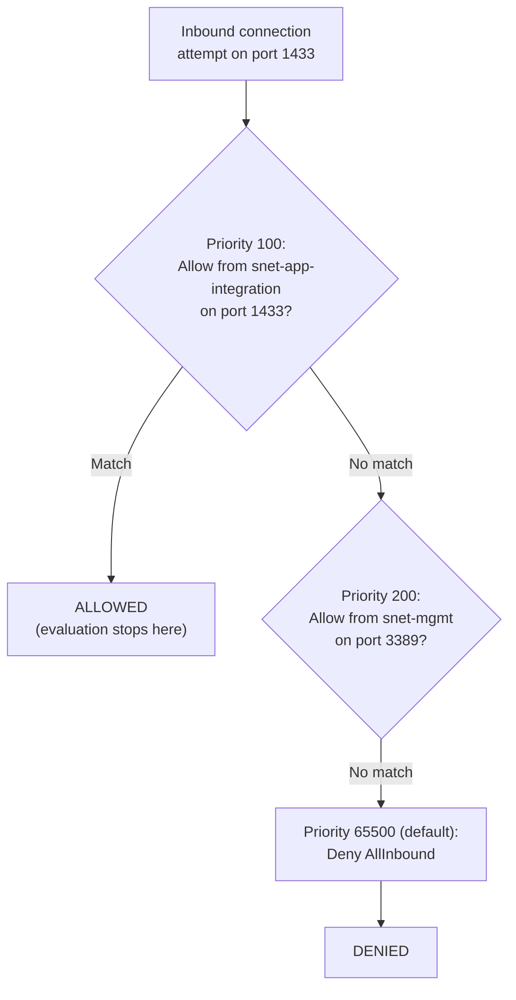
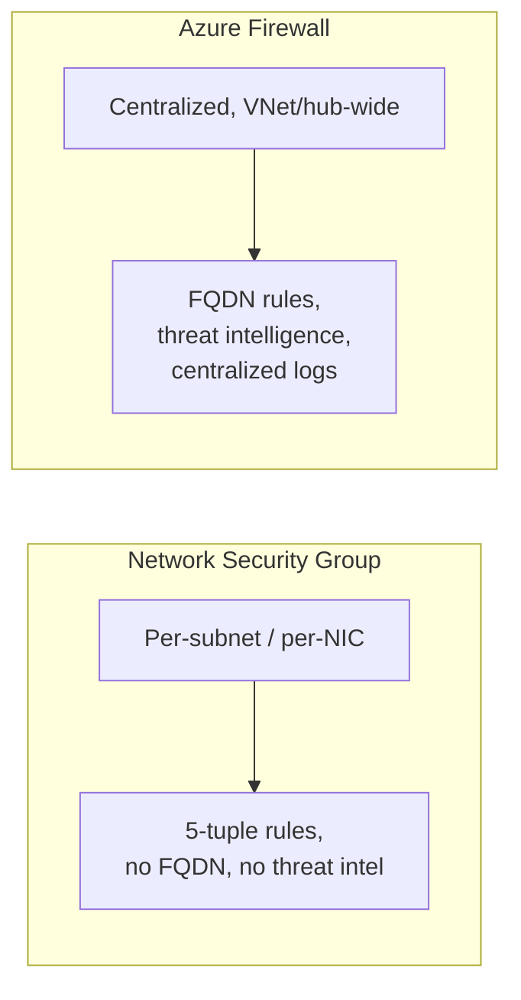

# Network Security Groups

## Introduction

Before reading this lesson, you should already be comfortable with **[Private Endpoints](../16-azure-for-dotnet-developers/16-63-private-endpoints.md)**, including the fact that a Private Endpoint solves *reachability* — it decides whether a resource has a public address at all — but says nothing about which specific traffic, once inside the VNet, is actually allowed to reach it. Even with `sql-banking-prod`'s public endpoint disabled, every other resource sitting inside `vnet-banking-prod` can, by default, still reach it freely on any port, because a VNet's subnets don't filter traffic between each other automatically. This lesson closes that final gap with **Network Security Groups (NSGs)** — and, as the capstone of this module's five-lesson Networking sub-area, closes by tying VNets, Front Door, Load Balancer/Application Gateway, Private Endpoints, and NSGs together into one coherent security story for the Banking/ATM data tier.

By the end of this lesson, you will be able to:

- Explain what a Network Security Group is and where it can be attached — a subnet or a network interface
- Write inbound and outbound NSG rules that allow or deny traffic by source, destination, port, and protocol
- Explain NSG rule priority and the order in which rules are evaluated
- Contrast NSGs with Azure Firewall as a centralized alternative
- Combine VNets, subnets, Private Endpoints, and NSGs into a complete network-hardening design for the Banking/ATM data tier
- Recap how all five lessons in this Networking sub-area fit together, end to end

## Network Security Groups — A Layman's Perspective

Return one final time to the sealed office floor and its records room from the last two lessons. The floor is sealed from other tenants, the records room has its own reinforced door, and the vendor's records-storage service now has a private door straight into that room instead of a public street address. One job remains undone: even standing right at the records room's reinforced door, *someone* still has to decide, person by person, exactly who is allowed through it and for what purpose — the fact that a door is reinforced says nothing on its own about who's permitted to open it.

A **Network Security Group** is the security guard posted at that door, holding a written list of rules, checked in a strict, numbered order every single time someone approaches: "Rule 100: anyone from the IT department, wearing their own badge, may enter for maintenance. Rule 200: anyone from the accounting department may enter to file records. Rule 65000: everyone else, deny." The guard doesn't invent judgment calls on the spot — they run down the numbered list from lowest number to highest, and the very first rule that matches the person standing at the door wins, immediately, with every rule further down the list simply never getting checked at all. If accounting's rule happened to be numbered lower than a company-wide deny-everyone rule, accounting gets through even though a later rule would have said no — order is not a formality, it's the entire mechanism.

That same guard also watches the door in both directions. **Inbound rules** govern who may walk *into* the room; **outbound rules** govern who inside the room may walk back *out* to somewhere else — a records clerk inside the room might be freely allowed to walk out to the break room, while being firmly denied any path to the building's public lobby. And critically, this guard isn't just checking IDs at one door — a guard like this can be posted at the entrance to an entire subnet's floor, screening everyone entering or leaving that whole area, or posted at one individual employee's personal office door, screening traffic to that one specific person alone. That's the difference between an NSG attached to a **subnet** versus one attached to a single **network interface**: the same rulebook, applied at a broader or narrower scope depending on where the guard is stationed.

One more property completes the picture, and it's the one that makes this guard genuinely useful rather than merely strict: the guard *remembers*. If accounting's clerk was allowed to walk out to place a phone call, the guard recognizes the return call coming back in as part of that same already-approved conversation, and lets it back in automatically without re-checking it against the numbered rulebook from scratch. That's what makes an NSG **stateful** — a rule that allows outbound traffic on a connection automatically allows the matching inbound response, without a mirrored rule having to be written for it by hand.

## Network Security Groups — A Programming Language Perspective

A **Network Security Group (NSG)** is a `Microsoft.Network/networkSecurityGroups` resource containing an ordered list of **security rules**, each specifying a **priority** (100-4096, lower numbers evaluated first), a **direction** (`Inbound` or `Outbound`), an **access** value (`Allow` or `Deny`), and match criteria — source/destination address prefix (or an Azure **Service Tag** like `Internet` or `VirtualNetwork`), source/destination port range, and protocol (`Tcp`, `Udp`, `*`). Rule evaluation stops at the first matching rule per traffic flow, in ascending priority order; every NSG carries non-removable default rules at priority 65000+ that allow intra-VNet traffic and deny everything else, guaranteeing an explicit fallback even if no custom rule matches. NSGs are **stateful**: an allowed outbound flow's return traffic is automatically permitted inbound without a separate matching rule. An NSG can be associated with a **subnet** (applying to every NIC inside it) or with an individual **network interface** (applying to just that one resource) — both associations can be active simultaneously, in which case traffic must pass both.

## How to Create and Attach an NSG with Priority-Ordered Rules

An NSG's rules only matter once they're attached somewhere; a subnet association applies the same rulebook to every resource inside it, which is exactly the scope this lesson's capstone example needs for the data tier.


*Figure 1: Rules are checked in ascending priority order; the first match wins and stops evaluation, with the non-removable default rule catching everything else.*

```bash
# Azure CLI — create an NSG and attach it to the data-tier subnet
az network nsg create \
  --name nsg-data-tier \
  --resource-group rg-banking-prod

# Priority 100: allow SQL traffic only from the app-integration subnet
az network nsg rule create \
  --nsg-name nsg-data-tier \
  --resource-group rg-banking-prod \
  --name Allow-App-To-SQL \
  --priority 100 \
  --direction Inbound \
  --access Allow \
  --protocol Tcp \
  --source-address-prefixes 10.20.1.0/24 \
  --destination-port-ranges 1433

# Priority 4096: explicit deny for everything else inbound (defense in depth beyond the default rule)
az network nsg rule create \
  --nsg-name nsg-data-tier \
  --resource-group rg-banking-prod \
  --name Deny-All-Other-Inbound \
  --priority 4096 \
  --direction Inbound \
  --access Deny \
  --protocol "*" \
  --source-address-prefixes "*" \
  --destination-port-ranges "*"

# Attach the NSG to the data-tier subnet
az network vnet subnet update \
  --name snet-data-tier \
  --vnet-name vnet-banking-prod \
  --resource-group rg-banking-prod \
  --network-security-group nsg-data-tier
```

**Azure CLI Output:**

```text
{
  "name": "nsg-data-tier",
  "securityRules": [
    { "name": "Allow-App-To-SQL", "priority": 100, "direction": "Inbound", "access": "Allow" },
    { "name": "Deny-All-Other-Inbound", "priority": 4096, "direction": "Inbound", "access": "Deny" }
  ]
}
{
  "name": "snet-data-tier",
  "networkSecurityGroup": { "id": "/subscriptions/.../networkSecurityGroups/nsg-data-tier" }
}
```

```csharp
// NsgRuleEvaluator.cs — .NET 10 / C# 14
// A small simulation of NSG priority evaluation, useful for reasoning about
// rule order before it's actually applied in the portal or CLI.
public sealed record NsgRule(string Name, int Priority, string Access, string SourcePrefix, int DestPort);

NsgRule[] rules =
[
    new("Allow-App-To-SQL", 100, "Allow", "10.20.1.0/24", 1433),
    new("Deny-All-Other-Inbound", 4096, "Deny", "*", 0)
];

bool Matches(NsgRule rule, string sourceIp, int destPort) =>
    (rule.SourcePrefix == "*" || sourceIp.StartsWith(rule.SourcePrefix.Split('/')[0][..7])) &&
    (rule.DestPort == 0 || rule.DestPort == destPort);

string Evaluate(string sourceIp, int destPort)
{
    NsgRule winner = rules.OrderBy(r => r.Priority).First(r => Matches(r, sourceIp, destPort));
    return $"{winner.Access} (matched '{winner.Name}', priority {winner.Priority})";
}

Console.WriteLine($"From 10.20.1.5:1433  -> {Evaluate("10.20.1.5", 1433)}");
Console.WriteLine($"From 203.0.113.9:1433 -> {Evaluate("203.0.113.9", 1433)}");
```

**Console Output:**

```text
From 10.20.1.5:1433  -> Allow (matched 'Allow-App-To-SQL', priority 100)
From 203.0.113.9:1433 -> Deny (matched 'Deny-All-Other-Inbound', priority 4096)
```

The app-integration subnet's traffic matches the priority-100 rule and is allowed through immediately, without evaluation ever reaching the priority-4096 deny rule at all. A request from an unrelated public IP matches neither the specific allow rule nor any other rule ahead of it, so it falls through to the explicit deny — the exact ascending-priority, first-match-wins behavior every NSG rule set follows.

## Real-Time Example: Full Network Hardening for the Banking/ATM Data Tier

We bring together every lesson in this Networking sub-area for one final, complete hardening pass on the Banking/ATM case study's `CoreBanking` database and its supporting VNet — `vnet-banking-prod`, `snet-data-tier`, and `pe-sql-banking-prod` from the previous two lessons, now with an NSG layered on top as the last piece.

```csharp
// DataTierHardeningReport.cs — .NET 10 / C# 14 — Real-Time Example (Banking/ATM)
public sealed record HardeningControl(string Layer, string Control, bool Applied);

HardeningControl[] controls =
[
    new("VNet & Subnets",     "snet-data-tier isolated from public internet by default (Lesson 60)", Applied: true),
    new("Private Endpoint",   "sql-banking-prod public access disabled, private IP only (Lesson 63)", Applied: true),
    new("NSG - Inbound",      "Allow port 1433 from snet-app-integration only (priority 100)",         Applied: true),
    new("NSG - Inbound",      "Deny all other inbound traffic (priority 4096)",                          Applied: true),
    new("NSG - Outbound",     "Data tier has no outbound rule to the internet at all",                   Applied: true)
];

Console.WriteLine("vnet-banking-prod / snet-data-tier — final hardening report:");
foreach (HardeningControl c in controls)
{
    Console.WriteLine($"  [{(c.Applied ? "x" : " ")}] {c.Layer,-16} {c.Control}");
}

bool fullyHardened = controls.All(c => c.Applied);
Console.WriteLine();
Console.WriteLine(fullyHardened
    ? "Data tier is fully hardened: no public IP, no unrestricted inbound path, no unrestricted outbound path."
    : "Hardening incomplete.");
```

**Console Output:**

```text
vnet-banking-prod / snet-data-tier — final hardening report:
  [x] VNet & Subnets     snet-data-tier isolated from public internet by default (Lesson 60)
  [x] Private Endpoint   sql-banking-prod public access disabled, private IP only (Lesson 63)
  [x] NSG - Inbound      Allow port 1433 from snet-app-integration only (priority 100)
  [x] NSG - Inbound      Deny all other inbound traffic (priority 4096)
  [x] NSG - Outbound     Data tier has no outbound rule to the internet at all

Data tier is fully hardened: no public IP, no unrestricted inbound path, no unrestricted outbound path.
```

This is what "defense in depth" concretely means for a bank's data tier: even if a Private Endpoint were somehow misconfigured back to public access, the NSG's priority-100/4096 rules would still block anything except `app-banking-api`'s own subnet on port 1433; even if an NSG rule were accidentally loosened, the resource still has no public IP to be reached on in the first place. Neither control depends on the other being correct, which is exactly the property a single point of failure lacks.

## Network Security Groups vs Azure Firewall

NSGs and Azure Firewall both filter traffic by rule, which invites confusion about when each applies. An **NSG** is a distributed, per-subnet or per-NIC control — cheap, simple 5-tuple (source, destination, port, protocol, and direction) rules with no application-layer awareness, no centralized logging beyond what you wire up yourself, and no support for FQDN-based rules like "allow only `api.partnerbank.com`." **Azure Firewall** is a centralized, managed firewall appliance for an entire VNet or hub in a hub-and-spoke topology, supporting FQDN filtering, threat intelligence feeds, and centralized logging through one resource, at meaningfully higher cost and operational complexity than an NSG. Most production designs use both: NSGs as cheap, granular guardrails at every subnet, and Azure Firewall — where justified by scale or compliance needs — as a single centralized checkpoint for outbound internet traffic across an entire hub network.


*Figure 2: NSGs are cheap, distributed guardrails at every subnet; Azure Firewall is a single, centralized, more capable checkpoint typically placed at a hub.*

| Aspect | Network Security Group | Azure Firewall |
|---|---|---|
| Scope | Per-subnet or per-NIC | Centralized, typically VNet/hub-wide |
| Rule basis | Source/dest IP, port, protocol (5-tuple) | 5-tuple plus FQDN filtering, application rules |
| Threat intelligence | No | Yes |
| Cost | Low — included with the VNet | Higher — a dedicated managed resource |
| Typical role | Baseline guardrail on every subnet | Centralized outbound/inbound checkpoint at scale |

## Types of Network Filtering Concepts in Azure

NSGs are the most common filtering mechanism, alongside a few related tools:

1. **Application Security Groups (ASGs)** — named groups of VMs (e.g., "core-banking-sql-vms") that NSG rules can reference instead of raw IP ranges, keeping rules readable as infrastructure changes.
2. **Azure Firewall** — the centralized alternative contrasted above.
3. **Default Security Rules** — the non-removable priority-65000+ rules every NSG ships with, guaranteeing a safe fallback.
4. **[Private Endpoints](../16-azure-for-dotnet-developers/16-63-private-endpoints.md)** — the previous lesson's control over *reachability*, which NSGs layer *filtering* on top of.
5. **[Azure Virtual Networks](../16-azure-for-dotnet-developers/16-60-azure-virtual-networks.md)** — the subnet structure NSGs attach to.
6. **[Serverless Architecture Fundamentals on Azure](../16-azure-for-dotnet-developers/16-65-serverless-architecture-on-azure.md)** — the next sub-area, where Functions and Logic Apps introduce a different networking trade-off of their own.

## What You've Learned & What's Next

Network Security Groups are stateful, priority-ordered inbound/outbound firewall rules attached to a subnet or a network interface, evaluated in ascending priority order with the first match winning — and, combined with VNets, Private Endpoints, and a regional traffic-distribution layer, they complete the network-hardening story for a resource like the Banking/ATM case study's `CoreBanking` database.

That completes the Networking sub-area of this module. Across five lessons, **[Azure Virtual Networks](../16-azure-for-dotnet-developers/16-60-azure-virtual-networks.md)** established the isolated, subnetted private space every other piece attaches to; **[Azure Front Door and CDN](../16-azure-for-dotnet-developers/16-61-azure-front-door-and-cdn.md)** added a global entry point above it; **[Load Balancer vs Application Gateway](../16-azure-for-dotnet-developers/16-62-load-balancer-vs-app-gateway.md)** covered the regional traffic-distribution layer beneath that global entry point; **[Private Endpoints](../16-azure-for-dotnet-developers/16-63-private-endpoints.md)** pulled PaaS resources themselves inside the VNet; and this lesson's NSGs added the final, rule-by-rule filter on top of all of it. Together, that five-lesson stack is the complete answer to "how does a production Azure application's network actually get secured," end to end.

Continue your learning journey with **[Serverless Architecture Fundamentals on Azure](../16-azure-for-dotnet-developers/16-65-serverless-architecture-on-azure.md)**, which opens the module's next sub-area — Serverless & Event-Driven Architecture — starting from a deliberately different premise: compute that has no VNet of its own to secure unless you explicitly integrate it into one.

---
*Applies to: .NET 10 / C# 14. Last reviewed 2026-08-16.*
