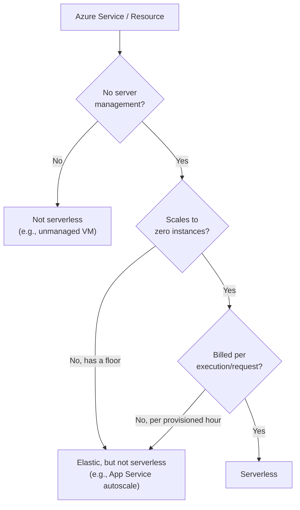
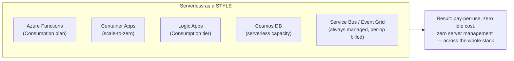

# Serverless Architecture Fundamentals on Azure

## Introduction

Before reading this lesson, you should already be comfortable with **[Network Security Groups](../16-azure-for-dotnet-developers/16-64-network-security-groups.md)** and, by extension, with everything this module has covered about provisioning and securing infrastructure: virtual networks, subnets, NSG rules, private endpoints. Every one of those lessons assumed something is *running* — a VM, an AKS node pool, an App Service instance — that needs a network path secured around it. This lesson steps back and asks a different question: what if, for a meaningful slice of an application, there is no long-running "something" to secure a network around at all, because nothing is running until the exact instant it's needed? That question is the entry point into **serverless architecture**, and this lesson consolidates a pattern this curriculum has already brushed up against half a dozen times — in Azure Functions (Lesson 12), Container Apps' scale-to-zero (Lesson 15), Logic Apps, Cosmos DB's serverless tier, and Service Bus/Event Grid — into one coherent architectural style, rather than treating "serverless" as a single product name.

By the end of this lesson, you will be able to:

- Define serverless precisely: no server management, automatic scaling including down to zero, and billing tied to actual execution rather than provisioned capacity
- Recognize that "serverless" describes an architectural *style*, present across several distinct Azure services, not one specific product
- Identify which of Functions, Container Apps, Logic Apps, Cosmos DB, and Service Bus/Event Grid a given workload's serverless characteristics come from
- Distinguish scale-to-zero from merely "elastic autoscaling" that still keeps a floor of running capacity
- Recognize the trade-offs serverless architecture accepts — cold starts, execution time limits, less low-level control — in exchange for its operational and cost benefits

## Serverless Architecture — A Layman's Perspective

Picture the difference between owning a car and using a ride-sharing app. A car you own is available to you the instant you want it, parked in your driveway, fully warmed up if you just drove it five minutes ago — but you pay for it every single day whether you drive it or not: the loan, the insurance, the depreciation, all ticking along at 3 a.m. while it sits untouched in the driveway. A ride-share car, by contrast, isn't "yours" at any moment you're not actually riding in it. You open the app, one gets dispatched, you pay for exactly the minutes and miles of that one trip, and then it's gone again, off serving someone else, costing you nothing until your next ride. The trade-off is real: a dispatched car might take a few minutes to arrive if none happen to be idling nearby, whereas your own car in the driveway is always instantly there.

Traditional server infrastructure — a VM, an always-on App Service Plan, a fixed-size AKS node pool — is the owned car. It is provisioned, running, and being paid for around the clock, whether a single request arrives at 3 a.m. or ten thousand arrive at noon. That's exactly right for workloads with steady, predictable, high-volume traffic, the same way owning a car makes sense for someone who drives to work every single day. But for a huge amount of real application logic — a webhook that fires a few times an hour, a nightly batch job, an endpoint that gets hit in unpredictable bursts — paying for a fully provisioned server every hour of every day is like leasing a car you only drive twice a week.

Serverless architecture is the ride-share model applied to compute. Nothing is provisioned, running, or costing money in the gaps between actual work. The moment a request, a message, or a timer fires, the platform "dispatches" compute — spins up exactly what's needed to handle that one unit of work — runs it, and lets it disappear again the instant it's done. Just as the ride-share company still owns a giant fleet of cars somewhere, Azure still owns the actual physical servers underneath every serverless service; the entire point of the term is that *you* never provision, patch, size, or pay a per-hour rate for any of them. You're billed for the ride, not for owning the car.

And just like ride-sharing's one real downside — the few minutes' wait for a car to arrive if the area is quiet — serverless compute has an analogous downside: a "cold start," the brief extra delay incurred when nothing was already running and warm to hand the work to instantly. That trade-off, and how it varies across Azure's serverless services, is significant enough to deserve its own dedicated lesson at the end of this sub-area — for now, hold onto the ride-share analogy: pay only for the trip, accept an occasional short wait for the car to show up.

## Serverless Architecture — A Programming Language Perspective

**Serverless** is not a single Azure product; it is an architectural style characterized by three concrete properties that a given Azure service either has or doesn't: **no server management** (no OS patching, no capacity provisioning, no instance sizing performed by the developer), **automatic scaling including to zero** (idle workloads consume zero running instances, not merely a small minimum), and **execution-based billing** (cost is metered per invocation, per execution-second, or per request-unit, rather than per provisioned hour). Measured against those three properties, several services this curriculum has already covered qualify: Azure Functions on the Consumption plan (Lesson 12), Azure Container Apps with `minReplicas: 0` (Lesson 15), Azure Logic Apps' Consumption tier, Azure Cosmos DB's serverless capacity mode (Lesson 21), and the message brokers Service Bus and Event Grid, which are always fully managed and billed per-operation with no provisioned compute of their own. None of these services *are* "serverless" as a category unto themselves — each is simply a managed Azure service that happens to satisfy all three properties, which is precisely why the term describes a style spanning several products rather than naming one.

## How to Recognize a Serverless Component in an Azure Architecture

Rather than a single how-to procedure, recognizing serverless components is a matter of checking each of the three defining properties against a given Azure resource's configuration — something visible directly in the Azure CLI output for that resource.


*Figure 1: The three-question test for whether a given Azure service instance is behaving in a serverless style.*

```bash
# Azure CLI — inspect a Function App's hosting plan to check for the serverless-defining properties
az functionapp show --name func-order-intake --resource-group rg-ecommerce-prod \
  --query "{name:name, sku:appServicePlanId}" --output table

az appservice plan show --ids "$(az functionapp show --name func-order-intake \
  --resource-group rg-ecommerce-prod --query appServicePlanId -o tsv)" \
  --query "{tier:sku.tier, size:sku.size, minInstances:sku.capacity}" --output table
```

**Azure CLI Output:**

```text
Name              Sku
-----------------  ----------------------------------------------------
func-order-intake  /subscriptions/.../serverfarms/plan-order-consumption

Tier         Size    MinInstances
-----------  ------  --------------
Dynamic      Y1      0
```

The `Tier: Dynamic` and `MinInstances: 0` fields are the tell: this plan is the Consumption plan, meaning Azure allocates zero standing compute for `func-order-intake` and bills per execution and per GB-second consumed. Compare that to an App Service Plan's `Tier: PremiumV3` with a minimum instance count of 1 or more — that plan is always running *something*, at a fixed hourly rate, regardless of traffic. Running the same query against a Container Apps environment or a Logic App would surface the equivalent property under different field names, but the underlying question — is there a guaranteed floor of running, paid-for compute? — is identical across all of them.

## Real-Time Example: Auditing the E-Commerce Platform's Serverless Footprint

We continue with the E-Commerce Order Processing case study used throughout this module. The platform now spans several Azure services introduced across earlier lessons, and before adding the order pipeline covered later in this sub-area, it's worth auditing which pieces of the existing architecture are actually serverless versus merely "managed but always-on."

```csharp
// ServerlessFootprintAudit.cs — .NET 10 / C# 14 — Real-Time Example (E-Commerce Order Processing)
public sealed record AzureComponent(
    string Name,
    string Service,
    bool NoServerManagement,
    bool ScalesToZero,
    bool BilledPerExecution);

AzureComponent[] platform =
[
    new("func-order-intake",       "Azure Functions (Consumption)", true,  true,  true),
    new("ca-inventory-service",    "Container Apps (minReplicas=0)", true, true,  true),
    new("cosmos-orders-db",        "Cosmos DB (Serverless capacity)", true, true, true),
    new("sb-order-events",         "Service Bus (Standard tier)",    true,  true,  true),
    new("aks-catalog-cluster",     "AKS node pool (fixed size)",     false, false, false),
    new("sql-reporting-primary",   "Azure SQL (Provisioned vCore)",  true,  false, false)
];

Console.WriteLine("E-Commerce platform — serverless-style audit:");
foreach (AzureComponent c in platform)
{
    bool isServerless = c.NoServerManagement && c.ScalesToZero && c.BilledPerExecution;
    Console.WriteLine($"  {c.Name,-24} {c.Service,-32} -> {(isServerless ? "SERVERLESS" : "not serverless")}");
}

int serverlessCount = platform.Count(c => c.NoServerManagement && c.ScalesToZero && c.BilledPerExecution);
Console.WriteLine();
Console.WriteLine($"Serverless components: {serverlessCount} of {platform.Length}");
```

**Console Output:**

```text
E-Commerce platform — serverless-style audit:
  func-order-intake       Azure Functions (Consumption)   -> SERVERLESS
  ca-inventory-service    Container Apps (minReplicas=0)  -> SERVERLESS
  cosmos-orders-db        Cosmos DB (Serverless capacity)  -> SERVERLESS
  sb-order-events         Service Bus (Standard tier)      -> SERVERLESS
  aks-catalog-cluster     AKS node pool (fixed size)       -> not serverless
  sql-reporting-primary   Azure SQL (Provisioned vCore)    -> not serverless

Serverless components: 4 of 6
```

This is the realistic shape of most production Azure architectures: not a single "serverless app," but a mix, where components with bursty or intermittent load (order intake, inventory checks, event delivery) get built serverlessly, while components needing predictable, always-hot performance (the product catalog cluster under constant read load, the reporting database) stay on provisioned infrastructure deliberately. Recognizing which is which, component by component, is the actual architectural skill — not a blanket decision to "go serverless" everywhere.

## Serverless Style vs a Single "Serverless Service"

A common misconception is treating "serverless" as a product you either use or don't, the way you either provision a VM or you don't. It's more accurate — and more useful architecturally — to treat it as a *style* that different Azure services opt into to different degrees, on different pricing tiers, for different types of work. Azure Functions is thought of as "the serverless service" mostly because it was Azure's first mainstream offering built around all three properties simultaneously, but it is neither the only one nor a requirement for calling an architecture serverless.


*Figure 2: Serverless is a property multiple independent Azure services can each exhibit, not a single service to adopt.*

| Aspect | "Serverless" as a Product | Serverless as an Architectural Style |
|---|---|---|
| Scope | Implies one specific service (commonly Functions) | Spans Functions, Container Apps, Logic Apps, Cosmos DB, Service Bus/Event Grid |
| Decision granularity | All-or-nothing across the app | Per-component — some workloads serverless, others provisioned |
| What determines it | The product name | Three properties: no server management, scale-to-zero, execution-based billing |
| Common mistake | Assuming any use of Functions makes an architecture "serverless" | Missing that a Premium-plan Function with min instances > 0 no longer scales to zero |

## Types of Serverless Building Blocks on Azure

Each of the following has appeared, or will appear, elsewhere in this curriculum as its own dedicated topic — this lesson's job was to name the property they all share:

1. **[Introduction to Azure Functions](../16-azure-for-dotnet-developers/16-12-introduction-to-azure-functions.md)** — the canonical serverless compute service, on its Consumption plan.
2. **[Azure Container Apps](../16-azure-for-dotnet-developers/16-15-azure-container-apps.md)** — containerized microservices with `minReplicas: 0` scale-to-zero.
3. **Azure Logic Apps** (Consumption tier, covered in Module 16's Messaging & Integration lessons) — serverless, low-code workflow orchestration.
4. **[Introduction to Azure Cosmos DB](../16-azure-for-dotnet-developers/16-21-introduction-to-cosmos-db.md)** — the serverless capacity mode, billed per request unit consumed rather than per provisioned throughput.
5. **Azure Service Bus and Azure Event Grid** (covered in Module 16's Messaging & Integration lessons) — fully managed messaging with no provisioned compute of their own, billed per operation.

## What You've Learned & What's Next

"Serverless" is not one Azure product but a set of three properties — no server management, scaling to true zero, and execution-based billing — that Functions, Container Apps, Logic Apps, Cosmos DB's serverless tier, and Service Bus/Event Grid each satisfy in their own way. Recognizing serverless as a style, applied component by component, is what lets an architecture mix serverless and provisioned infrastructure deliberately rather than treating the choice as all-or-nothing.

Continue your learning journey with **[Event-Driven Architecture with Functions and Event Grid](../16-azure-for-dotnet-developers/16-66-event-driven-functions-event-grid.md)**, where we combine two of these serverless building blocks into a concrete, reactive architectural pattern.

---
*Applies to: .NET 10 / C# 14. Last reviewed 2026-08-16.*
