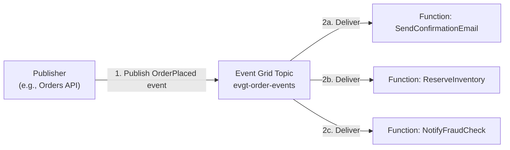
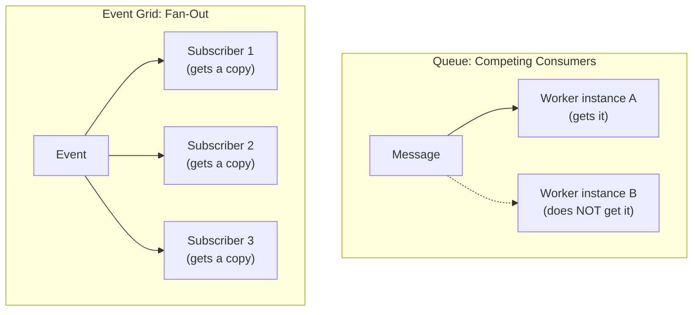

# Event-Driven Architecture with Functions and Event Grid

## Introduction

Before reading this lesson, you should already be comfortable with **[Serverless Architecture Fundamentals on Azure](../16-azure-for-dotnet-developers/16-65-serverless-architecture-on-azure.md)** — specifically, that Azure Functions and Azure Event Grid are two independent building blocks that each happen to be serverless in their own right. This lesson combines them into something more specific than either building block alone: a concrete architectural *pattern* where Event Grid, Azure's managed pub/sub event router, and Functions, Azure's serverless compute, together realize the event-driven architecture that Module 12, Lesson 43 described in the abstract — an `Order` publishing a fact, with independent listeners reacting, none of them aware the others exist.

By the end of this lesson, you will be able to:

- Explain the role Event Grid plays as the event *router*, distinct from the Functions that do the actual reacting
- Publish a custom event to an Event Grid topic from C# using the `Azure.Messaging.EventGrid` SDK
- Wire multiple independent Azure Functions to subscribe to the same Event Grid topic, each reacting for its own reason
- Recognize this fan-out pattern as the Azure-concrete realization of Module 12's domain-event-to-integration-event boundary
- Distinguish an Event Grid subscription's event filter from a message queue's competing-consumer model

## Event-Driven Functions and Event Grid — A Layman's Perspective

Return to the fire alarm from Module 12's Event-Driven Architecture lesson: one loud, public announcement, with security, facilities, and evacuating employees each reacting independently, none of them aware the others exist. That lesson deliberately stopped short of saying *how*, mechanically, the alarm actually reaches every one of those separate parties at once. This lesson answers that with a concrete building: the alarm doesn't just make noise into empty air and hope — it's wired into a building-wide annunciator panel that is specifically responsible for taking one signal and reliably fanning it out, in parallel, to every department's own separate call system. Security's phone rings. Facilities' pager buzzes. The PA system announces to employees. All three happen from one alarm pull, and the annunciator panel is the thing that made the fan-out actually work, not the alarm itself.

That annunciator panel is Event Grid. It is not, itself, security, facilities, or the PA system — it does no actual work when the fire alarm is pulled. Its entire job is routing: take one incoming signal, and reliably deliver a copy of it to every registered listener, with each listener's own separate wiring untouched by, and unaware of, every other listener's wiring. Each Azure Function subscribing to that Event Grid topic is one of those departments: a small, independently deployable, independently failing piece of reaction logic that does one job when the signal arrives, and has zero code referencing any of the other departments doing their own jobs off the same signal.

The genuinely useful property this buys a system is the one Module 12 already named: adding a new reaction to an existing event costs nothing to the existing reactions. If the data-center team adds "spin down noncritical servers" to the fire-alarm response next year, nobody has to touch security's elevator-lock code, facilities' gas-shutoff code, or the annunciator panel's wiring for either of them — the data center team wires their own pager into the panel, done. Translated back to Azure: adding a fourth Function that reacts to an `OrderPlaced` event costs zero changes to the three Functions already reacting to it, and zero changes to the code that published the event in the first place. That's the entire value proposition of Event Grid plus Functions as a pair — Event Grid guarantees the fan-out is reliable and decoupled, and Functions guarantee that each reaction is cheap to write, deploy, and scale entirely on its own.

The one thing this arrangement asks in return, same as the fire alarm, is that the publisher genuinely not care who's listening. `Order.Place()` doesn't call three functions directly — it raises one event and walks away, the same way pulling the alarm doesn't dial security's phone number directly.

## Event-Driven Functions and Event Grid — A Programming Language Perspective

**Azure Event Grid** is a fully managed, publish-subscribe event routing service: publishers send discrete events — each an `EventGridEvent` or the newer CloudEvents-schema equivalent, carrying an `EventType`, `Subject`, and JSON `Data` payload — to a **topic**, and Event Grid delivers a copy of each matching event to every registered **event subscription** independently, retrying delivery to each subscriber on its own schedule if that particular subscriber is briefly unavailable. An Azure Function becomes a subscriber through an **Event Grid trigger** (`[EventGridTrigger]` in the isolated worker model), which the Functions runtime registers as a webhook endpoint that Event Grid calls on delivery. Because each subscription is configured independently — including an optional filter on `EventType` or `Subject` prefix — many Functions can subscribe to the exact same topic, each receiving its own delivery of the identical event, entirely unaware of how many other subscriptions exist. This is architecturally distinct from a queue-based system's competing-consumer model, covered by comparison later in this lesson.

## How to Publish an Event and Fan It Out to Multiple Functions

Building this pattern has two halves: publishing a custom event to an Event Grid topic, and writing the Function(s) that subscribe to it. The publish side is a normal SDK call from any C# code — a web API, another Function, anything; the subscribe side is standard Function code with an `[EventGridTrigger]` binding instead of an HTTP or timer trigger.


*Figure 1: One published event fans out to three independent Function subscriptions, each delivered separately by Event Grid.*

```bash
# Azure CLI — create the topic and three independent event subscriptions
az eventgrid topic create --name evgt-order-events --resource-group rg-ecommerce-prod --location eastus

az eventgrid event-subscription create --name sub-send-confirmation \
  --source-resource-id "$(az eventgrid topic show --name evgt-order-events -g rg-ecommerce-prod --query id -o tsv)" \
  --endpoint "https://func-order-intake.azurewebsites.net/runtime/webhooks/eventgrid?functionName=SendConfirmationEmail" \
  --endpoint-type webhook

az eventgrid event-subscription create --name sub-reserve-inventory \
  --source-resource-id "$(az eventgrid topic show --name evgt-order-events -g rg-ecommerce-prod --query id -o tsv)" \
  --endpoint "https://func-order-intake.azurewebsites.net/runtime/webhooks/eventgrid?functionName=ReserveInventory" \
  --endpoint-type webhook
```

**Azure CLI Output:**

```text
{
  "name": "evgt-order-events",
  "properties": { "endpoint": "https://evgt-order-events.eastus-1.eventgrid.azure.net/api/events" }
}
{
  "name": "sub-send-confirmation",
  "properties": { "provisioningState": "Succeeded" }
}
{
  "name": "sub-reserve-inventory",
  "properties": { "provisioningState": "Succeeded" }
}
```

```csharp
// PublishOrderEvent.cs — .NET 10 / C# 14 — publisher side (e.g., inside the Orders API)
using Azure;
using Azure.Messaging.EventGrid;

var client = new EventGridPublisherClient(
    new Uri("https://evgt-order-events.eastus-1.eventgrid.azure.net/api/events"),
    new AzureKeyCredential(topicAccessKey));

var orderEvent = new EventGridEvent(
    subject: "orders/ORD-9001",
    eventType: "Ecommerce.OrderPlaced",
    dataVersion: "1.0",
    data: new { OrderId = "ORD-9001", Total = 249.99m, CustomerEmail = "j.doe@example.com" });

await client.SendEventAsync(orderEvent);
Console.WriteLine($"Published event '{orderEvent.EventType}' for subject '{orderEvent.Subject}'");
```

```csharp
// ReserveInventoryFunction.cs — .NET 10 / C# 14 — one of several independent subscribers
using Azure.Messaging.EventGrid;
using Microsoft.Azure.Functions.Worker;

public static class ReserveInventoryFunction
{
    [Function(nameof(ReserveInventory))]
    public static void ReserveInventory([EventGridTrigger] EventGridEvent evt)
    {
        Console.WriteLine($"[ReserveInventory] Received '{evt.EventType}' for '{evt.Subject}' — reserving stock");
    }
}
```

**Console Output** *(illustrative — publisher, then two independently-triggered Function logs)*:

```text
Published event 'Ecommerce.OrderPlaced' for subject 'orders/ORD-9001'
[ReserveInventory] Received 'Ecommerce.OrderPlaced' for 'orders/ORD-9001' — reserving stock
[SendConfirmationEmail] Received 'Ecommerce.OrderPlaced' for 'orders/ORD-9001' — sending email
```

Notice the publisher's code has no knowledge that two (or more) Functions exist — it sent exactly one event to exactly one topic. Event Grid's two separately provisioned subscriptions are what turned that single send into two independent deliveries, each triggering its own Function on its own schedule, exactly matching the fire-alarm annunciator-panel behavior from the layman's section.

## Real-Time Example: Fanning Out `OrderPlaced` to Independent Reactions

We continue with the E-Commerce Order Processing domain's `Order` type, now publishing a domain fact the way Module 12, Lesson 43 described in the abstract, made concrete with Event Grid and Functions.

```csharp
// OrderEventFanOut.cs — .NET 10 / C# 14 — Real-Time Example (E-Commerce Order Processing)
public sealed record OrderPlacedEvent(string OrderId, decimal Total, string CustomerEmail);
public sealed record Subscriber(string FunctionName, string Reaction);

Subscriber[] subscribers =
[
    new("ReserveInventoryFunction",       "Deduct stock for each line item"),
    new("SendOrderConfirmationFunction",  "Email the customer a receipt"),
    new("NotifyFraudCheckFunction",       "Queue the order for a fraud-risk score")
];

var placed = new OrderPlacedEvent("ORD-9001", 249.99m, "j.doe@example.com");

Console.WriteLine($"Publishing Ecommerce.OrderPlaced for order {placed.OrderId} (${placed.Total})");
Console.WriteLine($"Event Grid topic 'evgt-order-events' has {subscribers.Length} independent subscriptions:");
foreach (Subscriber s in subscribers)
{
    Console.WriteLine($"  -> {s.FunctionName,-32} reacts by: {s.Reaction}");
}
Console.WriteLine();
Console.WriteLine("Publisher code above never referenced any of these three Functions by name.");
```

**Console Output:**

```text
Publishing Ecommerce.OrderPlaced for order ORD-9001 ($249.99)
Event Grid topic 'evgt-order-events' has 3 independent subscriptions:
  -> ReserveInventoryFunction       reacts by: Deduct stock for each line item
  -> SendOrderConfirmationFunction  reacts by: Email the customer a receipt
  -> NotifyFraudCheckFunction       reacts by: Queue the order for a fraud-risk score

Publisher code above never referenced any of these three Functions by name.
```

This is the precise moment Module 12's abstract event-driven pattern becomes a running Azure system: the `Order` aggregate's `Place()` method raises one domain fact, that fact crosses the process boundary as one Event Grid publish call, and Azure fans it out to however many Functions are currently subscribed — three today, potentially a fourth next quarter when a loyalty-points team adds their own subscription, with zero code changes anywhere else in this listing.

## Event Grid Fan-Out vs a Message Queue's Competing Consumers

Event Grid's subscription model is easy to confuse with a queue, but the two solve different problems. A queue (like Service Bus, covered in Module 16's Messaging & Integration lessons) is built for **competing consumers**: several instances of the *same* worker pull from one queue, and each message is processed exactly once, by exactly one of them — the queue is a load-distribution mechanism for identical workers sharing one job list. Event Grid's subscriptions are built for the opposite: every matching subscriber gets its **own full copy** of every event, because each subscriber is doing a *different* job, not sharing one job list.


*Figure 2: A queue splits one job among identical competing workers; Event Grid fans one event out to every distinct subscriber.*

| Aspect | Queue (Service Bus) | Event Grid |
|---|---|---|
| Delivery model | Exactly one consumer processes each message | Every matching subscription receives its own copy |
| Typical use | Distributing identical work across scaled-out workers | Notifying multiple, differently-purposed reactions |
| Adding a new consumer | Increases throughput of the *same* work | Adds an entirely *new*, independent reaction |
| Coupling to publisher | Publisher still just enqueues, unaware of consumer count | Publisher unaware of subscriber count, identical decoupling |

## Types of Event Grid Subscribers and Related Concepts

Event Grid can deliver to more than Azure Functions, and this pattern connects to several other lessons:

1. **Azure Functions (Event Grid trigger)** — this lesson's focus, the most common Event Grid subscriber for custom application events.
2. **Azure Logic Apps** (covered in Module 16's Messaging & Integration lessons) — a low-code alternative subscriber for workflow-style reactions.
3. **[Domain-Driven Design Basics](../12-advanced-concepts/12-42-domain-driven-design-basics.md)** — the Aggregate Root pattern whose `Place()` method is the true origin of the domain event published here.
4. **[Event-Driven Architecture](../12-advanced-concepts/12-43-event-driven-architecture.md)** — the abstract pattern this lesson makes concrete with a specific Azure service pairing.
5. **Azure Service Bus: Topics and Subscriptions** (covered in Module 16's Messaging & Integration lessons) — a queue-based pub/sub alternative with different delivery guarantees.
6. **[Building a Serverless Order Pipeline — Real-Time Example](../16-azure-for-dotnet-developers/16-67-serverless-order-pipeline-real-time.md)** — where this fan-out pattern becomes a complete, production-shaped pipeline.

## What You've Learned & What's Next

Event Grid and Azure Functions together realize event-driven architecture concretely on Azure: Event Grid is the reliable, decoupled router, and each Function is one independent, cheaply-scaled reaction — with any number of Functions able to subscribe to the same event, none of them aware the others exist, exactly matching the decoupling Module 12 described in the abstract.

Continue your learning journey with **[Building a Serverless Order Pipeline — Real-Time Example](../16-azure-for-dotnet-developers/16-67-serverless-order-pipeline-real-time.md)**, where this exact fan-out pattern becomes the backbone of a complete, end-to-end serverless order pipeline.

---
*Applies to: .NET 10 / C# 14. Last reviewed 2026-08-16.*
