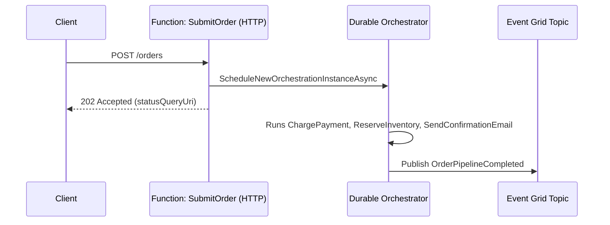
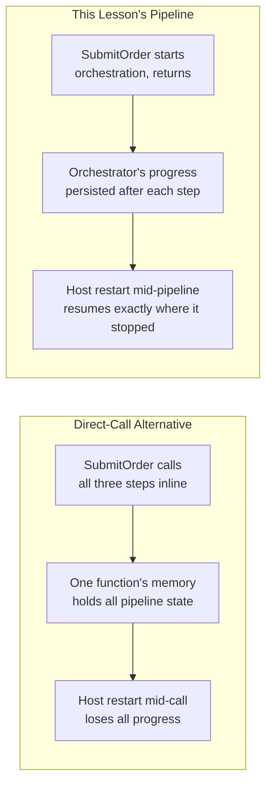

# Building a Serverless Order Pipeline — Real-Time Example

## Introduction

Before reading this lesson, you should already be comfortable with **[Event-Driven Architecture with Functions and Event Grid](../16-azure-for-dotnet-developers/16-66-event-driven-functions-event-grid.md)** — specifically, that one published event can fan out to several independent Functions, and with **[Durable Functions](../16-azure-for-dotnet-developers/16-14-durable-functions.md)**, which added orchestration and compensating actions on top of that same serverless compute model. This lesson exists to put every one of those pieces together into one complete, working system rather than leaving them as separate ideas: a fully serverless order pipeline for the E-Commerce Order Processing case study, built entirely from an HTTP-triggered Function, an Event Grid topic, three independent reactive Functions, and a Durable Functions orchestrator watching over the whole thing for failures.

By the end of this lesson, you will be able to:

- Trace a single order through an entirely serverless pipeline from HTTP request to final confirmation
- Explain why an HTTP-triggered Function accepting the order should publish an event rather than call the next steps directly
- Identify where Durable Functions' orchestration adds retry and compensation logic on top of plain Event Grid fan-out
- Recognize which parts of this pipeline never provision or pay for idle compute, end to end
- Build the four Functions (`SubmitOrder`, `ChargePayment`, `ReserveInventory`, `SendConfirmationEmail`) that make up this pipeline

## Serverless Order Pipeline — A Layman's Perspective

Picture a busy restaurant's open kitchen on a night with wildly unpredictable demand — dead quiet at 2 p.m., then a sudden rush of forty tables at 7:15. A traditional kitchen staffs for the *rush*, all night, which means expensive cooks standing around idle at 2 p.m. earning full wages for doing nothing. A radically different kitchen instead works like this: a single host takes the order at the door and immediately pins a ticket to a central rail — nothing more. The host doesn't personally walk to the grill station, the salad station, and the dessert station; pinning the ticket is the entire job. The moment that ticket appears, every station glances at the rail, and whichever stations are relevant to that ticket start cooking *independently*, in parallel, each one showing up only because there's a ticket to act on, and going home the instant there isn't.

Now add one more role: a floor manager who doesn't cook anything personally, but watches the whole ticket's progress across every station, and knows exactly what to do if one station comes back and says "we're out of salmon." The floor manager doesn't let a botched dish sit there forever, and doesn't let the front of house serve half a meal without noticing — a failed step gets a defined response: substitute, refund that line item, or void the whole ticket and comp the table, in that order of preference, depending on how far the meal had already progressed.

That's precisely this lesson's pipeline. The host pinning the ticket is the HTTP-triggered `SubmitOrder` Function — its only job is validation and handing the order off, not cooking anything itself. The central rail everyone glances at is the Event Grid topic. The grill, salad, and dessert stations reacting independently are `ChargePayment`, `ReserveInventory`, and `SendConfirmationEmail` — three Functions, each doing one job, each completely unaware the other two exist. And the floor manager watching for a burned dish and deciding how to compensate is the Durable Functions orchestrator, added specifically because plain fan-out alone has no concept of "and if step two fails, undo step one."

## Serverless Order Pipeline — A Programming Language Perspective

This pipeline composes four already-covered Azure primitives into one system: an **HTTP-triggered Function** (`[HttpTrigger]`) as the single public entry point, which validates the incoming order and calls `ScheduleNewOrchestrationInstanceAsync` on a `DurableTaskClient` rather than doing any business logic itself; a **Durable Functions orchestrator** (`[OrchestrationTrigger]`, from Lesson 14) that calls three **activity functions** in sequence — `ChargePayment`, `ReserveInventory`, `SendConfirmationEmail` — via `context.CallActivityAsync<T>`, catching `TaskFailedException` to trigger compensation; and an **Event Grid publish** from inside the successful path, notifying any *other*, non-orchestrated subscribers (analytics, loyalty points) that don't need to participate in the guaranteed-ordering guarantee the orchestrator provides. The orchestrator, not raw Event Grid fan-out, owns the payment/inventory/email sequence specifically because that sequence needs retries and compensation — a job Lesson 66's plain fan-out pattern was never meant to do; Event Grid remains the right tool for the *unordered*, no-compensation-needed side reactions layered on top.

## How to Wire the Pipeline's Entry Point

The HTTP-triggered Function is deliberately thin: validate, start the orchestration, return `202 Accepted` immediately rather than blocking on the full pipeline.


*Figure 1: The HTTP entry point starts an orchestration and returns immediately; the orchestrator runs the pipeline and publishes a completion event.*

```csharp
// SubmitOrderFunction.cs — .NET 10 / C# 14
using Microsoft.Azure.Functions.Worker;
using Microsoft.Azure.Functions.Worker.Http;
using Microsoft.DurableTask.Client;

public sealed record OrderRequest(string OrderId, decimal Total, string CustomerEmail);

public static class SubmitOrderFunction
{
    [Function(nameof(SubmitOrder))]
    public static async Task<HttpResponseData> SubmitOrder(
        [HttpTrigger(AuthorizationLevel.Function, "post", Route = "orders")] HttpRequestData req,
        [DurableClient] DurableTaskClient client)
    {
        OrderRequest? order = await req.ReadFromJsonAsync<OrderRequest>();
        if (order is null || order.Total <= 0)
        {
            HttpResponseData bad = req.CreateResponse(System.Net.HttpStatusCode.BadRequest);
            await bad.WriteStringAsync("Invalid order payload");
            return bad;
        }

        string instanceId = await client.ScheduleNewOrchestrationInstanceAsync(
            "RunOrderPipeline", order);

        HttpResponseData accepted = req.CreateResponse(System.Net.HttpStatusCode.Accepted);
        await accepted.WriteStringAsync($"Order {order.OrderId} accepted. Instance: {instanceId}");
        return accepted;
    }
}
```

**Console Output** *(illustrative — `func start` locally, `POST /orders` with `{"orderId":"ORD-9001","total":249.99,"customerEmail":"j.doe@example.com"}`)*:

```text
[SubmitOrder] Order ORD-9001 accepted. Instance: 7c1e9a4f-...
[Durable] Orchestration '7c1e9a4f-...' started for order ORD-9001
```

The `202 Accepted` returns before payment has even been attempted — the client gets an immediate response, and the actual pipeline runs entirely in the background, exactly the point of serverless, asynchronous request handling.

## Real-Time Example: The Full Serverless E-Commerce Order Pipeline

We now assemble the complete pipeline for the E-Commerce Order Processing case study, extending the `Order` type and the function-chaining orchestrator introduced in Lesson 14, with Event Grid fan-out from Lesson 66 layered on top for the non-critical side reactions.

The orchestrator runs the three critical, ordered steps — `ChargePayment`, `ReserveInventory`, `SendConfirmationEmail` — and if any step fails partway through, it runs compensation for whatever already succeeded, rather than leaving the system in a half-completed state. This is the same shape of problem the Saga pattern (Module 12, Lesson 44) solves, implemented here with Durable Functions' native retry and history-replay support instead of hand-rolled compensation bookkeeping.

```csharp
// OrderPipelineWithCompensation.cs — .NET 10 / C# 14 — Real-Time Example (E-Commerce Order Processing)
using Microsoft.Azure.Functions.Worker;
using Microsoft.DurableTask;
using Azure.Messaging.EventGrid;

public sealed record OrderRequest(string OrderId, decimal Total, string CustomerEmail);
public sealed record PipelineResult(string OrderId, string FinalStatus, IReadOnlyList<string> CompletedSteps);

public static class OrderPipeline
{
    [Function(nameof(RunOrderPipeline))]
    public static async Task<PipelineResult> RunOrderPipeline(
        [OrchestrationTrigger] TaskOrchestrationContext context)
    {
        OrderRequest order = context.GetInput<OrderRequest>()!;
        var completed = new List<string>();

        // Durable Functions applies automatic retry policies per activity call, so a
        // transient payment-gateway timeout is retried before ever reaching this catch block.
        var retryOptions = TaskOptions.FromRetryPolicy(
            new RetryPolicy(maxNumberOfAttempts: 3, firstRetryInterval: TimeSpan.FromSeconds(5)));

        try
        {
            await context.CallActivityAsync(nameof(ChargePayment), order, retryOptions);
            completed.Add("PaymentCharged");

            await context.CallActivityAsync(nameof(ReserveInventory), order, retryOptions);
            completed.Add("InventoryReserved");

            await context.CallActivityAsync(nameof(SendConfirmationEmail), order, retryOptions);
            completed.Add("ConfirmationSent");

            await context.CallActivityAsync(nameof(PublishPipelineCompleted), order);
            return new PipelineResult(order.OrderId, "Completed", completed);
        }
        catch (TaskFailedException)
        {
            // Compensate only what actually succeeded — mirrors the Saga pattern's
            // compensating-action list, run in reverse order of completion.
            if (completed.Contains("InventoryReserved"))
                await context.CallActivityAsync(nameof(ReleaseInventory), order);
            if (completed.Contains("PaymentCharged"))
                await context.CallActivityAsync(nameof(RefundPayment), order);

            return new PipelineResult(order.OrderId, "Failed-Compensated", completed);
        }
    }

    [Function(nameof(ChargePayment))]
    public static void ChargePayment([ActivityTrigger] OrderRequest order) { /* payment gateway call */ }

    [Function(nameof(ReserveInventory))]
    public static void ReserveInventory([ActivityTrigger] OrderRequest order)
    {
        if (order.OrderId == "ORD-9002") throw new InvalidOperationException("Out of stock: SKU-4471");
    }

    [Function(nameof(SendConfirmationEmail))]
    public static void SendConfirmationEmail([ActivityTrigger] OrderRequest order) { /* email send */ }

    [Function(nameof(RefundPayment))]
    public static void RefundPayment([ActivityTrigger] OrderRequest order) =>
        Console.WriteLine($"[Compensate] Refunded payment for {order.OrderId}");

    [Function(nameof(ReleaseInventory))]
    public static void ReleaseInventory([ActivityTrigger] OrderRequest order) =>
        Console.WriteLine($"[Compensate] Released reserved inventory for {order.OrderId}");

    [Function(nameof(PublishPipelineCompleted))]
    public static async Task PublishPipelineCompleted([ActivityTrigger] OrderRequest order)
    {
        var client = new EventGridPublisherClient(
            new Uri("https://evgt-order-events.eastus-1.eventgrid.azure.net/api/events"),
            new Azure.AzureKeyCredential(Environment.GetEnvironmentVariable("EVENTGRID_KEY")!));
        await client.SendEventAsync(new EventGridEvent(
            subject: $"orders/{order.OrderId}",
            eventType: "Ecommerce.OrderPipelineCompleted",
            dataVersion: "1.0",
            data: new { order.OrderId }));
    }
}
```

**Console Output** *(illustrative — two orders: ORD-9001 succeeds, ORD-9002 fails at inventory)*:

```text
[Durable] Orchestration started for ORD-9001
[Durable] ChargePayment completed
[Durable] ReserveInventory completed
[Durable] SendConfirmationEmail completed
[Durable] PublishPipelineCompleted completed
[Durable] Orchestration result: PipelineResult { OrderId = ORD-9001, FinalStatus = Completed, CompletedSteps = [PaymentCharged, InventoryReserved, ConfirmationSent] }

[Durable] Orchestration started for ORD-9002
[Durable] ChargePayment completed
[Durable] ReserveInventory failed: Out of stock: SKU-4471 (retried 3x, still failing)
[Compensate] Refunded payment for ORD-9002
[Durable] Orchestration result: PipelineResult { OrderId = ORD-9002, FinalStatus = Failed-Compensated, CompletedSteps = [PaymentCharged] }
```

ORD-9002's trace is the entire reason this lesson layered Durable Functions on top of plain Event Grid fan-out: the customer's card was already charged when inventory came back empty, and without an orchestrator tracking exactly which steps had completed, that charge would have silently stuck. Because `completed` only contained `["PaymentCharged"]` at the moment of failure, the orchestrator knew precisely — not by guessing, not by re-querying every system — that a refund was the only compensation needed, and that inventory release was not, since that step never succeeded in the first place.

Every piece of this pipeline is genuinely serverless end to end: `SubmitOrder` provisions nothing while waiting for the next order, the orchestrator and its activities scale independently per invocation, and Event Grid's publish costs nothing when no order is in flight. Compare that to hand-building this same retry-and-compensation logic on an always-on server with a database-backed state machine — the business logic would look similar, but the idle-cost and operational-burden profile would be entirely different, which is precisely the trade-off the next lesson examines directly.

## Comparison: This Pipeline's Serverless Path vs a Direct-Call Alternative

A tempting shortcut would have `SubmitOrder` call `ChargePayment`, `ReserveInventory`, and `SendConfirmationEmail` directly, in one function, with a `try/catch` around all three. That removes Durable Functions and Event Grid entirely — and removes their guarantees along with them.


*Figure 2: Inline calls lose all progress on a crash; the orchestrated pipeline's persisted history survives one.*

| Aspect | Direct-Call Alternative | This Lesson's Pipeline |
|---|---|---|
| Progress if the host restarts mid-pipeline | Lost entirely — must restart from step one | Resumes from the last completed activity |
| Retry behavior | Hand-written, per call site | Declarative `RetryPolicy`, applied uniformly |
| Compensation on partial failure | Manual `try/catch`, easy to miss a step | Explicit, tracked via `completed`, mirrors the Saga pattern |
| Adding a fourth reaction (e.g., loyalty points) | Requires editing `SubmitOrder` itself | New Event Grid subscription, zero changes to existing code |

## Types of Components in This Pipeline

1. **[HTTP-triggered Function](../16-azure-for-dotnet-developers/16-13-azure-functions-bindings-triggers.md)** — `SubmitOrder`, the single public entry point.
2. **[Durable Functions orchestrator](../16-azure-for-dotnet-developers/16-14-durable-functions.md)** — sequences the three critical, ordered steps with retry and compensation.
3. **Activity functions** — `ChargePayment`, `ReserveInventory`, `SendConfirmationEmail`, each a plain, stateless unit of work.
4. **[Event Grid publish](../16-azure-for-dotnet-developers/16-66-event-driven-functions-event-grid.md)** — notifies non-critical, unordered subscribers once the pipeline completes.
5. **[The Saga Pattern](../12-advanced-concepts/12-44-the-saga-pattern.md)** — the abstract compensation strategy this pipeline implements concretely.

## What You've Learned & What's Next

This pipeline shows every serverless building block covered so far working together on one real workflow: an HTTP Function as the thin entry point, a Durable Functions orchestrator owning the ordered, compensable core sequence, and Event Grid fanning out the non-critical side effects — with zero provisioned, idle compute anywhere in the chain.

Continue your learning journey with **[Serverless vs Container-Based Architecture — Comparison](../16-azure-for-dotnet-developers/16-68-serverless-vs-container-architecture.md)**, where we weigh this exact pipeline's serverless trade-offs against building the same system on Container Apps or AKS instead.

---
*Applies to: .NET 10 / C# 14. Last reviewed 2026-08-16.*
