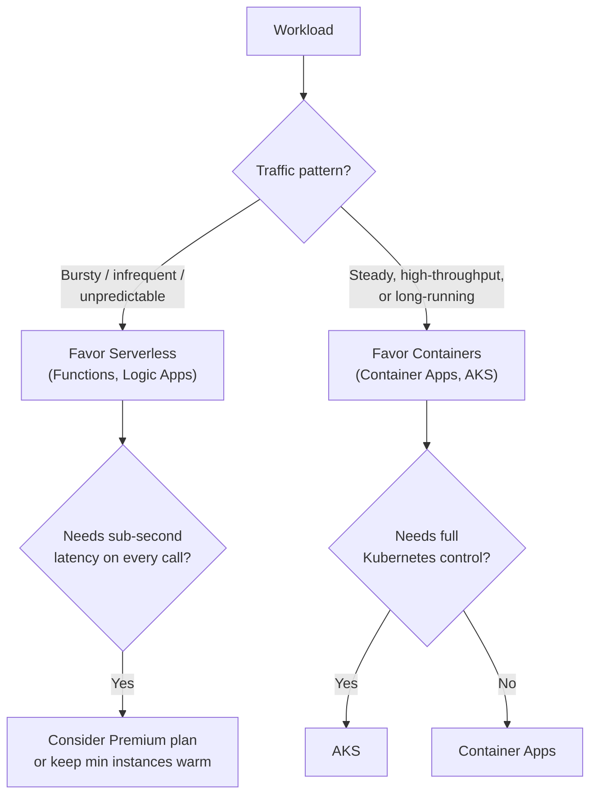
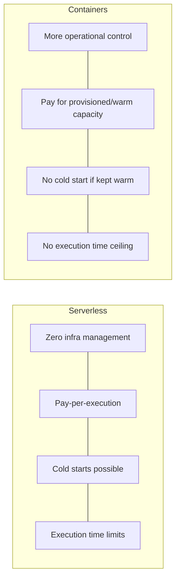

# Serverless vs Container-Based Architecture — Comparison

## Introduction

Before reading this lesson, you should already be comfortable with **[Building a Serverless Order Pipeline — Real-Time Example](../16-azure-for-dotnet-developers/16-67-serverless-order-pipeline-real-time.md)**, which built one complete workflow entirely out of Functions, Event Grid, and Durable Functions, and with **[Azure Container Apps](../16-azure-for-dotnet-developers/16-15-azure-container-apps.md)** and **[AKS Fundamentals](../16-azure-for-dotnet-developers/16-16-aks-fundamentals.md)** from earlier in this module, which built comparable workloads on managed containers instead. This lesson asks the question those earlier lessons deliberately left open: when should a given piece of E-Commerce, Banking, or Library workload be serverless, and when should it be a container — because the previous lesson's order pipeline could, in fact, have been built entirely on Container Apps instead, and would have worked, just with a different set of trade-offs.

By the end of this lesson, you will be able to:

- Contrast serverless (Functions, Logic Apps) against container-based compute (Container Apps, AKS) across infrastructure ownership, cold starts, and execution limits
- Explain why "no cold starts" for containers is conditional on being kept warm, not an inherent property of containers
- Apply a decision framework based on workload shape — bursty/infrequent versus steady/high-throughput/long-running
- Recognize that a single real system typically mixes both, choosing per-component rather than per-application

## Serverless vs Containers — A Layman's Perspective

Return once more to the ride-share-versus-owned-car comparison from Lesson 65, but now push it further, because that lesson only established that serverless behaves like ride-sharing — it didn't yet compare ride-sharing against the *other* realistic alternative: leasing a car with a driver, kept running and parked right outside, ready the instant you walk out the door, for a flat monthly rate regardless of how often you actually use it.

A leased, always-idling car is the container model. You're not managing the engine, the oil changes, or the driver's schedule — a fair amount of "management" has genuinely been handed off, the same way Container Apps hides the underlying Kubernetes control plane. But unlike ride-sharing, that car is *yours*, sitting there, burning a flat rate whether you use it four times today or zero times. In exchange, it never makes you wait even thirty seconds for a car to arrive — it's already there, engine warm, the instant you need it.

Now think about which of these two arrangements actually makes sense for different people. Someone who takes exactly one unpredictable trip every few days is paying dramatically more with the leased car than they would with ride-sharing, for a "no-wait" benefit they rarely even need. Someone who needs a car available literally every hour, all day, every day — a courier running back-to-back deliveries nonstop — is paying dramatically more with ride-sharing's per-trip pricing than they would just leasing the thing outright, and they'd also be paying, over and over, for that brief dispatch delay on every single one of dozens of daily trips.

That's the entire comparison this lesson is building toward, stated in one line: serverless (ride-sharing) wins when demand is bursty or infrequent, because you stop paying — and stop "waiting" — the instant nobody's using it, and containers (the leased car) win when demand is steady and constant, because a small, fixed, always-warm cost beats paying a per-trip premium and repeatedly eating a small delay, hour after hour, all day long.

## Serverless vs Containers — A Programming Language Perspective

**Serverless compute** (Azure Functions, Logic Apps) hands the platform full control over provisioning, scaling — including down to zero instances — and per-request or per-execution-second billing, at the cost of a bounded execution time per invocation (10 minutes by default on the Consumption plan, extendable on Premium) and a cold start whenever an instance must be created from nothing. **Container-based compute** (Azure Container Apps, AKS) runs your own container image on infrastructure Azure manages to varying degrees — Container Apps abstracts the Kubernetes control plane away entirely, AKS exposes it directly — giving you a long-running process with no per-invocation time limit, full control over the runtime environment, and, critically, *no* cold start for any request handled by an already-running replica; a scaled-to-zero Container App replica still incurs a cold start on its first request; only a replica held warm (`minReplicas` ≥ 1) genuinely avoids one. The operational cost of that control is real: container images to build and patch, resource requests/limits to tune, and — for AKS specifically — a cluster's control plane and node pools to keep healthy, none of which Functions or Logic Apps ask of you at all.

## How to Read the Decision Signals in an Azure Architecture

Rather than a single how-to procedure, this comparison is best made concrete by inspecting the actual configured scaling behavior of a workload already running on Azure — the same `az` commands from Lesson 65's audit, read for a different purpose here.


*Figure 1: A workload's traffic shape and latency needs point toward serverless or containers, and toward which specific service within each.*

```bash
# Azure CLI — read the scaling configuration that actually determines cold-start exposure
az functionapp show --name func-order-intake --resource-group rg-ecommerce-prod \
  --query "{plan:appServicePlanId}" --output tsv

az containerapp show --name ca-inventory-service --resource-group rg-ecommerce-prod \
  --query "properties.template.scale.{minReplicas:minReplicas, maxReplicas:maxReplicas}" --output table
```

**Azure CLI Output:**

```text
/subscriptions/.../serverfarms/plan-order-consumption

MinReplicas    MaxReplicas
-------------  -------------
0              10
```

`MinReplicas: 0` on `ca-inventory-service` means this particular Container App is *also* subject to a cold start on its first request after idling — it has opted into the same scale-to-zero economics as the Function App above it, at the cost of the same wait. Setting `MinReplicas: 1` would remove the cold start entirely, at the cost of paying for one replica continuously, whether or not it's handling traffic — the exact leased-car trade-off from the layman's section, made literal in one CLI flag.

## Real-Time Example: Choosing Compute for the Banking Platform's Three Workloads

We turn to the Banking/ATM case study for this lesson's example, since a single bank's platform typically needs both models at once. Three workloads illustrate the decision cleanly: a nightly interest-accrual batch job, a customer-facing balance-check API hit constantly during business hours, and an infrequent wire-transfer-approval webhook.

```csharp
// ComputeChoiceDecision.cs — .NET 10 / C# 14 — Real-Time Example (Banking/ATM)
public sealed record Workload(string Name, string TrafficShape, int AvgCallsPerHour, bool LatencySensitive);

Workload[] workloads =
[
    new("InterestAccrualBatchJob",   "Runs once nightly, ~20 minutes", 0,    LatencySensitive: false),
    new("BalanceCheckApi",           "Steady, constant during business hours", 50_000, LatencySensitive: true),
    new("WireTransferApprovalHook",  "A few calls per day, unpredictable", 5, LatencySensitive: false)
];

foreach (Workload w in workloads)
{
    string recommendation = (w.AvgCallsPerHour, w.LatencySensitive) switch
    {
        (0, _) => "Serverless (Function, timer-triggered) — pure batch, no waiting client",
        (_, true) when w.AvgCallsPerHour > 1000 => "Containers (Container Apps, kept warm) — steady, latency-sensitive",
        _ => "Serverless (Function, HTTP-triggered) — bursty, infrequent, no warm cost justified"
    };
    Console.WriteLine($"{w.Name,-26} [{w.TrafficShape,-38}] -> {recommendation}");
}
```

**Console Output:**

```text
InterestAccrualBatchJob   [Runs once nightly, ~20 minutes       ] -> Serverless (Function, timer-triggered) — pure batch, no waiting client
BalanceCheckApi           [Steady, constant during business hours] -> Containers (Container Apps, kept warm) — steady, latency-sensitive
WireTransferApprovalHook  [A few calls per day, unpredictable    ] -> Serverless (Function, HTTP-triggered) — bursty, infrequent, no warm cost justified
```

`BalanceCheckApi` is the interesting case: it's the one workload where a cold start on any request would be unacceptable to a customer standing at an ATM, and its constant call volume means a warm container's fixed cost is already amortized across tens of thousands of calls per hour — serverless's per-execution pricing would not meaningfully beat it, and would occasionally cost a customer a multi-second wait. `InterestAccrualBatchJob` and `WireTransferApprovalHook` show the opposite: neither has anyone waiting on a tight latency budget, and both would pay for a huge amount of guaranteed-idle time on a container kept warm around the clock for a job that runs for twenty minutes a night or five times a day.

## Decision Table by Workload Characteristics

| Workload Characteristic | Recommended Model | Why |
|---|---|---|
| Bursty, unpredictable, or infrequent traffic | Serverless (Functions, Logic Apps) | Pay only for actual executions; zero cost while idle |
| Steady, high-throughput, latency-sensitive traffic | Containers (Container Apps, AKS, kept warm) | Fixed warm cost amortizes across high volume; no cold start |
| Long-running processes (minutes to hours per unit of work) | Containers | No execution-time ceiling, unlike Consumption-plan Functions |
| Needs fine-grained infrastructure/networking control | AKS | Full Kubernetes API surface, custom ingress, node-level tuning |
| Needs managed containers without owning Kubernetes | Container Apps | Middle ground: containers, Dapr, scale-to-zero, no cluster to run |
| Simple event reaction, sub-minute execution | Serverless (Functions) | Matches the execution model exactly; minimal code for the job |


*Figure 2: Serverless trades operational simplicity and elasticity for cold starts and time limits; containers trade the reverse.*

## Types of Compute Models Covered in This Comparison

1. **[Introduction to Azure Functions](../16-azure-for-dotnet-developers/16-12-introduction-to-azure-functions.md)** — serverless compute, this comparison's primary serverless representative.
2. **Azure Logic Apps** (covered in Module 16's Messaging & Integration lessons) — serverless, low-code workflow compute.
3. **[Azure Container Apps](../16-azure-for-dotnet-developers/16-15-azure-container-apps.md)** — managed containers with optional scale-to-zero, this comparison's middle-ground representative.
4. **[AKS Fundamentals](../16-azure-for-dotnet-developers/16-16-aks-fundamentals.md)** — full Kubernetes control, this comparison's maximum-control representative.
5. **[App Service Scaling (Vertical and Horizontal)](../16-azure-for-dotnet-developers/16-11-app-service-scaling.md)** — a third, always-on model that sits outside both serverless and container-native compute entirely.

## What You've Learned & What's Next

Serverless and containers are not competing "better or worse" options but two different answers to the same question of where your workload's idle-time cost and latency guarantees should sit — serverless for bursty, infrequent work willing to accept an occasional cold start, containers (kept warm) for steady, high-throughput, or long-running work willing to pay for a permanent floor of capacity. Most real systems, like this lesson's Banking platform, use both, chosen per workload rather than as an all-or-nothing architectural stance.

Continue your learning journey with **[Cold Starts and Performance in Serverless .NET](../16-azure-for-dotnet-developers/16-69-cold-starts-serverless-performance.md)**, where we examine the cold-start trade-off this lesson kept deferring, in full depth, including how Native AOT changes the picture.

---
*Applies to: .NET 10 / C# 14. Last reviewed 2026-08-16.*
