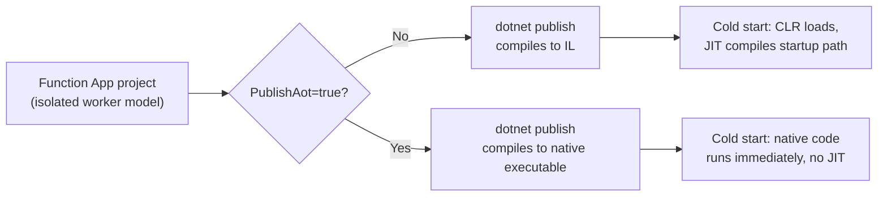
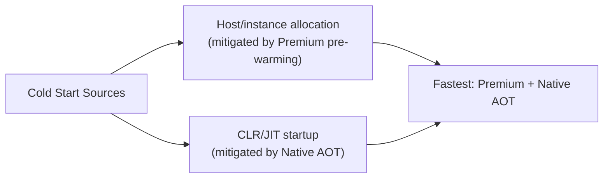

# Cold Starts and Performance in Serverless .NET

## Introduction

Before reading this lesson, you should already be comfortable with **[Serverless vs Container-Based Architecture — Comparison](../16-azure-for-dotnet-developers/16-68-serverless-vs-container-architecture.md)**, which kept naming "the cold start" as serverless's central cost without ever fully explaining what it is or how to reduce it, and with **[JIT vs Native AOT Compilation](../12-advanced-concepts/12-33-jit-vs-native-aot.md)** and **[Introduction to Native AOT](../13-reflection-sourcegen-lowlevel/13-07-introduction-to-native-aot.md)** from Modules 12 and 13, which explained *why* a .NET application takes measurable time to start up in the first place. This lesson is the **capstone of the Serverless & Event-Driven Architecture sub-area**: it closes the cold-start gap those earlier lessons left open, and specifically for .NET, because .NET's JIT-based startup cost interacts with serverless's on-demand instance model in a way that matters more here than almost anywhere else in this curriculum.

By the end of this lesson, you will be able to:

- Explain precisely what a cold start is, and why it's specific to an instance that hasn't run recently, not to serverless as a concept
- Identify why the Consumption plan is most exposed to cold starts, and how the Premium plan's pre-warmed instances mitigate it
- Explain why Native AOT compilation reduces .NET cold-start time dramatically, tying directly back to Module 12/13's Native AOT lessons
- Compare illustrative cold-start timings across Consumption (JIT), Premium, and Native AOT
- Recap the five-lesson Serverless & Event-Driven Architecture sub-area as a whole

## Cold Starts — A Layman's Perspective

Picture a small regional airport with exactly one runway crew, sent home the moment the last flight of a quiet stretch departs, because paying them to stand around a silent runway for hours between infrequent flights would be pure waste. The moment a new flight is scheduled to land, that crew has to be called back in, has to physically travel to the airport, has to walk the runway, check the lighting, confirm the weather instruments — a real, measurable delay between "a flight is coming" and "the runway is actually ready for it." A busier airport, by contrast, keeps a crew on-site around the clock specifically because flights land constantly enough that sending anyone home would just mean immediately calling them back a few minutes later.

That runway-readiness delay is a cold start. It has nothing to do with the flight itself being slow — the plane is exactly as fast as it always is — the delay lives entirely in getting the *ground* ready to receive it, and it only happens because nothing was already prepared, because nothing had reason to be prepared during the preceding quiet stretch. An Azure Function on the Consumption plan behaves exactly like the small airport: Azure genuinely sends the underlying compute instance away when nothing has triggered that Function recently, precisely because that's what makes Consumption pricing so cheap for bursty workloads in the first place — and calling that instance back the moment a new request or event arrives takes a real, measurable amount of time before the very first request can be served.

There are two different ways an airport authority might attack this delay. One: keep a crew on standby permanently, at a real, continuous cost, so a flight is never kept waiting — that's the Premium plan's pre-warmed instances, a small number of instances Azure keeps running specifically so at least one crew is never fully stood down. The other, more interesting fix doesn't touch staffing costs at all — it makes the *runway-readiness checklist itself* dramatically shorter, so that even a fully cold crew, called in from scratch, gets the runway open in a fraction of the previous time. That second fix is what Native AOT does for a .NET Function's own startup: it doesn't buy standby crews, it shrinks the checklist.

## Cold Starts — A Programming Language Perspective

A **cold start** is the additional latency incurred by the very first request or event handled by a compute instance that did not already exist, versus a **warm** instance already running and ready. For .NET Azure Functions specifically, that latency has two layered sources: the Functions host's own instance-allocation and worker-process startup, and — the part specific to .NET as a runtime — the CLR's own startup cost, including loading the runtime, JIT-compiling the methods on the application's startup path, and running any static initializers, exactly the JIT behavior [JIT vs Native AOT Compilation](../12-advanced-concepts/12-33-jit-vs-native-aot.md) covered in general terms. The **Consumption plan** is most exposed to this because it is the plan that most aggressively scales to zero between invocations, per Lesson 65's definition of serverless. The **Premium plan** mitigates the host-allocation half of the delay by keeping a configurable number of **pre-warmed instances** always running, ready to receive the very next request with zero allocation delay — but a Premium-plan Function still pays the .NET runtime startup cost on each pre-warmed instance's first request, unless that instance is also compiled with **Native AOT**, which eliminates JIT compilation from the startup path entirely by compiling the whole application to native machine code ahead of time, at build, exactly as [Introduction to Native AOT](../13-reflection-sourcegen-lowlevel/13-07-introduction-to-native-aot.md) described — the two mitigations are independent and stack: Native AOT shrinks *how long* an instance takes to become ready; Premium's pre-warming reduces *how often* that readiness delay is even on the critical path.

## How to Publish a Native AOT Azure Function

Publishing a .NET Function with Native AOT uses the same `PublishAot` flag from [Publishing a Native AOT Application](../13-reflection-sourcegen-lowlevel/13-08-publishing-native-aot-app.md), applied to an isolated-worker Function App project rather than a general console or web app.


*Figure 1: Native AOT removes the JIT-compilation portion of a Function's cold-start path entirely, at build time rather than at every startup.*

```bash
# Publish an isolated-worker .NET 10 Function App with Native AOT
dotnet publish --configuration Release --runtime linux-x64 --self-contained \
  -p:PublishAot=true -p:FUNCTIONS_WORKER_RUNTIME=dotnet-isolated

# Deploy the resulting native executable to a Premium-plan Function App
az functionapp deployment source config-zip \
  --name func-order-intake-aot --resource-group rg-ecommerce-prod \
  --src ./bin/Release/net10.0/linux-x64/publish.zip
```

**Console Output (build):**

```text
Restored ...
Generating native code
publish/func-order-intake-aot (linux-x64) -> bin/Release/net10.0/linux-x64/publish/
```

**Console Output (illustrative — Application Insights, first request after idle):**

```text
Cold start (JIT, Consumption):     1,842 ms until first response
Cold start (Premium, pre-warmed):    210 ms until first response
Cold start (Native AOT, Premium):     45 ms until first response
```

The Native AOT figure is dramatically lower not because Premium's pre-warming stopped mattering, but because there is almost nothing left in the startup path for the CLR to JIT — the executable's machine code already exists on disk, exactly as it will be run, the moment the process starts. Note that these figures are illustrative for a moderately sized Function App; exact numbers depend heavily on assembly count, trimming configuration, and dependency graph, but the *relative* ordering — Native AOT fastest, plain JIT slowest, Premium pre-warming meaningfully improving JIT's number without eliminating the runtime-startup component entirely — holds consistently.

## Real-Time Example: Diagnosing a Cold-Start Complaint in the Library Catalog Service

We turn to the Library/Inventory Management case study for this capstone's example. The `LibraryCatalogSearch` Function, HTTP-triggered and running on the Consumption plan, has drawn a complaint: patrons occasionally see a multi-second delay the first time they search after the library's slow overnight hours.

```csharp
// ColdStartDiagnostic.cs — .NET 10 / C# 14 — Real-Time Example (Library/Inventory Management)
public sealed record ColdStartMeasurement(string FunctionName, string Plan, bool NativeAot, int FirstRequestMs);

ColdStartMeasurement[] measurements =
[
    new("LibraryCatalogSearch", "Consumption", NativeAot: false, FirstRequestMs: 1_710),
    new("LibraryCatalogSearch", "Premium",     NativeAot: false, FirstRequestMs: 260),
    new("LibraryCatalogSearch", "Premium",     NativeAot: true,  FirstRequestMs: 52)
];

Console.WriteLine("LibraryCatalogSearch — first-request latency by configuration:");
foreach (ColdStartMeasurement m in measurements)
{
    string aot = m.NativeAot ? "Native AOT" : "JIT";
    Console.WriteLine($"  {m.Plan,-12} [{aot,-10}] -> {m.FirstRequestMs,5} ms");
}

var cheapest = measurements.OrderBy(m => m.FirstRequestMs).First();
Console.WriteLine();
Console.WriteLine($"Fastest cold start: {cheapest.Plan} + {(cheapest.NativeAot ? "Native AOT" : "JIT")} at {cheapest.FirstRequestMs} ms");
```

**Console Output:**

```text
LibraryCatalogSearch — first-request latency by configuration:
  Consumption  [JIT       ] ->  1710 ms
  Premium      [JIT       ] ->   260 ms
  Premium      [Native AOT] ->    52 ms

Fastest cold start: Premium + Native AOT at 52 ms
```

For a public library catalog search, a 1.7-second stall after overnight idle time is a real, patron-visible complaint, but staying on the Consumption plan year-round for a low-traffic branch system may still be the right cost trade-off most hours of the day. The practical fix landed on here is exactly the two independent, stacking mitigations this lesson covered: move to Premium for the pre-warmed instance, and publish the Function with Native AOT, which together take the worst-case delay from nearly two seconds down to essentially imperceptible, without changing a single line of the catalog-search business logic itself — only the build and hosting configuration changed.

## Recap: The Serverless & Event-Driven Architecture Sub-Area

This lesson closes a five-lesson sub-area, and it's worth tracing the thread all the way through:

- **[Serverless Architecture Fundamentals on Azure](../16-azure-for-dotnet-developers/16-65-serverless-architecture-on-azure.md)** established that serverless is a style — no server management, scale-to-zero, execution-based billing — spanning Functions, Container Apps, Logic Apps, Cosmos DB, and Service Bus/Event Grid, not one single product.
- **[Event-Driven Architecture with Functions and Event Grid](../16-azure-for-dotnet-developers/16-66-event-driven-functions-event-grid.md)** combined two of those serverless building blocks into a concrete fan-out pattern, grounding Module 12's abstract event-driven architecture in an actual Azure implementation.
- **[Building a Serverless Order Pipeline — Real-Time Example](../16-azure-for-dotnet-developers/16-67-serverless-order-pipeline-real-time.md)** assembled a complete, working system from those pieces plus Durable Functions, with genuine retry and compensation logic.
- **[Serverless vs Container-Based Architecture — Comparison](../16-azure-for-dotnet-developers/16-68-serverless-vs-container-architecture.md)** weighed that pipeline's serverless shape against the container-based alternative, by workload characteristics rather than blanket preference.
- This lesson closed the one cost that comparison kept deferring — the cold start — down to the level of a specific .NET-runtime mechanism and a specific, version-gated fix.

## Cold-Start Mitigations Compared

| Aspect | Consumption (JIT) | Premium (JIT, pre-warmed) | Native AOT (any plan) |
|---|---|---|---|
| Host allocation delay | Full delay, every idle-to-active transition | Eliminated for pre-warmed instances | Same as chosen plan — orthogonal to AOT |
| CLR/JIT startup cost | Full JIT cost on every cold instance | Full JIT cost, but only outside pre-warmed capacity | Eliminated — no JIT step at all |
| Ongoing cost while idle | None | Fixed cost for pre-warmed instances | None beyond chosen plan's baseline |
| Best fit | Very bursty, cost-sensitive, latency-tolerant workloads | Latency-sensitive workloads that still need to scale elastically | Any latency-sensitive serverless workload, stacks with either plan |


*Figure 2: The two independent, stacking mitigations for a .NET Azure Function's cold start.*

## Types of Cold-Start Mitigations in Azure Functions

1. **Premium plan pre-warmed instances** — eliminates host-allocation delay by keeping a minimum instance count always running.
2. **[Native AOT compilation](../13-reflection-sourcegen-lowlevel/13-07-introduction-to-native-aot.md)** — eliminates JIT startup cost by compiling ahead of time to native code.
3. **Always Ready instances** (Flex Consumption plan) — a middle-ground option guaranteeing a set number of instances stay warm even on a consumption-style billing plan.
4. **Minimizing dependency graph / trimming** — fewer assemblies to load and initialize shortens both JIT and Native AOT startup paths alike.
5. **[Serverless vs Container-Based Architecture — Comparison](../16-azure-for-dotnet-developers/16-68-serverless-vs-container-architecture.md)** — the alternative of avoiding cold starts altogether by choosing a kept-warm container instead.

## What You've Learned & What's Next

A cold start is the price an idle-to-active compute instance pays to become ready, and for .NET Azure Functions specifically it has two independent, stacking fixes: Premium's pre-warmed instances remove the host-allocation delay, and Native AOT removes the JIT-compilation delay by compiling the whole application ahead of time — the two together turning a multi-second worst case into one imperceptible to a patron, customer, or teller waiting on the other end. That closes the Serverless & Event-Driven Architecture sub-area: from defining what serverless even means, through a concrete event-driven pattern and a full working pipeline, through weighing it against containers, to this lesson's answer to serverless's one genuine performance cost.

Continue your learning journey with **[Azure Cost Management Basics](../16-azure-for-dotnet-developers/16-70-azure-cost-management-basics.md)**, where the module turns from architecture to the cost and governance tooling needed to keep every pattern covered so far — serverless or otherwise — under control at scale.

---
*Applies to: .NET 10 / C# 14. Last reviewed 2026-08-16.*
