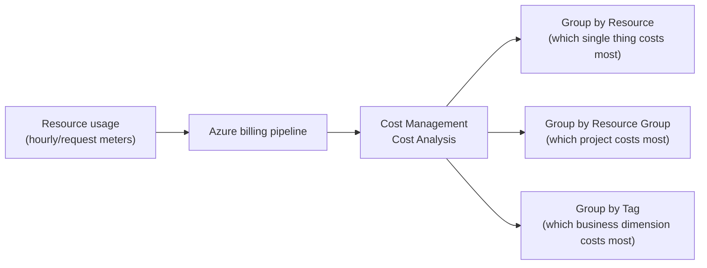
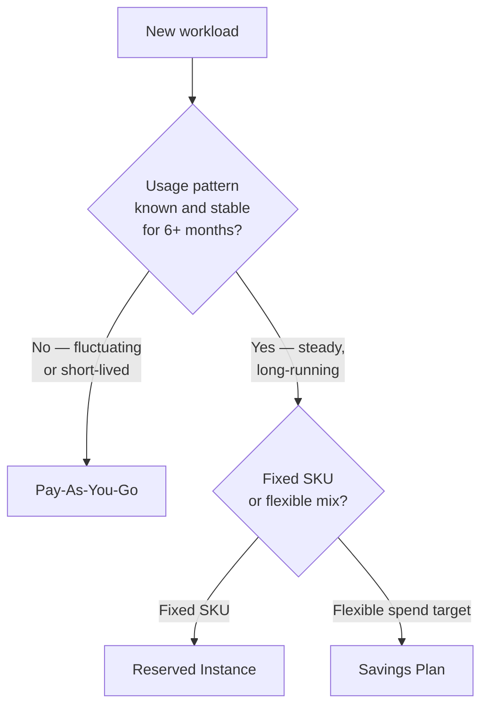

# Azure Cost Management Basics

## Introduction

Before reading this lesson, you should already be comfortable with **[Cold Starts and Performance in Serverless .NET](../16-azure-for-dotnet-developers/16-69-cold-starts-serverless-performance.md)**, and specifically with the fact that choosing between an always-on App Service Plan and a consumption-based Functions plan is fundamentally a performance-versus-cost trade-off. Module 16, Lesson 6 introduced Azure's pay-as-you-go pricing model in plain terms — metered continuously, billed monthly, avoid surprises with a budget alert. That was necessarily a beginner's first pass, delivered before this module had provisioned more than a handful of resources. Now that you've built out App Services, container platforms, databases, storage accounts, and identity infrastructure across sixty-plus lessons, it's time to open the actual **Cost Management + Billing** portal and read what all of that has really been costing, broken down the way a finance team would actually want to see it.

By the end of this lesson, you will be able to:

- Navigate the Cost Management + Billing portal and locate the Cost Analysis blade
- Break down spend by resource, by resource group, and by tag to answer "what is actually costing money, and why"
- Read a monthly bill and map its line items back to the resources that generated them
- Explain how Reserved Instances and Savings Plans convert predictable, long-running usage into a substantial discount over pay-as-you-go
- Decide, for a given workload, whether it is a pay-as-you-go candidate or a reservation candidate

## Cost Management — A Layman's Perspective

Picture the moment a monthly credit card statement arrives. There are two very different ways to read it. The lazy way is to glance at the total due at the bottom and pay it — which tells you *how much*, but nothing about *why*. The useful way is to open the itemized statement most card issuers now provide, which groups every charge by category: groceries, dining, travel, subscriptions. Suddenly the number stops being a mystery. Maybe dining is three times what you expected, and now you know exactly where to look if you want to spend less next month. Same total, wildly different amount of insight, purely because of how the charges were grouped.

Azure's Cost Management + Billing portal is that itemized statement for a subscription's cloud spend, and it offers considerably more than one way to slice it. You can group by *resource* — this specific database, that specific App Service — which answers "which individual thing is the most expensive." You can group by *resource group* — the whole "order-api-prod" folder from Module 16, Lesson 3 — which answers "which whole project or environment costs the most." And, most powerfully once you start labeling things (the subject of this sub-area's final lesson), you can group by *tag* — "everything tagged `Environment: Production`" or "everything tagged `CostCenter: Engineering`" — which answers business questions the resource hierarchy alone can never answer, like "how much does the Engineering department's slice of the bill actually cost, across a dozen different resource groups."

Now consider a second, separate decision that has nothing to do with reading a bill after the fact: how you *pay* for something you already know you'll be using for a long time. Think about a gym. Paying the drop-in day-pass rate every single visit is flexible — you can stop anytime, no commitment — but it is, per visit, by far the most expensive way to use that gym. Commit to an annual membership instead, paid upfront or in fixed monthly installments, and the per-visit cost drops dramatically, precisely because you've told the gym "I'm not going anywhere, plan around that." Azure's **Reserved Instances** and **Savings Plans** are that annual membership, applied to compute you already know, with reasonable confidence, will keep running for a year or three: commit to that duration upfront, in exchange for a substantial discount off the pay-as-you-go day-pass rate for the exact same resource.

The trap, in both halves of this analogy, is applying the wrong tool to the wrong situation. Grouping a bill by tag is wasted effort if nothing was ever tagged in the first place — there's nothing to group. And committing to a gym membership for a workout routine you might abandon next month locks in a cost you didn't need to lock in. This lesson is about learning to read the itemized statement clearly enough to know, resource by resource, which of those two situations you're actually in.

## Cost Management — A Programming Language Perspective

**Azure Cost Management + Billing** is the portal blade (and equivalent `az costmanagement` CLI surface) that aggregates metered usage records — the same underlying data Lesson 6's `az consumption usage list` reads — into queryable, groupable views scoped to a subscription, resource group, or management group. Its central tool, **Cost Analysis**, accepts a **scope**, a **time range**, and one or more **group-by dimensions** (resource, resource group, resource type, meter category, or tag key), and returns a cost breakdown as both a chart and an exportable table. Costs can be viewed as **actual cost** (what was billed) or **amortized cost** (an upfront reservation purchase spread evenly across its commitment period, so a one-year reservation paid in a lump sum doesn't distort a single month's chart). **Reserved Instances (RIs)** commit to a *specific resource SKU* (e.g., a particular VM size) for one or three years; **Savings Plans** commit to a *dollar-per-hour spend target* across a broader, more flexible set of compute services, trading a little discount depth for a lot more flexibility.

## How to Read Cost Analysis by Resource, Resource Group, and Tag

Cost Analysis is reachable from the Portal under **Cost Management + Billing → Cost Analysis**, or programmatically via `az costmanagement query`. The same underlying data supports all three groupings; only the `group-by` dimension changes.


*Figure 1: The same metered usage data, grouped three different ways to answer three different questions.*

```bash
# Cost for the last 30 days, grouped by resource group, for the current subscription
az costmanagement query \
  --type ActualCost \
  --timeframe MonthToDate \
  --scope "subscriptions/00000000-0000-0000-0000-000000000000" \
  --dataset-aggregation '{"totalCost":{"name":"PreTaxCost","function":"Sum"}}' \
  --dataset-grouping name=ResourceGroupName type=Dimension
```

**Azure CLI Output (illustrative):**

```text
Columns: PreTaxCost, ResourceGroupName, Currency
------------------------------------------------
   842.17   rg-orderapi-prod             USD
   118.30   rg-orderapi-staging          USD
    22.45   rg-orderapi-dr               USD
```

```csharp
// Program.cs — .NET 10 / C# 14
using Azure.Identity;
using Azure.ResourceManager;
using Azure.ResourceManager.CostManagement;
using Azure.ResourceManager.CostManagement.Models;

var armClient = new ArmClient(new DefaultAzureCredential());
ResourceIdentifier subscriptionScope = new("/subscriptions/00000000-0000-0000-0000-000000000000");

QueryDefinition query = new(ExportType.ActualCost, TimeframeType.MonthToDate)
{
    Dataset = new QueryDataset
    {
        Granularity = GranularityType.None,
        Aggregation = { ["totalCost"] = new QueryAggregation("PreTaxCost", FunctionType.Sum) },
        Grouping = { new QueryGrouping(QueryColumnType.Dimension, "ResourceGroupName") }
    }
};

QueryResult result = armClient.GetGenericResource(subscriptionScope)
    .GetCostManagementQueryClient()
    .Usage(subscriptionScope, query);

foreach (IList<object> row in result.Rows)
{
    Console.WriteLine($"{row[0],10:F2}  {row[1]}");
}
```

**Console Output (illustrative — actual values depend on real subscription usage):**

```text
    842.17  rg-orderapi-prod
    118.30  rg-orderapi-staging
     22.45  rg-orderapi-dr
```

The CLI call and the SDK call above ask the exact same question two different ways, and both return the exact same shape of answer: a total cost per resource group. Swap `ResourceGroupName` for `ResourceType` and the same query answers "which *kind* of resource is expensive" instead; swap it for a tag key like `Environment` — once resources are actually tagged, the subject of Lesson 73 — and it answers "which business dimension is expensive," independent of resource-group boundaries entirely.

## Real-Time Example: Reading the Order API's Bill and Sizing a Reservation

Continuing the E-Commerce Order Processing domain, the order API's production footprint from Lesson 6 — an App Service Plan, an Azure SQL Database, a storage account — has now been running continuously for eight months. It's time to check whether that steady-state usage justifies a reservation.

```csharp
// OrderApiReservationAnalysis.cs — .NET 10 / C# 14 — Real-Time Example (E-Commerce Order Processing)
public sealed record ResourceCost(string Resource, decimal MonthlyPayAsYouGo, decimal MonthlyReserved1Yr, int MonthsRunningContinuously);

ResourceCost[] resources =
[
    new("App Service Plan (P1v3)", MonthlyPayAsYouGo: 146.00m, MonthlyReserved1Yr: 95.90m, MonthsRunningContinuously: 8),
    new("Azure SQL Database (S2)", MonthlyPayAsYouGo: 75.00m, MonthlyReserved1Yr: 48.75m, MonthsRunningContinuously: 8),
    new("Storage Account", MonthlyPayAsYouGo: 4.20m, MonthlyReserved1Yr: 4.20m, MonthsRunningContinuously: 8) // no reservation SKU for storage
];

Console.WriteLine("Order API production footprint — reservation candidacy:");
foreach (ResourceCost r in resources)
{
    decimal annualSavings = (r.MonthlyPayAsYouGo - r.MonthlyReserved1Yr) * 12;
    bool candidate = r.MonthsRunningContinuously >= 6 && annualSavings > 0;
    Console.WriteLine($" - {r.Resource,-26} PAYG: ${r.MonthlyPayAsYouGo,7:F2}/mo  Reserved: ${r.MonthlyReserved1Yr,7:F2}/mo  " +
                      $"Annual savings if reserved: ${annualSavings,7:F2}  Candidate: {candidate}");
}
```

**Console Output:**

```text
Order API production footprint — reservation candidacy:
 - App Service Plan (P1v3)     PAYG: $ 146.00/mo  Reserved: $  95.90/mo  Annual savings if reserved: $ 601.20  Candidate: True
 - Azure SQL Database (S2)     PAYG: $  75.00/mo  Reserved: $  48.75/mo  Annual savings if reserved: $ 315.00  Candidate: True
 - Storage Account             PAYG: $   4.20/mo  Reserved: $   4.20/mo  Annual savings if reserved: $   0.00  Candidate: False
```

Eight months of continuous, unchanging usage on the App Service Plan and the SQL Database is exactly the signal a reservation is designed for — the team isn't guessing about future usage, they're looking at eight months of Cost Analysis history that already proves the pattern. The storage account, by contrast, isn't eligible for this kind of reservation at all; its low per-GB rate is already close to the floor. Recognizing that difference — reserve the steady compute and database tiers, leave the already-cheap storage on pay-as-you-go — is precisely the judgment call this lesson exists to build.

## Reserved Instances / Savings Plans vs Pay-As-You-Go

Pay-as-you-go remains the right default for anything with usage that fluctuates or that might be decommissioned soon — Lesson 6's staging environment, or a proof-of-concept nobody has committed to running past this quarter. Reservations and Savings Plans exist specifically for the opposite case: usage stable and predictable enough, over a long enough history, that committing to it upfront is a safe bet rather than a gamble. The discount is real and substantial — commonly 30-60% off pay-as-you-go rates for a one-year commitment, more for three years — but it is paid for with reduced flexibility: canceling a Reserved Instance early forfeits some or all of the discount, and switching that VM size means the reservation may no longer apply.


*Figure 2: Deciding between pay-as-you-go, a Reserved Instance, and a Savings Plan based on usage predictability and SKU flexibility.*

| Aspect | Pay-As-You-Go | Reserved Instance | Savings Plan |
|---|---|---|---|
| Commitment | None | 1 or 3 years, specific SKU | 1 or 3 years, $/hour spend target |
| Discount depth | None (baseline rate) | Deep (up to ~60%+) | Slightly less deep, more flexible |
| Flexibility | Full — stop anytime | Low — tied to a specific VM size/region | Higher — applies across eligible compute |
| Best for | Fluctuating, short-lived, or unproven workloads | Well-understood, stable, single-SKU workloads | Stable spend across a mix of compute services |
| Risk if usage changes | None | Reservation may go unused | Spend target may be under- or over-shot |

## Types of Cost Management Views and Related Tools

1. **[Budgets, Alerts, and Cost Optimization](../16-azure-for-dotnet-developers/16-71-budgets-alerts-cost-optimization.md)** — next lesson, turning this lesson's read-only analysis into proactive alerts and recommendations.
2. **Cost Analysis exports** — scheduled exports of Cost Analysis data to a storage account, for long-term trend analysis or Power BI dashboards.
3. **Azure Advisor cost recommendations** — automated, per-resource right-sizing and idle-resource suggestions, covered in depth next lesson.
4. **[Azure Governance and Management Groups](../16-azure-for-dotnet-developers/16-72-azure-governance-management-groups.md)** — rolling Cost Analysis up across multiple subscriptions at once.
5. **[Tagging Strategies for Cost Tracking](../16-azure-for-dotnet-developers/16-73-tagging-strategies-for-cost-tracking.md)** — the tag-based grouping this lesson introduced, covered as this sub-area's capstone.
6. **Azure Hybrid Benefit** — a separate discount mechanism for reusing existing on-premises Windows Server/SQL Server licenses, orthogonal to reservations.

## What You've Learned & What's Next

Cost Analysis turns a single opaque monthly total into an answerable question — grouped by resource, by resource group, or by tag — and Reserved Instances or Savings Plans convert genuinely predictable, long-running usage, the kind this lesson's Cost Analysis history reveals, into a substantial discount over the pay-as-you-go default from Lesson 6.

Continue your learning journey with **[Budgets, Alerts, and Cost Optimization](../16-azure-for-dotnet-developers/16-71-budgets-alerts-cost-optimization.md)**, where this lesson's read-only analysis becomes a proactive budget with automatic threshold alerts and Azure Advisor's cost-optimization recommendations.

---
*Applies to: .NET 10 / C# 14. Last reviewed 2026-08-16.*
