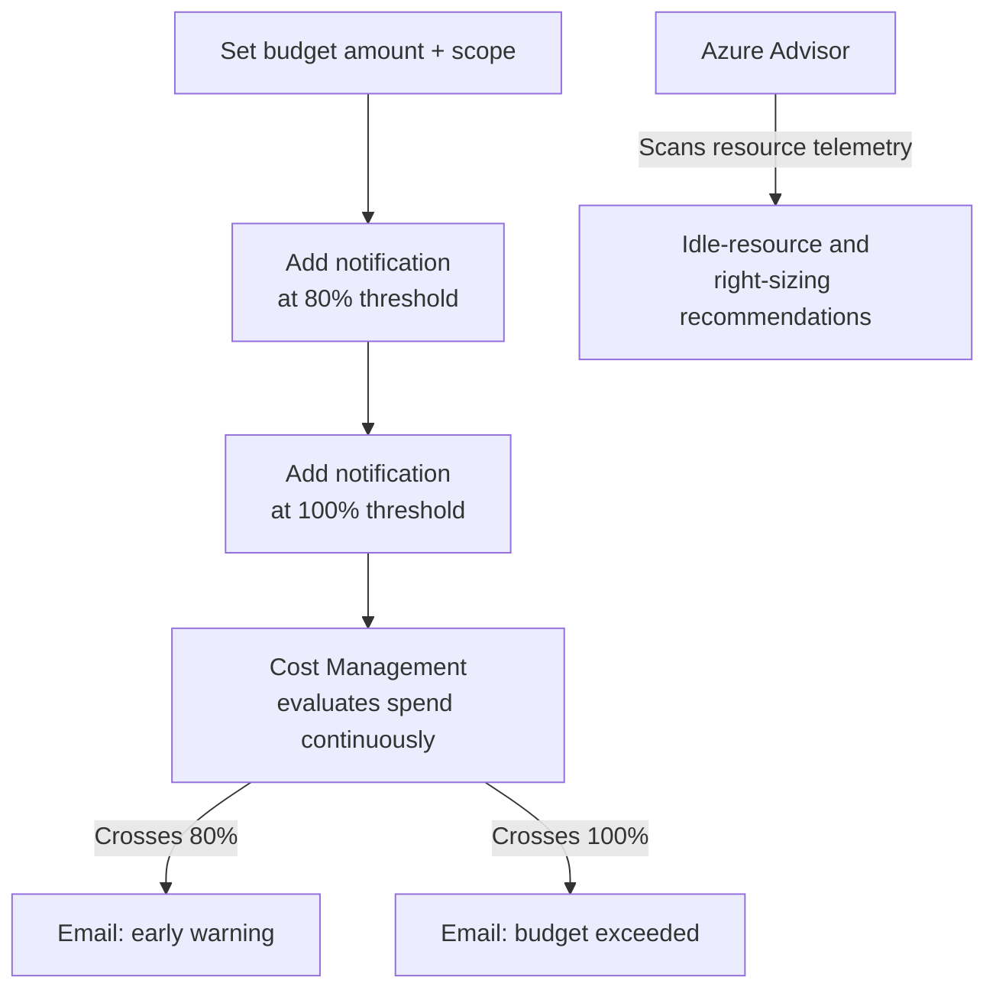
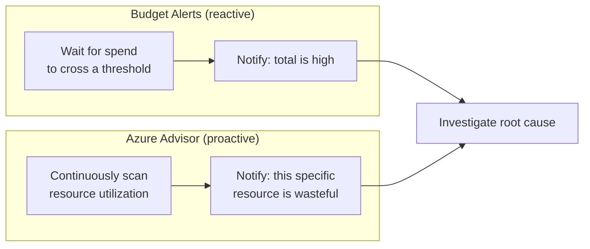

# Budgets, Alerts, and Cost Optimization

## Introduction

Before reading this lesson, you should already be comfortable with **[Azure Cost Management Basics](../16-azure-for-dotnet-developers/16-70-azure-cost-management-basics.md)**, including how to read Cost Analysis grouped by resource, resource group, and tag, and when a Reserved Instance beats pay-as-you-go. That entire previous lesson was, deliberately, about *looking back* — reading a bill after the fact. This lesson is about looking forward: setting a budget that watches spend in near-real time and emails someone the moment it crosses a threshold, and using Azure Advisor to catch waste before it ever shows up as a line item worth investigating.

By the end of this lesson, you will be able to:

- Create a monthly budget scoped to a subscription or resource group
- Configure threshold alerts that fire automatically at, for example, 80% and 100% of that budget
- Read Azure Advisor's cost-optimization recommendations for idle resources and right-sizing opportunities
- Identify the most common real-world causes of a surprise Azure bill
- Build the habit of treating a budget alert as a signal to investigate, not an emergency to panic over

## Budgets and Alerts — A Layman's Perspective

A household budget that exists only as a number written on a sticky note is nearly useless — nobody checks the sticky note in real time while they're shopping. A budget that actually changes behavior is one paired with a notification: a banking app that buzzes your phone the moment a spending category crosses 80% of what you allotted for the month, well before you've blown through the whole thing. The value isn't the number itself; it's the *timing* of the warning. Learning you overspent on the 31st, staring at a final statement, is too late to do anything about it. Learning it on the 24th, at 80%, still leaves a week to course-correct.

Azure budgets work on exactly that principle, and they map cleanly onto the previous lesson's Cost Analysis scopes: a budget can watch an entire subscription, a single resource group, or a specific tag, and it can carry multiple threshold alerts — commonly one around 80% as an early warning and another at 100% as a harder line — each one firing an email (or a webhook to a more elaborate automated response) the instant Cost Management's data crosses it. Nobody has to remember to go check a dashboard; the dashboard comes looking for you instead.

Now, separately, imagine a household that dutifully sets that budget and its alerts, but never actually looks at *why* it keeps tripping. A smarter approach is to also have someone walking through the house pointing out the specific, fixable habits driving the bill up — a space heater left running in an empty guest room, a streaming subscription nobody's used in four months, a data plan sized for a family of six when it's just two people now. That's Azure Advisor's cost role: it doesn't just tell you the total is high, it points at *specific resources* and says, in effect, "this one has been idle for three weeks," or "this VM is running at 4% CPU around the clock — a smaller, cheaper size would do the exact same job."

The single most avoidable failure mode this lesson wants to name directly, because it happens constantly and to genuinely careful people: a developer spins up a resource for a quick test — a VM, a database, an App Service Plan sized generously "just in case" — finishes the test, and simply forgets to tear it down. Unlike a physical piece of test equipment left on a shelf, a forgotten cloud resource keeps quietly billing, indefinitely, until something — ideally a budget alert, not a shocked glance at an invoice three months later — brings it back to someone's attention.

## Budgets and Alerts — A Programming Language Perspective

An **Azure Budget** is a resource (`Microsoft.Consumption/budgets`, or `az consumption budget create`) that defines a spending amount, a time grain (monthly, quarterly, annually), a scope (subscription, resource group, or a filtered subset via tags), and one or more **notifications**, each specifying a **threshold percentage** and a list of recipient emails or an **action group** for automated responses such as webhooks or Azure Automation runbooks. Thresholds can be evaluated against **actual cost** or **forecasted cost** — the latter alerting *before* the threshold is even reached, based on the current spending trend. **Azure Advisor**'s Cost category surfaces specific, actionable recommendations — computed from actual resource-level telemetry, not guesses — for right-sizing over-provisioned VMs and App Service Plans, and for deleting or shutting down resources showing sustained low or zero utilization.

## How to Configure a Budget Alert and Read Advisor Recommendations

A budget is created once and then runs unattended; Advisor recommendations refresh continuously in the background and simply need to be checked periodically.


*Figure 1: A budget's two threshold alerts firing independently as spend rises, alongside Advisor's continuous, separate scan for waste.*

```bash
# Create a monthly budget on the banking core-services resource group,
# with alerts at 80% (actual) and 100% (forecasted)
az consumption budget create \
  --budget-name budget-corebanking-monthly \
  --amount 4000 \
  --category cost \
  --time-grain monthly \
  --start-date 2026-08-01 \
  --end-date 2027-08-01 \
  --resource-group rg-corebanking-prod

# List Azure Advisor's current cost recommendations
az advisor recommendation list --category Cost --output table
```

**Azure CLI Output (illustrative):**

```text
{
  "name": "budget-corebanking-monthly",
  "amount": 4000,
  "notifications": {
    "actual_GreaterThan_80_Percent": { "threshold": 80, "enabled": true },
    "forecasted_GreaterThan_100_Percent": { "threshold": 100, "enabled": true }
  }
}

Category    Impact    ShortDescription                                  ResourceName
----------  --------  -------------------------------------------------  ---------------------
Cost        High      Right-size or shut down underutilized VM          vm-corebanking-batch
Cost        Medium    App Service Plan has low average CPU usage        asp-corebanking-api
Cost        Low       Buy a reservation for this consistently-used SKU  sql-corebanking-core
```

```csharp
// AdvisorRecommendationTriage.cs — .NET 10 / C# 14
public sealed record AdvisorFinding(string Resource, string Impact, string Recommendation, decimal EstimatedMonthlySavings);

AdvisorFinding[] findings =
[
    new("vm-corebanking-batch", "High", "Idle for 21 days — shut down or delete", 187.40m),
    new("asp-corebanking-api", "Medium", "Average CPU 6% — downsize P2v3 to P1v3", 63.00m),
    new("sql-corebanking-core", "Low", "Steady usage 9 months — buy 1-yr reservation", 41.50m)
];

decimal totalPotentialSavings = findings.Sum(f => f.EstimatedMonthlySavings);
foreach (AdvisorFinding f in findings.OrderByDescending(f => f.EstimatedMonthlySavings))
{
    Console.WriteLine($"[{f.Impact,-6}] {f.Resource,-22} ${f.EstimatedMonthlySavings,7:F2}/mo -> {f.Recommendation}");
}
Console.WriteLine($"\nTotal potential monthly savings if all recommendations are acted on: ${totalPotentialSavings:F2}");
```

**Console Output:**

```text
[High  ] vm-corebanking-batch   $ 187.40/mo -> Idle for 21 days — shut down or delete
[Medium] asp-corebanking-api    $  63.00/mo -> Average CPU 6% — downsize P2v3 to P1v3
[Low   ] sql-corebanking-core   $  41.50/mo -> Steady usage 9 months — buy 1-yr reservation

Total potential monthly savings if all recommendations are acted on: $291.90
```

Notice the budget alert and the Advisor findings are answering two different questions: the budget says "you've crossed a line you drew," while Advisor says "here are three specific, named reasons that line kept getting crossed." Acting on the High-impact finding alone — an idle VM nobody had noticed in three weeks — recovers nearly two-thirds of the total potential savings on its own, which is exactly the pattern real Advisor reports tend to show: a small number of forgotten or oversized resources usually account for most of the avoidable spend.

## Real-Time Example: Catching a Forgotten Test Environment in Banking/ATM

Continuing the Banking/ATM domain, the team's `CoreBankingDbConnectionString` and statement-signing infrastructure from Lesson 33 run in `rg-corebanking-prod`. Alongside it, a `rg-corebanking-loadtest` resource group was created six weeks ago to load-test the ATM transaction endpoint before a regulatory audit deadline — and, as is common, nobody circled back to delete it once the audit passed.

```csharp
// LoadTestEnvironmentAudit.cs — .NET 10 / C# 14 — Real-Time Example (Banking/ATM)
public sealed record TestResource(string Name, string ResourceGroup, DateOnly CreatedOn, DateOnly LastMeaningfulUse, decimal MonthlyCost);

DateOnly today = new(2026, 8, 16);
TestResource[] resources =
[
    new("vm-loadtest-generator", "rg-corebanking-loadtest", new(2026, 7, 5), new(2026, 7, 8), 214.00m),
    new("sql-loadtest-copy", "rg-corebanking-loadtest", new(2026, 7, 5), new(2026, 7, 8), 58.20m),
    new("app-corebanking-atm-prod", "rg-corebanking-prod", new(2025, 11, 1), today, 146.00m)
];

Console.WriteLine("Resource idle audit (flag anything unused for 14+ days):");
foreach (TestResource r in resources)
{
    int idleDays = today.DayNumber - r.LastMeaningfulUse.DayNumber;
    bool flagged = idleDays >= 14;
    string note = flagged ? $"FLAGGED — idle {idleDays} days, ${r.MonthlyCost:F2}/mo wasted" : "active";
    Console.WriteLine($" - {r.Name,-26} [{r.ResourceGroup,-24}] {note}");
}
```

**Console Output:**

```text
Resource idle audit (flag anything unused for 14+ days):
 - vm-loadtest-generator      [rg-corebanking-loadtest] FLAGGED — idle 39 days, $214.00/mo wasted
 - sql-loadtest-copy          [rg-corebanking-loadtest] FLAGGED — idle 39 days, $58.20/mo wasted
 - app-corebanking-atm-prod   [rg-corebanking-prod    ] active
```

A budget alert scoped to the subscription would eventually have caught this as an unexplained rise in total spend, but a budget scoped specifically to `rg-corebanking-loadtest` — a lifecycle-based resource group, exactly per Lesson 3's guidance — would have flagged it far sooner and far more precisely, since that whole group's spend should have dropped to zero the week the audit finished. This is the recurring, entirely preventable cost mistake this lesson names outright: temporary environments that outlive their purpose because deleting them was never made anyone's explicit responsibility.

## Reactive Budget Alerts vs Proactive Advisor Recommendations

A budget alert and an Advisor recommendation are complementary, not competing, tools, and conflating them is a common early mistake. A budget alert is inherently reactive and threshold-based: it says nothing until spend crosses a line you predefined, and it says nothing at all about *why* — just that a number moved. Advisor is proactive and resource-specific: it continuously watches utilization telemetry and surfaces a named resource with a named problem, whether or not any budget has been crossed yet, often catching waste while it's still small enough not to trip any alert at all.


*Figure 2: Budget alerts catch a rising total after the fact; Advisor points at specific causes before the total necessarily even rises much.*

| Aspect | Budget Alerts | Azure Advisor (Cost) |
|---|---|---|
| Trigger | Spend crosses a predefined threshold | Continuous resource-level utilization analysis |
| Granularity | Scope-level total (subscription/RG/tag) | Individual, named resource |
| Timing | After spend has already accumulated | Often before it becomes large |
| Tells you why | No — just that the number moved | Yes — a specific, actionable reason |
| Setup effort | One-time configuration | Zero — always-on by default |

## Types of Cost-Optimization Mechanisms Worth Knowing

1. **[Azure Cost Management Basics](../16-azure-for-dotnet-developers/16-70-azure-cost-management-basics.md)** — the previous lesson's Cost Analysis views this lesson's budgets are scoped against.
2. **Action Groups** — the automation layer a budget notification can trigger beyond email, such as an Azure Function that auto-shuts-down a flagged resource.
3. **Azure Advisor Score** — an aggregate health score across cost, reliability, security, and performance, tracked over time.
4. **Auto-shutdown schedules** — a VM-level feature that stops a dev/test VM automatically outside business hours, preventing the exact mistake in this lesson's Real-Time Example.
5. **[Azure Governance and Management Groups](../16-azure-for-dotnet-developers/16-72-azure-governance-management-groups.md)** — applying budgets and policy consistently across many subscriptions at once, covered next.

## What You've Learned & What's Next

A budget with threshold alerts turns Cost Analysis from something you have to remember to check into something that comes looking for you, while Azure Advisor's cost recommendations point at the specific idle or over-provisioned resources — forgotten test environments chief among them — that are usually the actual root cause behind a rising total.

Continue your learning journey with **[Azure Governance and Management Groups](../16-azure-for-dotnet-developers/16-72-azure-governance-management-groups.md)**, where we zoom out from a single subscription's budget to governing cost and access policy across an entire organization's worth of subscriptions at once.

---
*Applies to: .NET 10 / C# 14. Last reviewed 2026-08-16.*
