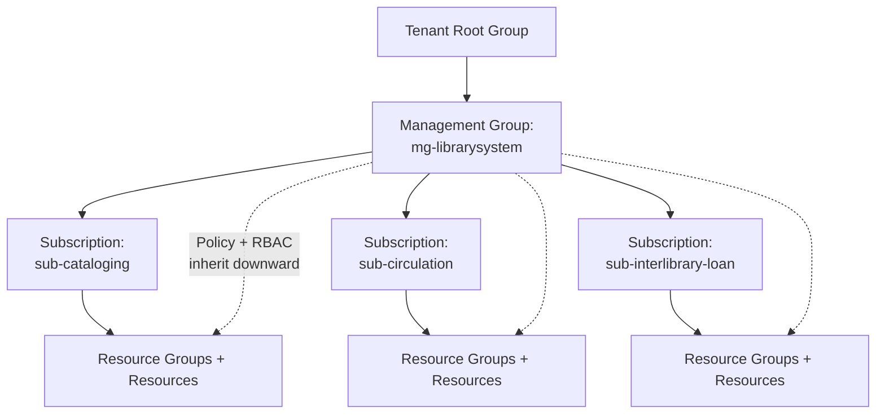
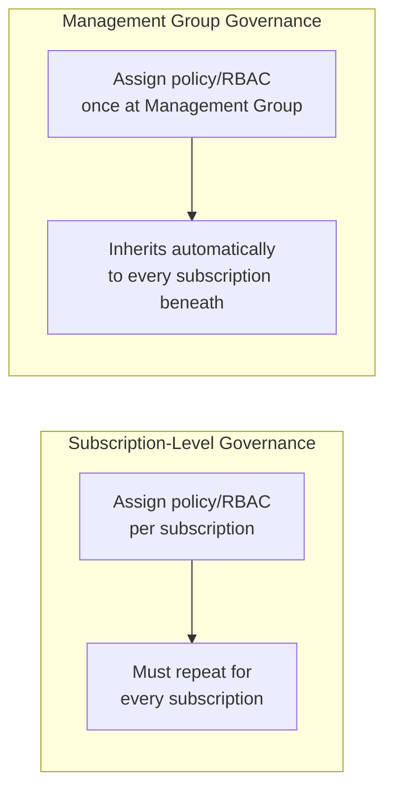

# Azure Governance and Management Groups

## Introduction

Before reading this lesson, you should already be comfortable with **[Budgets, Alerts, and Cost Optimization](../16-azure-for-dotnet-developers/16-71-budgets-alerts-cost-optimization.md)**, which scoped every budget and Advisor recommendation to a single subscription or resource group. That scope was appropriate for one team's one workload, but Module 16, Lesson 3 already noted, in passing, that a real organization typically holds "a handful" of subscriptions — one for production, one for development, perhaps one per business unit — and Lesson 33's RBAC and Azure Policy roles and rules were, until now, always assigned to a single scope at a time. This lesson introduces the layer that sits *above* every subscription an organization owns, and lets governance rules be written once and applied everywhere beneath it, instead of once per subscription.

By the end of this lesson, you will be able to:

- Explain what a Management Group is and where it sits relative to subscriptions in Azure's scope hierarchy
- Describe a typical enterprise hierarchy: Management Group → Subscriptions → Resource Groups → Resources
- Apply an RBAC role assignment or an Azure Policy at the Management Group level so it inherits down to every subscription beneath it
- Explain why centralizing governance at this level reduces both administrative effort and the risk of inconsistent policy across teams
- Recognize when an organization has outgrown a single-subscription model and needs Management Groups

## Management Groups — A Layman's Perspective

Return to the university campus analogy from Module 16, Lesson 3, but zoom out one more level. A single university has one subscription-equivalent: one master financial account. Now picture an entire state university *system* — a governing board overseeing six separate, financially independent campuses, each with its own budget, its own dean, its own admissions office. The system's board doesn't manage any individual campus's day-to-day finances directly, but it absolutely sets rules every campus must follow regardless: a minimum library funding floor, a shared code of conduct, a system-wide data-security standard. Write that rule once, at the board level, and it automatically applies to all six campuses — nobody has to remember to separately email each dean and ask them to adopt it themselves.

That governing board is a **Management Group**. Where a resource group organizes resources *within* one subscription, and a subscription is itself the top-level billing boundary as far as Lesson 3 was concerned, a Management Group sits one level higher still, and it doesn't hold resources directly at all — it holds *subscriptions* (and, if needed, other Management Groups nested beneath it, layer upon layer, exactly like a university system that might itself belong to an even larger multi-state consortium). Its entire purpose is exactly the campus board's purpose: let an organization declare "every subscription under here follows this rule" once, in one place, rather than chasing down every subscription owner individually and hoping they configure it identically.

Think concretely about a growing library system that started with one small subscription for a single branch's catalog application, and has since grown to run separate subscriptions for Cataloging, Circulation, and Interlibrary Loan — each managed somewhat independently by a different small team, because that's how the organization actually grew. Without a Management Group, ensuring all three subscriptions enforce the same tagging rule, the same restricted set of allowed regions, and the same "no public IP addresses on database servers" security baseline means visiting all three subscriptions separately, and hoping nobody's team quietly drifts out of compliance next quarter when a new hire provisions something slightly differently. With a Management Group wrapping all three subscriptions, that same rule set is defined exactly once and simply *inherits downward automatically* — a new subscription added under that Management Group next year picks up every existing rule immediately, with zero extra configuration.

The organizational payoff isn't just less typing. It's consistency that survives organizational growth and staff turnover: a rule enforced at the Management Group level doesn't depend on every subscription's individual administrator remembering to apply it correctly, or apply it at all.

## Management Groups — A Programming Language Perspective

An Azure **Management Group** is a scope-hierarchy container (`Microsoft.Management/managementGroups`) that sits above subscriptions, can nest up to six levels deep, and forms a single root — the **Tenant Root Group** — under which every subscription in a tenant ultimately resides, whether explicitly organized into custom Management Groups or not. Both **Azure RBAC role assignments** and **Azure Policy assignments** support Management Group scope in addition to subscription, resource group, and individual resource scope, and both **inherit downward**: a role assignment or policy applied at a Management Group applies automatically to every subscription, resource group, and resource nested beneath it, with no separate assignment required at each lower level. The resulting typical enterprise scope hierarchy, from broadest to narrowest, is: **Management Group → Subscription → Resource Group → Resource** — the same RBAC and Policy mechanisms from Lesson 34, now simply assignable one level higher than a single subscription.

## How to Create a Management Group and Assign Policy at Scale

Provisioning the hierarchy is a short sequence: create the Management Group, move subscriptions under it, then assign a policy once at the top.


*Figure 1: A single Management Group wrapping three subscriptions; a policy assigned once at the Management Group inherits down through every subscription, resource group, and resource beneath it.*

```bash
# Create a Management Group for the whole library system
az account management-group create --name mg-librarysystem --display-name "Library System"

# Move an existing subscription under it
az account management-group subscription add \
  --name mg-librarysystem \
  --subscription "sub-cataloging"

# Assign a built-in policy -- restrict allowed regions -- once, at the Management Group scope
az policy assignment create \
  --name allowed-regions-librarysystem \
  --display-name "Allowed regions for Library System" \
  --scope "/providers/Microsoft.Management/managementGroups/mg-librarysystem" \
  --policy "e56962a6-4747-49cd-b67b-bf8b01975c4c" \
  --params '{"listOfAllowedLocations": {"value": ["eastus", "westus2"]}}'
```

**Azure CLI Output (illustrative):**

```text
{
  "name": "mg-librarysystem",
  "properties": { "displayName": "Library System" }
}
{
  "id": "/providers/Microsoft.Management/managementGroups/mg-librarysystem/subscriptions/sub-cataloging"
}
{
  "name": "allowed-regions-librarysystem",
  "policyDefinitionId": "/providers/Microsoft.Authorization/policyDefinitions/e56962a6-4747-49cd-b67b-bf8b01975c4c",
  "scope": "/providers/Microsoft.Management/managementGroups/mg-librarysystem"
}
```

```csharp
// GovernanceHierarchyReport.cs — .NET 10 / C# 14
public sealed record GovernedScope(string Name, string ScopeType, string ParentScope, string[] InheritedPolicies);

GovernedScope[] hierarchy =
[
    new("mg-librarysystem", "Management Group", "Tenant Root Group", ["allowed-regions-librarysystem"]),
    new("sub-cataloging", "Subscription", "mg-librarysystem", ["allowed-regions-librarysystem"]),
    new("sub-circulation", "Subscription", "mg-librarysystem", ["allowed-regions-librarysystem"]),
    new("sub-interlibrary-loan", "Subscription", "mg-librarysystem", ["allowed-regions-librarysystem"])
];

Console.WriteLine("Governance hierarchy — policies each scope inherits:");
foreach (GovernedScope s in hierarchy)
{
    Console.WriteLine($" - {s.Name,-24} [{s.ScopeType,-16}] under {s.ParentScope,-18} inherits: {string.Join(", ", s.InheritedPolicies)}");
}
```

**Console Output:**

```text
Governance hierarchy — policies each scope inherits:
 - mg-librarysystem         [Management Group] under Tenant Root Group inherits: allowed-regions-librarysystem
 - sub-cataloging           [Subscription    ] under mg-librarysystem  inherits: allowed-regions-librarysystem
 - sub-circulation          [Subscription    ] under mg-librarysystem  inherits: allowed-regions-librarysystem
 - sub-interlibrary-loan    [Subscription    ] under mg-librarysystem  inherits: allowed-regions-librarysystem
```

One policy assignment, made a single time against the Management Group, now shows up as inherited on all three subscriptions beneath it. Add a fourth subscription to the library system next year, place it under `mg-librarysystem`, and it inherits that same allowed-regions restriction immediately — nobody has to remember to reassign it.

## Real-Time Example: Governing the Library System's Three Subscriptions

Continuing the Library/Inventory Management domain, the library system's Cataloging, Circulation, and Interlibrary Loan teams each provisioned their own subscription independently over the past two years, and — predictably — small inconsistencies have crept in: one team allows an extra region, another has a looser RBAC assignment than intended. Bringing all three under one Management Group is how the platform team closes that gap for good.

```csharp
// LibrarySystemGovernanceAudit.cs — .NET 10 / C# 14 — Real-Time Example (Library/Inventory Management)
public sealed record SubscriptionCompliance(string Subscription, bool AllowedRegionsPolicyApplied, bool ReaderRoleConsistent);

SubscriptionCompliance[] before =
[
    new("sub-cataloging", AllowedRegionsPolicyApplied: true, ReaderRoleConsistent: true),
    new("sub-circulation", AllowedRegionsPolicyApplied: false, ReaderRoleConsistent: true),
    new("sub-interlibrary-loan", AllowedRegionsPolicyApplied: false, ReaderRoleConsistent: false)
];

Console.WriteLine("Before Management Group rollout:");
foreach (SubscriptionCompliance s in before)
{
    Console.WriteLine($" - {s.Subscription,-24} RegionsPolicy: {s.AllowedRegionsPolicyApplied}  ConsistentRBAC: {s.ReaderRoleConsistent}");
}

// After moving all three under mg-librarysystem and assigning policy + RBAC once at that scope
var after = before.Select(s => s with { AllowedRegionsPolicyApplied = true, ReaderRoleConsistent = true });

Console.WriteLine("\nAfter Management Group rollout (inherited from mg-librarysystem):");
foreach (SubscriptionCompliance s in after)
{
    Console.WriteLine($" - {s.Subscription,-24} RegionsPolicy: {s.AllowedRegionsPolicyApplied}  ConsistentRBAC: {s.ReaderRoleConsistent}");
}
```

**Console Output:**

```text
Before Management Group rollout:
 - sub-cataloging           RegionsPolicy: True  ConsistentRBAC: True
 - sub-circulation           RegionsPolicy: False  ConsistentRBAC: True
 - sub-interlibrary-loan     RegionsPolicy: False  ConsistentRBAC: False

After Management Group rollout (inherited from mg-librarysystem):
 - sub-cataloging           RegionsPolicy: True  ConsistentRBAC: True
 - sub-circulation           RegionsPolicy: True  ConsistentRBAC: True
 - sub-interlibrary-loan     RegionsPolicy: True  ConsistentRBAC: True
```

Before the rollout, two of three subscriptions were quietly out of compliance with rules the platform team assumed were universal — the exact kind of drift that happens naturally as independent teams provision independently over time. After moving all three subscriptions under `mg-librarysystem` and assigning the policy and RBAC role once at that single scope, every subscription's compliance state converges automatically, without a single change made inside any individual subscription.

## Management Groups vs Subscription-Level Governance

Governing at the subscription level works fine for a single team or a small organization with one or two subscriptions, exactly as Lesson 34 presented RBAC and Policy. It stops scaling the moment an organization's subscription count grows past what one administrator can reliably keep configured identically — usually somewhere between three and a dozen subscriptions, depending on how disciplined the team is. Management Groups don't replace subscription-level RBAC and Policy; they add a scope *above* it that the same mechanisms already understand, letting an organization choose, rule by rule, whether something belongs at the Management Group (organization-wide) or the subscription (team-specific) level.


*Figure 2: Repeating a governance rule per subscription versus defining it once and letting Management Group inheritance apply it everywhere.*

| Aspect | Subscription-Level Governance | Management Group Governance |
|---|---|---|
| Scope of one assignment | A single subscription | Every subscription nested beneath it |
| Effort to add a new subscription | Reconfigure rules from scratch | Inherits existing rules automatically |
| Risk of drift between teams | High — depends on each admin | Low — enforced centrally |
| Suitable organization size | One team, one or few subscriptions | Multiple teams/business units, many subscriptions |
| Underlying mechanism | Azure RBAC + Azure Policy | Same RBAC + Policy, higher scope |

## Types of Governance Scopes and Related Concepts

1. **Tenant Root Group** — the implicit top-level Management Group every subscription in a tenant ultimately belongs to, even without custom Management Groups.
2. **RBAC and Azure Policy** — the two enforcement mechanisms this lesson applies at a broader scope; see [Azure Key Vault in Depth](../16-azure-for-dotnet-developers/16-33-azure-key-vault-in-depth.md) for RBAC applied to a single resource, by contrast.
3. **Policy Initiatives** — a bundle of multiple related Azure Policy definitions assigned together as one unit, common at Management Group scope.
4. **[Azure Resource Manager, Subscriptions, and Resource Groups](../16-azure-for-dotnet-developers/16-03-arm-subscriptions-resource-groups.md)** — the scopes directly beneath a Management Group in the hierarchy.
5. **[Tagging Strategies for Cost Tracking](../16-azure-for-dotnet-developers/16-73-tagging-strategies-for-cost-tracking.md)** — next lesson, where tag *enforcement* via Policy is itself often rolled out at Management Group scope for consistency.

## What You've Learned & What's Next

A Management Group sits above subscriptions in Azure's scope hierarchy, letting RBAC role assignments and Azure Policy definitions be applied once and inherit automatically down through every subscription, resource group, and resource beneath it — turning governance from a per-subscription chore into an organization-wide guarantee.

Continue your learning journey with **[Tagging Strategies for Cost Tracking](../16-azure-for-dotnet-developers/16-73-tagging-strategies-for-cost-tracking.md)**, the capstone of this Cost Management & Governance sub-area, where we design a tagging scheme and enforce it consistently using exactly the Policy inheritance this lesson just introduced.

---
*Applies to: .NET 10 / C# 14. Last reviewed 2026-08-16.*
