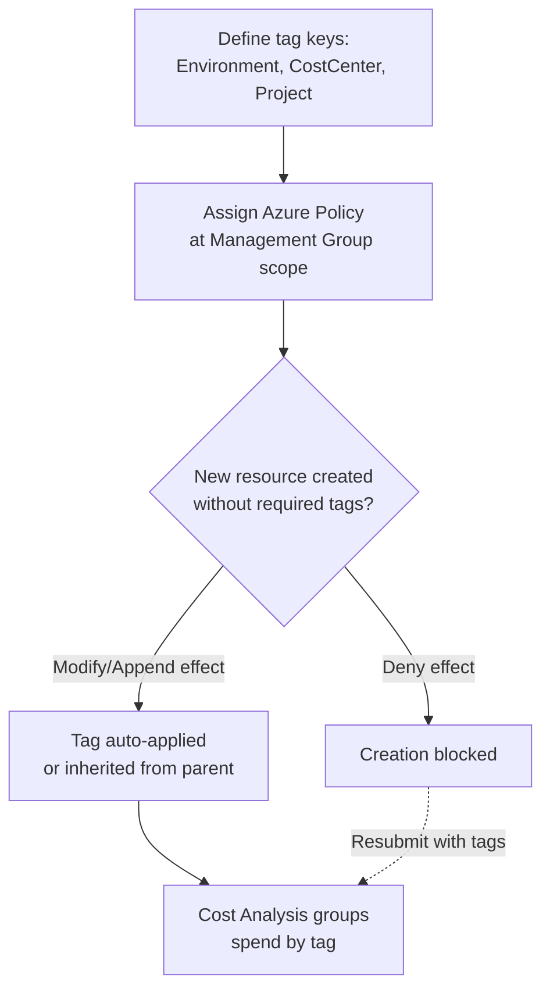
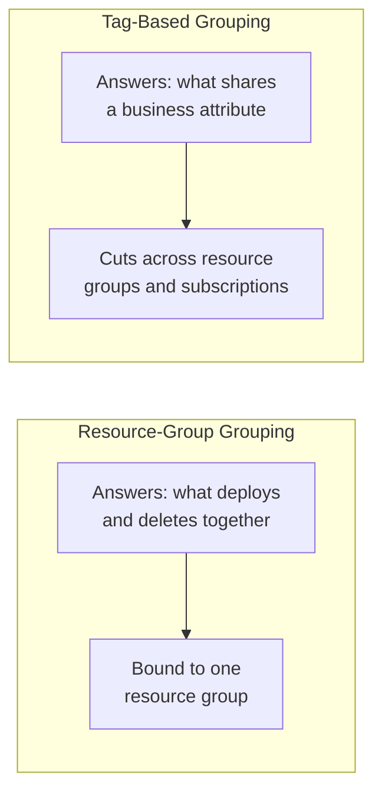

# Tagging Strategies for Cost Tracking

## Introduction

Before reading this lesson, you should already be comfortable with **[Azure Governance and Management Groups](../16-azure-for-dotnet-developers/16-72-azure-governance-management-groups.md)**, particularly the idea that RBAC and Azure Policy can be assigned once, at a broad scope, and inherit automatically down through everything beneath it. This lesson applies that exact inheritance mechanism to a problem this whole sub-area has been circling since Lesson 70: Cost Analysis can group spend by resource or by resource group, but neither of those hierarchies was designed to answer a business question like "how much does Production cost across every team" or "what does the Engineering cost center actually spend, across a dozen scattered resource groups." Tags are the answer, and this lesson is the capstone of the four-lesson Cost Management & Governance sub-area: it closes the loop from raw metered spend, through budgets and Advisor recommendations, through organization-wide governance, to a tagging scheme precise enough to answer exactly those questions.

By the end of this lesson, you will be able to:

- Explain what an Azure tag is and why it's a better cost-tracking dimension than resource type or resource group alone
- Design a consistent, minimal tagging scheme covering environment, cost center, and project
- Enforce that scheme automatically using Azure Policy's tag-inheritance and tag-requirement effects
- Use tags to group Cost Analysis by business dimension rather than infrastructure hierarchy
- Recap how this sub-area's four lessons — Cost Analysis, budgets/Advisor, Management Groups, and tagging — combine into one coherent cost-governance practice

## Tagging — A Layman's Perspective

Picture a large shared office supply closet. Every pen, notebook, and box of paper sitting on its shelves is organized *physically* by category — pens in one bin, paper in another — which is exactly analogous to Azure's resource-type and resource-group hierarchy: useful for finding a specific physical thing, but useless for answering "how much did the Marketing department spend on supplies this quarter," because Marketing's purchases are scattered across every bin in the closet, mixed in with everyone else's.

The fix a well-run office actually uses is a small sticky label on each item as it's purchased: department, project code, and whether it's for an active initiative or something already wound down. The physical shelf location never changes — pens still live with pens — but now a completely different question becomes instantly answerable by reading the labels instead of the shelves: total spend, sliced by department, regardless of which bin anything physically sits in. That sticky label, applied consistently, at the moment something enters the closet, is exactly what an Azure **tag** is: a key-value label — `CostCenter: Marketing`, `Project: Q3-Campaign` — attached directly to a resource, entirely independent of which resource group or subscription that resource happens to live in.

The obvious weakness of a sticky-label system, in an office or in Azure, is that it only works if everyone actually applies the label, consistently, every time. One employee who skips the label, or writes "Mktg" one week and "Marketing" the next, breaks the whole reporting exercise for that item — it becomes invisible to any report grouped by that dimension, or worse, silently miscounted under a near-miss spelling. A large organization can't rely on hoping every single person remembers and spells things identically forever; eventually someone needs to make the label *mandatory and standardized*, enforced automatically at the point something is added to the closet, not politely requested afterward.

That's precisely the role Azure Policy plays here, and it's exactly the same inheritance mechanism the previous lesson used for regions and RBAC, now aimed at tags instead: a policy assigned at a Management Group or subscription can *require* specific tag keys on every new resource, *reject* resources missing them outright, or automatically *inherit* a tag's value down from its parent resource group or subscription so nobody even has to type it manually. The office closet's sticky-label problem, solved at scale, without trusting a single person's memory or spelling consistency ever again.

## Tagging — A Programming Language Perspective

An Azure **tag** is a key-value pair of strings (each up to 512/256 characters respectively) attachable to most Azure resources, resource groups, and subscriptions, independent of the resource-type or resource-group hierarchy those same resources already belong to. Tags are set via the Portal, `az resource tag` / `az tag`, ARM/Bicep resource definitions, or the `Azure.ResourceManager` SDK's `Tags` property on a resource's data model, and — critically for this sub-area — Cost Analysis (Lesson 70) accepts a tag key as a **group-by dimension** exactly like `ResourceGroupName`, letting spend be broken down by any business dimension a tag encodes. **Azure Policy** enforces tagging consistency through built-in policy definitions with effects such as `Modify` (auto-apply or auto-inherit a tag value from a parent scope), `Append` (add a tag if missing without failing the request), and `Deny` (reject resource creation outright if a required tag is absent) — assignable at Management Group scope, per the previous lesson, so a tagging standard applies uniformly across every subscription in the hierarchy.

## How to Design and Enforce a Tagging Scheme

A minimal, effective tagging scheme answers three recurring cost questions with three tag keys, then gets enforced with a policy so it can't silently lapse.


*Figure 1: A tagging scheme enforced by Azure Policy at Management Group scope, feeding directly into Cost Analysis's tag-based grouping.*

```bash
# Assign a built-in policy that requires the "CostCenter" tag on any new resource,
# denying creation if it's missing, at Management Group scope from the previous lesson
az policy assignment create \
  --name require-costcenter-tag \
  --display-name "Require CostCenter tag" \
  --scope "/providers/Microsoft.Management/managementGroups/mg-librarysystem" \
  --policy "1e30110a-5ceb-460c-a204-c1c3969c6d62" \
  --params '{"tagName": {"value": "CostCenter"}}'

# Query Cost Analysis grouped by the CostCenter tag instead of resource group
az costmanagement query \
  --type ActualCost --timeframe MonthToDate \
  --scope "subscriptions/00000000-0000-0000-0000-000000000000" \
  --dataset-aggregation '{"totalCost":{"name":"PreTaxCost","function":"Sum"}}' \
  --dataset-grouping name=CostCenter type=Tag
```

**Azure CLI Output (illustrative):**

```text
{
  "name": "require-costcenter-tag",
  "policyDefinitionId": "/providers/Microsoft.Authorization/policyDefinitions/1e30110a-5ceb-460c-a204-c1c3969c6d62"
}

Columns: PreTaxCost, CostCenter, Currency
------------------------------------------
   612.40   Engineering             USD
   340.10   Operations               USD
    58.90   (untagged)               USD
```

```csharp
// TagComplianceReport.cs — .NET 10 / C# 14
using Azure.Identity;
using Azure.ResourceManager;
using Azure.ResourceManager.Resources;

var armClient = new ArmClient(new DefaultAzureCredential());
SubscriptionResource subscription = armClient.GetDefaultSubscription();

string[] requiredTagKeys = ["Environment", "CostCenter", "Project"];

await foreach (GenericResource resource in subscription.GetGenericResourcesAsync())
{
    IReadOnlyDictionary<string, string> tags = resource.Data.Tags;
    string[] missing = requiredTagKeys.Where(k => !tags.ContainsKey(k)).ToArray();
    string status = missing.Length == 0 ? "compliant" : $"MISSING: {string.Join(", ", missing)}";
    Console.WriteLine($"{resource.Data.Name,-28} {status}");
}
```

**Console Output (illustrative — depends on real subscription contents):**

```text
app-orderapi-prod           compliant
sql-corebanking-core        MISSING: Project
vm-loadtest-generator       MISSING: Environment, CostCenter, Project
```

The CLI query's third row, `(untagged)`, is the tell-tale sign of a scheme that hasn't yet been enforced — $58.90 of spend that Cost Analysis simply cannot attribute to any cost center, because nothing labeled it. The C# report above is exactly the audit that catches that gap directly at the resource level, before it ever shows up as an unattributed slice of a chart: `vm-loadtest-generator`, unsurprisingly, is missing every tag — the same forgotten load-test VM from Lesson 71's Real-Time Example, which a `Deny`-effect policy would simply have refused to create without tags in the first place.

## Real-Time Example: One Tagging Scheme Across E-Commerce, Banking, and Library

This module has built three recurring case-study domains — E-Commerce Order Processing, Banking/ATM, and Library/Inventory Management — each with its own subscriptions and resource groups from earlier lessons. A single, shared tagging scheme, applied consistently across all three, is what finally lets a shared platform team answer cross-domain cost questions without touching any application code.

```csharp
// SharedTaggingScheme.cs — .NET 10 / C# 14 — Real-Time Example (E-Commerce, Banking, Library)
public sealed record TaggedResource(string Name, string Environment, string CostCenter, string Project);

TaggedResource[] resources =
[
    new("app-orderapi-prod", "Production", "Engineering", "ECommerce"),
    new("sql-orderapi-prod", "Production", "Engineering", "ECommerce"),
    new("app-corebanking-atm-prod", "Production", "Engineering", "Banking"),
    new("sql-corebanking-core", "Production", "Engineering", "Banking"),
    new("app-librarycatalog-prod", "Production", "Operations", "Library"),
    new("sql-librarycatalog-core", "Production", "Operations", "Library"),
    new("app-orderapi-staging", "Staging", "Engineering", "ECommerce")
];

Console.WriteLine("Cost breakdown by Project tag (mirrors a Cost Analysis tag grouping):");
foreach (var group in resources.GroupBy(r => r.Project))
{
    Console.WriteLine($" - {group.Key,-10} resources: {group.Count()}  (Environments: {string.Join("/", group.Select(r => r.Environment).Distinct())})");
}

Console.WriteLine("\nCost breakdown by CostCenter tag:");
foreach (var group in resources.GroupBy(r => r.CostCenter))
{
    Console.WriteLine($" - {group.Key,-12} resources: {group.Count()}  (Projects: {string.Join(", ", group.Select(r => r.Project).Distinct())})");
}
```

**Console Output:**

```text
Cost breakdown by Project tag (mirrors a Cost Analysis tag grouping):
 - ECommerce  resources: 3  (Environments: Production/Staging)
 - Banking    resources: 2  (Environments: Production)
 - Library    resources: 2  (Environments: Production)

Cost breakdown by CostCenter tag:
 - Engineering resources: 5  (Projects: ECommerce, Banking)
 - Operations  resources: 2  (Projects: Library)
```

Notice what this scheme reveals that neither resource groups nor subscription boundaries alone ever could: Engineering owns both the ECommerce and Banking projects, while Operations owns Library — a real organizational fact, cutting straight across three unrelated resource groups and however many subscriptions they live in. That's the entire point of tagging as a cost-tracking dimension: it encodes business structure, not infrastructure structure, and Cost Analysis can report against either one, on demand, once the tags are actually there.

## Tag-Based Grouping vs Resource-Group-Based Grouping

Resource groups and tags are not competing organizational systems — they answer different questions and both remain useful simultaneously, which is precisely why this sub-area covers both rather than picking one. A resource group answers "what shares a deployment lifecycle" — the App Service, database, and storage account that get created and deleted together, per Lesson 3. A tag answers "what shares a business attribute" — which resources belong to Engineering, which belong to the ECommerce project, which are Production versus Staging — a classification that cuts across resource group and even subscription boundaries freely, exactly as the Real-Time Example above demonstrated.


*Figure 2: Resource groups group by deployment lifecycle; tags group by business attribute, freely crossing resource-group and subscription boundaries.*

| Aspect | Resource-Group Grouping | Tag-Based Grouping |
|---|---|---|
| Answers | What deploys/deletes together | What shares a business attribute |
| Boundary | Fixed to one resource group | Crosses resource groups and subscriptions |
| Set at | Resource creation, fixed thereafter | Any time, editable, multiple tags per resource |
| Enforced by | Nothing automatic | Azure Policy (`Deny`, `Modify`, `Append`) |
| Typical Cost Analysis use | "What does this project cost" | "What does this cost center/environment cost" |

## Types of Tagging Mechanisms Worth Knowing

1. **Tag inheritance policies** — the `Modify`/`Append` policy effects this lesson used to auto-apply or auto-fill tag values from a parent scope.
2. **Deny-effect tag policies** — the stricter enforcement that blocks resource creation outright when a required tag is missing.
3. **Cost Analysis tag grouping** — the [Cost Management](../16-azure-for-dotnet-developers/16-70-azure-cost-management-basics.md) view this lesson's tags feed directly into.
4. **Resource Graph queries** — `az graph query`, for auditing tag compliance across an entire tenant faster than iterating resources one at a time as this lesson's C# example did.
5. **[Azure Governance and Management Groups](../16-azure-for-dotnet-developers/16-72-azure-governance-management-groups.md)** — the scope this lesson's tag-requirement policy is typically assigned at, for organization-wide consistency.

## Cost Management & Governance — Sub-Area Recap

Four lessons, one coherent practice. **[Azure Cost Management Basics](../16-azure-for-dotnet-developers/16-70-azure-cost-management-basics.md)** opened the Cost Analysis views this whole sub-area builds on, and introduced Reserved Instances and Savings Plans for genuinely predictable, long-running workloads. **[Budgets, Alerts, and Cost Optimization](../16-azure-for-dotnet-developers/16-71-budgets-alerts-cost-optimization.md)** turned that read-only view into a proactive budget with threshold alerts and Azure Advisor's targeted, resource-level recommendations, and named the single most common preventable mistake — a forgotten dev/test resource left running. **[Azure Governance and Management Groups](../16-azure-for-dotnet-developers/16-72-azure-governance-management-groups.md)** zoomed out to an organization's entire subscription footprint, showing how RBAC and Policy inherit downward from a single Management Group assignment. And this lesson closed the loop: a consistent tagging scheme, enforced by exactly that same Policy inheritance, that finally lets Cost Analysis answer business questions — by environment, cost center, and project — across the E-Commerce, Banking, and Library domains this module has been building the whole way through.

## What You've Learned & What's Next

Tags are Azure's mechanism for organizing cost and resources by business attribute rather than infrastructure hierarchy, and Azure Policy is what keeps a tagging scheme from silently lapsing the moment a busy team forgets — the same inheritance mechanism this sub-area used for regions, RBAC, and now tags, applied consistently from a single Management Group down to every resource beneath it.

Continue your learning journey with **[Introduction to .NET Aspire](../16-azure-for-dotnet-developers/16-74-introduction-to-dotnet-aspire.md)**, where this module shifts from managing and governing Azure resources to a tooling layer built specifically to orchestrate a distributed .NET application's local development and its eventual Azure deployment together.

---
*Applies to: .NET 10 / C# 14. Last reviewed 2026-08-16.*
