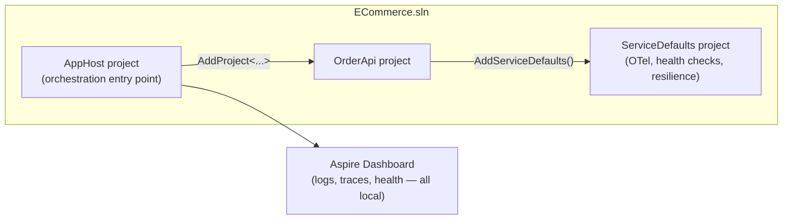
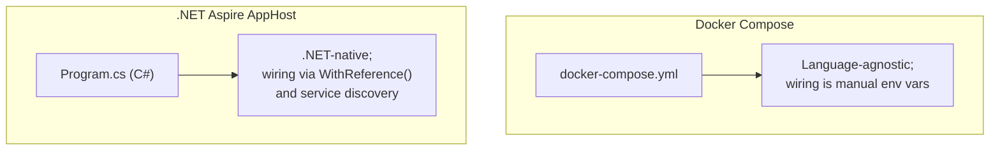

# Introduction to .NET Aspire

## Introduction

The previous lesson closed out this module's cost-governance arc — tags that let a subscription answer "whose spend is this?" after the fact. This lesson turns the other direction entirely, back toward the moment *before* anything is even deployed: the everyday experience of running a real distributed application on your own machine while you're still writing it. Every service this module has covered — App Service, Container Apps, Cosmos DB, Redis, Service Bus, Key Vault — was introduced mostly in isolation, one resource at a time. A real system needs several of them running *together*, locally, every single day of development, and coordinating that by hand — five terminal windows, hardcoded ports, a docker-compose file that drifts out of sync with the actual code — is exactly the kind of friction Microsoft built **.NET Aspire** to remove.

By the end of this lesson, you will be able to:

- Explain the local multi-project orchestration problem that .NET Aspire solves for distributed .NET applications
- Describe the role of the **AppHost** project as an Aspire solution's orchestration entry point
- Explain what the **ServiceDefaults** project wires up automatically — OpenTelemetry, health checks, and resilient `HttpClient` pipelines
- Connect that automatic instrumentation back to Module 10's health checks lesson and Module 12's distributed tracing and service discovery/resilience lessons
- Distinguish an Aspire AppHost from a deployable production service
- Scaffold and run a minimal two-project Aspire solution

## .NET Aspire — A Layman's Perspective

Picture opening night of a large stage production — not a one-actor monologue, but a full show with a lead cast, a lighting rig, a sound board, a fly system moving scenery, and a follow-spot operator up in the rafters. Every one of those pieces is built and rehearsed separately for weeks. But on the night itself, none of them can just be switched on in any order and left alone. The lighting rig needs to be powered up and calibrated before the actors walk out under it. The sound board needs a live feed from the wireless mics before anyone speaks. And critically, one person — the stage manager, headset on, standing at a console backstage — needs a single view of everything at once: which system is live, which is still warming up, which just threw an error, and where to look first if something goes wrong mid-scene.

Without that stage manager, "running the show" becomes five separate people in five separate rooms, each trusting that the others did their job correctly, with no one actually watching all of it at the same time. That's precisely the situation a growing .NET solution ends up in without something like Aspire: a database container started by hand in one terminal, a cache started in another, the API launched from an IDE with a `launchSettings.json` port that has to match what's typed into three different config files, and absolutely no shared view of whether all of it actually came up healthy. Every developer on the team rebuilds their own fragile version of "the show," and every version is slightly different.

.NET Aspire is that stage manager, built directly into the .NET tooling. It doesn't replace any of the individual pieces — the actors are still actors, the lighting rig is still a lighting rig, the Order API from earlier lessons is still exactly the Order API. What Aspire adds is a single project, written in ordinary C#, that describes the *whole cast list* — "start the Order API, start a Redis cache, start a Service Bus emulator, and here's how they're allowed to talk to each other" — and then a dashboard that shows every one of those pieces, live, the moment `dotnet run` is pointed at that one project. Starting the show is one command instead of five terminal windows. Knowing something backstage broke is one glance at a dashboard instead of a frantic search through scattered log files.

The bridge back to code: that single "cast list" project is called the **AppHost**, and the shared wiring every actor on stage gets handed automatically — a working microphone, a way to be tracked by the follow-spot — is called **ServiceDefaults**. Neither one ships to production as its own deployed service; both exist to make the rehearsal — local development — behave as much like opening night as possible, long before real Azure infrastructure ever gets involved.

## .NET Aspire — A Programming Language Perspective

**.NET Aspire** is a set of NuGet-distributed project templates and libraries, not a separate runtime, for orchestrating multi-project .NET applications during local development and for generating a deployable resource graph from that same definition. An Aspire solution centers on an **AppHost** project — a console-style project referencing `Aspire.Hosting.AppHost` whose `Program.cs` calls `DistributedApplication.CreateBuilder(args)` and then registers each dependency (`builder.AddProject<Projects.OrderApi>("orderapi")`, `builder.AddRedis("cache")`, and so on) as a strongly-typed `IResourceBuilder<T>`, wiring relationships between resources with `.WithReference(...)`. A companion **ServiceDefaults** project, referenced by every *consumer* project (the actual API, not the AppHost itself), exposes a single `builder.AddServiceDefaults()` extension method that configures OpenTelemetry export, ASP.NET Core health check endpoints, and `Microsoft.Extensions.Http.Resilience`-based `HttpClient` pipelines with sensible defaults, in one call. Running the AppHost project launches every referenced resource and a local web **dashboard** for inspecting them.

## How to Set Up a .NET Aspire AppHost

Scaffolding an Aspire solution starts from two templates — `aspire-apphost` for the orchestrator and `aspire-servicedefaults` for the shared wiring — added to an existing solution alongside an ordinary ASP.NET Core project such as the `OrderApi` used throughout this module.


*Figure 1: The AppHost registers and starts every project it references; the dashboard is generated for free, and ServiceDefaults gives every referenced project the same baseline instrumentation.*

```bash
# .NET CLI — scaffold the AppHost and ServiceDefaults projects
dotnet new aspire-apphost -n ECommerce.AppHost -o AppHost
dotnet new aspire-servicedefaults -n ECommerce.ServiceDefaults -o ServiceDefaults

dotnet sln add AppHost/ECommerce.AppHost.csproj ServiceDefaults/ECommerce.ServiceDefaults.csproj
```

**.NET CLI Output:**

```text
The template "Aspire App Host" was created successfully.
The template "Aspire Service Defaults" was created successfully.
Project `AppHost\ECommerce.AppHost.csproj` added to the solution.
Project `ServiceDefaults\ECommerce.ServiceDefaults.csproj` added to the solution.
```

```csharp
// AppHost/Program.cs — .NET 10 / C# 14
var builder = DistributedApplication.CreateBuilder(args);

// One line registers the existing Order API project as an orchestrated resource
builder.AddProject<Projects.OrderApi>("orderapi");

builder.Build().Run();
```

```csharp
// OrderApi/Program.cs — .NET 10 / C# 14
var builder = WebApplication.CreateBuilder(args);

// One call wires OpenTelemetry, health checks, and resilient HttpClient defaults —
// the exact building blocks from Module 10's health checks lesson and Module 12's
// distributed tracing and service discovery/resilience lessons, pre-configured.
builder.AddServiceDefaults();

var app = builder.Build();

app.MapDefaultEndpoints(); // registers /health and /alive, added by AddServiceDefaults

app.MapGet("/orders/{id:int}", (int id) => Results.Ok(new { OrderId = id, Status = "Processing" }));

app.Run();
```

**Console Output (running `dotnet run --project AppHost`):**

```text
info: Aspire.Hosting.DistributedApplication[0]
      Distributed application starting.
info: Aspire.Hosting.DistributedApplication[0]
      Now listening on: https://localhost:17148
      Login to the dashboard at https://localhost:17148/login?t=8f2a1c9b7e...
info: Aspire.Hosting.DistributedApplication[0]
      Distributed application started. Press Ctrl+C to shut down.
```

Running the AppHost — never the `OrderApi` project directly — starts both the API and the dashboard together. The `orderapi` resource shows up in that dashboard as "Running," with its console output, structured logs, and distributed traces already flowing in, because `AddServiceDefaults()` configured OpenTelemetry the moment the API started. Nothing about `MapGet("/orders/{id:int}", ...)` changed; what changed is everything *around* it, wired once instead of by hand in every project.

## Real-Time Example: Modeling the AppHost's Resource Graph for Order Processing

We continue with the `OrderApi` project this module's Cosmos DB and Redis lessons have been building toward. Before wiring in real dependencies next lesson, it's worth seeing what the AppHost actually tracks internally: a small graph of named resources, each with a type and a running state — precisely what the dashboard renders as a live table.

```csharp
// AppHostInventory.cs — .NET 10 / C# 14 — Real-Time Example (E-Commerce Order Processing)
public sealed record AspireResource(string Name, string ResourceType, string State);

AspireResource[] resources =
[
    new("orderapi", "Project", "Running"),
    new("servicedefaults", "Referenced Class Library", "N/A (compile-time only)")
];

Console.WriteLine("AppHost resource graph — ECommerce.AppHost:");
foreach (AspireResource r in resources)
{
    Console.WriteLine($"  {r.Name,-16} {r.ResourceType,-28} {r.State}");
}
```

**Console Output:**

```text
AppHost resource graph — ECommerce.AppHost:
  orderapi         Project                      Running
  servicedefaults   Referenced Class Library    N/A (compile-time only)
```

That two-row graph looks unremarkable today, and that's the point: it is the exact same model the next lesson extends to five or six resources — a Redis cache, a Service Bus emulator, and eventually a database — without changing a single line of `OrderApi`'s own business logic. The AppHost's job is entirely about *what runs and how it's wired*, never about *what the order-processing code does*.

## .NET Aspire vs Docker Compose

Both tools solve the same surface problem — start several interdependent services together on a developer's machine — but they solve it at different layers. Docker Compose describes containers in YAML and is language-agnostic: it has no idea what's inside an image, only how to start it, and connecting one service to another means hand-managing environment variables and hostnames yourself. Aspire's AppHost describes *.NET projects and cloud resources* in C#, with full IntelliSense and compile-time checking, and it generates connection information for you through service discovery — the next lesson's subject — rather than requiring it to be typed into YAML by hand. Aspire can also orchestrate containers it doesn't own (a Redis or Postgres image, for instance) side by side with .NET projects, so the two approaches often coexist rather than compete.


*Figure 2: Compose orchestrates opaque containers from YAML; Aspire orchestrates typed .NET resources from C#, with the AppHost aware of what each resource actually is.*

| Aspect | .NET Aspire AppHost | Docker Compose |
|---|---|---|
| Definition language | C# (`Program.cs`) | YAML |
| Awareness of resource type | Strongly typed (project, Redis, Service Bus, etc.) | Opaque containers only |
| Service-to-service wiring | Automatic via `WithReference()` + service discovery | Manual environment variables / hostnames |
| Built-in observability | Dashboard with logs, traces, health, out of the box | None — bring your own (e.g., separate log aggregator) |
| Deployment path to Azure | `azd up` from the same resource graph | Requires a separate translation step |
| Scope | .NET-first, though can host arbitrary containers too | Any containerized stack, language-agnostic |

## Types of .NET Aspire Building Blocks

.NET Aspire is made up of a handful of distinct pieces, most of which get their own dedicated treatment in the next two lessons:

1. **AppHost project** — the orchestration entry point covered above, expanded with real dependencies in [Orchestrating Services Locally with .NET Aspire](../16-azure-for-dotnet-developers/16-75-orchestrating-services-with-aspire.md).
2. **ServiceDefaults project** — the shared OpenTelemetry, health check, and resilience wiring introduced in this lesson.
3. **Hosting integration packages** (e.g., `Aspire.Hosting.Redis`, `Aspire.Hosting.Azure.ServiceBus`) — used by the AppHost to declare infrastructure resources, covered next lesson alongside [Azure Cache for Redis](../16-azure-for-dotnet-developers/16-26-azure-cache-for-redis.md).
4. **Client integration packages** (e.g., `Aspire.StackExchange.Redis`) — the consumer-side counterpart that a project like `OrderApi` references to receive a ready-to-use, pre-instrumented client, also covered next lesson.
5. **The Aspire Dashboard** — the local, dev-time observability surface described in the layman's section, contrasted with production-grade Azure Monitor and Application Insights in the next lesson.
6. **Azure Developer CLI (`azd`)** — the tool that turns this same AppHost resource graph into real, deployed Azure infrastructure, covered in [Deploying a .NET Aspire App to Azure](../16-azure-for-dotnet-developers/16-76-deploying-aspire-app-to-azure.md).

## What You've Learned & What's Next

.NET Aspire turns local multi-project development from a hand-managed collection of terminals and config files into a single, typed AppHost project with a live dashboard — and every project it orchestrates picks up OpenTelemetry, health checks, and resilience automatically through ServiceDefaults, tying together instrumentation this curriculum has been building toward since Module 10.

Continue your learning journey with **[Orchestrating Services Locally with .NET Aspire](../16-azure-for-dotnet-developers/16-75-orchestrating-services-with-aspire.md)**, where the AppHost grows real dependencies — a Redis cache and a Service Bus emulator — wired together entirely through service discovery.

---
*Applies to: .NET 10 / C# 14. Last reviewed 2026-08-16.*
