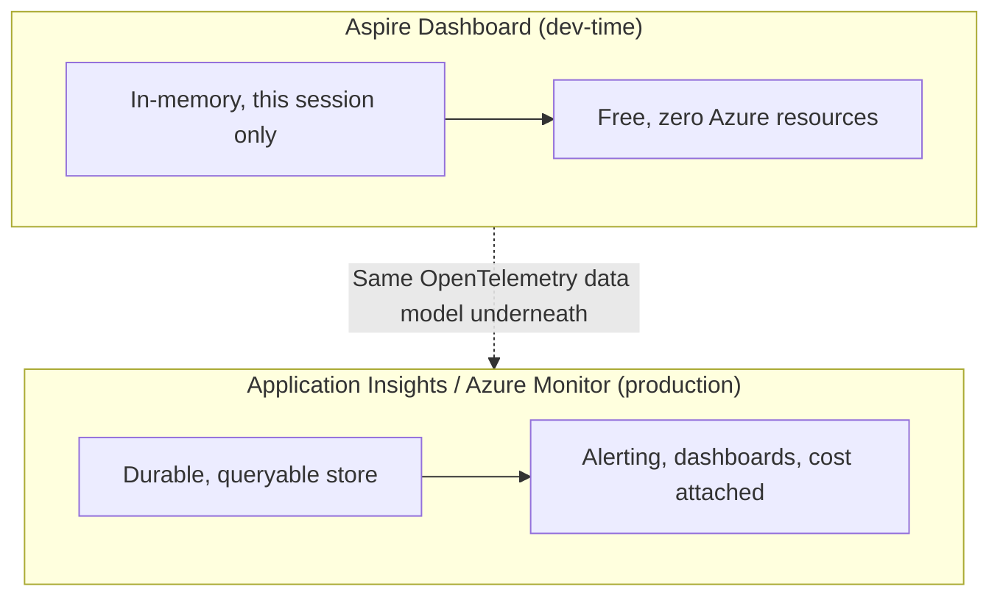

# Orchestrating Services Locally with .NET Aspire

## Introduction

The previous lesson introduced the AppHost with the smallest possible resource graph: one project, wired to nothing. That's not what a real order-processing system looks like. The `OrderApi` from this module's storage lessons needs a cache — [Azure Cache for Redis](../16-azure-for-dotnet-developers/16-26-azure-cache-for-redis.md) — to avoid hammering Cosmos DB on every product lookup, and it needs a message broker to hand off order events for asynchronous processing, the local stand-in for the Service Bus topic this module wires up in its messaging lessons. This lesson connects all three inside one AppHost, and introduces the dashboard that makes the whole graph visible while it runs.

By the end of this lesson, you will be able to:

- Add a Redis resource and a Service Bus emulator resource to an Aspire AppHost
- Reference those resources from a consuming project with `WithReference()`
- Explain what **service discovery** means in Aspire, and why no connection string is ever typed into `appsettings.json` by hand
- Read the Aspire dashboard's Resources, Console Logs, and Traces views to understand what a running distributed application is doing
- Explain why the dashboard is described as a local preview of the Application Insights / Azure Monitor experience, and where the two genuinely differ

## Orchestrating Services with Aspire — A Layman's Perspective

Think about the difference between a small home network years ago and a modern smart-home hub. In the old setup, every device had to be told, by hand, exactly how to find every other device: the thermostat needed the router's address typed in, the security camera needed a fixed IP configured in its settings menu, and if the router's address ever changed, three separate devices silently stopped talking to anything until someone tracked down and fixed each one individually. Nobody had a single place to look and see, at a glance, "is everything actually online right now?"

A modern hub changes both halves of that problem at once. New devices announce themselves by name — "living room thermostat," not "192.168.1.47" — and the hub keeps track of wherever they actually are on the network today, so nothing has to be hardcoded and nothing breaks just because a device got a new address after a router reboot. And the hub gives you one app, one dashboard, where every connected device shows up with a status light: green and responding, or red and unreachable, with a tap-through to its recent activity if something looks wrong.

An Aspire AppHost is exactly that hub for a distributed .NET application. Instead of typing a Redis connection string into `appsettings.json` — the old, fragile way, one address someone has to remember to update whenever the cache moves — the `OrderApi` project simply asks for the resource it needs by the name the AppHost gave it, "cache," and Aspire resolves wherever that cache is actually running right now. The same goes for the message broker. Nothing in `OrderApi`'s own code hardcodes a hostname, a port, or a connection string; it just declares a dependency by name and trusts the hub to have already wired it up correctly, before the API's first request ever comes in.

And exactly like the smart-home app, Aspire hands you a single dashboard the moment everything starts: every resource — the API, the cache, the broker — shown with a live status, its own console output streaming in real time, and a timeline of requests as they actually flow between services. That last part matters more than it sounds: seeing a request travel from the API, into the cache, out again, and over to the broker, all on one screen, is precisely the kind of end-to-end visibility that, in a production Azure environment, comes from Application Insights and Azure Monitor. Aspire gives a taste of that same experience for free, entirely on your own laptop, before a single resource has been deployed anywhere.

The bridge back to code: "service discovery" is just the formal name for what the smart-home hub does with device names instead of IP addresses — a resource asks for another resource by a logical name, and the platform resolves the real address at run time, wherever that happens to be today.

## Orchestrating Services with Aspire — A Programming Language Perspective

**Service discovery** in .NET Aspire is the mechanism by which a consuming project resolves a dependency's real connection details — a Redis endpoint, a Service Bus namespace, an HTTP base address — from a logical resource name rather than a literal value in configuration. The AppHost declares each dependency with a hosting integration method (`builder.AddRedis("cache")`, `builder.AddAzureServiceBus("servicebus").RunAsEmulator()`) and attaches it to a consumer with `.WithReference(cache)`; Aspire then injects the resolved connection information into the consumer's environment at startup, surfaced through the matching client integration package (`Aspire.StackExchange.Redis`, `Aspire.Azure.Messaging.ServiceBus`) via a single `builder.AddRedisClient("cache")`-style call that registers a ready-to-inject client — `IConnectionMultiplexer`, `ServiceBusClient` — with no manual `IConfiguration` binding required. The **Aspire Dashboard**, launched automatically by the AppHost, is a Blazor-based web UI exposing three primary views: **Resources** (status per resource), **Console Logs** (per-resource stdout/stderr), and **Traces** (OpenTelemetry-based distributed traces across every referenced resource).

## How to Wire a Cache and a Message Broker into the AppHost

Adding infrastructure resources to the AppHost follows the same pattern as adding a project: call an `Add*` method, capture the returned `IResourceBuilder<T>`, and reference it from whatever project needs it.

```mermaid
flowchart LR
    AH["AppHost"] -->|"AddRedis(\"cache\")"| R["Redis container"]
    AH -->|"AddAzureServiceBus(\"servicebus\").RunAsEmulator()"| SB["Service Bus emulator container"]
    AH -->|"AddProject<OrderApi>(\"orderapi\")"| API["OrderApi project"]
    API -.->|"WithReference(cache)"| R
    API -.->|"WithReference(servicebus)"| SB
    AH --> DASH["Aspire Dashboard\nResources / Console Logs / Traces"]
```
*Figure 1: The AppHost starts the cache and broker as containers, starts the API as a project, and injects resolved connection info into the API wherever `WithReference` points.*

```csharp
// AppHost/Program.cs — .NET 10 / C# 14
var builder = DistributedApplication.CreateBuilder(args);

IResourceBuilder<RedisResource> cache = builder.AddRedis("cache");

IResourceBuilder<AzureServiceBusResource> serviceBus = builder
    .AddAzureServiceBus("servicebus")
    .RunAsEmulator(); // local emulator container — no real Azure Service Bus namespace needed yet

builder.AddProject<Projects.OrderApi>("orderapi")
    .WithReference(cache)
    .WithReference(serviceBus)
    .WaitFor(cache)
    .WaitFor(serviceBus);

builder.Build().Run();
```

```csharp
// OrderApi/Program.cs — .NET 10 / C# 14
var builder = WebApplication.CreateBuilder(args);

builder.AddServiceDefaults();

// No connection string in appsettings.json anywhere — "cache" and "servicebus" are
// the logical resource names the AppHost registered, resolved via service discovery.
builder.AddRedisClient("cache");
builder.AddAzureServiceBusClient("servicebus");

var app = builder.Build();
app.MapDefaultEndpoints();

app.MapPost("/orders/{id:int}/submit", async (int id, ServiceBusClient sb) =>
{
    ServiceBusSender sender = sb.CreateSender("order-events");
    await sender.SendMessageAsync(new ServiceBusMessage($"OrderSubmitted:{id}"));
    return Results.Accepted();
});

app.Run();
```

**Console Output (Aspire Dashboard — Resources view, as text):**

```text
Resource       Type              State      Endpoint
orderapi       Project           Running    https://localhost:7245
cache          Container (Redis) Running    localhost:54217
servicebus     Container (Emulator) Running localhost:54301
```

No `RedisConnectionString` or `ServiceBusConnectionString` setting appears anywhere in `OrderApi`'s configuration files. `WithReference(cache)` on the AppHost side and `AddRedisClient("cache")` on the API side are the only two lines that connect them — the AppHost resolves the cache's real, dynamically assigned port and hands it to the API automatically at startup, exactly as service discovery is meant to.

## Real-Time Example: Tracing One Order Through Cache, API, and Broker

We extend the `OrderApi` project with the flow a real checkout triggers: a price lookup that should hit Redis before Cosmos DB, followed by an event handed to the broker for downstream processing — the same `order-events` topic this module's messaging lessons build out fully.

```csharp
// OrderSubmission.cs — .NET 10 / C# 14 — Real-Time Example (E-Commerce Order Processing)
public sealed record OrderPriceLookup(int OrderId, decimal Total, bool ServedFromCache);
public sealed record OrderEventPublished(int OrderId, string Topic, string EventType);

OrderPriceLookup lookup = new(OrderId: 4471, Total: 129.97m, ServedFromCache: true);
OrderEventPublished published = new(OrderId: 4471, Topic: "order-events", EventType: "OrderSubmitted");

Console.WriteLine($"Order {lookup.OrderId}: price lookup served from cache = {lookup.ServedFromCache}, total = {lookup.Total:C}");
Console.WriteLine($"Order {published.OrderId}: published '{published.EventType}' to '{published.Topic}' via the local Service Bus emulator");
Console.WriteLine("Both hops are visible end to end in the Aspire dashboard's Traces view — one trace ID, two spans.");
```

**Console Output:**

```text
Order 4471: price lookup served from cache = True, total = $129.97
Order 4471: published 'OrderSubmitted' to 'order-events' via the local Service Bus emulator
Both hops are visible end to end in the Aspire dashboard's Traces view — one trace ID, two spans.
```

The line that matters for a growing team: nobody had to know Redis was running on port 54217 or that the emulator was listening on 54301 to make any of this work, and nobody had to open a second application to see the full request travel from API to cache to broker — it's the same view, the same trace ID, in the same dashboard tab the AppHost opened automatically.

## Aspire Dashboard vs Application Insights / Azure Monitor

The Aspire dashboard and Application Insights answer the same underlying question — "what is this distributed application actually doing right now?" — for two different audiences and two different points in the application's lifecycle. The dashboard is local-only, ephemeral (its data disappears when the AppHost stops), and free of any Azure resource or cost; it exists purely to make *today's* development session legible. Application Insights, covered later in this module's observability lessons, is a durable, queryable, production-grade telemetry store backed by a real Azure resource, built to retain data across deployments, alert on it, and be queried by more than one person at once.


*Figure 2: Both surfaces read the same OpenTelemetry signals — traces, logs, metrics — but the dashboard is a disposable dev-time window and Application Insights is the durable production record.*

| Aspect | Aspire Dashboard | Application Insights / Azure Monitor |
|---|---|---|
| Where it runs | Local, launched by the AppHost | Azure, a deployed resource |
| Data lifetime | This session only | Retained per the workspace's configured period |
| Cost | None | Billed on ingested data volume |
| Underlying data model | OpenTelemetry | OpenTelemetry (via the same exporters) |
| Alerting | None | Azure Monitor alert rules |
| Intended audience | The developer running the app right now | Operations teams, on-call engineers, post-incident review |

## Types of Aspire Orchestration Building Blocks Used Here

This lesson leaned on a handful of specific Aspire pieces, each worth knowing by name:

1. **Hosting integration methods** (`AddRedis`, `AddAzureServiceBus`) — declare an infrastructure dependency on the AppHost, expanded further alongside real Azure provisioning in [Deploying a .NET Aspire App to Azure](../16-azure-for-dotnet-developers/16-76-deploying-aspire-app-to-azure.md).
2. **`RunAsEmulator()`** — runs a cloud service's local emulator container instead of a real cloud resource, used here for Service Bus.
3. **`WithReference()` / `WaitFor()`** — wire a consumer to a dependency and make startup ordering explicit.
4. **Client integration packages** (`AddRedisClient`, `AddAzureServiceBusClient`) — register a ready-to-inject client resolved via service discovery, consumed the same way [Azure Cache for Redis](../16-azure-for-dotnet-developers/16-26-azure-cache-for-redis.md) introduced `StackExchange.Redis`.
5. **The Aspire Dashboard's Traces view** — an OpenTelemetry trace viewer, the local counterpart to the distributed tracing concepts from Module 12's [Distributed Tracing](../12-advanced-concepts/12-46-distributed-tracing.md) lesson.
6. **Azure Developer CLI (`azd`)** — takes this same resource graph to real Azure infrastructure next.

## What You've Learned & What's Next

An Aspire AppHost can orchestrate not just .NET projects but the infrastructure they depend on — a Redis cache, a Service Bus emulator — with every dependency resolved through service discovery instead of hand-typed connection strings, and every hop between them visible in one local dashboard that mirrors, in miniature, what Application Insights does in production.

Continue your learning journey with **[Deploying a .NET Aspire App to Azure](../16-azure-for-dotnet-developers/16-76-deploying-aspire-app-to-azure.md)**, where this exact AppHost graph becomes the input to `azd up` and every local resource here gets mapped to its real Azure equivalent.

---
*Applies to: .NET 10 / C# 14. Last reviewed 2026-08-16.*
