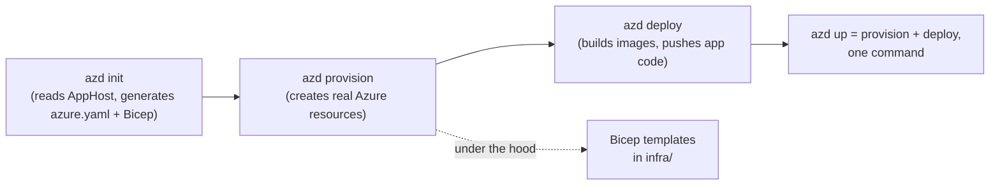
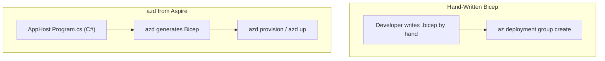

# Deploying a .NET Aspire App to Azure

## Introduction

The previous lesson built an AppHost that starts an Order API, a Redis cache, and a Service Bus emulator together on one machine, with the Aspire dashboard showing all three running healthily. None of that is production. A container running "Redis" on a laptop is not [Azure Cache for Redis](../16-azure-for-dotnet-developers/16-26-azure-cache-for-redis.md); a Service Bus emulator is not a real Service Bus namespace with guaranteed delivery. This lesson closes that gap with the **Azure Developer CLI (`azd`)**, the tool that reads the exact same AppHost project this module has been building and turns it into real, provisioned, deployed Azure infrastructure — without hand-writing a Bicep file for every resource the AppHost already describes.

By the end of this lesson, you will be able to:

- Explain what `azd` is and how it differs from the plain Azure CLI (`az`) used throughout this module
- Run `azd init` and `azd up` against an Aspire AppHost project
- Describe how Aspire resources map to real Azure services during provisioning
- Explain the relationship between `azd`'s generated infrastructure and the Bicep templates from [ARM Templates vs Bicep](../16-azure-for-dotnet-developers/16-05-arm-templates-vs-bicep-intro.md)
- Redeploy an updated application with `azd deploy` without re-provisioning infrastructure

## Deploying with azd — A Layman's Perspective

Go back to the theater analogy from two lessons ago. Rehearsal — running the AppHost locally — happens in a rehearsal room: folding chairs standing in for the real set, a boombox standing in for the real sound system, nothing permanent, nothing costing real money by the hour. Opening night happens in an actual theater, with a real stage, a real lighting rig wired into the building's power, real seats, and a real budget that started ticking the moment the venue was booked. Getting from the rehearsal room to opening night isn't a rewrite of the show — the blocking, the lines, the cues are identical — but it does require someone whose entire job is translating "stand here, the light comes up here" into "here is the actual electrical and structural work the real venue needs," and then making sure it's booked, wired, and switched on before the curtain rises.

`azd` is that production manager for an Aspire application. It reads the exact same AppHost description used for the rehearsal — this project needs a Redis-shaped cache, this project needs a message-broker-shaped dependency, this project is an ASP.NET Core app that needs to be reachable from outside — and translates each of those *shapes* into the real Azure equivalent: a genuine Azure Cache for Redis instance, a genuine Service Bus namespace, a genuine Azure Container App with a public ingress endpoint. Nobody had to describe the venue twice. The AppHost said what the show needs; `azd` figures out, and builds, the real building that satisfies it.

And just like a real production manager doesn't re-pour the theater's foundation every single night of the run, `azd` distinguishes between the one-time (or rarely-repeated) *provisioning* step — pouring the foundation, wiring the building — and the routine *deployment* step of pushing an updated show into a venue that already exists. `azd up` does both the first time. After that, `azd deploy` alone pushes new code into infrastructure that's already standing, in a fraction of the time, exactly the way a touring show reopens the same theater each night without rebuilding it.

The bridge back to code: this translation isn't magic or hidden — it produces an actual, readable Bicep template on disk, the same kind of file this module's infrastructure-as-code lessons taught you to write by hand. `azd` just generates that file *from* the AppHost instead of asking a developer to write it directly, and then runs it exactly the way `az deployment group create` would.

## Deploying with azd — A Programming Language Perspective

The **Azure Developer CLI (`azd`)** is a higher-level CLI layered on top of the plain Azure CLI (`az`) and Bicep, purpose-built around an application's full lifecycle rather than individual resource commands. Run against a .NET Aspire AppHost project, `azd init` inspects the AppHost's resource graph via Aspire's manifest generation (`dotnet run --project AppHost -- --publisher manifest`) and produces an `azure.yaml` file plus an `infra/` folder of generated **Bicep** templates — one module per resource type, following the same syntax [ARM Templates vs Bicep](../16-azure-for-dotnet-developers/16-05-arm-templates-vs-bicep-intro.md) introduced. `azd up` then runs, in sequence, provisioning (`azd provision`, effectively `az deployment sub create` against that generated Bicep) followed by deployment (`azd deploy`, which builds container images and pushes application code into the now-existing infrastructure). Each Aspire resource type maps to a specific Azure target: a .NET project defaults to an **Azure Container App**, `AddRedis` maps to **Azure Cache for Redis** (or a containerized Redis inside Container Apps, depending on configuration), and `AddAzureServiceBus` maps to a real **Service Bus namespace** with the topics/queues the AppHost declared.

## How to Provision and Deploy an AppHost with azd

Turning the AppHost from the previous lesson into deployed Azure infrastructure is a short, mostly automatic sequence once `azd` is pointed at the project.


*Figure 1: `azd init` generates infrastructure from the AppHost's resource graph; `azd up` runs provisioning and deployment together, with Bicep doing the actual resource creation.*

```bash
# Azure Developer CLI — from the solution folder containing AppHost/
azd init --template none

azd up
```

**Azure CLI Output (`azd up`, abbreviated):**

```text
Packaging services (azd package)
  (✓) Done: Packaging service orderapi

Provisioning Azure resources (azd provision)
  (✓) Done: Resource group: rg-ecommerce-aspire-prod
  (✓) Done: Container Apps Environment: cae-ecommerce-prod
  (✓) Done: Azure Cache for Redis: cache-ecommerce-prod
  (✓) Done: Service Bus Namespace: sb-ecommerce-prod

Deploying services (azd deploy)
  (✓) Done: Deploying service orderapi
  - Endpoint: https://orderapi.happyflower-12ab34cd.eastus.azurecontainerapps.io

SUCCESS: Your application was provisioned and deployed to Azure in 6 minutes 12 seconds.
```

```csharp
// Reading azd's own output — .NET 10 / C# 14
public sealed record AspireToAzureMapping(string AspireResource, string AzureService);

AspireToAzureMapping[] mappings =
[
    new("AddProject<Projects.OrderApi>", "Azure Container App"),
    new("AddRedis(\"cache\")", "Azure Cache for Redis"),
    new("AddAzureServiceBus(\"servicebus\")", "Service Bus Namespace")
];

foreach (AspireToAzureMapping m in mappings)
{
    Console.WriteLine($"{m.AspireResource,-38} -> {m.AzureService}");
}
```

**Console Output:**

```text
AddProject<Projects.OrderApi>         -> Azure Container App
AddRedis("cache")                     -> Azure Cache for Redis
AddAzureServiceBus("servicebus")      -> Service Bus Namespace
```

Nothing about `OrderApi`'s own code changed between the local run and this deployment — the same `AddRedisClient("cache")` call resolves a real Azure Cache for Redis endpoint in production, exactly as it resolved a local container two lessons ago, because service discovery is doing the same job in both environments; only the thing on the other end of the name changed.

## Real-Time Example: Redeploying the Order API After a Fix

We continue with the same `rg-ecommerce-aspire-prod` resource group from the provisioning run above. A bug fix lands in `OrderApi`'s order-submission endpoint — no infrastructure change, no new resource, just corrected application code — and needs to reach production without re-provisioning anything that's already standing.

```csharp
// DeploymentDecision.cs — .NET 10 / C# 14 — Real-Time Example (E-Commerce Order Processing)
public sealed record ChangeSet(string Description, bool ChangesInfrastructure, bool ChangesApplicationCode);

ChangeSet fix = new(
    Description: "Fix: order total miscalculated when a discount code is applied twice",
    ChangesInfrastructure: false,
    ChangesApplicationCode: true);

string command = fix.ChangesInfrastructure ? "azd up" : "azd deploy";

Console.WriteLine($"Change: {fix.Description}");
Console.WriteLine($"Infrastructure change required: {fix.ChangesInfrastructure}");
Console.WriteLine($"Recommended command: {command}");
```

**Console Output:**

```text
Change: Fix: order total miscalculated when a discount code is applied twice
Infrastructure change required: False
Recommended command: azd deploy
```

Running `azd deploy` alone rebuilds and redeploys only `orderapi`'s container image against the Container Apps Environment, Redis cache, and Service Bus namespace already provisioned — typically under a minute, compared to the full multi-resource run `azd up` performed the first time. For a team shipping fixes daily, that distinction between "stand up the building" and "open tonight's show" is the difference between a six-minute wait and a fifty-second one, every single deploy.

## azd up vs Hand-Written Bicep Deployment

Both paths end at the same place — Bicep templates executed against a resource group — but they start from a different source of truth. The hand-written approach from [ARM Templates vs Bicep](../16-azure-for-dotnet-developers/16-05-arm-templates-vs-bicep-intro.md) requires a developer to author every `resource` block directly, keeping the `.bicep` files in sync with the application by hand as it evolves. The `azd` approach generates those same kinds of Bicep files *from* the Aspire AppHost's resource graph, so the infrastructure definition and the application's actual dependencies can never drift apart silently — add a `builder.AddRedis(...)` call, and the next `azd provision` picks it up.


*Figure 2: Hand-written Bicep is authored directly; azd's Bicep is generated output, kept in sync with the AppHost by construction rather than by discipline.*

| Aspect | Hand-Written Bicep (`az deployment`) | `azd up` from Aspire |
|---|---|---|
| Source of truth | `.bicep` files authored directly | AppHost's C# resource graph |
| Risk of drift from the app | High — nothing enforces it stays current | Low — regenerated from the app itself |
| Granularity of control | Full, resource-by-resource | High, but opinionated defaults unless overridden |
| Fastest path for a new distributed .NET app | Slower — every resource written by hand | Faster — `azd init` scaffolds it |
| Underlying execution engine | ARM/Bicep deployment engine | Same ARM/Bicep deployment engine |
| Best fit | Existing infra teams, non-.NET-centric stacks | .NET-first teams already using Aspire |

## Types of azd Commands and Related Concepts

`azd` exposes a small, memorable command surface, each piece worth knowing on its own:

1. **`azd init`** — scaffolds `azure.yaml` and generates Bicep from an AppHost's manifest, the starting point of this lesson.
2. **`azd provision`** — creates or updates Azure infrastructure only, without touching application code.
3. **`azd deploy`** — pushes updated application code into already-provisioned infrastructure, used in the Real-Time Example above.
4. **`azd up`** — `provision` and `deploy` together, the command used for the very first deployment.
5. **`azd down`** — tears down every resource `azd` provisioned, the cleanup counterpart to [Tagging Strategies for Cost Tracking](../16-azure-for-dotnet-developers/16-73-tagging-strategies-for-cost-tracking.md)'s cost-governance concerns.
6. **[Azure Container Apps](../16-azure-for-dotnet-developers/16-15-azure-container-apps.md)** — the default deployment target for an Aspire project resource, covered in depth earlier in this module.

## What You've Learned & What's Next

`azd` closes the loop this Aspire arc opened: the same AppHost that orchestrates an Order API, a cache, and a broker on a laptop becomes, through `azd up`, a real Azure Container App backed by a real Azure Cache for Redis and a real Service Bus namespace — with Bicep doing the actual provisioning work underneath, generated rather than hand-written.

Continue your learning journey with **[Capstone: End-to-End E-Commerce Platform on Azure — Real-Time Example](../16-azure-for-dotnet-developers/16-77-capstone-ecommerce-platform-on-azure.md)**, where this exact Aspire-and-`azd` workflow becomes the delivery mechanism for the full, multi-service e-commerce architecture this module has been building toward since its data and storage lessons.

---
*Applies to: .NET 10 / C# 14. Last reviewed 2026-08-16.*
