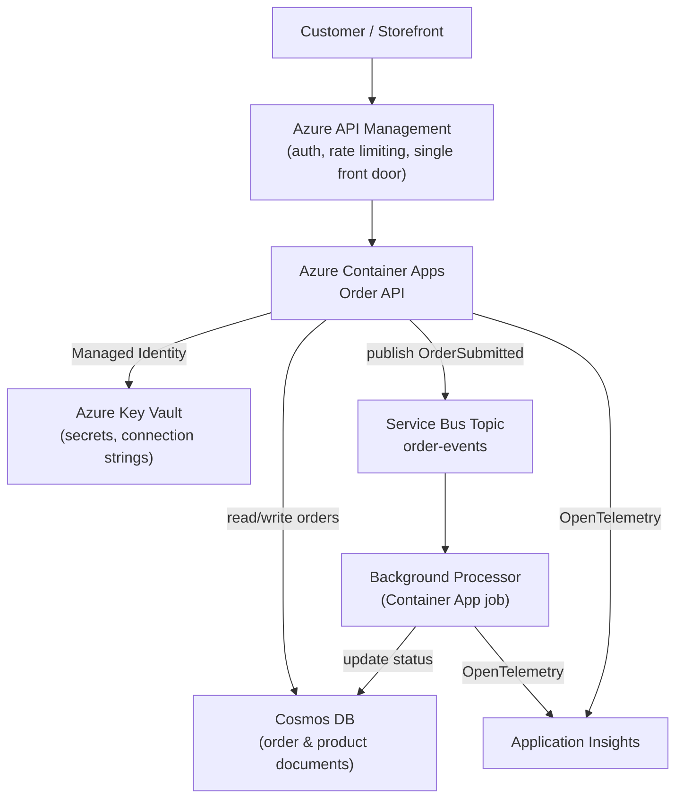
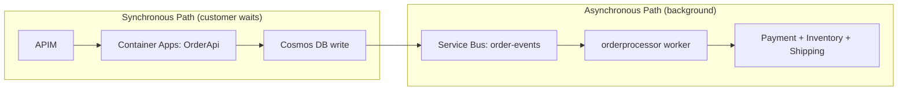

# Capstone: End-to-End E-Commerce Platform on Azure — Real-Time Example

## Introduction

Every lesson in this module up to this point has looked at exactly one Azure service in isolation — Cosmos DB on its own, Service Bus on its own, Key Vault on its own, Aspire on its own. A real production system is never one service; it's a dozen services agreeing to cooperate, each covering the others' weaknesses. This lesson stops zooming in and assembles the full picture: a complete, deployable **E-Commerce Order Processing** platform built from the exact services this module already introduced, wired together with the exact Aspire-and-`azd` workflow the last three lessons just walked through.

By the end of this lesson, you will be able to:

- Assemble the individually-covered Azure services from this module into one coherent E-Commerce Order Processing architecture
- Explain the specific role each of Container Apps, Cosmos DB, Service Bus, Key Vault + Managed Identity, Application Insights, and API Management plays in that architecture
- Trace one customer order's entire journey through the system, hop by hop
- Explain why this architecture is deployed as one unit through Aspire and `azd`, rather than resource by resource
- Identify the architecture's synchronous and asynchronous paths, and why they're kept separate

## The Capstone Architecture — A Layman's Perspective

Picture a large international airport. A traveler's experience with it looks simple from the curb — walk in, check a bag, get on a plane — but underneath that simplicity sits an enormous coordinated system, and every part of that system exists because a single, simpler airport couldn't handle the volume or the stakes.

At the front door is a single check-in and security hall that every traveler passes through, no matter which airline or gate they're eventually headed to — one consistent point where identity gets checked, boarding passes get validated, and anyone without the right documents gets turned back before they ever reach a gate. That's **API Management**: one consistent front door for every request into the e-commerce platform, checking API keys and rate limits before anything reaches the services behind it.

Past that hall are the actual gates and aircraft — dozens of them, each one spun up or idled based on how many flights are actually departing that hour, never staffed for peak Thanksgiving traffic on a quiet Tuesday morning. That's **Azure Container Apps**, hosting the Order API itself, scaling instances up and down with real demand instead of running fixed capacity around the clock.

Every checked bag gets a tag and enters a single, unified tracking system the moment it's dropped off — one record, globally consistent, that any department in the airport can query to answer "where is this bag right now?" That's **Cosmos DB**, holding every order as a single document, queryable instantly regardless of which service asks.

But not everything happens the instant a bag is tagged. Sorting, loading onto the right aircraft, transferring between connecting flights — all of that runs on a conveyor-and-cart system working in the background, decoupled from the passenger's own walk from check-in to the gate. That's **Service Bus**, carrying order events — "payment confirmed," "ready to ship" — to background processors without making the customer's own checkout request wait for any of that work to finish.

Behind every secure door in the airport — the tarmac, the baggage handling floor, the control tower itself — staff don't fumble with a key card they could lose or a password they could leak; they're recognized by their own credentialed badge, checked against a central security system the moment they approach a door. That's **Managed Identity** paired with **Key Vault**: every service authenticates as itself, and the genuinely sensitive material — signing keys, partner credentials — lives in one access-controlled vault, never scattered into configuration files.

And above all of it sits an actual control tower, watching every flight, every delay, every anomaly, in real time, on one set of screens. That's **Application Insights**: one place where a slow checkout, a failed payment call, or a spike in errors shows up the moment it happens, correlated end to end.

None of these six systems is impressive alone. An airport's actual power is that all six run *together*, invisibly, so a traveler experiences "check in, get on a plane" as one simple action. That is exactly the goal of this capstone architecture: a customer experiences "click Buy," while six coordinated Azure services quietly make it correct, fast, secure, and observable.

## The Capstone Architecture — A Programming Language Perspective

Structurally, this platform is a request-driven ASP.NET Core Minimal API (the `OrderApi` project used throughout this module) fronted by Azure API Management, hosted on Azure Container Apps, authenticating outbound calls with `DefaultAzureCredential` against a system-assigned **Managed Identity**, reading order and product documents from **Cosmos DB** via `Microsoft.Azure.Cosmos`, publishing domain events onto an Azure **Service Bus** topic for asynchronous consumers, resolving all secrets and connection material through **Key Vault** folded into `IConfiguration`, and exporting OpenTelemetry traces, logs, and metrics to **Application Insights**. The entire graph — API, Cosmos DB reference, Service Bus reference, Key Vault reference — is declared once in an Aspire **AppHost** project and provisioned/deployed as a unit via `azd up`, so the architecture diagram below and the actual `Program.cs` files defining it are, in a very literal sense, the same document.

## How to Assemble the Full Architecture

The AppHost from the previous three lessons grows one more time — from a project plus a cache plus a broker, to the full production graph, with API Management sitting in front of everything once deployed.


*Figure 1: The six-plus-one service architecture — API Management at the edge, Container Apps for compute, Cosmos DB for storage, Service Bus for async processing, Key Vault plus Managed Identity for secrets, and Application Insights watching all of it.*

```csharp
// AppHost/Program.cs — .NET 10 / C# 14 — full capstone resource graph
var builder = DistributedApplication.CreateBuilder(args);

IResourceBuilder<AzureCosmosDBResource> cosmos = builder.AddAzureCosmosDB("cosmos")
    .AddCosmosDatabase("ecommerce");

IResourceBuilder<AzureServiceBusResource> serviceBus = builder.AddAzureServiceBus("servicebus")
    .AddServiceBusTopic("order-events");

IResourceBuilder<AzureKeyVaultResource> keyVault = builder.AddAzureKeyVault("kv-ecommerce");

IResourceBuilder<ProjectResource> orderApi = builder.AddProject<Projects.OrderApi>("orderapi")
    .WithReference(cosmos)
    .WithReference(serviceBus)
    .WithReference(keyVault)
    .WaitFor(cosmos)
    .WaitFor(serviceBus);

builder.AddProject<Projects.OrderProcessorWorker>("orderprocessor")
    .WithReference(cosmos)
    .WithReference(serviceBus)
    .WaitFor(orderApi);

builder.Build().Run();
```

**Azure CLI Output (`azd up`, abbreviated — full capstone environment):**

```text
Provisioning Azure resources (azd provision)
  (✓) Resource group: rg-ecommerce-capstone-prod
  (✓) Cosmos DB account: cosmos-ecommerce-prod
  (✓) Service Bus namespace: sb-ecommerce-prod
  (✓) Key Vault: kv-ecommerce-prod
  (✓) Container Apps Environment: cae-ecommerce-prod
  (✓) API Management: apim-ecommerce-prod
  (✓) Application Insights: appi-ecommerce-prod

Deploying services (azd deploy)
  (✓) orderapi        -> https://orderapi.internal.cae-ecommerce-prod.eastus.azurecontainerapps.io
  (✓) orderprocessor  -> background worker, no public endpoint

SUCCESS: Provisioned and deployed 7 Azure resources in 9 minutes 41 seconds.
```

## Real-Time Example: One Order's Journey Through the Entire System

Everything above is scaffolding until a real customer clicks Buy. Follow order `#78421` — a customer purchasing a pair of running shoes and a water bottle — through every one of the six services just introduced, in the order it actually happens.

**Step 1 — The front door.** The storefront's checkout page sends `POST /orders` with the customer's cart. That request never reaches the Order API directly; it lands first at **Azure API Management**, which validates the storefront's subscription key, checks the request against its configured rate limit, and strips a couple of internal headers before forwarding the call onward. If the key were invalid or the customer's IP had exceeded its quota, the request would be rejected right here, and none of the six services behind APIM would ever know it existed. This is precisely the point of a single front door: every one of those protections is enforced once, centrally, instead of being re-implemented inside the Order API itself.

**Step 2 — Compute picks it up.** APIM forwards the request to **Azure Container Apps**, where a running revision of the `OrderApi` container accepts it. Because Container Apps scales on demand, this might be revision instance number one of one on a quiet Tuesday morning, or instance seventeen of thirty during a flash sale — the customer's experience is identical either way, and nothing in `OrderApi`'s own code changes based on which instance handled the call.

**Step 3 — Borrowing no secrets of its own.** Before `OrderApi` can talk to Cosmos DB or Service Bus, it needs credentials — and it authenticates to both using its **Managed Identity**, resolving its Cosmos DB connection string and any partner API keys from **Key Vault** through the exact `AddAzureKeyVault` pattern this module's identity lessons introduced. At no point does a stored secret sit in `OrderApi`'s own configuration; the identity it already has is the only credential involved.

**Step 4 — The order is written.** `OrderApi` validates the cart, calculates the total, and writes a new order document — status `Submitted` — into **Cosmos DB**, partitioned by `CustomerId` exactly as this module's Cosmos DB lessons designed. That write is synchronous and fast: the customer's browser is still waiting on this call, and nothing about payment processing, shipping labels, or warehouse notification needs to finish before the customer sees a success page.

**Step 5 — Handing off the slow work.** Immediately after that write, `OrderApi` publishes an `OrderSubmitted` event onto the **Service Bus** `order-events` topic and returns `202 Accepted` to APIM, which returns it to the storefront. The customer sees "Order confirmed" in well under a second, even though payment settlement, inventory reservation, and shipping-label generation haven't happened yet — and don't need to, for the customer to see a confirmation.

**Step 6 — Background processing.** A separate **Container Apps** job — `orderprocessor`, subscribed to that same topic — picks up the `OrderSubmitted` event independently, on its own schedule, calls the payment processor, reserves inventory, and writes the order's status back to `Processing` and eventually `Shipped` in Cosmos DB, all without the customer's original request ever being held open waiting for it.

**Step 7 — Watching all of it.** Every one of those hops — the APIM call, the Container Apps request, the Cosmos DB write, the Service Bus publish, the background processor's work — emits OpenTelemetry data that lands in **Application Insights**, correlated by a single trace ID. If order `#78421` had failed at, say, the payment call inside `orderprocessor`, that failure would show up in Application Insights' end-to-end transaction view, linked all the way back to the original checkout request, without anyone having to manually stitch logs together from six different services.

This is the payoff of the entire module: six services, none of them exotic on their own, cooperating well enough that a customer never notices any of them individually — they just see a fast "Order confirmed" and, a few minutes later, a shipping notification.

## Synchronous Request Path vs Asynchronous Event Path

This architecture deliberately keeps two paths separate rather than doing everything inline. The **synchronous path** — everything the customer's own request waits on — covers APIM, Container Apps, and the single Cosmos DB write; it has to stay fast, because a person is watching a spinner. The **asynchronous path** — everything triggered by the Service Bus event — covers payment settlement, inventory reservation, and shipping, none of which the customer needs to wait for, and all of which can retry safely on failure without the customer ever seeing an error.


*Figure 2: The customer-facing path stays short and fast; everything slower or riskier moves onto the event-driven path where retries are safe and invisible to the customer.*

| Aspect | Synchronous Path | Asynchronous Path |
|---|---|---|
| What triggers it | The customer's own HTTP request | A Service Bus event |
| What the customer waits on | Yes — must stay fast | No — happens after confirmation |
| Failure handling | Must fail fast and clearly | Can retry safely, invisibly |
| Services involved | APIM, Container Apps, Cosmos DB | Service Bus, a separate Container Apps worker, Cosmos DB |
| Typical latency budget | Under one second | Seconds to minutes, acceptable |

## Types of Services Assembled in This Capstone

Each piece of this architecture has its own dedicated lesson earlier in this module:

1. **[Azure Container Apps](../16-azure-for-dotnet-developers/16-15-azure-container-apps.md)** — hosts both the Order API and the background processor.
2. **[Storing E-Commerce Order Data in Cosmos DB](../16-azure-for-dotnet-developers/16-29-ecommerce-orders-in-cosmos-db.md)** — the order and product document store.
3. **[Azure Key Vault in Depth](../16-azure-for-dotnet-developers/16-33-azure-key-vault-in-depth.md)** paired with **[Managed Identities](../16-azure-for-dotnet-developers/16-32-managed-identities.md)** — secrets with no stored vault credential.
4. **Azure Service Bus** — the event backbone decoupling the synchronous and asynchronous paths above.
5. **Azure API Management** — the platform's single, consistent front door.
6. **Application Insights** — end-to-end observability correlated by trace ID.
7. **[Introduction to .NET Aspire](../16-azure-for-dotnet-developers/16-74-introduction-to-dotnet-aspire.md)** and **[Deploying a .NET Aspire App to Azure](../16-azure-for-dotnet-developers/16-76-deploying-aspire-app-to-azure.md)** — the workflow that deploys all six as one coordinated unit.

## What You've Learned & What's Next

This capstone took every major service this module introduced separately — compute, storage, messaging, secrets, identity, the API edge, and observability — and assembled them into one coherent, deployable E-Commerce Order Processing platform, tracing a single order from checkout to shipment across every hop. Nothing here was a new Azure concept; it was the same building blocks this module has spent 76 lessons introducing, now cooperating.

Continue your learning journey with **[Capstone: End-to-End Banking Platform on Azure — Real-Time Example](../16-azure-for-dotnet-developers/16-78-capstone-banking-platform-on-azure.md)**, the module's final lesson, where the same assembly exercise is repeated for the Banking/ATM domain — with very different, security-first architecture choices where this lesson's choices don't fit a regulated financial system.

---
*Applies to: .NET 10 / C# 14. Last reviewed 2026-08-16.*
