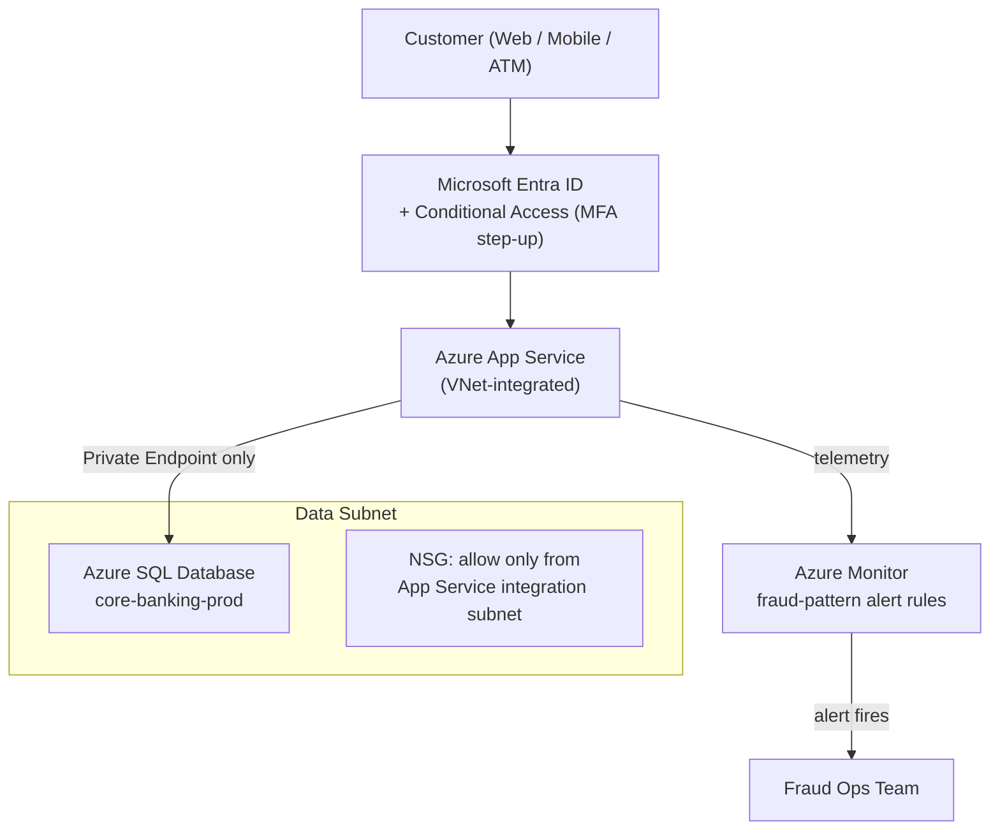
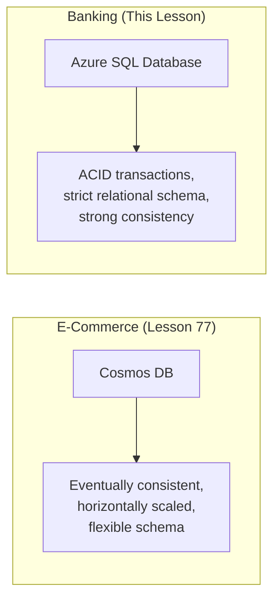

# Capstone: End-to-End Banking Platform on Azure — Real-Time Example

## Introduction

The previous lesson assembled six Azure services into a complete e-commerce platform and prioritized speed, scale, and flexible document storage — entirely reasonable choices for a shopping cart, where an eventually-consistent read of a product page or a brief delay in a shipping notification costs nothing more than a shrug. A **Banking/ATM** system cannot make those same trade-offs. A balance that's briefly wrong, a transaction that's applied twice, or a customer's account reachable from the open internet is not a shrug — it's a regulatory incident. This final lesson of Module 16 assembles a second complete architecture for the Banking/ATM domain, built from services this module already covered, but assembled around a different priority: correctness and containment over raw throughput.

By the end of this lesson, you will be able to:

- Assemble App Service with VNet integration and Private Endpoints, Azure SQL Database, Entra ID with Conditional Access, NSGs, and Azure Monitor alerting into one Banking/ATM architecture
- Justify why relational, ACID-guaranteed storage fits core banking better than the previous lesson's Cosmos DB choice
- Trace one banking transaction through the entire system end to end
- Explain the security- and compliance-driven differences between this architecture and the e-commerce capstone
- Recap the full 78-lesson arc of Module 16 across its eleven sub-areas
- Identify what the curriculum covers next, now that the Azure module is complete

## The Banking Capstone Architecture — A Layman's Perspective

Picture an actual bank branch, not a website — the physical building. The building itself sits behind a fence and a monitored perimeter; nobody parks a car against the vault's outer wall or wanders the loading dock unescorted. That perimeter fence, checked at every gate, is the **Network Security Group**: a rule set that decides, at the network level, exactly which traffic is even allowed to approach the systems holding customer data, before anything gets a chance to authenticate.

Inside that perimeter, the teller counters and back-office systems don't sit exposed to the street — they're reached through the building's own internal corridors, never a door opening directly onto the sidewalk. That's **VNet integration** paired with **Private Endpoints**: the banking API and its database talk to each other over a private network path that never touches the public internet, the architectural equivalent of walking down an internal hallway instead of stepping outside and back in through another entrance.

At the center of the building sits the actual ledger — the record of who owns what, down to the cent, that must always balance, with no such thing as "probably correct for now." A real bank has never tolerated a ledger that might briefly disagree with itself; every transaction either fully completes or fully fails, with nothing in between. That's exactly what **Azure SQL Database**'s relational, ACID-guaranteed transactions provide, and it is the single clearest reason this capstone reaches for a different database than the last one did.

Getting past the front desk requires real identification, and for anything unusual — a large withdrawal, a login from a new device in a new country — the teller doesn't just check a photo ID; they ask a follow-up question, call a supervisor over, or require a second form of verification. That escalating scrutiny is **Entra ID paired with Conditional Access**: ordinary sign-in for ordinary activity, and an automatic step-up challenge the moment a request looks unusual.

And running quietly the entire time is a silent alarm system, watching transaction patterns rather than any single transaction — five withdrawals from five different ATMs in five minutes trips it, even though each withdrawal alone looked perfectly ordinary. That's **Azure Monitor alerting**, tuned in this architecture to fraud patterns rather than just server errors.

None of these five protections exists in isolation in a real bank, and none of them exists in isolation here either — the fence, the internal corridors, the ledger, the ID check, and the silent alarm all have to hold at once for the branch to be trustworthy. That is the standard this capstone architecture is built to meet.

## The Banking Capstone Architecture — A Programming Language Perspective

Structurally, this platform is an ASP.NET Core API hosted on **Azure App Service**, integrated into a **Virtual Network** subnet via VNet integration so its outbound calls never leave Azure's private backbone, reaching **Azure SQL Database** exclusively through a **Private Endpoint** rather than a public connection string. Customer authentication runs through **Microsoft Entra ID**, with a **Conditional Access** policy requiring multi-factor authentication whenever a sign-in's risk score, location, or device posture falls outside expected norms. The database subnet is locked down with a **Network Security Group** permitting inbound traffic only from the App Service's integration subnet, denying everything else by default. Data access uses `Microsoft.Data.SqlClient` inside explicit, ACID-scoped transactions (`BEGIN TRANSACTION` / `COMMIT` / `ROLLBACK`) rather than the document-per-write model of the previous capstone, and **Azure Monitor** alert rules run continuously over transaction telemetry, firing on statistically unusual patterns rather than single-event thresholds.

## How to Assemble the Banking Architecture

Provisioning this architecture emphasizes network topology as much as compute — the subnet layout and the NSG rule attached to it matter as much as the App Service plan itself.


*Figure 1: Every hop from customer to ledger passes through an identity check, a private network path, and one more layer of monitoring than the previous capstone required.*

```bash
# Azure CLI — the network and data-tier pieces this architecture depends on
az network vnet subnet create --resource-group rg-banking-capstone-prod \
  --vnet-name vnet-banking-prod --name snet-data \
  --nsg nsg-banking-data-tier

az network private-endpoint create --resource-group rg-banking-capstone-prod \
  --name pe-sql-banking-prod --vnet-name vnet-banking-prod --subnet snet-data \
  --private-connection-resource-id "/subscriptions/.../sql-banking-prod" \
  --group-id sqlServer --connection-name sql-banking-connection
```

**Azure CLI Output:**

```text
{
  "name": "snet-data",
  "networkSecurityGroup": { "id": ".../nsg-banking-data-tier" }
}
{
  "name": "pe-sql-banking-prod",
  "privateLinkServiceConnections": [ { "connectionState": { "status": "Approved" } } ]
}
```

```csharp
// TransactionService.cs — .NET 10 / C# 14
public sealed record TransferResult(bool Committed, string Reason);

async Task<TransferResult> TransferFundsAsync(SqlConnection connection, int fromAccountId, int toAccountId, decimal amount)
{
    await using SqlTransaction tx = (SqlTransaction)await connection.BeginTransactionAsync();
    try
    {
        await using SqlCommand debit = new("UPDATE Accounts SET Balance = Balance - @amt WHERE AccountId = @id AND Balance >= @amt", connection, tx);
        debit.Parameters.AddWithValue("@amt", amount);
        debit.Parameters.AddWithValue("@id", fromAccountId);
        int rowsAffected = await debit.ExecuteNonQueryAsync();

        if (rowsAffected == 0)
        {
            await tx.RollbackAsync();
            return new TransferResult(Committed: false, Reason: "Insufficient funds");
        }

        await using SqlCommand credit = new("UPDATE Accounts SET Balance = Balance + @amt WHERE AccountId = @id", connection, tx);
        credit.Parameters.AddWithValue("@amt", amount);
        credit.Parameters.AddWithValue("@id", toAccountId);
        await credit.ExecuteNonQueryAsync();

        await tx.CommitAsync();
        return new TransferResult(Committed: true, Reason: "OK");
    }
    catch
    {
        await tx.RollbackAsync();
        throw;
    }
}
```

**Console Output (sample invocation):**

```text
Transfer of $500.00 from Account 10245 to Account 10389: Committed = True, Reason = OK
```

Either both `UPDATE` statements succeed and the transaction commits, or neither does — there is no state in which money vanished from one account without appearing in the other. That guarantee is the entire justification for reaching for SQL Server's transaction model instead of a document database here.

## Real-Time Example: One Banking Transaction Through the Entire System

Follow a customer, Priya, withdrawing $500 from an ATM linked to her online banking account, through every layer of this architecture.

**Step 1 — Proving who she is.** The ATM's request first reaches **Microsoft Entra ID** carrying Priya's authentication token. This particular withdrawal is unremarkable — her usual ATM, her usual city, her usual hour of the evening — so the **Conditional Access** policy evaluates the sign-in's risk as low and lets it through with the standard PIN-based check already performed at the machine. Had this instead been a $500 withdrawal attempted from a browser session in a country Priya has never logged in from, the exact same policy would have escalated it, demanding a one-time code sent to her registered device before anything reached the banking API at all — the "ask a follow-up question" behavior from the layman's analogy, enforced automatically and identically for every customer, every time.

**Step 2 — Entering the building, not the street.** Once authenticated, the request reaches the **App Service**-hosted core banking API. Because that App Service is **VNet-integrated**, its call to the database never touches the public internet — it travels over Azure's private backbone directly into the VNet, then to the **Private Endpoint** sitting in front of `sql-banking-prod`. There is no public connection string for this database at all; even someone with valid SQL credentials but no network path into that VNet has nothing to connect to.

**Step 3 — The NSG double-checks.** Traffic arriving at the data subnet is evaluated against the **Network Security Group** attached to it, which permits inbound connections only from the App Service's own integration subnet and denies everything else, including, deliberately, direct access from developer workstations or other subnets in the same VNet that have no legitimate reason to reach the ledger.

**Step 4 — The ledger update, atomically.** The API executes the `TransferFundsAsync` logic shown above inside a single SQL transaction: debit Priya's account, credit the ATM network's settlement account, commit both or neither. Halfway through a partial failure — a dropped connection between the debit and the credit — the transaction rolls back entirely, and Priya's balance is exactly what it was before she ever inserted her card. This is precisely the property Cosmos DB's per-document model, chosen deliberately for the previous capstone's shopping cart, does not provide across two separate documents without considerably more application-level coordination — and precisely why this system reaches for SQL Server instead.

**Step 5 — The silent alarm watches anyway.** Nothing about this single $500 withdrawal looks suspicious on its own, and no alert fires. But **Azure Monitor**'s fraud-pattern alert rule is evaluating a rolling window across *all* of Priya's recent activity, not just this one event — and if four more withdrawals appeared against her account from four different ATMs in the next ten minutes, that rule would fire immediately, notifying the fraud operations team before a human ever noticed the pattern, and potentially freezing the account automatically pending review.

Every one of those five steps existed to answer one question that a regulator, an auditor, or Priya herself might eventually ask: could this transaction have gone wrong silently, or been reached by someone who shouldn't have been able to reach it? At every layer, the answer built into this architecture is no.

## Azure SQL Database vs Cosmos DB for Core Banking

This capstone's database choice is a direct, deliberate contrast with the previous lesson's Cosmos DB, and the reasoning is worth stating plainly rather than leaving implicit. E-commerce order data tolerates eventual consistency and benefits enormously from Cosmos DB's horizontal scale and flexible schema — a slightly-stale product page or an order document that gains new optional fields over time costs nothing. A core ledger tolerates neither: two updates to the same balance must never be allowed to race, a multi-step transfer must never be allowed to partially apply, and the schema — accounts, balances, transaction history — is stable and relational by nature, not a good fit for a document model's per-record flexibility.


*Figure 2: The same module, two different capstones, two deliberately different databases — chosen for what each domain actually needs, not out of habit.*

| Aspect | Cosmos DB (E-Commerce Capstone) | Azure SQL Database (Banking Capstone) |
|---|---|---|
| Consistency model | Tunable, often eventual | Strong, ACID transactions |
| Schema | Flexible, per-document | Fixed, relational, normalized |
| Multi-row/multi-document atomicity | Limited without extra coordination | Native, via `BEGIN TRANSACTION` |
| Scale pattern | Horizontal, global distribution | Vertical + read replicas |
| Best fit here | Product catalog, order documents | Account balances, transaction ledger |
| Regulatory expectation | Flexible tolerance | Frequently mandated (auditable, ACID) |

## Types of Services Assembled in This Capstone

Each piece of this security-first architecture has its own dedicated lesson earlier in this module:

1. **Azure SQL Database** — the relational, ACID-guaranteed ledger this lesson relies on, contrasted directly above with Cosmos DB.
2. **App Service with VNet Integration and Private Endpoints** — the banking API's private, network-isolated path to its data tier.
3. **Network Security Groups** — the perimeter rule set locking the data subnet down to only the App Service's traffic.
4. **[Microsoft Entra ID Fundamentals](../16-azure-for-dotnet-developers/16-30-entra-id-fundamentals.md)** paired with Conditional Access — identity checks that escalate automatically when a sign-in looks unusual.
5. **Azure Monitor alerting** — the fraud-pattern detection watching transaction trends, not single events.
6. **[Introduction to .NET Aspire](../16-azure-for-dotnet-developers/16-74-introduction-to-dotnet-aspire.md)** and **[Deploying a .NET Aspire App to Azure](../16-azure-for-dotnet-developers/16-76-deploying-aspire-app-to-azure.md)** — the same deployment workflow used for both capstones, regardless of how different the resulting architectures are.

## What You've Learned & What's Next: Module 16 Complete

This lesson closes out Module 16 — 78 lessons, eleven sub-areas, one continuous arc from "what is a resource group" to two fully assembled, production-shaped Azure architectures. Before handing off to the rest of the curriculum, here is the full shape of what that arc covered:

1. **Foundations & Core Concepts** (Lessons 1–7) — the Azure Portal, CLI, and PowerShell; ARM, subscriptions, and resource groups; regions and availability zones; Bicep introduced; pricing and the shared responsibility model.
2. **App Service** (Lessons 8–11) — deploying ASP.NET Core, deployment slots, and scaling.
3. **Serverless Compute** (Lessons 12–14) — Azure Functions, bindings and triggers, and Durable Functions.
4. **Containers & Kubernetes** (Lessons 15–17) — Azure Container Apps and AKS fundamentals and networking.
5. **Virtual Machines & Batch Compute** (Lessons 18–19) — VMs for .NET workloads and Azure Batch.
6. **Data & Storage** (Lessons 20–29) — Azure SQL, Cosmos DB, Blob/Table/File storage, Redis, Data Lake, culminating in the e-commerce Cosmos DB capstone.
7. **Identity & Security** (Lessons 30–37) — Entra ID, app registrations and OAuth, Managed Identities, Key Vault, RBAC, Conditional Access.
8. **Messaging & Integration** (Lessons 38–43) — Service Bus, event-driven messaging, and API Management.
9. **Observability & Monitoring** (Lessons 44–51) — Application Insights, distributed tracing in Azure, and Azure Monitor alerting.
10. **Networking, Infrastructure as Code & Cost Governance** (Lessons 52–73) — Bicep in depth, VNets, Private Endpoints, NSGs, and cost/tagging strategies.
11. **.NET Aspire + Azure** (Lessons 74–78) — local orchestration, deployment via `azd`, and these two capstones.

Stepping back further, this module was never really "about Azure" in isolation — it was the place where nearly every earlier module in this curriculum finally got deployed somewhere real. The domain models from **Module 2's OOP** lessons became the `Order` and `Account` classes persisted in Cosmos DB and Azure SQL. **Module 4's LINQ** queries became the filters running against those stores. **Module 7's async and concurrency** patterns became the non-blocking calls to Cosmos DB, Service Bus, and SQL Server threaded throughout both capstones. **Module 11's EF Core** lessons became the mapping layer between C# records and relational tables. **Module 10's ASP.NET Core** became the actual APIs hosted on Container Apps and App Service. **Module 14's security and cryptography** lessons became Entra ID, Managed Identity, and Key Vault in practice. **Module 15's containers** became the images Container Apps and AKS actually run. And **Module 12's design patterns and architecture** lessons — CQRS, the Saga pattern, clean architecture, service discovery and resilience — became the actual shape of the Order API and the fraud-detection alerting built in this lesson. Azure didn't replace any of that earlier learning; it's where all of it became a real, running, deployable system.

There is no next lesson in this module — this is the last one. Continue your learning journey with **[Where to Go From Here: Beyond This Curriculum](../17-whats-next/17-01-where-to-go-from-here.md)**, the opening lesson of the curriculum's closing module, which looks at what to learn next now that the fundamentals, the language, the frameworks, and the cloud are all in place.

---
*Applies to: .NET 10 / C# 14. Last reviewed 2026-08-16.*
