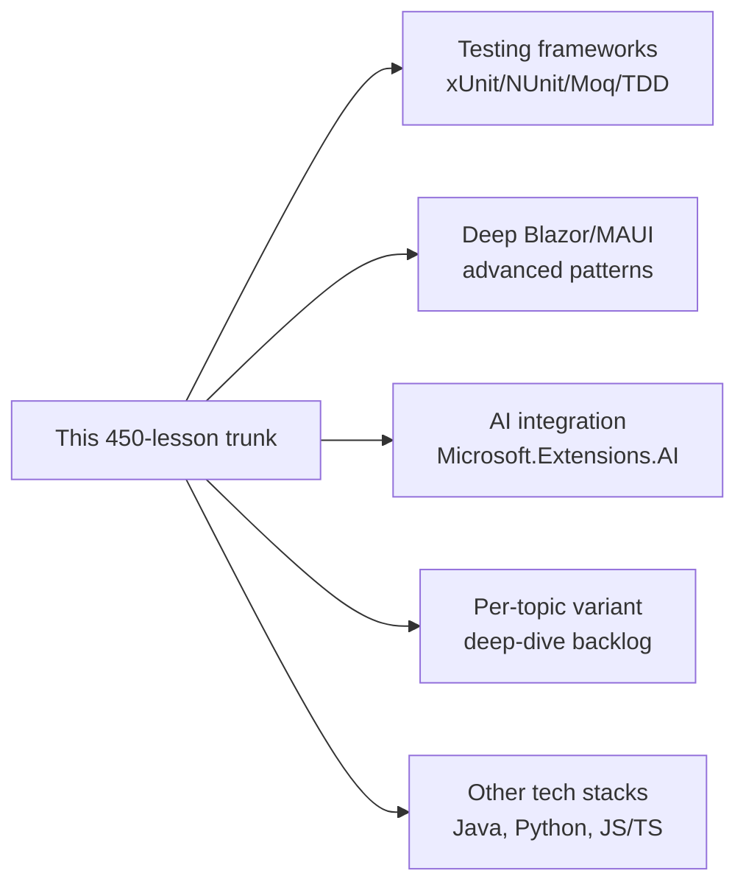
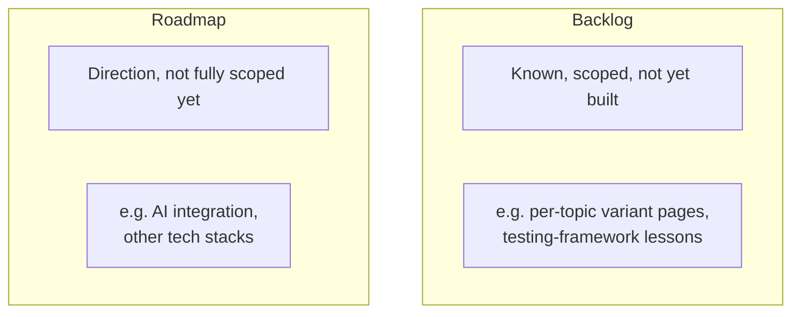

# Where to Go From Here: Beyond This Curriculum

## Introduction

You've reached the final lesson of a curriculum that started with "How to Use This Tutorial Series" and ended two capstone Azure architectures later. There's no new prerequisite concept to learn here — this lesson's job is to close the loop: recap what the ~450 lessons across 18 modules actually covered, name what was deliberately left out, and point you toward what's genuinely worth learning next.

By the end of this lesson, you will be able to:

- See the whole curriculum's arc in one place, from `Console.WriteLine` to a two-service Azure architecture
- Identify the handful of topics this series intentionally left as a backlog, and why
- Know which emerging .NET/C# directions are worth watching
- Have a concrete list of next moves depending on what you want to build next

## This Journey — A Layman's Perspective

Think about learning to cook seriously, the way a culinary apprenticeship works. You don't start with a soufflé. You start with knife skills, then basic sauces, then how heat actually behaves, then you learn the pantry — what a good stock is made of, why acid balances fat. Only much later do you learn to run a kitchen: how a whole service comes together under pressure, how a menu is priced, how a supply chain gets food to your door reliably. By the end, you're not just following recipes — you understand *why* a dish works, and you could build a new one from first principles.

This curriculum walked that same arc for C# and .NET. Module 01 was knife skills — variables, loops, the raw syntax you'll type ten thousand times. Modules 02 through 09 were technique — object-oriented design, collections, LINQ, concurrency, memory, files — the things a working cook (or developer) reaches for constantly, half by instinct. Modules 10 through 15 were "now build something real" — a web API, a database, security, a container, a UI. Module 12's design patterns and architecture lessons were the pantry philosophy: not ingredients themselves, but the accumulated wisdom about which combinations tend to work. And Module 16 — the 78-lesson Azure module — was running the whole kitchen: provisioning, deploying, securing, monitoring, and paying for a real system that real customers depend on.

You didn't just read about a kitchen. Across three recurring case studies — an e-commerce order pipeline, a banking/ATM system, and a library catalog — you built the same three "restaurants" over and over, each time with a sharper tool. That's the whole point of carrying `Order`, `Account`, and `Book` through 17 modules instead of inventing a new toy example every lesson: by lesson 16-77, you weren't looking at a new dish, you were looking at the same dish, finally served at scale, to real guests, on a real night.

The bridge back to programming: you now have a coherent mental model of C# and .NET end to end, not a pile of disconnected facts — and a coherent mental model is what lets you build things this curriculum never showed you an example of.

## This Curriculum — A Technical Perspective

Formally, this series covered: C# 14 language fundamentals; the four pillars of object-oriented programming plus modern C# constructs (records, primary constructors, pattern matching, extension blocks); collections and generics; LINQ; exception handling; delegates and events; a four-part treatment of concurrency (multithreading primitives, async/await, parallel programming, and channel/queue-based concurrent collections); memory management including `Span<T>`/`Memory<T>` and GC tuning; file I/O and serialization; ASP.NET Core (both Minimal APIs and MVC); EF Core against both relational and Cosmos DB providers; 46 lessons of SOLID principles, the full 24-pattern Gang-of-Four-plus-practical catalog, performance diagnostics, and clean/microservices architecture; reflection, source generators, and low-level/unsafe C# including Native AOT; gRPC, SignalR, and a full security stack (OAuth2/OIDC, cryptography, ASP.NET Core Identity); containers, Blazor, and .NET MAUI; and a from-scratch, 78-lesson Azure curriculum spanning compute, data, identity, messaging, observability, DevOps/IaC, networking, serverless architecture, cost governance, and .NET Aspire — all current as of .NET 10 and C# 14 (August 2026).

## What This Curriculum Deliberately Left Out

A few things were named across the series as "out of scope for this trunk" rather than forgotten. It's worth listing them explicitly so you know where the intentional boundary is.


*Figure 1: What sits just outside this curriculum's trunk, ready to be a Phase 2.*

- **Testing frameworks and TDD** — xUnit/NUnit, mocking with Moq, integration testing, and a proper test-driven workflow were referenced (Module 12's SOLID lessons lean on testability as a *reason* for good design) but never given their own dedicated lessons. This is the single most concrete gap if you're about to work on a real team.
- **Deeper Blazor and MAUI patterns** — Module 15 covered both frameworks' fundamentals and how to publish them, but production-grade state management, advanced MAUI platform-specific code, and Blazor's newer render-mode nuances go deeper than an 18-lesson module can.
- **AI integration in .NET** — `Microsoft.Extensions.AI` and building AI-powered features into a .NET app were named as a live, fast-moving area but not covered, since the API surface here is genuinely still stabilizing as of this writing.
- **Per-topic "variant deep-dive" pages** — several lessons' "Types of X" sections link to specific named variants (e.g. individual collection types, individual exception-handling patterns). Where those links point to slugs beyond this trunk, they're a tracked backlog for follow-on lessons, not broken references to something that was supposed to exist.
- **Other tech stacks** — this was explicitly a *.NET/C# first* build. Java, Python, and JavaScript/TypeScript (with React/Angular) are the next planned phases of the same series, reusing this exact template and case-study pattern.

## Real-Time Example: What Your Own "Module 17" Could Look Like

There's no code example in this closing lesson — but there is a genuinely useful exercise, and it's the same kind of "Real-Time Example" this series has used throughout: pick ONE of the three case studies you've been building (E-Commerce, Banking/ATM, or Library/Inventory) and write down, concretely, what you'd add to it next if this were a real product.

For the E-Commerce case study, a realistic Module 17 backlog might read:

```text
- Add xUnit tests for OrderService and PaymentGateway before touching them again
- Add a recommendation feature backed by Microsoft.Extensions.AI (Module "AI" — future)
- Move the admin dashboard from Blazor Server to InteractiveAuto (Module 15 lesson 8, revisited)
- Add a Java-based inventory microservice to see how the two stacks interoperate
  (Module 12 lesson 39's microservices patterns, applied across stacks)
- Add proper canary rollout for the checkout API using the Module 16 lesson 58 pattern
```

Notice that every line on that list points back to a specific lesson number in this curriculum — that's deliberate. The point of this exercise isn't to invent new knowledge; it's to prove to yourself that you can now *plan* real work using the vocabulary and lesson map you've built over 450 lessons. If you can write a backlog like this and know exactly which earlier lesson each line draws on, the curriculum did its job.

## Backlog vs. Roadmap — What's the Difference?

It's worth being precise about two words this lesson has used loosely so far: **backlog** and **roadmap**. They sound similar but mean different things for what you do next.


*Figure 2: A backlog item is scoped and ready to build; a roadmap item is a direction still being figured out.*

| Aspect | Backlog | Roadmap |
| --- | --- | --- |
| Definition | Specific, scoped work known to be missing | A direction intended to be explored, not yet fully scoped |
| Example here | Per-collection-type deep-dive lessons | AI integration, other tech stacks |
| When it gets built | As soon as capacity allows | After more research/stabilization |
| How you'd act on it | Just start writing the lesson | Scope it first, then plan |

If you're deciding what to learn next for yourself, the same distinction applies: your personal "backlog" is stuff you already know you need (testing, probably) — go do that first. Your personal "roadmap" is stuff you're curious about but haven't scoped yet (AI features? another language?) — that's fine to explore more loosely.

## Types of Next Steps From Here

Depending on what you want to build next, here are the concrete paths this curriculum sets you up for:

1. **[Go deeper on testing](../12-advanced-concepts/12-01-single-responsibility-principle.md)** — start from Module 12's SOLID lessons (already build testability into the reasoning) and layer xUnit/Moq on top; this is the highest-leverage gap to close first.
2. **[Build something with AI](../16-azure-for-dotnet-developers/16-74-introduction-to-dotnet-aspire.md)** — .NET Aspire (Module 16's capstone sub-area) is where Microsoft.Extensions.AI integration typically gets wired in for real apps; start there once the API stabilizes further.
3. **[Go deeper on one Azure sub-area](../16-azure-for-dotnet-developers/16-01-introduction-to-azure-for-dotnet.md)** — this module covered 78 lessons broadly; pick one (Kubernetes/AKS, or the messaging trio, or observability) and go get certification-level depth on it.
4. **[Revisit the UI layer](../15-containers-blazor-maui/15-04-introduction-to-blazor.md)** — Module 15 was intentionally introductory on Blazor/MAUI; if UI work is your focus, this is where to add depth next.
5. **[Move to another stack](../00-orientation/00-01-how-to-use-this-series.md)** — the orientation lesson that started this whole series explicitly named Java, Python, and JavaScript/TypeScript as future phases of this same curriculum pattern.

## What You've Learned & What's Next

You've now seen this entire curriculum's arc end to end: from your first `Console.WriteLine` in Module 01 to two full Azure architectures in Module 16, all built around three case studies that grew with you the whole way. You know what was deliberately left as backlog (testing, deeper Blazor/MAUI, AI integration, per-topic variant pages) versus what's still on the roadmap (other stacks), and you have a concrete way to plan your own next steps using the same lesson-numbered vocabulary this series taught you.

There is no next lesson — this is the end of the trunk. What comes next is up to you: pick one item from the "Types of Next Steps" list above, or write your own Real-Time Example backlog for whichever case study stuck with you the most, and go build it.

---
*Applies to: .NET 10 / C# 14. Last reviewed 2026-08-16.*
